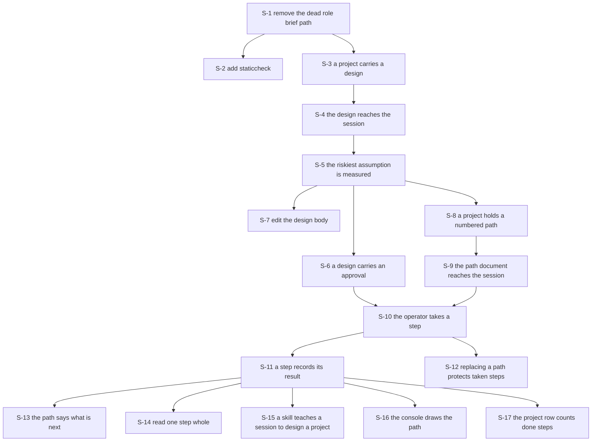

# Contracts: a project carries its own context

Written 2026-09-04, from `.greenlight/DESIGN.md` and the code the design touches.

These contracts are the source of truth for the tests. A contract states the input, the output and
every error. A contract with no stated error is an incomplete contract.

Nothing here is code. Nothing here is a test. No code exists before the operator approves the path.

## How to read this

Each contract carries an identifier. `GRAPH.json` names those identifiers, so a slice says exactly
which contracts it satisfies.

The groups are:

- `REMOVE` for the dead code the work clears first.
- `TABLE` for a database table, at field level.
- `STORE` for one method on the `Store` interface.
- `WIRE` for one protobuf message or one service method.
- `GRAMMAR` for the path document format.
- `RENDER` for what the control plane writes into a sandbox.
- `COMMAND` for one command line verb.
- `CONSOLE` for one view.
- `SKILL` for the design skill.
- `MEASURE` for the proof of the riskiest assumption.

Verification is `auto` or `verify`. `auto` means a green test fully proves the contract. `verify`
means the operator looks at the result before the slice closes.

## Decisions the architect took, beyond the design

The design does not answer these. Each one is a decision, not a fact. The operator can reverse any of them.

1. The migration splits into three numbered pairs, not one. Section 11 of the design says one pair.
   One reviewable pull request per slice forces the split. `0062` creates `project_designs`. `0063`
   adds the approval columns. `0064` creates `project_steps`. Migrations `0043` and `0044` already
   add one column each to `projects`, so this follows the house style.
2. `SetPath` carries the markdown document, and the control plane parses it. The design says the
   grammar is the architect's contract. One grammar in one place keeps the console and the command
   line from drifting. It is the same reason the control plane composes the step text.
3. `written_by` is a claim the caller sends, not an authenticated fact. The token says operator or
   driver, and it does not say which session. Carrying the caller identity through the interceptor is
   real work in `internal/auth`, and the field grants nothing. Deferred.
4. `ApproveDesign` joins `DeniedToDriver`. That mechanism already refuses a driver the calls that
   grant capability. It is what makes "nothing inside a sandbox can set the approval" real.
5. `FinishStep` accepts a step in any state and replaces the record. A result is what somebody
   declared, and a correction goes through the door the first statement went through.
   `SetProjectRepository` already works this way.
6. `ListSteps` with an empty project answers for every project. `ListProjects` and
   `ListSessionEvents` already read an empty identifier as "every one". It is what lets the console
   count steps for a page of projects in one call.
7. An empty path document is refused. There is no way to empty a path, and that is deliberate: a
   wrong file path must not delete a path. Recorded as deferred.
8. The design section in the memory file is capped at 400 characters. When the four lines would run
   past the cap, the brief is cut further so the other three lines survive.

## The order of the work



S-5 is the gate. It costs no code. If the answer is no, every slice after it is cancelled.

## REMOVE: the dead code that goes first

### REMOVE-1: a memory file carries no role section

Boundary: control plane to the file the model reads.

Today `renderContext` at `internal/controlplane/server.go:585` declares `brief` as the empty string.
It never assigns it again. The `RoleScope` section therefore never renders. Lines 597 to 598 hold an
`if false` branch left from the roles removal.

Input: a session, and the store's four levels of context.

Output: two memory files. The outer file holds system context, workspace context and the skills
index. The inner file holds project context and session context.

Errors:
- A store read that fails skips that level and renders the rest. This is today's behaviour and it
  does not change. A failure here never fails an exec.

Invariants:
- No section carries the mark `role`, in either file.
- `sandbox.RoleScope` does not exist after this contract is satisfied.
- The read back in `syncContextExcept` at line 527 no longer names `RoleScope` in its scope list.
- The skills index still renders into the outer file, and is still never read back.
- Every existing context scenario stays green.

Verification: verify
Acceptance criteria:
- A dispatched session's memory file carries the project context and no role section.
- A session that writes into its own memory still has that writing kept.
Steps:
- Read `features/context.feature` and confirm every scenario in it still passes in continuous
  integration.

### REMOVE-2: a sandbox is configured without a role

Boundary: control plane to sandbox.

Input: a `sandbox.Config` for one session.

Output: a sandbox whose conversation store sits at `workspaces/<workspace>/claude`, always.

Errors:
- None new. The layout has one branch fewer.

Invariants:
- `sandbox.Config` carries no `Role` field.
- `layout` in `internal/sandbox/storage.go:87` has one path, not two.
- `conversationDir` in `internal/sandbox/usage.go:170` has no role branch.
- A session's working directory is unchanged:
  `workspaces/<workspace>/projects/<project>/sessions/<session>/workspace`.

Verification: auto
The reason: the removed branch was unreachable, so a green suite fully proves the removal. The
existing directories scenarios cover the paths.

### REMOVE-3: the linter refuses an always false branch

Boundary: repository to continuous integration.

Input: the Go source of this module.

Output: a `golangci-lint run` that reports an always false condition and an assigned but unused
value.

Errors:
- A finding anywhere in the module fails the lint job. The slice that adds the linter fixes every
  finding it raises, or the linter entry does not go in.

Invariants:
- `.golangci.yml` names `staticcheck` in its enabled set.
- `make lint` reports zero issues after the change.
- The linter is added after REMOVE-1, never before. Added first, it turns the build red on code that
  is about to go anyway.

Verification: verify
Acceptance criteria:
- `make lint` reports zero issues.
- A deliberately added `if false` branch is refused by the linter.
Steps:
- Run `make lint` and read the count it prints.

## TABLE: the tables, at field level

### TABLE-1: table `project_designs`

Boundary: store to Postgres.

One row per project. The row appears when somebody sets a brief or a design body. A project with no
row has no design, and that is the normal state.

Fields, with the migration that adds each one:

- `project` text, primary key, references `projects (id)` on delete cascade. Migration `0062`.
- `brief` text not null default `''`. What the project is for, one paragraph. Migration `0062`.
- `body` text not null default `''`. The design document, whole, in markdown. Migration `0062`.
- `written_by` text not null default `''`. The session that last wrote `body`, empty when the
  operator wrote it. Not a foreign key. Migration `0062`.
- `created_at` timestamptz not null default now(). Migration `0062`.
- `updated_at` timestamptz not null default now(). Migration `0062`.
- `approved` boolean not null default false. Migration `0063`.
- `approved_at` timestamptz, null while `approved` is false. Migration `0063`.

Indexes: the primary key is the only read path. A design is read by project identifier and is never
scanned.

Errors:
- An insert naming a project that does not exist fails on the foreign key. The store maps this to
  `store.ErrNotFound`.

Invariants:
- Every text column defaults to the empty string. `approved` defaults to false. No new column is
  nullable except `approved_at`.
- Deleting a project deletes its design row through the cascade.
- `0062.down.sql` drops the table. `0063.down.sql` drops the two approval columns. Each down
  migration says in its own comment that the data goes with it and exists nowhere else.

Verification: verify
Acceptance criteria:
- The control plane starts against an empty database and applies both migrations.
- The control plane starts twice against the same database without failing.
Steps:
- Read `internal/store/migrations/0062_a_project_carries_its_design.up.sql` and confirm every column
  above is present with the stated default.

### TABLE-2: table `project_steps`

Boundary: store to Postgres.

One row per step of one project's path. Migration `0064`.

Fields:

- `project` text not null, references `projects (id)` on delete cascade.
- `number` int not null. Where in the path, counting from one.
- `title` text not null. One line, one intention.
- `intention` text not null default `''`. What changes and why.
- `touches` text not null default `''`. The files or packages, one per line.
- `proof` text not null default `''`. What proves it.
- `after` int not null default 0. The step number this one waits for. Zero means nothing blocks it.
- `state` text not null default `'ready'`. One of `ready`, `taken`, `done`, `stopped`.
- `session` text not null default `''`. The session that took it. Not a foreign key.
- `result` text not null default `''`. What somebody said came of it, or why it stopped.
- `taken_at` timestamptz, null until taken.
- `finished_at` timestamptz, null until done or stopped.
- `created_at` timestamptz not null default now().
- `updated_at` timestamptz not null default now().
- primary key (`project`, `number`).

Indexes:
- The primary key serves the ordinary read: one project's path in number order.
- `project_steps_session_idx on project_steps (session) where session <> ''`. It answers which step
  a session is on.

The four state words:
- `ready`: nobody took it.
- `taken`: a session holds it. `session` names that session.
- `done`: somebody said it finished. `result` says what came of it.
- `stopped`: somebody stopped it. `result` says why.

Errors:
- An insert naming a project that does not exist fails on the foreign key, mapped to
  `store.ErrNotFound`.
- A second row with the same project and number fails on the primary key. The store never writes
  one: `SetPath` replaces.

Invariants:
- `number` is one or greater. Zero and negative numbers never reach the table.
- `after` is zero, or a number that exists in the same project's path. It never equals the row's own
  number.
- Deleting a project deletes its steps through the cascade.
- `0064.down.sql` drops the table and says the data exists nowhere else.

Verification: verify
Acceptance criteria:
- The control plane starts against an empty database and applies migration `0064`.
- Deleting a project leaves no rows in `project_steps` for it.

## STORE: the methods on the one `Store` interface

Every method here runs against both implementations through the conformance suite in
`internal/store/storetest`. A behaviour proved against one is proved against both.

The store keeps what it is given. Whether a word belongs to a vocabulary is the control plane's
question. The exception is a rule only an atomic write can hold, and each such rule says so.

### STORE-0: the new sentinel errors

Boundary: store to control plane.

- `ErrNothingToApprove`: the design body is empty, so there is nothing to approve.
- `ErrPathHoldsTakenSteps`: the incoming path drops or renames a step that is taken, done or
  stopped. The error text names those step numbers.
- `ErrStepNotReady`: the step is not in state `ready`, so it cannot be taken.

Errors:
- Each one is a package level `errors.New`, tested with `errors.Is`.

Invariants:
- Each sentinel names a rule that only the store can hold at write time. The control plane maps
  each one to a `FailedPrecondition` with a sentence a person can act on.
- `store.ErrNotFound` covers a project that does not exist or was deleted, as it does today.

Verification: auto
The reason: the sentinels carry no user visible behaviour of their own. The refusal sentences are
verified where the control plane builds them.

### STORE-1: `GetDesign`

Signature: `GetDesign(ctx context.Context, project string) (*quaycrewv1.Design, error)`

Input: a project identifier.

Output: the project's design. A project that exists with no design row returns a `Design` with
`project` set and every other field zero.

Errors:
- `store.ErrNotFound` when the project does not exist or is deleted.

Invariants:
- Nothing written is the normal state and is not an error. `GetContext` already answers this way.
- The returned `Design` carries the body whole. No length is trimmed on read.

Verification: auto
The reason: input and output are fully stated, and the conformance suite proves both stores agree.

### STORE-2: `SetProjectBrief`

Signature: `SetProjectBrief(ctx context.Context, project, brief string) (*quaycrewv1.Design, error)`

Input: a project identifier, and one paragraph saying what the project is for.

Output: the design row after the write.

Errors:
- `store.ErrNotFound` when the project does not exist or is deleted.

Invariants:
- The row is created on first use.
- `approved` and `approved_at` are untouched. A brief says what the project is for, and it does not
  change what the design says.
- An empty brief clears the brief. It is a value, not an absence.
- `updated_at` moves.

Verification: auto
The reason: a store write with a stated output, proved against both stores.

### STORE-3: `SetProjectDesign`

Signature:
`SetProjectDesign(ctx context.Context, project, body, writtenBy string) (*quaycrewv1.Design, error)`

Input: a project identifier, the design document whole, and who wrote it. `writtenBy` is empty when
The operator wrote it.

Output: the design row after the write.

Errors:
- `store.ErrNotFound` when the project does not exist or is deleted.

Invariants:
- The row is created on first use.
- The same write sets `approved` to false and `approved_at` to null. Approval is a statement about a
  specific text, so a rewrite clears it. One write, never two, so no reader sees an approved row
  carrying a new body.
- `written_by` records what the caller sent, including empty.
- No length refuses the body. The body is kept whole.
- `brief` is untouched.

Verification: verify
Acceptance criteria:
- Writing a body over an approved design leaves the design unapproved.
- The body reads back exactly as it went in, including its line breaks.

### STORE-4: `ApproveProjectDesign`

Signature: `ApproveProjectDesign(ctx context.Context, project string) (*quaycrewv1.Design, error)`

Input: a project identifier.

Output: the design row after the write, with `approved` true and `approved_at` stamped.

Errors:
- `store.ErrNotFound` when the project does not exist, or the project has no design row.
- `ErrNothingToApprove` when `body` is empty.

Invariants:
- The check on the body and the write happen in one statement. Only the store sees the body at write
  time, which is why the refusal lives here rather than in the control plane.
- Approving an already approved design is allowed and moves `approved_at`.

Verification: verify
Acceptance criteria:
- Approving a design with an empty body is refused, and the refusal says there is nothing to
  approve.
- An approved design reads back with an approval time.

### STORE-5: `SetPath`

Signature: `SetPath(ctx context.Context, project string, steps []store.Step) ([]*quaycrewv1.Step, error)`

`store.Step` carries only the fields a caller may set: `Number`, `Title`, `Intention`, `Touches`,
`Proof`, `After`.

Input: a project identifier and the whole path.

Output: the project's whole path after the write, in number order.

Errors:
- `store.ErrNotFound` when the project does not exist or is deleted.
- `ErrPathHoldsTakenSteps` when the incoming path drops or renames a step in state `taken`, `done`
  or `stopped`. The error text names those numbers.

Invariants:
- Every step in state `ready` is replaced.
- A step in state `taken`, `done` or `stopped` keeps its state, its session, its result and its
  stamps. Its title, intention, touches, proof and after are updated from the incoming step.
- A step is dropped when the incoming path has no step of that number. A step is renamed when the
  incoming path has that number with a different title.
- The whole write is one transaction. A refused write changes nothing.
- Number order is the order the rows come back in, always.

Verification: verify
Acceptance criteria:
- Setting a path of five steps and reading it back gives five steps in number order.
- Setting a path again, without step 2, is refused when step 2 is taken, and the refusal names
  step 2.
- Setting a path again, without step 2, succeeds when step 2 is ready.

### STORE-6: `ListSteps`

Signature: `ListSteps(ctx context.Context, project string) ([]*quaycrewv1.Step, error)`

Input: a project identifier, or the empty string for every project.

Output: steps in number order. For every project, the order is by project identifier, then number.

Errors:
- `store.ErrNotFound` when a named project does not exist or is deleted.

Invariants:
- A project with no path returns an empty slice and no error.
- No pagination. One operator, tens of projects, tens of steps in a path.

Verification: auto
The reason: order and emptiness are both stated, and the conformance suite proves both stores agree.

### STORE-7: `GetStep`

Signature: `GetStep(ctx context.Context, project string, number int32) (*quaycrewv1.Step, error)`

Input: a project identifier and a step number.

Output: one step.

Errors:
- `store.ErrNotFound` when the project does not exist, or the path holds no step of that number.

Invariants:
- The step comes back whole, including its result and its stamps.

Verification: auto
The reason: one read with one error, proved against both stores.

### STORE-8: `TakeStep`

Signature:
`TakeStep(ctx context.Context, project string, number int32, session string) (*quaycrewv1.Step, error)`

Input: a project identifier, a step number, and the session that takes it.

Output: the step after the write, in state `taken`.

Errors:
- `store.ErrNotFound` when the project does not exist, or the path holds no step of that number.
- `ErrStepNotReady` when the step is not in state `ready`.

Invariants:
- The state check and the write happen in one statement, so two callers cannot both take one step.
- `session` and `taken_at` are set in the same write as the state.
- `after` is not read here. Taking a step whose predecessor is unfinished is the control plane's
  question, and the answer there is a warning rather than a refusal.

Verification: verify
Acceptance criteria:
- Taking a ready step leaves it in state taken, naming the session.
- Taking it a second time is refused.

### STORE-9: `FinishStep`

Signature:
`FinishStep(ctx context.Context, project string, number int32, state, result string) (*quaycrewv1.Step, error)`

Input: a project identifier, a step number, the new state, and what came of it.

Output: the step after the write.

Errors:
- `store.ErrNotFound` when the project does not exist, or the path holds no step of that number.

Invariants:
- The store writes the state it is given. Whether `done` and `stopped` are the only two words is the
  control plane's question, the way a permission mode already is.
- `finished_at` is stamped in the same write.
- A step in any state may be finished. A result is what somebody declared, and a correction goes
  through the door the first statement went through.
- `session` and `taken_at` are untouched, so the record still says who took it.

Verification: verify
Acceptance criteria:
- A step marked done carries its result and a finish time.
- A step marked done a second time carries the newer result.

## WIRE: the protobuf messages and the service methods

All of it lands in `proto/quaycrew/v1/controlplane.proto` and regenerates through `make proto`.

`DispatchRequest` gains no field. `Session` gains no field. `Project` gains no field.

### WIRE-1: message `Design`

```protobuf
message Design {
  string project = 1;
  string brief = 2;
  string body = 3;
  bool approved = 4;
  google.protobuf.Timestamp approved_at = 5;
  string written_by = 6;
  google.protobuf.Timestamp updated_at = 7;
}
```

Field mapping: every field of `project_designs` maps to the field of the same name. `created_at` is
not on the wire, because nothing reads it.

Errors: none. A message carries no behaviour.

Invariants:
- `approved_at` is unset while `approved` is false.
- `written_by` is what the caller claimed, never what the system authenticated. It grants nothing.
- A project with no design row is answered by a `Design` carrying only `project`.

Verification: auto
The reason: a message with a field list is fully proved by a compile and by the calls that carry it.

### WIRE-2: message `Step`

```protobuf
message Step {
  string project = 1;
  int32 number = 2;
  string title = 3;
  string intention = 4;
  string touches = 5;
  string proof = 6;
  int32 after = 7;
  string state = 8;
  string session = 9;
  string result = 10;
  google.protobuf.Timestamp taken_at = 11;
  google.protobuf.Timestamp finished_at = 12;
}
```

Field mapping: every field of `project_steps` maps to the field of the same name. `created_at` and
`updated_at` are not on the wire.

Errors: none.

Invariants:
- `state` is one of `ready`, `taken`, `done`, `stopped`.
- `taken_at` is unset while the state is `ready`. `finished_at` is unset until `done` or `stopped`.

Verification: auto
The reason: as WIRE-1.

### WIRE-3: `GetDesign`

Request: `GetDesignRequest { string project = 1; }`
Response: `GetDesignResponse { Design design = 1; }`

Input: a project identifier.

Output: the project's design. A project with no design row answers with an empty design rather than
an error.

Errors:
- `InvalidArgument` when `project` is empty: "which project: say where with an address".
- `NotFound` when the project does not exist or is deleted.

Invariants:
- Reading a design records nothing.
- The driver may call it. Reading what the project holds is the point.

Verification: auto
The reason: a read with two stated refusals, covered by scenarios in `features/design.feature`.

### WIRE-4: `SetBrief`

Request: `SetBriefRequest { string project = 1; string brief = 2; }`
Response: `SetBriefResponse { Design design = 1; }`

Input: a project identifier and one paragraph.

Output: the design after the write.

Errors:
- `InvalidArgument` when `project` is empty.
- `NotFound` when the project does not exist or is deleted.

Invariants:
- No length refuses a brief. A brief past 2000 characters warns and is kept whole. The warning says
  the length.
- The approval is untouched.
- The design section is rendered again into every live session that reads it. `SetContext` already
  does this.

Verification: verify
Acceptance criteria:
- Setting a brief and reading the design back gives the brief whole.
- A session already running in the project reads the new brief on its next exec.

### WIRE-5: `SetDesign`

Request: `SetDesignRequest { string project = 1; string body = 2; string written_by = 3; }`
Response: `SetDesignResponse { Design design = 1; }`

Input: a project identifier, the design document whole, and who wrote it.

Output: the design after the write, with `approved` false.

Errors:
- `InvalidArgument` when `project` is empty.
- `NotFound` when the project does not exist or is deleted.

Invariants:
- The write clears the approval. The response says so, so a caller sees the consequence without a
  second call.
- No length refuses the body. A body past 100000 characters warns and is kept whole. The warning
  says the length.
- The driver may call it. A design session writes the design, and writing a design grants nothing.
- `written_by` is a claim. The system does not check it.

Verification: verify
Acceptance criteria:
- Writing a body over an approved design comes back saying the design is no longer approved.
- The body reads back whole through `GetDesign`.

### WIRE-6: `ApproveDesign`

Request: `ApproveDesignRequest { string project = 1; }`
Response: `ApproveDesignResponse { Design design = 1; }`

Input: a project identifier.

Output: the design, approved, with the moment stamped.

Errors:
- `InvalidArgument` when `project` is empty.
- `NotFound` when the project does not exist, or the project has no design.
- `FailedPrecondition` when the body is empty: "this project has no design to approve: write one
  with krewe design set [<address>] --file <path>".
- `PermissionDenied` when the caller presents the driver token. The refusal is the one
  `DeniedToDriver` already sends, naming `ApproveDesign`.

Invariants:
- `ApproveDesign` is named in `DeniedToDriver` in `internal/controlplane/deny.go`. Nothing inside a
  sandbox can approve a design. This is the one boundary that makes the guard in section 1 of the
  design real.
- Approval reaches the store only through the operator's own command.

Verification: verify
Acceptance criteria:
- The operator approves a design and reads it back approved.
- A driver session that tries to approve is refused, and the refusal says it is the operator's to
  make.

### WIRE-7: `SetPath`

Request: `SetPathRequest { string project = 1; string document = 2; }`
Response: `SetPathResponse { repeated Step steps = 1; repeated string warnings = 2; }`

Input: a project identifier and the path document, in the grammar of GRAMMAR-1.

Output: the whole path after the write, in number order, and any warnings.

Errors:
- `InvalidArgument` when `project` is empty.
- `NotFound` when the project does not exist or is deleted.
- `InvalidArgument` for every grammar refusal in GRAMMAR-1. The refusal names the line number.
- `FailedPrecondition` when the write would drop or rename a step that is taken, done or stopped.
  The refusal names those step numbers and says to keep them.

Invariants:
- The control plane parses the document. The command line and the console send the same words.
- A refused document changes nothing.
- The driver may call it. A design session writes the path.

Verification: verify
Acceptance criteria:
- Setting a path of five steps reads back five steps in number order.
- A document with a bad heading is refused, and the refusal names the line.

### WIRE-8: `ListSteps`

Request: `ListStepsRequest { string project = 1; }`
Response: `ListStepsResponse { repeated Step steps = 1; int32 next = 2; }`

Input: a project identifier, or empty for every project.

Output: steps in number order, and `next`.

`next` is the lowest numbered step in state `ready` whose `after` step is `done`, or whose `after` is
zero. It is 0 when no step qualifies.

Errors:
- `NotFound` when a named project does not exist or is deleted.

Invariants:
- `next` is 0 for an empty path, and 0 when every ready step waits on something unfinished.
- `next` is 0 when the request names no project, because "what is next" is a question about one path.
- A project with no path answers with an empty list and no error.

Verification: verify
Acceptance criteria:
- A path with steps 1 and 2 done says step 3 is next.
- A path where step 3 waits for step 4 does not say step 3 is next.

### WIRE-9: `TakeStep`

Request: `TakeStepRequest { string project = 1; int32 number = 2; }`
Response: `TakeStepResponse { Step step = 1; Session session = 2; string text = 3; repeated string warnings = 4; }`

Input: a project identifier and a step number.

Output: the step in state `taken`, the session that took it, and the text that session was given.

Errors:
- `InvalidArgument` when `project` is empty.
- `InvalidArgument` when `number` is less than one: "a step number counts from one".
- `NotFound` when the project does not exist, or the path holds no step of that number. The refusal
  says how many steps the path has.
- `FailedPrecondition` when the design carries no approval. The refusal reads: "this project's
  design is not approved, so no step can be taken. Read it with krewe design [<address>]. Approve it
  with krewe design approve [<address>]".
- `FailedPrecondition` when the step is not ready. The refusal names the state and, where there is
  one, the session that holds it.

Invariants:
- The approval check comes first. A refusal costs one line of output and starts nothing.
- The session is created by `Dispatch`, which is unchanged. The step text is the dispatch text.
- The store records the session in the same write that moves the state, before the dispatch starts.
- A step whose `after` step is not done warns and continues. The operator may know something the path does
  not. The warning names the unfinished step.
- The response carries the composed text so a caller can show what the session was asked to do
  without a second call.

Verification: verify
Acceptance criteria:
- Taking a step on an unapproved design is refused, and the refusal says to approve the design.
- Taking a step dispatches a session whose text names the step number and its title.
- Taking the same step twice is refused, and the refusal names the session that holds it.

### WIRE-10: `FinishStep`

Request: `FinishStepRequest { string project = 1; int32 number = 2; string state = 3; string result = 4; }`
Response: `FinishStepResponse { Step step = 1; }`

Input: a project identifier, a step number, `done` or `stopped`, and what came of it.

Output: the step after the write.

Errors:
- `InvalidArgument` when `project` is empty.
- `InvalidArgument` when `number` is less than one.
- `InvalidArgument` when `state` is not `done` or `stopped`: "%q is not a way to finish a step: use
  done or stopped". This follows `SetSessionPermissionMode`, which refuses an unknown mode rather
  than storing it.
- `InvalidArgument` when `result` is empty: "say what came of it, because nothing can see inside the
  container".
- `NotFound` when the project does not exist, or the path holds no step of that number.

Invariants:
- A step's finish is what somebody declared, never what the system observed.
- The result is required. A step marked done with no result is a record that tells the next session
  nothing.
- Nothing dispatches, stops or reclaims a session as a consequence. The step and the session are
  separate records.

Verification: verify
Acceptance criteria:
- Marking a step done with a result reads back in the path listing with that result.
- Marking a step with the word "finished" is refused, and the refusal names done and stopped.

## GRAMMAR: the path document

### GRAMMAR-1: the format `SetPath` reads

Boundary: a document a person or a design session writes, to the control plane.

Input: markdown, one heading per step.

```
## 1. The store holds a project's brief

What changes and why
The design has nowhere to live, so a project cannot carry one.

What this touches
internal/store/store.go
internal/store/postgres.go

What proves it
features/design.feature, the scenario that sets a brief and reads it back

After
0
```

The rules:

- A step starts at a line reading `## <number>. <title>`. The number is one or more digits. The
  title is the rest of the line, trimmed.
- The four labels are exactly `What changes and why`, `What this touches`, `What proves it` and
  `After`. Each label sits alone on its line.
- A block runs from its label to the next label, or to the next step heading, or to the end.
- Every label is optional. A step needs only its heading.
- Text before the first heading is ignored, so a document may carry a title and a paragraph.
- `After` holds one number, or `0`, or nothing. Nothing means zero.

Output: a list of steps, in ascending number order, ready for STORE-5.

Errors:
- `InvalidArgument`, naming the line, when a number is zero or negative.
- `InvalidArgument`, naming both lines, when two steps carry the same number.
- `InvalidArgument`, naming the line, when a step heading carries no title.
- `InvalidArgument`, naming the line, when `After` is not a number.
- `InvalidArgument`, naming the line, when `After` names a number that no step in the document has.
- `InvalidArgument`, naming the line, when `After` equals the step's own number.
- `InvalidArgument` when the document holds no step heading. The refusal reads: "this document has
  no steps in it. A step starts with a line reading ## 1. <title>". There is no way to empty a path,
  and that is deliberate.

Invariants:
- Numbers must be unique and one or greater. They need not be contiguous, so a path may run 1, 2, 5.
- The system never refuses a title for holding the word "and". A step whose title needs "and" is two
  steps, and the design session enforces that, not the system.
- A path past 200 steps warns and is kept whole. The warning says the count.
- A step whose intention, touches or proof is empty warns and is kept. A step written for somebody
  who was not in the design conversation needs all three, and the warning says which are missing.
- No warning refuses a document.

Verification: verify
Acceptance criteria:
- A document of five steps parses into five steps carrying their intention, touches and proof.
- A document naming step 3 twice is refused, and the refusal names both lines.
- A document whose step 2 says `After 7`, with no step 7, is refused, and the refusal names the line.
- A step titled "add the table and the index" is accepted without complaint.

## RENDER: what the control plane writes into a sandbox

### RENDER-1: the design section in the inner memory file

Boundary: control plane to the file the model reads.

`renderContext` gains one section at the top of the inner memory file, before the project context.
The mark is `design`, following `sandbox.SkillsScope`.

Input: the project's design, and the step this session took, when there is one.

Output: at most four lines.

```
This project is <project name>. It is for: <brief>
The design is approved, on 2026-09-04.
Read .krewe/design.md before you start. The whole path is in .krewe/path.md.
You are on step 3 of 7: The store holds a project's brief
```

Errors:
- A store read that fails renders no design section and renders the rest. A failure here never fails
  an exec.

Invariants:
- The whole section is at most 400 characters. This is the one number that matters: a memory file is
  read on every exec of every session in the project.
- The brief is cut at 200 characters. When the four lines would still run past 400, the brief is cut
  further, so the other three lines survive. The line ends with a full stop and nothing else, so a
  cut is not announced to the model.
- A project with no brief and no design body renders no section at all. `Compose` already drops an
  empty section.
- Line 2 reads "The design is not approved yet." while `approved` is false.
- Line 4 is present only for a session that took a step.
- The section grows across three slices, and the 400 character cap holds at every one of them. S-4
  writes line 1 and the first sentence of line 3. S-6 adds line 2. S-9 adds the second sentence of
  line 3. S-10 adds line 4.
- The section is rendered state, never context. It is never read back into the store. Its mark is
  named in the read back scope list in `syncContextExcept`. Text under it is then recognised and
  left alone, rather than swept into the session's own context. This is the trap `RoleScope`
  documented.
- `internal/contextspend` counts the section under `told`, so the cost is measurable rather than
  asserted.

Verification: verify
Acceptance criteria:
- A session dispatched into a project with a design reads the brief and the approval state in its
  memory file.
- The section is under 400 characters, with a brief of 5000 characters.
- The next exec of the same session does not carry the section twice.
Steps:
- Dispatch a session into a project that holds a design, then read the memory file in the session's
  working directory.

### RENDER-2: the design document file

Boundary: control plane to the sandbox filesystem.

Input: the design body from the store.

Output: `.krewe/design.md` inside the session's working directory, at
`/home/agent/workspace/.krewe/design.md` as the model sees it. It holds the body, whole.

Errors:
- A directory that cannot be made, or a file that cannot be written, is skipped. A failure here
  never fails an exec, and it is logged at warning level.

Invariants:
- It is written on every render, which is every dispatch. The file always agrees with the store.
- It is not a memory file, so the model does not load it. The model opens it because two places tell
  it to: the memory file section and the step text.
- It sits in a dot directory, because a repository cloned into the working directory may hold a file
  of that name.
- A project with an empty design body has no `.krewe/design.md`. A file that exists and says nothing
  costs a read.
- Nothing reads the file back. A session that edits it changes nothing in the store.

Verification: verify
Acceptance criteria:
- A session dispatched into a project with a design finds the whole design at `.krewe/design.md`.
- Rewriting the design and dispatching again gives the session the new text.

### RENDER-3: the path document file

Boundary: control plane to the sandbox filesystem.

Input: the project's steps, in number order.

Output: `.krewe/path.md` inside the session's working directory. One block per step:

```
## 3. The store holds a project's brief
state: done
result: shipped as pull request 712, the brief reads back whole

What changes and why
...
```

Errors:
- As RENDER-2. A write failure never fails an exec.

Invariants:
- Written on every render, from the store.
- A finished step carries its result. This is what makes a session start from what is true: a
  session on step 4 reads what steps 1 to 3 produced.
- A project with no path has no `.krewe/path.md`.
- Nothing reads the file back.

Verification: verify
Acceptance criteria:
- A session dispatched after step 1 is done reads step 1's result in `.krewe/path.md`.
- The steps appear in number order.

### RENDER-4: the composed step dispatch text

Boundary: control plane to the model, through `Dispatch`.

Input: one step, and how many steps the path has.

Output: the text the session is given.

```
Step 3 of 7 on the path for <project>.

<title>

What changes and why
<intention>

What this touches
<touches>

What proves it
<proof>

The design is in .krewe/design.md. The whole path is in .krewe/path.md. Read both before you start.
Build this step only. Do not take work from another step.
```

Errors:
- None. Composition cannot fail. A step always has a number and a title.

Invariants:
- The composition happens in the control plane, never in the command line tool. The console and the
  command line then send the same words.
- An empty block is left out entirely, with its label. A label with nothing under it is noise the
  model has to read.
- `Dispatch` gains no field. The step text is the dispatch text.
- The last two sentences are always present. They are what keeps a session inside its step.
- "Step 3 of 7" counts the steps in the path, not the numbers, so a path running 1, 2, 5 still reads
  "of 3".

Verification: verify
Acceptance criteria:
- Taking step 3 dispatches a session whose text opens with "Step 3 of 7".
- A step with no proof produces text with no "What proves it" label in it.

## COMMAND: the command line verbs

Three new words become taken: `design`, `path` and `step`. None of them is in `removedCommands` or
`removedFlags`, so no refusal table is made to lie. Nothing is removed from the command line, so no
entry is added to either table.

Every verb takes an optional address. With no address it reads where the operator stands, and it
refuses the way every other command does when they stand nowhere.

Every verb is added to `internal/manual.Commands`, or the tool has a command its own help does not
name.

### COMMAND-1: `krewe design [<address>]`

Input: an optional address naming a workspace and a project.

Output: the brief, the approval state and the design body, in that order.

Errors:
- The address refusals every command shares: an unparseable address, a workspace or project that
  does not exist, and standing nowhere.
- Nothing else. A project with no design prints "this project has no design yet", and says how to
  write one.

Invariants:
- It records nothing.
- The body prints whole, so it can be piped.

Verification: verify
Acceptance criteria:
- Reading a project with a design prints the brief, then the approval state, then the body.
- Reading a project with no design says so and names the command that writes one.

### COMMAND-2: `krewe design brief [<address>] "<text>"`

Input: an optional address, then one paragraph.

Output: a line saying the brief is set, and its length.

Errors:
- The shared address refusals.
- `usage: krewe design brief [<address>] "<text>"` when there is no text, or more than two arguments.

Invariants:
- With one argument, the argument is the text. With two, the first is the address. This is the shape
  `krewe exec` already has.
- An empty string clears the brief.
- A brief past 2000 characters prints the warning the control plane returned and is kept whole.

Verification: verify
Acceptance criteria:
- Setting a brief and reading it back with `krewe design` gives the same words.

### COMMAND-3: `krewe design set [<address>] --file <path>`

Input: an optional address, and a file holding the design body.

Output: a line saying the design is written, its length, and that the approval is cleared.

Errors:
- The shared address refusals.
- `usage: krewe design set [<address>] --file <path>` when `--file` is missing.
- A file that cannot be read, naming the path and the reason.
- An empty file is refused: "that file is empty, and an empty design is not a design".

Invariants:
- The tool sends `written_by` from the environment variable `QC_SESSION_ID` when it is set, and
  empty otherwise. That variable exists only inside a sandbox, so a design session records itself
  and the operator records nobody. No flag.
- The output always says the approval is cleared, whether or not the design was approved. A person
  who reads it twice learns the rule.

Verification: verify
Acceptance criteria:
- Writing a design from a file and reading it back gives the file whole.
- The output says the approval is cleared.

### COMMAND-4: `krewe design edit [<address>]`

Input: an optional address.

Output: the design body opened in the operator's editor, then written back.

Errors:
- The shared address refusals.
- `usage: krewe design edit [<address>]` for more than one argument.
- An editor that exits non zero. Nothing is written back.

Invariants:
- The editor is `VISUAL`, then `EDITOR`, then `vi`. This is what `krewe context edit` already does.
- The body is fetched, written to a temporary file, edited, then sent with `SetDesign`. A design
  lives in the store, and a file nobody read back is a note left on one machine.
- Leaving the editor without changing anything still writes, and still clears the approval. Approval
  is a statement about a text, and the tool cannot tell an unchanged text from a rewritten one that
  reads the same. The output says so.

Verification: verify
Acceptance criteria:
- Editing a design and saving writes the new text into the store.
- The temporary file is removed afterwards.

### COMMAND-5: `krewe design approve [<address>]`

Input: an optional address.

Output: a line saying the design is approved, with the moment.

Errors:
- The shared address refusals.
- `usage: krewe design approve [<address>]` for more than one argument.
- The `FailedPrecondition` of WIRE-6, printed as the control plane sent it.

Invariants:
- It approves the text as it is now. It does not open an editor and it does not ask a question.
- Run from inside a sandbox, it is refused by `DeniedToDriver`, and the refusal reaches the model.

Verification: verify
Acceptance criteria:
- Approving a design, then reading it, says the design is approved and when.
- Approving a project with no design is refused, and the refusal says to write one.

### COMMAND-6: `krewe path [<address>]`

Input: an optional address.

Output: one line per step: the number, the title, the state, the session that took it, and the age.
Under the list, one line saying which step is next.

Errors:
- The shared address refusals.
- A project with no path prints "this project has no path yet", and names the command that writes
  one.

Invariants:
- Number order, always. The order comes from the control plane, so the console and the command line
  cannot drift.
- The next line reads "next: step 3" or "next: nothing, every step is taken or waiting".
- It records nothing.

Verification: verify
Acceptance criteria:
- A path of five steps prints five lines in number order.
- The done steps read done, and the line under the list names the next step.

### COMMAND-7: `krewe path set [<address>] --file <path>`

Input: an optional address, and a file in the grammar of GRAMMAR-1.

Output: a line per step written, then any warnings.

Errors:
- The shared address refusals.
- `usage: krewe path set [<address>] --file <path>` when `--file` is missing.
- A file that cannot be read, naming the path and the reason.
- Every grammar refusal of GRAMMAR-1, printed as the control plane sent it, with the line number.
- The `FailedPrecondition` of WIRE-7 when the write would drop a step somebody took.

Invariants:
- The tool sends the document. It does not parse it. One grammar, in one place.
- A refused document changes nothing, and the output says nothing was written.

Verification: verify
Acceptance criteria:
- Setting a path from a file, then running `krewe path`, shows those steps.
- A file with a duplicate step number is refused, naming both lines, and nothing is written.

### COMMAND-8: `krewe step take [<address>] <number>`

Input: an optional address, and a step number.

Output: the session identifier, the step number and title, and the text the session was given.

Errors:
- The shared address refusals.
- `usage: krewe step take [<address>] <number>` when the number is missing or is not a number.
- Every refusal of WIRE-9, printed as the control plane sent it: an unapproved design, an unknown
  number, and a step somebody already holds.

Invariants:
- With one argument, the argument is the number. With two, the first is the address.
- It dispatches and lets go, so closing the terminal does not take the work with it. The output
  names the session, so the operator attaches when they want to.
- A warning about an unfinished predecessor prints and the command carries on.

Verification: verify
Acceptance criteria:
- Taking a step prints a session identifier, and `krewe sessions` then lists that session.
- Taking a step on an unapproved design prints one line of refusal and starts nothing.
Steps:
- Run `krewe step take me/house-bills 1` against a project whose design is not approved, and read
  the refusal.

### COMMAND-9: `krewe step done [<address>] <number> "<result>"`

Input: an optional address, a step number, and what came of it.

Output: a line saying the step is done, and what is next.

Errors:
- The shared address refusals.
- `usage: krewe step done [<address>] <number> "<result>"` for a wrong argument count.
- Every refusal of WIRE-10.

Invariants:
- With two arguments they are the number and the result. With three, the first is the address.
- The result is required. Nothing can see inside a container, so a step's finish is what somebody
  declared.
- The line under the output names the next step, so the operator's next command is in front of them.

Verification: verify
Acceptance criteria:
- Marking a step done prints the next step number.
- Marking a step done with no result is refused.

### COMMAND-10: `krewe step stop [<address>] <number> "<reason>"`

Input: an optional address, a step number, and why it stopped.

Output: a line saying the step is stopped, and the reason.

Errors:
- As COMMAND-9, with `stopped` in place of `done`.

Invariants:
- The same command shape as `krewe step done`, so the two are one thing to learn.
- A stopped step is not ready. Taking it again needs the path written again, which is the deliberate
  route back.

Verification: verify
Acceptance criteria:
- Stopping a step reads back as stopped in `krewe path`, carrying the reason.

### COMMAND-11: `krewe step show [<address>] <number>`

Input: an optional address, and a step number.

Output: one step, whole. It carries the number, the title, what changes and why, what it touches
and what proves it. It also carries what it waits for, the state, the session and the result.

Errors:
- The shared address refusals.
- `usage: krewe step show [<address>] <number>` for a wrong argument count.
- `NotFound` when the path holds no step of that number, saying how many steps the path has.

Invariants:
- It records nothing.
- A row of a listing cannot hold an intention, which is why this exists.

Verification: verify
Acceptance criteria:
- Showing a step prints its intention, its touches and its proof whole.

## CONSOLE: the views

### CONSOLE-1: the `path` view

Boundary: console to control plane.

A new `Resource` in `internal/console/resources.go`, beside `Projects` and `Sessions`.

Input: the identifier of the project the operator drilled in from.

Output: one row per step.

- Name: `path`. Aliases: `steps`. The letters `p` and `s` are taken by projects and sessions, so
  neither is an alias here.
- Columns: number, width 6. title, width 0, which takes what is left. state, width 10. session,
  width 10. age, width 10.
- `SortBy: -1`. The control plane answers in number order. Sorting here compares rendered text, so
  it would put step 10 above step 2. The sessions view carries the same note for the same reason.
- `DrillTo: "sessions"`, with `DrillBy` returning the step's project when the step names a session.
- `List` calls `ListSteps` with the project.

Errors:
- A call that fails leaves the view empty and prints the error the way every other view does.
- `DrillBy` returns an error for a step nobody took: "step 3 has not been taken, so there is no
  session to open".

Invariants:
- Rows are drawn in number order.
- The state cell reads exactly `ready`, `taken`, `done` or `stopped`.
- `movedViews` gains no entry, because nothing moves out of the console.
- Taking a step from the console is not in this contract. It is deferred.
- Enter lands on the project's sessions, not on that one row. Selecting the row needs a mechanism
  the console does not have, and that is deferred.

Verification: verify
Acceptance criteria:
- Typing `:path` after drilling into a project draws one row per step.
- A path of eleven steps draws step 2 above step 10.
- Pressing enter on a step nobody took prints the refusal and moves nowhere.
Steps:
- Run `krewe` with no arguments, drill into a project, then type `:path`.

### CONSOLE-2: the project row counts its steps

Boundary: console to control plane.

Input: the projects listing, and one `ListSteps` call with an empty project.

Output: the `Projects` resource gains one column, headed `path`, reading `3/7`.

Errors:
- A `ListSteps` call that fails leaves the cell empty. A listing that cannot count steps still has
  rows worth drawing, so this failure is swallowed, the way `GetUsage` already is in the header.

Invariants:
- One call per draw, not one per project. `ListSteps` with an empty project answers for every
  project.
- A project with no path draws an empty cell, not `0/0`. Nothing there is not a count of zero.
- `Project` gains no field on the wire. The count is derived by the reader.

Verification: verify
Acceptance criteria:
- A project with seven steps, three of them done, draws `3/7`.
- A project with no path draws nothing in that column.

## SKILL: the design skill

### SKILL-1: `skills/design`

Boundary: a skill a workspace attaches, to the session that holds it.

Prose only. No code. `skills/design/skill.yaml` and `skills/design/SKILL.md`, following every other
skill in `skills/`.

Input: `skill.yaml` carries `name: design`, `version: 1`, a one line summary, and
`binaries: [krewe]`. It declares no secret.

Output: `SKILL.md`, telling a session how to design a project before anybody builds it.

It says, at least:
- Read the brief with `krewe design [<address>]`, and read the project's context.
- Read the repository the project names, and say what was read.
- Write the design as one document, and write it with `krewe design set [<address>] --file <path>`.
- Write the path in the grammar of GRAMMAR-1, and write it with
  `krewe path set [<address>] --file <path>`.
- Every step is one intention and one reviewable change. A title needing "and" is two steps.
- Every step is written for a person who was not in the conversation. That person must build it
  without asking a question.
- Never approve the design. Only the operator approves.

Errors:
- The skill is left out of a session whose workspace lacks a required binary. `withoutUnusable`
  already does this, and the listing says why.

Invariants:
- The session stays ordinary. It is dispatched by hand. No stage, no controller, no gate on it.
- The skill adds no system machinery. It is instructions the model may read.
- The word "stage" does not appear in the skill, and neither does "job", "flow", "role" or
  "controller". Each names a thing that was removed.

Verification: verify
Acceptance criteria:
- A session holding the skill writes a design that reads back through `krewe design`.
- The same session writes a path that reads back through `krewe path`.
- The design it wrote is not approved.
Steps:
- Attach the skill to a workspace, dispatch a session with a brief, and read what it wrote back.

## MEASURE: the proof

### MEASURE-1: the riskiest assumption is measured

Boundary: the operator to the record.

This is not code. It is the gate. Section 2 of the design names the assumption and says the proof
comes before every milestone that costs real work.

The assumption. A session starts holding a design, the project context and one atomised step. It
then produces work the operator accepts more often than a session that starts with a line of text.

Input: one real path of about five steps, on a real project, with a real design.

Output: two entries in `.greenlight/DECISIONS.md`: what was dispatched, what came back, and whether
the assumption holds.

The method:
- Dispatch step one twice. Once with the composed step text of RENDER-4, once with a line of text.
- Compare what comes back.
- Record which one the operator accepts, in their own words.

Errors:
- A run that produces nothing to compare is not an answer. Say so and run it again.
- A comparison of one step is thin evidence. Say that it is thin, in the record.

Invariants:
- The number in the record traces to a command that was run. It is an observation, never an
  inference.
- If the answer is no, every slice after this one is cancelled. The cost so far is one migration and
  one render.
- Nothing is built between this measurement and the operator reading it.

Verification: verify
Acceptance criteria:
- `.greenlight/DECISIONS.md` carries a dated entry naming both dispatches and what came back.
- The entry says whether the assumption holds, and the operator says the next move.
Steps:
- Run `krewe exec --dispatch <address> "<a line of text>"` and read the reply.
- Run `krewe step take <address> 1` and read the reply.
- Write both into `.greenlight/DECISIONS.md` and stop.
