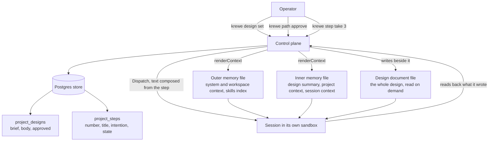
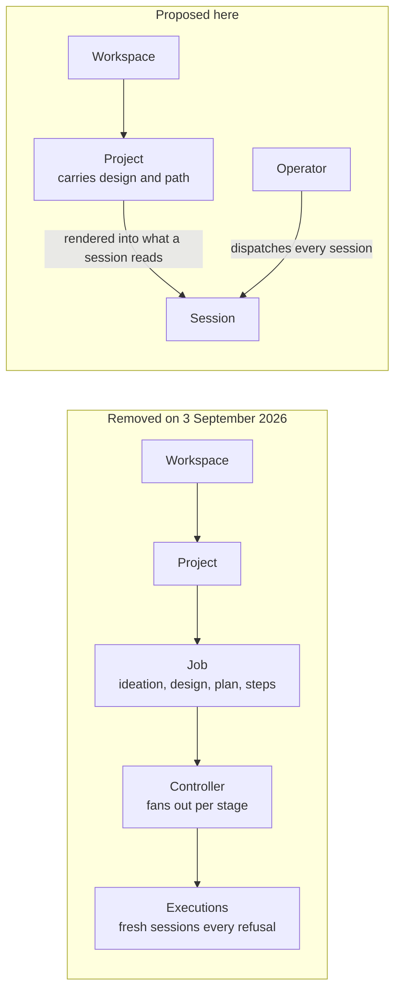
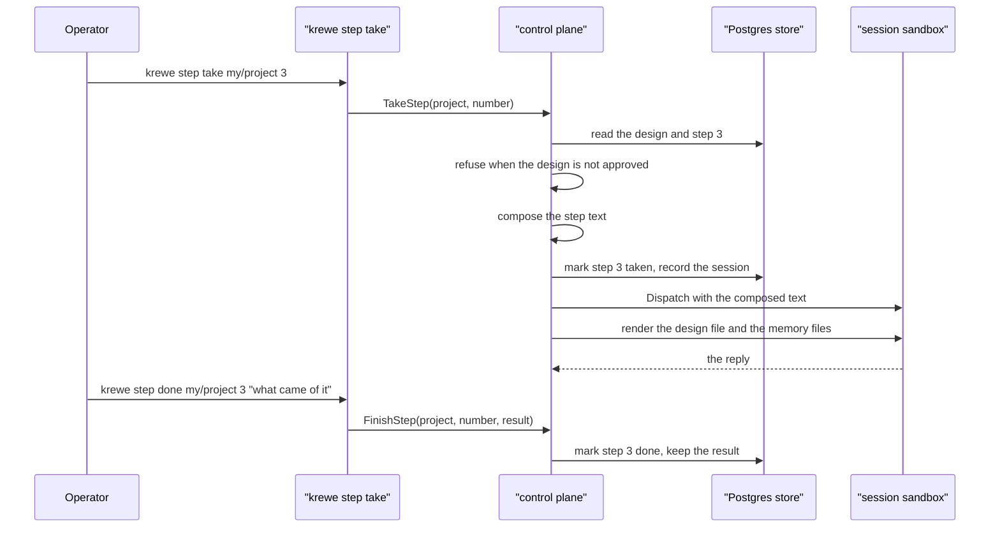

# System Design: a project carries its own context

Written 2026-09-04, in the worktree `design-a-project-carries-its-own-context`.

Status: proposed. Four decisions wait for Julian. See section 12. No code exists yet.

## 1. Why a design stage succeeds now, when the last one did not

Krewe already had this capability. Migration `internal/store/migrations/0060_remove_jobs_flows_and_roles.up.sql`,
commit `f323024`, pull request 693, dropped 20 tables on 3 September 2026. Among them was a `jobs`
table. It carried an `ideation` column, an `ideation_answer` column, a `design` column and a
`design_accepted` flag. It also carried a `plan` column and a `plan_approved` flag. A `job_steps`
table sat under it.

The removal was 500 files and about 138,000 lines.

The migration states the reason in its own words. Four stages, a controller and a gate produced work
nobody could use. A session with its hooks and its skills produces work.

The hub decisions file records the measurement behind that sentence. On 3 September 2026 four
verticals of one job merged by 19:43. The system then asked a person about the same work four more
times until 22:00. Each ask ran four workers again from nothing. The day cost about 1.23 billion
cache read tokens and delivered one column on one listing.

Read that measurement closely. The fault was not the idea of a design. The fault was one sentence in
the decisions file: a refusal never reuses the session that did the work.

### What is structurally different

One thing, and it is the only claim this design makes.

The design and the path are context. They are not orchestration.

The old design put the stages on a job, and put a controller above the session to move the job
between them. A gate stopped the controller. A refusal made the controller start again, and starting
again meant new sessions with empty conversations.

This design adds no controller and no stage. It adds rows that a project owns, and it renders those
rows into the files a session already reads. The mechanism exists and works today. `renderContext`
at `internal/controlplane/server.go:580` writes the store into the memory files. `syncContext` at
`:498` reads them back, so an edit from inside a sandbox survives. Nothing schedules anything.

Three consequences follow, and each one is a test of whether this claim holds:

1. The system never starts a session by itself. Every session starts because Julian typed a command
   or pressed a key. There is no fan out, so a refusal cannot cost four workers.
2. The only gate refuses one of Julian's own commands. A refusal costs one line of output and starts
   nothing. The old gate refused a controller, which then rebuilt the world.
3. The design belongs to the project, which outlives every session. The old design belonged to a job,
   which is declared once and thrown away. A project is read many times, so the record earns its
   storage.

### The guard, stated so a later change can be measured against it

A later change may add a component that dispatches a session without Julian asking. That component
is the controller, and it is the thing that failed. Refuse it.

A later change may add a stage word to a project or a session, and something that moves the row
between stage values. That is the same failure under a different name. Refuse it.

### The honest risk

Migration 0060 also states this: a table nobody writes is a table somebody reads a year later and
believes. If Julian does not read the design, or if a session builds no better from it, then this
design creates exactly that table. Section 2 names the assumption and says how to prove it early and
cheaply.

## 2. The riskiest assumption

The `proving` skill in this repository asks a design for three lines. Here they are.

Riskiest assumption. A session starts holding a design, the project context and one atomised step.
It then produces work Julian accepts more often than a session that starts with a line of text.

Proved where. Not yet proved.

What came back. Nothing yet.

The narrowest thing that answers it. Take one real path of about five steps. Dispatch step one twice:
once with the composed step text, once with a line of text. Compare what comes back. That costs two
execs.

That proof cannot run before the feature exists. So milestone 2 of the roadmap is the proof, and it
sits before every other milestone that costs real work. If the answer is no, the remaining milestones
are cancelled.

## 3. Requirements

### 3.1 Functional

The interview holds a draft of five actions. Four survive. One is reworded, because it names a stage,
and a stage is the shape that failed.

The draft action 1 reads as follows. An operator gives a project a brief, and krewe runs an ideation
stage that ends in a written design the operator approved. The words "runs an ideation stage" put a
lifecycle on the system. This design replaces it with: a project holds a brief and a design, and an ordinary
session writes the design.

The five actions, as this design states them:

**Action 1. A project holds a brief and a design.**
- Julian sets a brief on a project. The brief is one paragraph: what this project is for.
- A design session reads the brief, the project context and the repository, and writes a design.
- The design is one document. It carries the requirements, the decisions and the shape.
- Any write to the design body clears the approval. An approved design that somebody rewrote is not
  approved.
- A project with no brief and no design is the normal state, and is not an error.

**Action 2. The design carries a numbered path of atomised changes.**
- The path is a list of steps. Each step is one intention and one reviewable change.
- Each step carries a number, a title, what changes and why, what it touches, and what proves it.
- A step whose title needs the word "and" is two steps. The design session enforces this, not the
  system.
- Each step is written for a person who was not in the design conversation. That person must build it
  without asking a question.
- Writing the path replaces every step that nobody took. It refuses to drop or rename a step that is
  taken, done or stopped.

**Action 3. Julian takes a step, and the session starts holding what it needs.**
- One command names a project and a step number.
- The system composes the dispatch text from the step and starts a session with it.
- The session's memory file carries the project context, the design summary and the approval state.
- The design document sits in a file beside the memory file, in the session's own working directory.
- The system records which session took the step.
- The command refuses when the design carries no approval. See section 12, decision 4.

**Action 4. Julian reads the state of the path.**
- One command lists every step of a project, in number order.
- Each row says the number, the title, the state, and which session took it.
- The listing says what is done, what a session holds now, and which step is next.
- The next step is the lowest numbered step in state ready whose predecessor is done.

**Action 5. A step records what came of it.**
- A step moves to done with a result, or to stopped with a reason.
- The result is what somebody said, never what the system watched. Migration 0047 states this rule
  and it still holds: nothing can see inside a container.
- The next session reads a path where the finished steps carry their results.

### 3.2 Non functional

**Context cost.** This is the one number that matters. A memory file is read on every exec of every
session in the project. An import in a memory file loads eagerly and inlines, so it saves nothing.
Therefore the design summary in the memory file must stay under about 400 characters.

The design body must live in a file the session opens on demand. `internal/contextspend` already
measures where a session's context goes, so this is measurable rather than asserted.

**Scale.** One operator, one machine. Tens of projects. Tens of steps in a path. One query reads a
whole path. No pagination is needed.

A cap of 200 steps per path is a warning rather than a refusal, per the decision of 2 September 2026.

**Latency.** A path listing must answer inside the console's draw budget. It is one indexed query on
a primary key prefix.

**Durability.** The design and the path survive a control plane restart, a sandbox teardown and a
session reclaim. Postgres gives this. The in memory store loses them on restart, which is what the in
memory store already does with every other row.

**Availability.** Self hosted, single machine, no requirement stated.

### 3.3 Constraints

- Tests never run on this machine. Continuous integration is the test runner. The safe local gates
  are `go build`, `go vet`, `gofmt` and `golangci-lint`.
- Every behaviour change ships its own scenario under `features/`. The promises gate refuses a
  behaviour change that carries no scenario.
- Anything removed from the command line or the console must refuse by name and say what to type
  instead. The mechanisms are `removedCommands`, `removedFlags` and `movedViews`.
- The store has two implementations behind one interface. Every new method runs against both through
  the conformance suite in `internal/store/storetest`.
- Every word the system puts in front of a person follows Simplified Technical English.
- No length cap refuses text. Each cap is a warning that says the length.
- No code exists before Julian approves this path.

### 3.4 Explicitly out of scope

- No controller. No scheduler. No queue. Nothing runs above a session.
- No fan out. One step, one session, dispatched by hand.
- No stage field on any resource, and nothing that moves a row between stage values.
- No branches, no pull requests, no forge calls. The `git` and `github` skills already do that inside
  a conversation.
- No project level or session level attachment for skills and hooks. That stays at system and
  workspace, as it is today.
- No new credential for an ordinary session. Only a driver session reaches the control plane.
- No visual acceptance evidence, no screenshot, no recording.
- No automatic advance from one step to the next.

## 4. Technical decisions

Each line is the decision, then what it rejects, then why.

- **The design and the path live in the store, not in files on a host.** Rejected: files in the
  repository as the truth. Migration 0006 already answered this for context, in its own
  words. A pod has no host directory to bind mount. An interface cannot edit a file on somebody's
  laptop. A project's repository field is optional, so a repository truth leaves a project with no
  design.
- **The design renders into what a session reads, through the mechanism context already uses.**
  Rejected: a new delivery path. `renderContext` and `syncContext` work, carry three years of defect
  fixes in their comments, and already handle a session that edits its own memory.
- **The design body sits in a file beside the memory file, not inside it.** Rejected: inlining. An
  import loads eagerly and inlines, so it saves nothing, and every session in the project would pay
  for every word on every exec.
- **The step text is the dispatch text.** Rejected: a new field on `DispatchRequest`, and rejected:
  the `--append-system-prompt` flag on the model command line. The dispatch already carries text to
  the model. Composing the step into that text needs no change to `Dispatch`, no change to
  `internal/model`, and no change to the sandbox.
- **The composition happens in the control plane, not in the command line tool.** Rejected: composing
  in `cmd/krewe`. The console and the command line must send the same words, and the system's own
  words belong in one place.
- **A step is a resource the project owns, not an exec with more on it.** Rejected: putting the step
  on an exec. An exec is ephemeral and belongs to one session. A step outlives the session that took
  it, and a failed step is taken again by a different session.
- **The design carries an approval flag beside the body.** Rejected: one state column. Migration 0050
  states the reason. A design somebody sent back for a rewrite carries the same text as a design
  nobody read. Only a flag tells those two apart.
- **Any write to the design body clears the approval.** Rejected: keeping approval across a rewrite.
  Approval is a statement about a specific text.
- **A step's finish is what somebody declared, never what the system observed.** Rejected: watching
  the sandbox. Migration 0047 states this: nothing can see inside a container, and a session that
  dies takes with it everything it did not write down.
- **Empty string and false, never null, in every new text and boolean column.** This follows every
  existing migration in this repository. A reader that must tell null from empty is a reader with two
  cases where there is one.
- **The word is "path", not "plan".** `plan` is already a permission mode (`krewe mode plan`). Two
  meanings for one word in one tool is the fault the vocabulary migrations kept fixing.
- **The words "job", "flow", "role", "stage" and "controller" do not appear.** Each one names a thing
  that was removed. Reusing one would make the refusal tables lie.

## 5. Architecture

No new binary. No new container. No new port. Three additions inside the existing control plane, and
one new package boundary is not needed.

- `internal/store`: two new tables, a migration pair, new methods on the one `Store` interface, and
  both implementations proved against the shared conformance suite.
- `internal/controlplane/design.go`: a new file beside `capability.go` and `hooks_render.go`. It
  holds the new remote procedure call handlers, the render of the design into a session's directory,
  and the composition of a step's dispatch text.
- `internal/controlplane/server.go`: `renderContext` gains one section, and one dead branch is
  removed. See section 10.
- `cmd/krewe`: new verbs. `internal/console`: one new view.



The difference from what was removed, drawn:



Taking a step, end to end:



All three diagrams render through the mermaid command line tool.

## 6. Data model, field level

### 6.1 What exists today, read from the migrations

Table `projects`, from `0001_init`, `0003_projects`, `0043_project_deploy_target` and
`0044_project_repository`:

- `id` text, primary key
- `workspace` text not null, references `workspaces (id)`
- `name` text not null
- `created_at` timestamptz not null default now()
- `updated_at` timestamptz not null default now()
- `deleted_at` timestamptz, null while the project lives
- `repository` text not null default ''
- `visibility` text not null default ''
- `deploy_account` text not null default ''
- `deploy_region` text not null default ''
- `deploy_identity` text not null default ''

Index: `projects_workspace_idx on projects (workspace) where deleted_at is null`.

Table `contexts`, from `0006_contexts`:

- `scope` text not null
- `owner` text not null
- `body` text not null default ''
- `created_at` timestamptz not null default now()
- `updated_at` timestamptz not null default now()
- primary key (`scope`, `owner`)

This design adds no column to either table.

### 6.2 New table `project_designs`

One row per project. Created when somebody sets a brief or a design. A project with no row has no
design, which is the normal state.

- `project` text, primary key, references `projects (id)` on delete cascade
- `brief` text not null default ''. What Julian says the project is for. One paragraph. He writes it.
- `body` text not null default ''. The design document, whole. A design session writes it. Markdown.
- `approved` boolean not null default false. Julian's word. Any write to `body` sets this to false.
- `approved_at` timestamptz, null while `approved` is false
- `written_by` text not null default ''. The session identifier that last wrote `body`. Empty when
  Julian wrote it directly. It is not a foreign key, because the session may be archived or deleted
  and the record of who wrote the design must survive that.
- `created_at` timestamptz not null default now()
- `updated_at` timestamptz not null default now()

Indexes: the primary key is the only read path. A design is read by project identifier and never
scanned.

Rules, each proved by a scenario:
- Setting `body` sets `approved` to false and `approved_at` to null, in the same write.
- Setting `brief` does not touch `approved`. A brief is what the project is for, and it does not
  change what the design says.
- Approving a design whose `body` is empty is refused. There is nothing to approve.
- Deleting a project deletes its design row through the cascade.

Separate table rather than columns on `projects`, for two reasons. Every project listing reads
`projects`, and a design body is the largest text in the system. The row also carries its own
timestamps and its own writer, which are facts about the design and not about the project.

### 6.3 New table `project_steps`

One row per step of one project's path.

- `project` text not null, references `projects (id)` on delete cascade
- `number` int not null. Where in the path, counting from one.
- `title` text not null. One line, one intention. A title needing "and" is two steps.
- `intention` text not null default ''. What changes and why, in the words a stranger needs.
- `touches` text not null default ''. The files or packages this step changes, one per line.
- `proof` text not null default ''. What proves it: the scenario, the test, the thing to look at.
- `after` int not null default 0. The step number this one waits for. Zero means nothing blocks it.
- `state` text not null default 'ready'. One of 'ready', 'taken', 'done', 'stopped'.
- `session` text not null default ''. The session that took it. Empty until taken. Not a foreign key,
  for the same reason `written_by` is not one.
- `result` text not null default ''. What somebody said came of it. A reason when the state is
  stopped.
- `taken_at` timestamptz, null until taken
- `finished_at` timestamptz, null until done or stopped
- `created_at` timestamptz not null default now()
- `updated_at` timestamptz not null default now()
- primary key (`project`, `number`)

Indexes:
- The primary key serves the only ordinary read: one project's path in number order.
- `create index if not exists project_steps_session_idx on project_steps (session) where session <> ''`.
  This answers "which step is this session on", which a session listing needs to draw one row.

The four state words:
- `ready`: nobody took it.
- `taken`: a session holds it. `session` names that session and `taken_at` says when.
- `done`: somebody said it finished. `result` says what came of it.
- `stopped`: somebody stopped it. `result` says why.

Rules, each proved by a scenario:
- A step number must be one or greater. Zero and negative numbers are refused.
- `after` must name a step that exists in the same path, or be zero. A step cannot wait for itself.
- Writing a path replaces every step in state `ready`. It refuses when the new path drops or renames
  a step in state `taken`, `done` or `stopped`. The refusal names those steps.
- Taking a step in state `taken` or `done` is refused. The refusal says which session holds it.
- Taking a step whose `after` step is not `done` warns and continues. It does not refuse, because
  Julian may know something the path does not.
- Deleting a project deletes its steps through the cascade.

### 6.4 The single dependency field, and its limit

`after` is one integer, not a list. A path is numbered and mostly runs in order, so one predecessor
answers most real paths.

Marked as an inference, not an observation. I did not measure how many real paths need two
predecessors, because no such path exists in this system yet. A step that truly waits for two others
names the later of the two, and says the rest in its `intention`. Section 13 records the full
dependency graph as deferred.

### 6.5 Field mapping, store to wire

Every field of `project_designs` maps to `Design`, under the same name.
`project` to `project`, `brief` to `brief`, `body` to `body`. `approved` to `approved`, `approved_at`
to `approved_at`. `written_by` to `written_by`, `updated_at` to `updated_at`. `created_at` is not on
the wire. Nothing reads it.

Every field of `project_steps` maps to `Step`, with the same names:
`project`, `number`, `title`, `intention`, `touches`, `proof`, `after`, `state`, `session`, `result`,
`taken_at`, `finished_at`. `created_at` and `updated_at` are not on the wire.

## 7. What a session gets at birth, field by field

This answers open question 4 of the interview.

Today a session gets two memory files, both named `CLAUDE.md`. It also gets the shared volume, the
skills mounts, the hooks mount, the secrets mount and the environment.

The outer file, at `/home/agent/.claude/CLAUDE.md` inside the sandbox: unchanged. It holds system
context, workspace context and the skills index.

The inner file, at `/home/agent/workspace/CLAUDE.md` inside the sandbox: gains one section at the
top, before the project context. The section carries, and nothing else:

- one line: the project name and its brief, cut at 200 characters for the file and kept whole in the
  store
- one line: whether the design carries an approval, and when
- one line: the path to the design document, `.krewe/design.md`, and an instruction to read it before
  starting
- one line: the step this session took, its number and its title, when a step was taken

Target size: under 400 characters. Measured on every exec by `internal/contextspend`.

The design document, at `/home/agent/workspace/.krewe/design.md` inside the sandbox: the whole design
body, written fresh before every exec that builds a sandbox, from the store. Not a memory file, so
the model does not load it automatically.

A dot directory rather than the working directory root, because a repository cloned into the working
directory may hold its own file of that name. The existing `CLAUDE.md` already carries that risk and
this design does not add a second one.

The path document, at `/home/agent/workspace/.krewe/path.md`: every step, in number order, with its
state and its result. This is what makes a session start from what is true. A session on step 4 reads
what steps 1 to 3 produced.

The dispatch text, when the session was started by taking a step. The control plane composes it:

```
Step 3 of 7 on the path for <project>.

<title>

What changes and why
<intention>

What this touches
<touches>

What proves it
<proof>

The design is in .krewe/design.md. The whole path is in .krewe/path.md. Read both before you start.
Build this step only. Do not take work from another step.
```

Nothing else changes. No new environment variable, no new mount, no new credential.

## 8. The command line and console surface

### 8.1 Command line

Following the existing shape: a noun, then verbs under it, addresses instead of flags.

`krewe design` on a project:
- `krewe design [<address>]` prints the brief, the approval state and the design body.
- `krewe design brief [<address>] "<text>"` sets the brief.
- `krewe design set [<address>] --file <path>` writes the design body from a file.
- `krewe design edit [<address>]` opens the design body in the editor, then writes it back. This
  follows `krewe context edit` exactly.
- `krewe design approve [<address>]` records the approval.

`krewe path` on a project:
- `krewe path [<address>]` lists every step with its number, title, state and session.
- `krewe path set [<address>] --file <path>` replaces the path from a file.

`krewe step`:
- `krewe step take [<address>] <number>` dispatches a session on that step.
- `krewe step done [<address>] <number> "<result>"` marks it done.
- `krewe step stop [<address>] <number> "<reason>"` marks it stopped.
- `krewe step show [<address>] <number>` prints one step whole.

The path file format for `krewe path set`: markdown, one heading per step, numbered. The design
session writes it. The exact grammar is the architect's contract, not this design's.

Nothing is removed from the command line, so no entry is added to `removedCommands` or
`removedFlags`. Two words become taken: `design` and `path`, plus `step`.

### 8.2 Console

One new resource in `internal/console/resources.go`, following `Projects` and `Sessions`:

- A `path` view, drilled into from a project. Columns: number, title, state, session, age.
- Enter on a step row opens the session that took it, when there is one.
- The project row gains one cell: how many steps are done out of how many exist.

Nothing moves out of the console, so `movedViews` gains no entry.

## 9. The protobuf changes

In `proto/quaycrew/v1/controlplane.proto`. Two messages and eight remote procedure calls.

Message `Design`: `string project = 1; string brief = 2; string body = 3; bool approved = 4;
google.protobuf.Timestamp approved_at = 5; string written_by = 6;
google.protobuf.Timestamp updated_at = 7;`

Message `Step`: `string project = 1; int32 number = 2; string title = 3; string intention = 4;
string touches = 5; string proof = 6; int32 after = 7; string state = 8; string session = 9;
string result = 10; google.protobuf.Timestamp taken_at = 11;
google.protobuf.Timestamp finished_at = 12;`

Calls, added to `ControlPlaneService`:
- `GetDesign(GetDesignRequest) returns (GetDesignResponse)`
- `SetBrief(SetBriefRequest) returns (SetBriefResponse)`
- `SetDesign(SetDesignRequest) returns (SetDesignResponse)`
- `ApproveDesign(ApproveDesignRequest) returns (ApproveDesignResponse)`
- `SetPath(SetPathRequest) returns (SetPathResponse)`
- `ListSteps(ListStepsRequest) returns (ListStepsResponse)`
- `TakeStep(TakeStepRequest) returns (TakeStepResponse)`
- `FinishStep(FinishStepRequest) returns (FinishStepResponse)`

`TakeStepResponse` carries the `Session` and the composed text, so a caller can show what the session
was asked to do without a second call.

`FinishStepRequest` carries `state`, which must be `done` or `stopped`. An unknown value is refused
rather than stored, following the way `SetSessionPermissionMode` refuses an unknown mode.

`DispatchRequest` gains no field. `Session` gains no field. `Project` gains no field. Adding the step
number to `Session` was rejected. A session may work on a step and then work on something else, and
the step already names its session.

## 10. Security

- **No new credential.** An ordinary session still cannot reach the control plane. Only a driver
  session carries the address and a token, at `internal/controlplane/server.go:1789`. This design does
  not change that.
- **No new network surface.** No port, no service, no external call.
- **Everything in a design reaches the model.** That is already true of context. The design body,
  the brief, the step text and the path all render into a sandbox. A secret written into a design
  reaches the model, exactly as a secret written into context does today. This design does not add a
  scanner, and the deferred list records that.
- **Input validation.** The project must exist and must not be deleted. A step number must be one or
  greater. A state must be one of the four words. A `FinishStep` state must be `done` or `stopped`.
  Every refusal names the value and says what is accepted.
- **No length refuses text.** Per the decision of 2 September 2026, a long design warns and is kept
  whole. The warning says the length.
- **No string concatenation into a query.** Every statement is parameterised, as every statement in
  `internal/store/postgres.go` already is.
- **A write from inside a sandbox is not trusted as approval.** A session can write a design body
  through a design session, but nothing inside a sandbox can set `approved`. Approval reaches the
  store only through the operator's own command. This is the one boundary that matters, and it is
  what makes the guard in section 1 real.

### One piece of dead code to remove in the same work

`internal/controlplane/server.go` lines 585 to 599 hold a dead role brief path. `brief` is assigned
the empty string and never reassigned, so the `RoleScope` section never renders, and an `if false`
branch remains from the roles removal. `sandbox.RoleScope` at `internal/sandbox/memory.go:36` and its
read back handling still exist and decompose a section nothing writes.

This looks exactly like a working mechanism for handing a session a brief. It is inert. This design
does not build on it. Milestone 1 removes it, and removes `Config.Role` at
`internal/sandbox/sandbox.go:75` and the role branch in `layout` at `internal/sandbox/storage.go:87`,
which are dead for the same reason. `staticcheck` is not in the enabled linter set, which is why
neither `go vet` nor `golangci-lint` reports any of it.

## 11. Deployment

No change to `deploy/docker-compose.yml`. No new environment variable. No new image.

What ships: one migration pair, `0062_a_project_carries_its_design.up.sql` and `.down.sql`; one
protobuf regeneration through `make proto`; a rebuilt tool and control plane.

The existing `make upgrade` covers all of it. An operator on an older tool sees `unimplemented` for
the new calls, which is the ordinary result of a new call against an old server.

The down migration drops both tables. The data goes with them, and it exists nowhere else. So the
down migration says so in its own comment, the way `0060` says there is no way back.

## 12. Grey areas, settled by Julian on 2026-09-04

Julian answered all four. Each one took the recommendation. The four options and the reasoning stay
below, because a later reader needs to know what was rejected and why.

1. The design and the path live in the store only. Option B, a file committed into the repository,
   stays deferred in section 13.
2. Julian marks a step done, with one command and the result.
3. The design reaches the model as a summary of about 400 characters and a pointer to
   `.krewe/design.md`.
4. An unapproved design refuses `krewe step take`.

The fifth question, whether `after` holds one predecessor or a list, was not put to him. It stays as
one predecessor, and section 6.4 states the limit.

**Decision 1. Where the design and the path live.**
- Option A. The store only. The system renders them into each session's sandbox. Nothing is written
  to your repository. This adds no new mechanism.
- Option B. The store, plus a file a session commits into the repository, so a reviewer reads the
  design beside the code. This adds a commit, a push and a branch to the design stage.
- Option C. Repository files are the truth and the system reads them. A project with no repository
  then has no design, and the system cannot list a path it does not hold.
- My recommendation: A for this design, and B recorded as deferred. The interview names a third
  reader, a person who was not in the conversation, and that person reads a forge. B serves them. But
  B adds exactly the machinery that made the last attempt expensive. A session can write the design
  into the repository as ordinary work whenever you ask it to.

**Decision 2. How a step gets marked done.**
- Option A. You say done, with one command and the result. The record holds your word.
- Option B. The session writes a marked section into its memory file. The control plane reads it
  back the way it already reads back context. The record then moves without you, but only after the
  next exec of that session.
- Option C. An ordinary session gets a narrow credential for one call.
- My recommendation: A. It matches migration 0047, which says a step is what somebody declared. It
  needs no credential, and you are the person who reads the result anyway. B has a real defect: the
  read back happens on the next dispatch, so the record lags. C adds authentication surface, and a
  session that can write the record can write it wrong.

**Decision 3. How the design reaches the model.**
- Option A. A summary and a pointer. The memory file holds the brief, the approval state and one line
  naming `.krewe/design.md`. About 400 characters per exec.
- Option B. A pointer only. Cheapest. The session has the least reason to open the file.
- Option C. The whole design inlined in the memory file. The session cannot miss it. Every exec of
  every session in the project pays for every word.
- My recommendation: A. I checked this rather than assumed it. An import in a memory file loads
  eagerly and inlines, so splitting a file saves no context at all. C therefore taxes every unrelated
  session in the project. A names the file twice, in the memory file and in the step text, which is
  the strongest instruction available without paying for the body.

**Decision 4. Does an unapproved design refuse the command that takes a step?**
- Option A. Refuse, and say to approve the design first.
- Option B. Warn and dispatch anyway.
- Option C. No gate. Approval is a fact on a listing and nothing reads it.
- My recommendation: A. Your rule is that no code exists before you approve the path, and A is the
  only option that makes it real. The refusal costs one line and starts nothing, which is what makes
  it different from the gate that failed. That gate refused a controller, which then rebuilt the
  world.

**A fifth question, smaller.** `after` holds one predecessor rather than a list. See section 6.4. My
recommendation is one predecessor for now, with the full graph deferred. Say if you want the list.

## 13. Deferred

Each item matters and is not in this design.

- **The design written into the project's repository.** Decision 1, option B. It serves the third
  reader. It needs a commit, a push and a branch.
- **A full dependency graph on a step.** One predecessor covers a numbered path. A list needs its own
  table and a cycle check.
- **Project level and session level attachment for skills and hooks.** Today both attach at system or
  workspace only. A design skill attached to one project would be tidier. Not needed: a skill is
  instructions the model may read, and a workspace wide one costs a line in the skills index.
- **A design session that runs the ideation conversation from a skill.** Milestone 7 of the roadmap
  builds the skill. What is deferred past that is any system machinery around it. The session stays
  ordinary.
- **A secret scanner over the design body.** Everything in a design reaches the model, exactly as
  context does today. Nothing scans context either.
- **Taking a step in the console with a key press.** Milestone 8 draws the path. Dispatching from it
  is a second change.
- **A path that spans two projects.** Out of scope, and probably wrong: a path belongs to one project.
- **Visual acceptance evidence on a step.** The decisions file of 2 September 2026 records that
  acceptance takes a picture, a recording or written steps. That is a whole capability and it is not
  this one.
- **Reworking `make promises` for the new scenarios.** The gate already covers this work as it
  stands.
