# Roadmap: a project carries its own context

Written 2026-09-04, revised the same day after the operator read the first version.

Status: proposed. Nothing starts before the operator approves it.

Read `.greenlight/DESIGN.md` first. Every decision in section 12 is settled.

## The order, drawn

```mermaid
flowchart LR
  M1["1 remove the dead role brief path"] --> M2["2 a project holds a brief and a design, and a session reads it"]
  M2 --> M2G{"the measurement: does a session build better from a design?"}
  M2G -->|"no"| STOP["stop here. The cost was one migration and one render."]
  M2G -->|"yes"| M3["3 the operator approves a design"]
  M3 --> M4["4 the design carries a numbered path"]
  M4 --> M5["5 the operator takes a step"]
  M5 --> M6["6 a step records what came of it"]
  M6 --> M7["7 several steps run at once, capped, with a file collision refused"]
  M7 --> M8["8 the session restates the step before it builds"]
  M8 --> M9["9 the operator approves the restatement and the build starts"]
  M9 --> M10["10 finishing a step runs its named scenario"]
  M10 --> M11["11 taking a step waits for a done step"]
  M11 --> M12["12 krewe earns the word done, and can lose it"]
  M12 --> M13["13 a skill teaches a session to design a project"]
    M4 --> M14["14 the console draws the path"]
  M10 --> M14
  M13 --> M15["15 krewe writes the slash commands, with init and design"]
  M15 --> M16["16 the status and trust commands"]
  M12 --> M16
```

The diagram renders through the mermaid command line tool.

## How to read a milestone

Each milestone is one intention and one reviewable pull request. Each one is revertable on its own.
Each one names the files it touches, what it changes, what proves it, and what it depends on.

Each one is written for a person who was not in this conversation. If a milestone needs somebody to
explain it, it is a note and not a milestone.

## The milestones

**Milestone 1. The dead role brief path is removed.**
- Why first. `internal/controlplane/server.go` lines 585 to 599 look exactly like a working mechanism
  for handing a session a brief. It is inert. Milestone 8 adds a live mark to the same scope list. A
  reader who finds two marks there, one live and one dead, cannot tell which to copy.
- Touches: `internal/controlplane/server.go` (`renderContext` and the read back of `RoleScope`),
  `internal/sandbox/memory.go` (`RoleScope`), `internal/sandbox/sandbox.go` (`Config.Role`),
  `internal/sandbox/storage.go` (`layout`).
- Proves it: the existing context scenarios stay green. One new scenario says a memory file carries no
  role section.
- Also: add `staticcheck` to `.golangci.yml`. It reports an always false branch, and the standard
  linter set does not.
- Depends on: nothing.

**Milestone 2. A project holds a brief and a design, and a session reads it.**
- This is the proof of the riskiest assumption, and it is why it comes second. It stays exactly here.
- The operator writes the brief and the design by hand. Nothing generates them yet.
- Touches, in the store: a migration pair for `project_designs`; `internal/store/store.go`,
  `postgres.go`, `memory.go`, `storetest/`.
- Touches, above the store: `proto/quaycrew/v1/controlplane.proto` (the `Design` message,
  `GetDesign`, `SetBrief`, `SetDesign`); `internal/controlplane/design.go` (new);
  `internal/controlplane/server.go` (`renderContext` gains one section); `cmd/krewe/design.go` (new).
- Proves it: `features/design.feature`. A session dispatched into a project with a design reads the
  design summary in its memory file, and the design body in `.krewe/design.md`. One scenario measures
  the section at under 400 characters with a 5,000 character brief.
- The measurement that closes it: dispatch one real step twice, once with the design and once with a
  line of text. Compare. Write the result into `.greenlight/DECISIONS.md` as an observation.
- Depends on: milestone 1.

**Milestone 3. The operator approves a design, and a rewrite clears the approval.**
- Touches: `ApproveDesign` on the protobuf file and the server, `krewe design approve`, and the store
  method that clears `approved` on any write to `body`.
- Proves it: `features/design.feature`. Approve, then rewrite, then read: the approval is gone.
  Approving an empty design is refused. Nothing inside a sandbox can approve.
- Depends on: milestone 2.

**Milestone 4. A design carries a numbered path, and the operator reads it.**
- Touches: a migration pair for `project_steps`; the `Step` message; `SetPath` and `ListSteps`;
  `internal/controlplane/design.go`; `cmd/krewe/path.go` (new).
- The path document names each step's scenario. A step with no named predecessor waits for the
  previous number.
- Proves it: `features/path.feature`. Set a path of five steps, read it back in number order. A
  duplicate number is refused, naming both lines. Replacing a path refuses to drop a step that is
  taken or done, and the refusal names it.
- Depends on: milestone 3.

**Milestone 5. The operator takes a step, and the session starts holding it.**
- Gate 1 lands here: an unapproved design refuses `krewe step take`.
- Touches: `TakeStep` on the protobuf file and the server; the text composition in
  `internal/controlplane/design.go`; the render of `.krewe/path.md`; `cmd/krewe/step.go` (new).
- Proves it: `features/path.feature`. Taking a step dispatches a session whose text names the step.
  Taking it twice is refused, naming the session that holds it. Taking a step on an unapproved design
  is refused and starts nothing.
- Depends on: milestone 4.

**Milestone 6. A step records what came of it, and the path says what is next.**
- Touches: `FinishStep` on the protobuf file and the server; `krewe step done` and `krewe step stop`;
  the next step calculation in `internal/controlplane/design.go`.
- No proof check yet. That is milestone 10, and it needs this command to exist first.
- Proves it: `features/path.feature`. A finished step carries its result into `.krewe/path.md`, so the
  next session reads what the last one produced. Finishing with a word that is not done or stopped is
  refused.
- Depends on: milestone 5.

**Milestone 7. Several steps run at once, with a cap and a file collision refused.**
- This is the fan out. One session still builds one step. The operator takes each one.
- Touches: `steps_in_flight_cap` on `project_designs`; `SetStepsInFlightCap` on the protobuf file;
  the take rules in `internal/controlplane/design.go`; `krewe path cap`.
- The collision check reads the `touches` field of every step in state taken, line by line.
- Proves it, on the cap: taking a fourth step with three in flight is refused, naming the three and
  the cap. Raising the cap lets the fourth take go through. A cap below 1 or above 20 is refused.
- Proves it, on the collision: a take is refused when the step names a file that a step in flight
  also names. The refusal names the file and the step. Two steps that share no file both go through.
  The comparison ignores the spaces at each end of a line.
- Depends on: milestone 6.

**Milestone 8. The session restates the step before it builds anything.**
- The take text changes: restate this step, write no code, then stop.
- Touches, in the render path: `internal/sandbox/memory.go` gains one scope constant.
  `internal/controlplane/server.go` names the new mark in `syncContextExcept`, and `renderContext`
  renders it back while the step is taken.
- Touches, elsewhere: `internal/controlplane/proof.go` (new, the read back handler); the restatement
  columns on `project_steps`; `GetStep` on the protobuf file; `krewe step restatement`.
- Proves it: `features/path.feature`. A session that writes the mark into its memory file has its text
  read back into the step. Reading the step again shows the latest text without a dispatch. Text under
  the mark is not swept into session context. A new restatement clears the approval.
- Depends on: milestone 7.

**Milestone 9. The operator approves a restatement, and the build starts.**
- This is the second command per step.
- Touches: `ApproveRestatement` on the protobuf file and the server; the build text composition in
  `internal/controlplane/design.go`; `krewe step approve`.
- Proves it: `features/path.feature`. Approving dispatches the same session with the build text.
  Approving with no restatement is refused. A restatement written after an approval clears it.
- Depends on: milestone 8.

**Milestone 10. Krewe runs the scenario the step promised and states a verdict.**
- Gate 3 lands here. Krewe checks. The operator still speaks the word.
- Touches: the proof columns on `project_steps` and the proof command columns on `project_designs`;
  `SetProofCommand`; `internal/controlplane/proof.go` (the run); `krewe design proof`;
  `krewe step check`, `krewe step done` and `krewe step show`.
- The run uses `Provider.Existing`. When the session was reclaimed it starts a container and restores
  the working tree into it. It costs no model tokens.
- Proves it: `features/path.feature`. A check runs the named scenario and keeps its state, its count
  and the last of its output. A run that reports zero scenarios is a failing verdict, even when the
  exit status is zero. A proof command without the scenario token is refused.
- Proves it, on the word: finishing a step that nothing checked is refused. Finishing a step whose
  check failed is allowed, and the row records the disagreement. A check on a reclaimed session
  starts a container.
- Depends on: milestone 9.

**Milestone 11. Taking a step waits for the step before it to be done.**
- Gate 2 lands here. It comes last of the three gates because it needs a finished step to read.
- Touches: `TakeStep` in `internal/controlplane/design.go`; the next step calculation; the path
  listing.
- Proves it: `features/path.feature`. Taking step 3 while step 2 is not done is refused, naming step 2
  and its state. Changing `after` on a ready step lets the path move past a stopped step. A step
  taken again after being stopped starts unproven.
- Depends on: milestone 10.

**Milestone 12. Krewe earns the word done, and can lose it.**
- This is the trust ladder. It is the last thing built, because it is worth nothing until the
  operator reads the check under it many times.
- Touches: the six trust columns on `project_designs` and the two on `project_steps`; `RaiseTrust`,
  `SetTrustThreshold` and `ReopenStep`; the counters in `internal/controlplane/design.go`;
  `krewe trust`, `krewe trust raise`, `krewe trust threshold` and `krewe step reopen`.
- Proves it, on the counters: `features/path.feature`. Finishing after a passing check records an
  agreement. Finishing after a failing check records a disagreement and lowers the level. Stopping
  after a failing check records an agreement.
- Proves it, on the offer: a run of agreements that reaches the threshold prints an offer. A raise
  with no offer standing is refused.
- Proves it, at level 1: a passing check closes the step and names krewe as the closer. A failing
  check closes nothing. A reopen of a step krewe closed lowers the level and restarts the run. A
  reopen of a step the operator closed is refused.
- Depends on: milestone 11.

**Milestone 13. A design session writes the design and the path.**
- This is where krewe carries the ideation and the design itself.
- Touches: `skills/design/SKILL.md` and `skills/design/skill.yaml`, both new, prose only, no code. The
  skill states the six parts of a restatement and the rule that a step's proof names the value.
- The session stays ordinary. It is dispatched by hand. No controller and no gate on it.
- Proves it: `features/design.feature`. A session dispatched with the skill writes a design and a path
  that read back whole, and the design it wrote is not approved.
- Depends on: milestone 12.

**Milestone 14. The path is a view in the console.**
- Touches: `internal/console/resources.go` (a `path` resource), and the project row gains a cell
  counting done steps out of total.
- Proves it: `internal/console` table tests, plus a scenario for the view opening by name.
- Enter on a step row opens the session that took it. A step waiting for the operator draws "waiting
  on you", derived from the row.
- Depends on: milestone 4 for the data, milestone 10 for the proof state and milestone 12 for the
  trust cell.

**Milestone 15. Krewe writes the slash commands the operator's own session reads.**
- The operator drives krewe from a terminal that runs an agent. That agent reads one markdown file
  per command. Krewe writes those files.
- Touches: `commands/` (new, the markdown files); `internal/commands/` (new, the embed and the
  install); `cmd/krewe/commands.go` (new); `internal/manual/manual.go`.
- Nothing touches the store. No migration, no table, no protobuf message.
- Ships two commands: `/krewe:init` and `/krewe:design`.
- Proves it: `features/commands.feature`. An install writes every file and names where they went. A
  second install replaces the files it wrote. An install refuses a file without krewe's marker, and
  names it. The files carry the build that wrote them.
- Depends on: milestone 13, because `/krewe:design` dispatches a session that uses the design skill.

**Milestone 16. The status and trust commands.**
- Touches: `commands/status.md` and `commands/trust.md`, both new.
- Proves it: `features/commands.feature`. Both files install. Each one names only commands the
  manual carries, and a scenario reads the manual to prove that.
- Depends on: milestone 12 for the trust record, and milestone 15 for the install.

## The order, and why

Milestone 1 clears a trap before anybody falls in it, and before milestone 8 puts a live mark beside
the dead one.

Milestone 2 is the cheapest thing that answers the riskiest assumption. Everything after it costs real
work. The measurement may say a session builds no better from a design. Then stop there.

Milestones 3 to 6 build the path in the order a person uses it: write it, approve it, take a step,
finish a step.

Milestone 7 is the fan out, and it sits here because everything after it is easier to build with it.
This project's own graph is 25 waves deep and its widest wave holds three slices. So the cap never
refuses a take on this path, and the file collision check is the part that does work here.

Milestones 8 to 12 are the trust the operator asked for, and they are last of the working code on
purpose. Each one costs the operator time on every step, so none of them is worth building until the
delivery underneath them is proved.

Milestone 12 is last of the five for a reason of its own. The ladder counts how often the operator
agreed with krewe's verdict. That count means nothing until the check runs many times and the
operator reads it. Built earlier, it would offer krewe the word on a record nobody trusts.

Milestone 13 is the headline capability. It rests on everything above it.

Milestone 14 is the surface. It reads what the earlier milestones write and adds no behaviour.

Milestones 15 and 16 put krewe in the operator's own terminal. They come last because each command
runs the command line tool, so every command it names has to exist first.

## What this roadmap does not carry

Every item in section 14 of the design. The largest are the design committed into the project's
repository, and a full dependency graph on a step. After those come a file level conflict check on
the graph, a second proof kind, a trust level above 1, and visual acceptance evidence.

Several steps may run at once from milestone 7. The operator takes each one. Section 5.1 of the
design records what the collision check cannot see.
