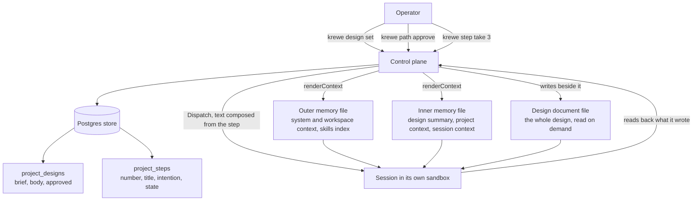

# Roadmap: a project carries its own context

Written 2026-09-04. Status: proposed. Nothing starts before the operator approves it.

Read `.greenlight/DESIGN.md` first. Section 12 holds four decisions that are not settled. Milestones
2, 5 and 6 change shape depending on those answers.

## The architecture, drawn

The diagram renders through the mermaid command line tool.

## How to read a milestone

Each milestone is one intention and one reviewable pull request. Each one is revertable on its own.
Each one names the files it touches, what it changes, what proves it, and what it depends on.

Each one is written for a person who was not in this conversation. If a milestone needs me to explain
it, it is a note and not a milestone.

## The milestones

**Milestone 1. The dead role brief path is removed.**
- Why first. `internal/controlplane/server.go` lines 585 to 599 look exactly like a working mechanism
  for handing a session a brief. It is inert. Anybody who builds milestone 2 will find it and believe
  it.
- Touches: `internal/controlplane/server.go` (`renderContext`), `internal/sandbox/memory.go`
  (`RoleScope`), `internal/sandbox/sandbox.go` (`Config.Role`), `internal/sandbox/storage.go`
  (`layout`), and `internal/controlplane/server.go:527` (the read back of `RoleScope`).
- Proves it: the existing context scenarios stay green. One new scenario says a memory file carries
  no role section.
- Also: add `staticcheck` to `.golangci.yml`. It reports an always false branch, and the standard
  linter set does not.
- Depends on: nothing.

**Milestone 2. A project holds a brief and a design, and a session reads it.**
- This is the proof of the riskiest assumption, and it is why it comes second.
- The operator writes the brief and the design by hand. Nothing generates them yet.
- Touches: a migration pair `0062_a_project_carries_its_design`; `internal/store/store.go`,
  `postgres.go`, `memory.go`, `storetest/`; `proto/quaycrew/v1/controlplane.proto` (the `Design`
  message, `GetDesign`, `SetBrief`, `SetDesign`); `internal/controlplane/design.go` (new);
  `internal/controlplane/server.go` (`renderContext` gains one section);
  `cmd/krewe/design.go` (new).
- Proves it: `features/design.feature`. A session dispatched into a project with a design reads the
  design summary in its memory file, and the design body in `.krewe/design.md`.
- The measurement that closes it: dispatch one real step twice, once with the design and once with a
  line of text. Compare. Write the result into `.greenlight/DECISIONS.md`.
- Depends on: milestone 1.

**Milestone 3. The operator approves a design, and a rewrite clears the approval.**
- Touches: `ApproveDesign` on the proto and the server, and `krewe design approve`. Also the store
  method that clears `approved` on any write to `body`. The migration adds nothing new.
- Proves it: `features/design.feature` gains scenarios. Approve, then rewrite, then read: the
  approval is gone. Approving an empty design is refused.
- Depends on: milestone 2.

**Milestone 4. A design carries a numbered path, and the operator reads it.**
- Touches: the second table in migration `0062`; the `Step` message; `SetPath` and `ListSteps`;
  `internal/controlplane/design.go`; `cmd/krewe/path.go` (new).
- Proves it: `features/path.feature`. Set a path of five steps, read it back in number order.
  Replacing a path refuses to drop a step that is taken or done, and the refusal names it.
- Depends on: milestone 3.

**Milestone 5. The operator takes a step, and the session starts holding it.**
- Touches: `TakeStep` on the proto and the server; the text composition in
  `internal/controlplane/design.go`; the render of `.krewe/path.md`; `cmd/krewe/step.go` (new).
- Proves it: `features/path.feature`. Taking a step dispatches a session whose text names the step.
  Taking a step twice is refused and the refusal names the session that holds it. Taking a step on an
  unapproved design is refused, per decision 4 of the design.
- Depends on: milestone 4.

**Milestone 6. A step records what came of it, and the path says what is next.**
- Touches: `FinishStep` on the proto and the server; `krewe step done` and `krewe step stop`; the
  next step calculation in `internal/controlplane/design.go`.
- Proves it: `features/path.feature`. A finished step carries its result into `.krewe/path.md`, so
  the next session reads what the last one produced. A path with steps 1 and 2 done says step 3 is
  next.
- Depends on: milestone 5. Its shape depends on decision 2 of the design.

**Milestone 7. A design session writes the design and the path.**
- This is where krewe carries the ideation and the design stages itself.
- Touches: `skills/design/SKILL.md` and `skills/design/skill.yaml`, both new, prose only, no code.
  Also the path file grammar that `SetPath` reads. Also a scenario that proves a session writes a
  design through the same call the operator uses.
- The session stays ordinary. It is dispatched by hand. No stage, no controller, no gate on it.
- Proves it: `features/design.feature`. A session dispatched with the design skill writes a design
  and a path that read back whole.
- Depends on: milestone 6.

**Milestone 8. The path is a view in the console.**
- Touches: `internal/console/resources.go` (a `path` resource), the project row gains a cell counting
  done steps out of total.
- Proves it: `internal/console` table tests, plus a scenario if the view calls a new remote procedure
  call.
- Enter on a step row opens the session that took it. Taking a step from the console is deferred.
- Depends on: milestone 4 for the data, and milestone 6 for the states.

## The order, and why

Milestone 1 clears a trap before anybody falls in it.

Milestone 2 is the cheapest thing that answers the riskiest assumption. Everything after it costs
real work. The measurement in milestone 2 may say a session builds no better from a design. Then stop here.
The cost was one migration and one render.

Milestones 3 to 6 build the path in the order a person uses it: write it, approve it, take a step,
finish a step.

Milestone 7 is the headline capability, and it comes last on purpose. It rests on the design reaching
a session. If that does not help, the ideation conversation is not worth building.

Milestone 8 is the surface. It reads what the earlier milestones write, and it adds no behaviour.

## What is not in this roadmap

Every item in section 13 of the design. The largest are: the design committed into the project's
repository, a full dependency graph on a step, project level skill attachment, and visual acceptance
evidence.
