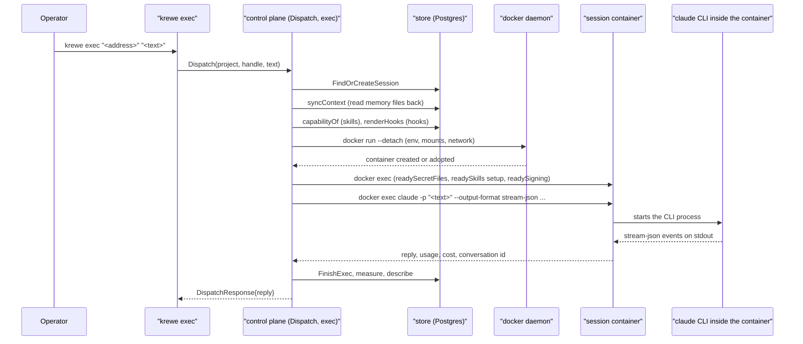
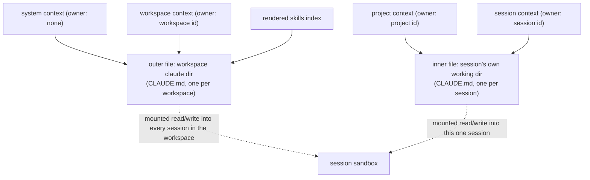
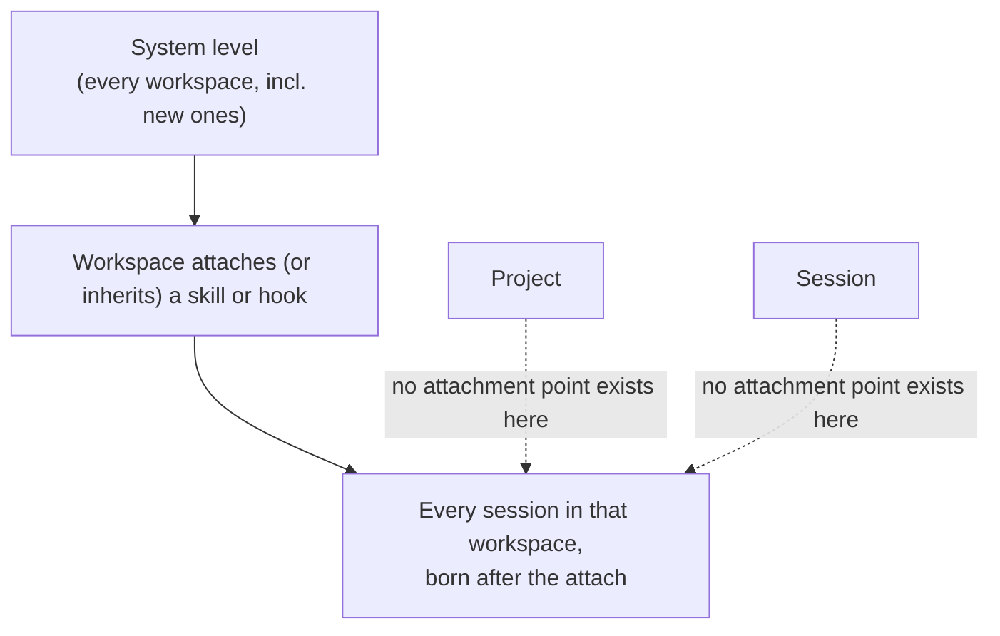
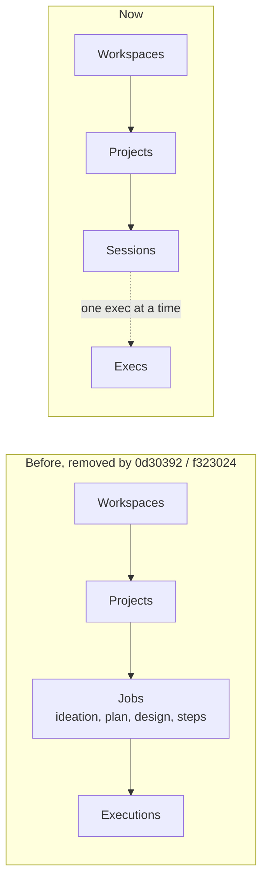

# Architecture

Focus: how Quay Krewe is designed, and where a design or plan stage would sit in it. Written for the
design session named in this worktree: "design a project carries its own context".

## 0. The pattern

One Go module, one control plane. `cmd/controlplane` serves a single gRPC service,
`ControlPlaneService` (`proto/quaycrew/v1/controlplane.proto`, generated into
`gen/quaycrew/v1`). `cmd/krewe` is the command line client and the console (a terminal user
interface). Every session runs in its own Docker container, started and torn down by the control
plane through `internal/sandbox`. State is kept in Postgres (`internal/store/postgres.go`) or an in
memory store for tests (`internal/store/memory.go`), behind one `Store` interface
(`internal/store/store.go:190` onward).

This is a monolith with one long lived server process and many short lived sandboxed workers. There
is no orchestration layer above a session today. That is a historical fact, not an assumption: see
section 5.

## 1. The four resources that hold state, field by field

### Workspace

`proto/quaycrew/v1/controlplane.proto:9`

```protobuf
message Workspace {
  string id = 1;
  string name = 2;
  google.protobuf.Timestamp created_at = 3;
}
```

Three fields. A workspace holds nothing of its own beyond its name: everything it "holds" (secrets,
skills, hooks, context) is a separate table keyed by the workspace id, read at dispatch time. The
outer grouping, one level under the system.

### Project

`proto/quaycrew/v1/controlplane.proto:24`

```protobuf
message Project {
  string id = 1;
  string workspace = 2;
  string name = 3;
  google.protobuf.Timestamp created_at = 4;
  DeployTarget deploy_target = 5;
  string repository = 6;
  string visibility = 7;
}
```

A project today is: an id, which workspace it is in, a name, a repository address
(`owner/name`, validated in `internal/repository/repository.go`), whether that repository is
public or private (a cost fact, not fetched from the forge), and an optional `DeployTarget`
(cloud account, region, deploy identity; `controlplane.proto:51`).

That is all. A project carries **no plan, no design, no path, no backlog, and no working directory
of its own**. Its context (see section 3) is a row in the store, keyed by the project id, and its
sessions each get their own working directory on disk (`internal/sandbox/storage.go:87`, the
`layout` function): the shared checkout a project's sessions would work from lives at the
**workspace** level (`workspaces/<workspace>/volume`), not at the project level. A project is a name,
a repository address and a cost flag that many sessions sit under.

### Session

`proto/quaycrew/v1/controlplane.proto:65`

The session message is large (22 fields; `id`, `workspace`, `handle`, `status`, `model_session_id`,
`created_at`, `updated_at`, `project`, `archived_at`, `permission_mode`, `driver`, `usage`, `stale`,
`label`, `description`, `described_at_exec`, `context_window`, `reclaimed_at`, `presence`, `title`,
`context_spend`; field 18, `role`, is `reserved`). The comment at line 62 defines it: "one
conversation inside a project: the operator's word for what the control plane runs as a session in a
sandbox." A session is a container plus a conversation history plus a row of bookkeeping about that
conversation (cost, context window fullness, presence, staleness). It is explicitly not a Pod
(README.md:39): a Pod is disposable, a session's whole value is the history it holds.

### Exec

`proto/quaycrew/v1/controlplane.proto:931`. One exchange with the model: a prompt, a reply, a status,
a failure, a timestamp, a trace id. README.md:25 calls it "ephemeral: an exec is written when it
starts and nothing survives the process going down." It is a row, not a resource with a lifecycle of
its own; it belongs entirely to the session it happened in.

## 2. Session creation: the whole path from the command line to the process inside the sandbox

Command: `krewe exec [--dispatch] [<address>] "<text>"` (`cmd/krewe/exec.go:31`).

1. `runExec` / `sendExec` (`cmd/krewe/exec.go:65`) resolve which project and which session handle the
   text is going to, then call the single RPC `Dispatch(DispatchRequest{Project, Handle, Text,
   PermissionMode, Detach, Title})` (`controlplane.proto:341`).
2. `Server.Dispatch` (`internal/controlplane/server.go:1127`) finds or creates the session row
   (`store.FindOrCreateSession`), refuses a dispatch to an archived session, records the permission
   mode if one was sent, and then either runs `s.exec` inline (waited) or spawns it in a goroutine
   (detached).
3. `Server.exec` (`server.go:1225`) is where both roads meet. It records the exec as running, then
   calls `s.startSandbox` to get (or create) the session's container.
4. `Server.startSandbox` -> `Server.sandboxFor` (`internal/controlplane/server.go:349`,
   `dispatchwaits.go:76`) does, in order, under one 60 second budget
   (`dispatchwaits.go:38`):
   - `s.syncContext` — reads the model's own memory files back into the store first, so nothing the
     model wrote to its own memory is lost (section 3).
   - `s.capabilityOf` — resolves every skill the session should hold (system's + workspace's, workspace
     wins a name clash), leaving out any whose secret is missing (`capability.go:73`).
   - `s.renderHooks` — writes the workspace's hooks and a settings file to a host directory, and builds
     the read only mount that carries them in (`hooks_render.go:24`).
   - `s.provider.Create(ctx, cfg)` (`internal/sandbox/docker.go:74`) — `docker run --detach --name
     <ContainerName(sessionID)>` with: a tmpfs for mounted secrets, CPU shares and a memory limit if
     configured, the session network (so the sandbox can reach the control plane and nothing else of
     the system's), every `cfg.Env` entry as `--env`, every mount (the workspace's conversation
     directory, the session's own working directory, the workspace's shared volume, the skills and
     hooks mounts), and the image, running `sleep infinity` (so it stays up between execs).
   - `s.provision` — inside the now running container: `readySecretFiles` (writes any file projected
     secrets), `readySkills` (checks each skill's required binaries are present, runs each skill's
     `bin/setup` once, marked with a `/tmp/.quay-setup-<name>` file), `readySigning` (sets up commit
     signing for git).
5. Back in `Server.exec`, once the sandbox is ready: `s.nameConversation` decides the conversation id
   (a new one, or the session's `model_session_id` to resume), and `s.runner.Run(ctx, box,
   model.Request{...})` is called (`internal/model/claudecode.go:99`).
6. `ClaudeCodeRunner.Run` builds the actual argv and execs it inside the container via
   `box.Exec(ctx, spec)`, which is `docker exec -i [-w <workdir>] [-e KEY=VALUE ...] <container>
   claude ...` (`internal/sandbox/docker.go:136`). The argv itself
   (`internal/model/claudecode.go:71`, `buildArgs`):

   ```
   claude -p "<text>" --output-format stream-json --verbose \
     --permission-mode <plan|acceptEdits|bypassPermissions> \
     [--model <model>] \
     [--resume <conversation id> | --session-id <conversation id>] \
     [--settings <path to hooks settings file>]
   ```

7. The process's environment (`Server.execEnv`, `server.go:1789`) carries: `QC_SESSION_ID` (this
   session's own id, so a skill's setup can namespace a shared volume by session); `QC_GRPC_ADDR` and
   a driver token, only if this session is a driver (`session.driver == true`); a per exec minted
   credential and `QC_GRPC_ADDR` again, only for a job credential (present in the schema, unused by
   any RPC today because the job subsystem that minted these credentials was removed, see section 5);
   `GIT_AUTHOR_NAME/EMAIL` and `GIT_COMMITTER_NAME/EMAIL` if the operator configured a git identity;
   every workspace secret whose projection is `env` rather than `file`, plus the model's own OAuth
   token under both `CLAUDE_CODE_OAUTH_TOKEN` and, because the Claude Code CLI strips the first name
   from every child process it starts, a second copy under `QUAY_MODEL_TOKEN` so a hook fired from
   inside the CLI can still authenticate. Mounted (file projected) secrets never reach the environment;
   they land as files under `/run/quay/secrets` (`secretsMount()`, `docker.go:423`).
8. `ClaudeCodeRunner.parseStream` reads the CLI's `stream-json` output line by line, captures the
   model's own conversation id, the reply text, token usage and cost, and any refusal, and returns a
   `model.Response`. `Server.exec` records the exec (`landExec`), measures it (`measureExec`, emitted
   as an OpenTelemetry metric), and, in the background, asks the model to describe the session in one
   line for the listing (`describeSession`).

Everything a session is "given" at birth, summarised: its own working directory (empty, a repository
is cloned in conversation, following the git skill); the workspace's shared checkout volume; the
workspace's conversation store directory (its `CLAUDE.md`); the skills mounts (system + workspace);
the hooks mount and settings file; the secrets file mount; whatever the environment carries (listed
above). A sandbox is born with all of this and never drifts: attaching a skill, a hook or a secret
after a session's container exists reaches its *next* container, not the one already running
(`sandboxFor`'s own comment, `server.go:344`; the `stale` field on `Session` exists to say this on a
listing).



## 3. The Context resource

Context is a store backed, four level, layered set of text bodies, rendered into two files a session
reads, never a runtime setting.

**Storage.** `internal/store/store.go:320` defines `ContextScope` with four values: `system`
(owner `""`), `workspace` (owner = workspace id), `project` (owner = project id), and `session`
(owner = session id, "the innermost level, and where a note written from inside a sandbox lands",
`store.go:331`). `GetContext(scope, owner)` / `SetContext(scope, owner, body)` are two calls on the
`Store` interface (`store.go:218`); Postgres stores them as rows, one per (scope, owner) pair
(`internal/store/postgres.go:596`).

**Note:** the README's own description, "what the system, the workspace and the project know", names
three levels; the code has a fourth, `session`, and it is load bearing (see rendering below). The
public `SetContext` RPC only accepts `system`, `workspace` or `project`
(`internal/controlplane/server.go:1461`, the error message literally lists three); a session's own
context is written only by the sandbox itself, never through an operator command.

**Rendering into files.** Every session reads exactly two memory files
(`internal/controlplane/server.go:690`, `contextFiles`):
- the **outer file**, in the workspace's shared conversation directory (`workspaces/<ws>/claude/`),
  carrying `system` context, then `workspace` context, then an index of the skills the session holds.
- the **inner file**, in the session's own working directory (`.../sessions/<id>/workspace/`), carrying
  `project` context, then `session` context.

Both files are the same filename the model already looks for as its own memory (`CLAUDE.md`,
`sandbox.MemoryFile`). `renderContext` (`server.go:580`) writes the store's bodies into these files
before every exec that needs a fresh sandbox; `syncContext` (`server.go:498`) reads them back into the
store first, on every dispatch, so anything the model itself appended to its own memory (marked with a
section marker, `sandbox.Marked`) is kept rather than overwritten. `SetContext` also renders
immediately to every *live* session that reads that scope (`renderTo`, `server.go:662`), so a change
reaches a running sandbox on its next exec rather than only on the next container.



A project's context is real and stored today, but it lands in a file that belongs to one *session's*
working directory, not to a directory the project itself owns on disk: there is no
`workspaces/<ws>/projects/<id>/` directory a project's sessions share (the working directory in
`internal/sandbox/storage.go:87` is keyed `workspaces/<ws>/projects/<proj>/sessions/<id>/workspace`,
so it is a project scoped *path* but a session scoped *mount*, made fresh and empty per session). This
is the seam the worktree's name points at: a project's context is a row keyed correctly, but nothing
about the project itself, on disk, carries it between sessions.

## 4. Where skills and hooks attach

Both are authored the same way: a directory (`skills/<name>/skill.yaml` + `SKILL.md`, or
`hooks/<name>/hook.yaml` + an executable entry point), imported into the store
(`ImportSkill`/`ImportHook` RPCs, files travel over the wire because the control plane may run in a
container with no view of the operator's disk), then **attached at one of exactly two levels**:

- **system** (`scope: "system"` on `AttachSkillRequest`/`AttachHookRequest`,
  `controlplane.proto:698` and `:790`) — every workspace holds it, including ones created afterwards.
- **workspace** (`scope: "workspace"`, the default) — one workspace's sessions hold it.

There is **no project level and no session level attachment** for either skills or hooks. Every
session in a workspace holds exactly what that workspace holds (system's skills plus the workspace's
own, workspace winning a name collision; `internal/controlplane/capability.go:79`,
`heldIn`/`withSystemSkills`). A skill whose required secret the workspace has not set is silently left
out of that session's set rather than failing the exec (`withoutUnusable`, `capability.go:161`); the
listing reports why (`Skill.left_out`).

Mechanically: skills are mounted read only, one bind mount per skill, at
`/skills/<name>` inside the sandbox (`capability.go:87-119`); hooks are rendered to one file per
workspace plus a settings file that binds them to Claude Code's own hook events (`PreToolUse`,
`UserPromptSubmit`, etc., `HookBinding.on`, `controlplane.proto:751`), mounted read only at a single
`HooksPath` (`internal/controlplane/hooks_render.go:24`). Both reach a session only when its sandbox
is *built*: attaching a skill or hook to a workspace does not reach a session's already running
container (`session.stale` exists to surface this).



## 5. Exec, dispatch, and the absence of a plan/design/backlog resource

**An exec** is one prompt/reply pair against one session, ephemeral, recorded when it starts and
finished when it lands (section 1). **Dispatch** is the one RPC that starts or continues a session
(`Dispatch`, section 2). There is no unit of work bigger than one exec that the system tracks today:
no queue, no retry policy, no "this exec is step 3 of a plan" relationship.

**There is no plan, design, backlog or sequence-of-steps resource in the running system.** This was
verified by reading `proto/quaycrew/v1/controlplane.proto` in full (930 lines) and
`internal/store/store.go`'s `Store` interface: no message or method mentions a plan, a design
document, a path of steps, or a backlog.

That absence is a deliberate removal, not an oversight, and it matters for this design session. The
schema history (`internal/store/migrations/0037` through `0059`) shows a **job** subsystem that
existed and was removed:

- A `jobs` table carried, at various points: `ideation` (what a session understood before writing a
  plan: what it understood, what the work is not, what it was told, what it assumed, what it does not
  know, how sure it is) and `ideation_answer` (a person's free text reply to that, migration
  `0052_job_ideation`); `plan` (at most seven one line steps) and `plan_approved` (migration
  `0050_job_plan`); `design` (proposed verticals, one line each, of what a person gets and what they
  are shown) and `design_accepted` (migration `0053_job_design`); a `job_steps` table recording each
  step a session said it finished, in order, once each (migration `0047_job_steps`); flows (graphs of
  jobs), roles (a session's declared capability set), executions, gates, a controller, and more.
- All of it was removed in a single change,
  `remove jobs, flows and roles and keep sessions` (commit `f323024`, migration
  `0060_remove_jobs_flows_and_roles`), which dropped 20 tables and about 138,000 lines across 500
  files: "executions, gates, the controller, messaging and channels, the room, the briefing page, the
  headless browser, the forge client, publishing, machine capacity and `docs/`." The stated reason, in
  the pull request's own words: "Four stages, a controller and a gate produced work nobody could use.
  A session with its hooks and its skills produces work. So the system is now the part that works."



Two things worth carrying into the design: the vocabulary this exact idea used before (ideation,
plan, design, steps, accepted flags) is already worked out in the migration history and the removal
commit's own reasoning, and the reason it was cut was that the orchestration sat *above* a session and
produced nothing a person could use, not that a project or a session should never carry a design. A
fresh design that wants a project to carry its own plan, context and path should read the old
`ideation` / `plan` / `design` / `job_steps` shape (migrations 0047, 0050, 0052, 0053) as prior art and
the removal pull request's own reasoning as the failure mode to avoid repeating: state above a
session, disconnected from what a session actually does.

## 6. Where an ideation or design stage would sit today

Named by package and boundary, given the architecture above:

- **`proto/quaycrew/v1/controlplane.proto`** — a design/plan resource is an API contract first. It
  would need its own message(s) (the old `jobs.ideation/plan/design` columns are the field level prior
  art) and RPCs, most naturally attached to `Project` (`CreateProject`/`GetProject` already exist,
  section 1) since the read at line 21 already says "Projects... hold... the context, and the sessions
  working in it."
- **`internal/store/store.go` + `internal/store/postgres.go` + `internal/store/memory.go` +
  `internal/store/migrations/`** — the persistence boundary. A design/plan needs its own table(s) (or
  columns on `projects`) and a migration, mirroring how `ContextScope` and `SetContext`/`GetContext`
  are already the pattern for "text a project owns."
- **`internal/controlplane/server.go`** (plus a new file, the way `capability.go`, `hooks_render.go`
  and `dispatchwaits.go` are already split out of the 2,327 line `server.go`) — where the RPC handlers
  and the "render this into what a session reads" logic would live, following the exact shape
  `renderContext`/`syncContext` already use for context: a design/plan is text (or structured text)
  the store holds, rendered into something a session reads at dispatch time, and read back if a
  session amends it.
- **`internal/sandbox/storage.go`** — if a plan or design should be readable and editable as a file the
  way context is (`ContextDir`, `Context`, `MyDirs`), this is where its directory and mount would be
  defined, following `layout()`.
- **`cmd/krewe/`** — a CLI surface (`context.go` is the existing analogue: `krewe context set/get`).
- **`internal/console/`** — the terminal UI's own view of it, following the existing project/session
  tree (`catalogue.go`).
- **What it would explicitly *not* touch**, on the evidence of section 5's removal: `Dispatch` and
  `exec` (section 2) should stay exactly what they are, one prompt against one session. The prior
  `jobs` design put the plan and its steps on a separate entity *above* sessions and orchestrated
  execs against it; the removal's stated reason was that this produced work nobody could use. A
  design/plan resource that a project carries as its own context, read by whatever session is working
  in that project rather than owned by a controller above sessions, is the shape consistent with what
  survived the removal.
