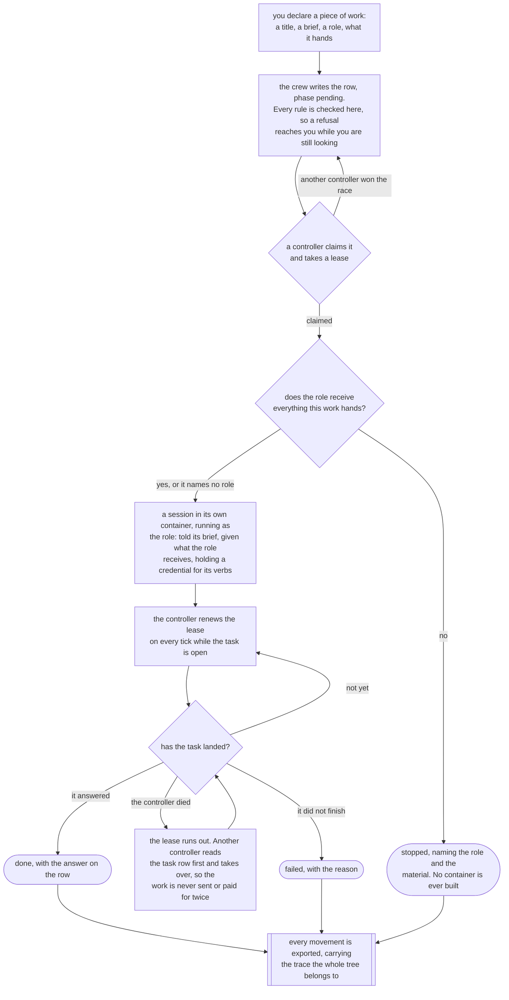

# Quay Crew

A self hosted, open source personal agent hub. You command a crew of AI agent sessions from any
channel (a command line tool, a chat app, a scheduler), they do the work in sandboxes and report
back, and every action is auditable and observable. Bring your own model. Run it on your own machine
or in your own cloud from the same build.

The name is the picture of the system: a crew you command at the quay where every channel docks.

**Status.** Early, and moving fast. Sessions and declared work both run end to end from the command
line. The telemetry stack starts with the crew and carries logs, what each task cost, and traces of
the crew's own calls; [`docs/OBSERVABILITY.md`](docs/OBSERVABILITY.md) says which signals are real
and which are wired and carry nothing. Chat channels do not exist yet: the gateway is a service
skeleton that boots and waits. There is no admin dashboard, although `quay web` serves a read only
view of the crew to a browser on your own machine. Nothing consumes the event log.
[`CHANGELOG.md`](CHANGELOG.md) is the honest list of what has landed, and
[`docs/ARCHITECTURE.md`](docs/ARCHITECTURE.md) is where the whole plan lives.

## Two things you can ask for

A task is a message. You send text, a session answers, and that is the whole life of it.

A piece of work is a job. You write down what you want done and the crew keeps that record, so it has
a phase you can read at any moment: pending, running, done, failed or stopped. It can run as a named
role, carry a budget and a deadline, and declare work of its own. Two more phases are written down
and nothing reaches them yet: `waiting`, because no controller honours ordering, and `asking`, which
today only a flow run gets to.

The test is one question. If you would ever ask where that is up to, it is work. If you would not, it
is a task.

A flow is work with its plan drawn in advance. A session is the conversation a task happens in.

## Work is a record the crew keeps

This is the shape of the product now, so read it after the section above.

A controller loop makes reality match the record. The work outlives the controller that started it,
and every movement it makes is on the record with the trace it happened in.



[`docs/ORCHESTRATION.md`](docs/ORCHESTRATION.md) is the long version: the record, the loop, the
lease, the capability model, and what is deliberately left out.

## What works today

Everything below runs. Each one is written out as scenarios in [`features/`](features/), which you
can run with `make features`, or read from the binary itself with `quay features`.

- **A session is a conversation in its own container.** It starts on the first task, is reused for
  every task after it, and runs the Claude Code command line tool on your subscription, so a task
  costs no API credit.
- **You address the crew by path.** `quay use me/house-bills`, then `quay dispatch "..."` to start
  work and let go of it, or `quay ask "..."` to wait here for the answer. Creating a workspace or a
  project moves you into it. An address typed on a command applies to that command only, and a
  session is the third level, so standing in one continues that conversation.
- **You declare work with `quay work create --title "..." --brief "..."`.** Every rule is checked at
  the write, so a refusal reaches you while you are still looking, and each one says what to do
  instead. `quay work list`, `quay work show` and `quay work stop` read it back and halt it.
- **A controller makes declared work happen.** It reads the rows, sends the brief as a task, lets go,
  and later writes the answer, the reason or the failure back onto the row. Two controllers racing
  over one row leave one task, because the claim is a single conditional statement.
- **Work survives the controller that started it.** The holder takes a lease and renews it while its
  task is open. Kill it and the task carries on, because the container belongs to the crew. Another
  controller reads the task record before it acts, so work is never sent twice and never paid for
  twice.
- **Work runs as a role.** The session is told the role's brief, is given what the role receives and
  nothing else, and its credential carries only the verbs the role declares. `--hands` says what the
  work cannot be done without, and work whose role does not receive that material is refused before
  any container starts.
- **A session may declare work, within limits.** A role names which of the four work verbs it may
  call, and the credential it is handed is bound to one piece of work and expires with it. `quay
  limits` bounds how deep the tree goes, how many run at once, and what a tree may spend. Max depth
  starts at zero, so no session declares anything until you raise it.
- **Every movement is on the record, and carries its trace.** Each change to a piece of work is
  written in the same transaction as the row it describes, then exported to `<workspace>.work`. The
  work row, its task row and the log lines around them all carry one trace identifier, so history and
  traces join up long after the containers are gone.
- **An automation run is made of work.** A flow run is itself a piece of work and each step is
  another under it, so there is one tree. The engine holds no call, no goroutine and no container
  while a step runs, and a crew restarted mid run picks every step back up on its next tick.
- **An answer is data.** `quay answer <session>` writes one reply to standard output and nothing
  else, so a caller can pipe it. A refusal goes to standard error and exits non zero.
- **A conversation survives its container.** The model's own store and the project's files are
  mounted in from the host, so replacing a sandbox does not destroy the conversation. The crew takes
  a settled session's container back on its own and keeps everything else, and `quay stop <session>`
  halts one task while the session lives on.
- **Each level carries context.** A workspace and a project own a directory the sandbox mounts, and
  the model reads `CLAUDE.md` from both. Giving a project context is writing a file into it.
- **Workspaces, sessions and work survive a restart**, in Postgres, so what you started yesterday is
  still there.
- **The crew says which build it is.** `quay version` prints three builds, the tool, the crew and the
  sandbox image, and says where two of them came from different commits.
- **The crew reports its own headroom.** The control plane samples the Docker daemon on its own
  timer. The header carries one figure and one word, `room`, `tight` or `full`, a console view lists
  every sandbox largest first, and `quay room` says what one session actually got.
- **A dispatch that cannot start fails instead of hanging.** Every wait between the session row and a
  running sandbox is named and budgeted, so a wedged crew says what it was waiting for.
- **You can get inside the conversation.** `quay attach <session>` puts you in it with its history;
  shelling in with `s` shows you the room instead. `quay web` serves the same conversations to a
  browser on this machine, read only.
- **`quay` with no arguments opens a console**, in the shape of k9s: `:` to switch resource, `/` to
  filter, enter to drill in, `s` to shell in, `x` to stop a session, `?` for every key. It opens with
  a status block naming the build, the crew you are connected to, where you are standing and what a
  task there would run in.
- **Secrets are per workspace**, held by a secrets backend and injected into the session's sandbox.
  The event log records a reference, never a value.

## Quick start

You need Docker and a Claude subscription.

```sh
make install     # writes ~/.quay/env, builds the tool, the hooks and the image, brings the crew up

quay workspace create me
quay project create house-bills
quay secret set CLAUDE_CODE_OAUTH_TOKEN <from `claude setup-token`>
quay ask "say pong"
```

`make install` is the whole first run, and running it again is safe. It never writes over the
configuration you edited, and it never replaces the services under a crew that is already working
without telling you what that costs first. It cannot mint your model credential, so it ends by
printing those last four commands itself.

The stack reads `~/.quay/env` on every command, so the model and image you chose survive a restart
and an upgrade. That file sits outside this checkout, because a crew that was installed rather than
cloned has no checkout to keep configuration in.

Common targets:

```sh
make install          # the whole first run: configuration, the builds, and the crew up
make rebuild          # build the tool, the hooks and the image, and leave a running crew alone
make tool             # build just the command line tool, over whatever quay your shell runs
make up               # start everything (Redpanda, the collector, the services, the telemetry stack)
make down             # stop everything
make upgrade          # fetch the latest, drain the sessions, rebuild, restart
make drain            # put every live session down, which upgrade does for you
make test             # run the tests
make features         # print what the product does, scenario by scenario
make lint             # run the linters
make proto            # regenerate code from the protobuf contracts
```

## Where to read next

- [`docs/ORCHESTRATION.md`](docs/ORCHESTRATION.md): work as a declared resource, the controller loop,
  the lease, the capability model, and the session lifecycle.
- [`docs/WORKSPACE.md`](docs/WORKSPACE.md): one workspace from nothing to working. Secrets as
  variables and as files, who a session commits as, context, shared files, repositories, skills and
  hooks.
- [`docs/SANDBOX.md`](docs/SANDBOX.md): the sandbox itself, the first run in full, and what runs
  without a subscription.
- [`docs/ROLES.md`](docs/ROLES.md) and [`docs/SKILLS.md`](docs/SKILLS.md): what a role is, what a
  skill is, and how each one reaches a session.
- [`docs/TASKS.md`](docs/TASKS.md): one task from the moment you dispatch it to the records it leaves
  behind, and the words that get used for each other.
- [`docs/DATABASE.md`](docs/DATABASE.md), [`docs/EVENTS.md`](docs/EVENTS.md) and
  [`docs/OBSERVABILITY.md`](docs/OBSERVABILITY.md): the store, the event log and the three signals.
- [`docs/ARCHITECTURE.md`](docs/ARCHITECTURE.md): the whole picture.

## What it is

Quay Crew is a set of small services that together let you drive AI coding and assistant work from
wherever you are:

- **Channels** take input and send output: a command line tool, chat apps, a scheduler.
- A durable **event log** (Kafka) carries messages between services so every component is
  independent and replaceable.
- A **control plane** routes work, manages workspaces, and runs the controller that makes declared
  work happen.
- **Agent sessions** run the model and execute tools inside sandboxes.
- History is written to the store in the same breath as the thing it describes; the event log is an
  audit **export** for a second consumer, such as an **admin dashboard**.

It ships with no data of any kind. You create **workspaces** at runtime through the command line tool
or the control plane API, and each workspace is isolated from the others.

## Principles

- **Open source and self hosted.** Everything runs on infrastructure you control.
- **No baked in data or secrets.** The code has no knowledge of any workspace. Workspaces and their
  credentials are created at runtime and stored outside the repository.
- **Independent components.** Services talk over an event log and typed APIs, never by reaching into
  each other, so any one can be deployed, scaled, or replaced on its own.
- **The store is the truth and the log is the export.** Publishing is deliberately lossy and never
  fails work that already happened.
- **Fully auditable and observable.** Structured logs and an audit stream, distributed traces, and
  metrics (including token spend and cost, plus processor and memory) through OpenTelemetry.
- **Reviewed changes only.** An agent can propose a new skill or memory, but nothing self applies.
- **Bring your own model.** Point it at the provider you use.

## Stack

- **Go**, one monorepo, a service per component.
- **Kafka** as the async backbone, run locally with **Redpanda** (Kafka compatible, lightweight), and
  managed Kafka or Redpanda in the cloud. Client: `franz-go`.
- **gRPC** and **protobuf** for synchronous APIs and shared contracts.
- **OpenTelemetry** into **Grafana**, **Loki**, **Tempo**, and **Prometheus**.
- **Docker** for every component, wired by a compose file. The same images deploy to the cloud.

## Workspaces and isolation

A workspace is the unit of isolation, created at runtime. Everything is namespaced by workspace id:
the event log topics, the consumer groups, the stored state, and the agent workspace. Workspaces can
share one running stack (logical isolation) or run as fully separate stacks when you want hard
isolation.

## Secrets

Secrets are never stored in the repository. You set a workspace's credentials with `quay secret set`,
or `quay secret mount` for a credential that is a file, and they go straight to a pluggable secrets
backend (an encrypted local store for development, a managed secrets service in the cloud). The event
log records only a reference, never the value, and logs redact them.
[`docs/WORKSPACE.md`](docs/WORKSPACE.md) covers which of the two to choose and why.

## Roadmap

Built spine first, so a usable thing exists early and the rest widens it. Full detail per slice is in
[`docs/ARCHITECTURE.md`](docs/ARCHITECTURE.md) and
[`docs/ORCHESTRATION.md`](docs/ORCHESTRATION.md); each slice is an issue.

- **Spine:** channel contract, event log, control plane with the sessions controller, session engine,
  and a command line channel end to end. Done.
- **Orchestration:** work as a declared resource, the controller, the lease, roles and limits. Mostly
  landed. A trigger node and a work view in the console are next.
- **First remote channel:** a chat channel, inbound and gated outbound.
- **Dashboard:** the admin dashboard, reading the export.
- **Cloud parity:** managed backends behind the same interfaces, deployed through continuous
  integration.
- **Differentiators (optional):** a reviewed learning loop, a scheduler, and voice input.

## Prior art

Quay Crew learns from OpenClaw (a self hosted gateway with files on disk), Hermes Agent (an agent
loop with a learning loop, a scheduler, and persistent memory), and remote control features that turn
a phone into a window onto a local session. The comparison and what Quay Crew borrows or rejects from
each is in the docs.

## License

Apache License 2.0. See [`LICENSE`](LICENSE).
