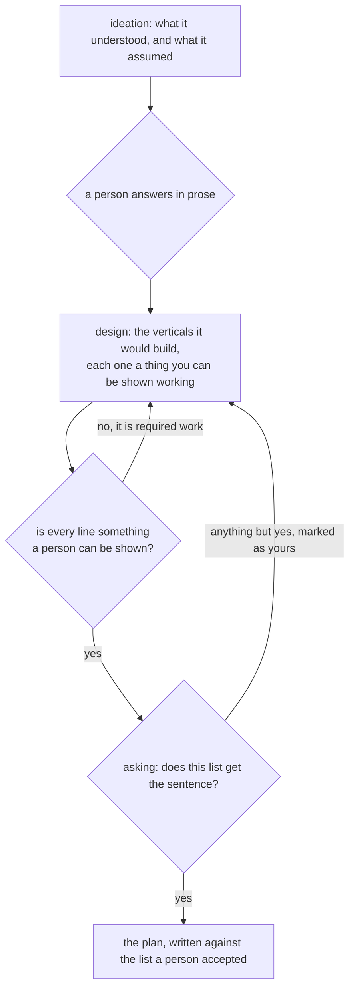

**A job says what it would build, and a person accepts the list, before it plans.** Ideation put the
reading in front of a person and the plan gate put the steps in front of them. Between the two there
was nothing. A plan says what the system will do and in what order, and never what somebody gets or
when, so nobody was ever asked which deliverable arrives first. Seven steps that all land together
are one delivery at the end of the work.

So a job that states the sentence now lists what it would build. Each line says what a person can do
when that one lands, and the line under it says what that person is shown. A person accepts the list,
and nothing is planned until they do.

A database is not a deliverable and nor is a piece of infrastructure. Those are required work towards
one, so a schema, a queue and a role are one vertical with its plumbing inside them rather than
three, and the system refuses that list rather than putting it to a person. The rule is in the code
rather than in the wording of the ask, because an ask is advice: a line that names infrastructure and
names nobody it serves is plumbing, and the same line with the person in it is a vertical. Measured
on the opening sentence of every changelog entry in this repository, 366 of them: 38 name the person
they serve, and the rule refuses none of those. It refuses 42 of the whole 366, every one a line that
names only the machinery.

An answer that is not the acceptance is the correction. The job goes back with what the person said
and the list is written again from it, so the person who says what is wrong writes no list. A
vertical they asked for comes back opening with `Yours` rather than `Vertical`, which is the mark the
reading already makes between what a session was told and what it filled in for itself, and it
travels into the plan task with the list.

Design was a stage with nothing behind it, and a job standing in it was told so. It is built now, so
the reading says what accepting the list opens, and test is the stage that says it is not built yet.

The scenarios are in [features/design.feature](features/design.feature), and both stores are held to
the new pair of movements in
[internal/store/storetest/design.go](internal/store/storetest/design.go).
