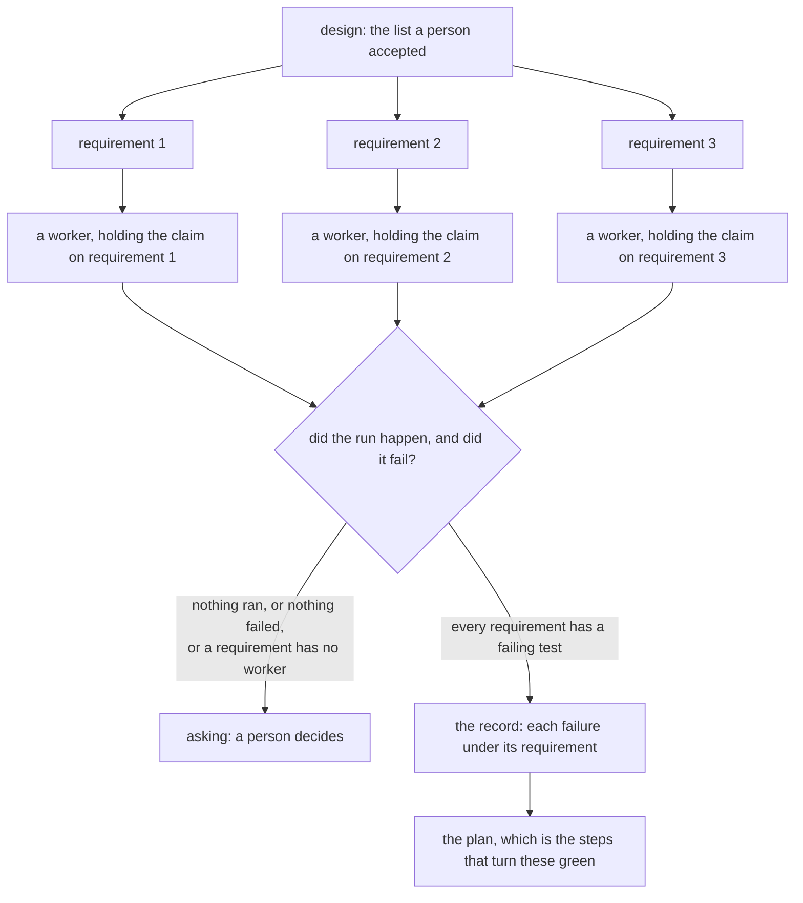

**The requirements a person accepted become failing tests, before anything is built.** A requirement
became code without ever becoming a failing test first. A session that builds and then tests writes
the test its own code passes. The suite then records the implementation rather than the requirement,
and it stays green through the change that breaks the product.

So the accepted list is now the requirement list. Each requirement becomes tests, and those tests
fail. The worker that writes a test is a different worker from the one that builds, and it never sees
an implementation. At this point in the job there is nothing to see: nothing is built until the suite
is red.

The stage fans out. One worker for each requirement, all at once, each writing the tests for its own
requirement and nothing else. Two workers must never write one requirement. So the system gives each
worker the claim on its own, which is the refusal a second job taking a first job's work already
meets. The claim is derived rather than passed, because a mechanism somebody has to remember is a
mechanism that gets forgotten.

The stage closes on a suite that is red for the stated reasons. It refuses two shapes of false
green. A run that executed no tests reports success just the same. A test that passes before
anything is built asserts nothing.

A requirement whose worker died leaves nothing holding that requirement. The job then stops for a
person, rather than closing on the requirements that finished. The record writes each failure under
the requirement it came from.

The plan moves behind this stage. A plan written first says what the crew will do. The tests are then
written to agree with the plan, which is the failure this stage exists to stop. Test was a stage with
nothing behind it, and a job standing in it was told so. It works now, so build is the stage that
says it is not built yet.

The scenarios are in [features/tests.feature](features/tests.feature). Both stores are held to the
new movements in [internal/store/storetest/tests.go](internal/store/storetest/tests.go).
