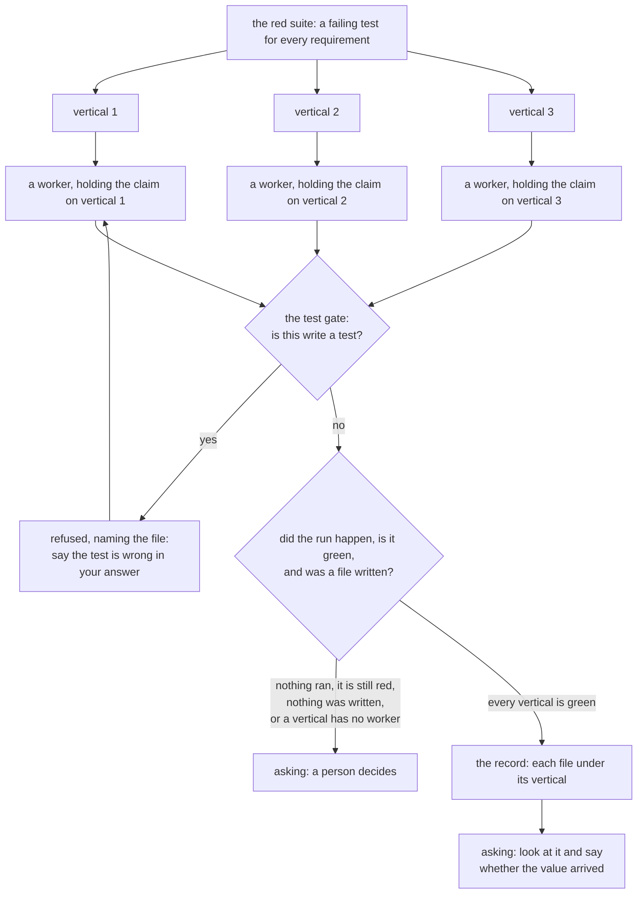

**The failing tests become an implementation, and nothing that builds can change a test.** The tests
existed and nothing implemented against them under a boundary. A session that builds and runs the
suite can reach a green suite two ways, and the shorter one is to change the assertion. From inside
the session a failing test looks exactly like a wrong test. Nothing there tells the two apart, and a
suite changed to agree with the code holds nothing.

So the build stage holds one rule. A worker may read every test as much as it needs to, and it may
not change one. Reading is allowed on purpose. A build that cannot read the test cannot tell a
failing assertion from a broken one, so it guesses instead.

The refusal is a hook rather than a sentence in a brief. A rule stated in a prompt is a rule the
model weighs against everything else it was told. A boundary a session can talk itself past is not a
boundary. The system sets a name on the task of a worker in this stage and on nothing else. The test
gate then refuses the write in that session alone. Every other session is refused nothing, because
the stage before this one writes the tests.

The stage fans out. One worker for each vertical a person accepted, all at once, each turning its own
failing tests green and nothing else. Two workers must never build one vertical. So the system gives
each worker the claim on its own, which is the refusal a second job taking a first job's work already
meets.

The stage closes on a build that happened. It refuses three shapes of false green. A run that
executed no tests reports success just the same. A suite that is still red is not built. A test that
passed before anything was written holds nothing, so the report names the files as well as the
counts.

A vertical whose worker died leaves nothing holding that vertical. The job then stops for a person,
rather than closing on the verticals that finished.

It ends by holding the job rather than by calling it done. Four things finish a build: acceptance,
behaviour tests, unit tests and integration tests. The last three are the machine's and they are in
the report this stage reads. Acceptance is a person who looks at the thing and agrees the value
arrived. So the job waits for them. The session that carries on afterwards gets the brief and the
plan as well as what they said.

Build was the stage that said it was not built yet. All four are written now. The reading says where
a job stands inside the one it is in. It writes its plan, or its verticals are built in a session
each, or it waits for somebody to accept what arrived. A listing says the same thing in the column that
read "not yet" for a job whose workers are all at work.

The scenarios are in [features/build.feature](features/build.feature). The gate is designed in
[hooks/test-gate/README.md](hooks/test-gate/README.md). Both stores are held to the new movements in
[internal/store/storetest/build.go](internal/store/storetest/build.go).
