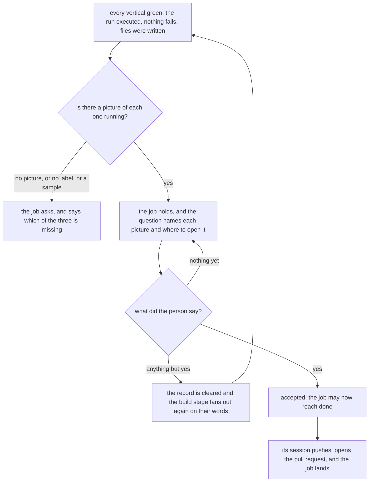

**A job is not done until a person has looked at a picture of it running.** The build stage closed
on three checks: the run executed something, nothing failed, and a file was written to make it pass.
All three are the machine reading its own work. A session that finishes the work writes the answer
that says the work is right, and it says so in good faith, because from inside the session there is
nothing to compare against.

So there is a fourth check and a person makes it. It is visual, and that is the whole of it: a
screenshot or a recording of the built thing actually running. Not a description of it working, not
a passing test named after it, and not a sample generated to illustrate what it would look like. A
picture and a paragraph both read as evidence on a page and are worth completely different amounts.

Every vertical now arrives with a picture and a label. The worker that turns a vertical green runs
what it built, captures it, and puts the file in the workspace's shared folder, which a person on the
machine opens with `krewe where <workspace>`. The label says what was running and the command that
drew it, so somebody else can get the same picture. Both are read off the answer and kept in the
record under the vertical they came from, because by the time anybody looks, every sandbox that made
one is gone.

Three shapes are refused by name. A vertical with no picture is not built. A picture with no label is
one nobody can reproduce, and a reader who cannot reproduce a picture concludes the code does not do
what was claimed. A label that says mockup, placeholder or what it would look like is a sample
presented as a capture, which is worse than no picture at all.

Then the job holds and a person answers. The word that accepts is `yes`, which is the word the plan
and the list already use. Anything else says what was missing, and the verticals go back to the build
stage to be built again from what they said, with their words kept whole on the row. Nothing else
moves the job: every tick while the question stands leaves it exactly where it is.

Their word is permission rather than an ending. The job still owes what every job owes at its ending,
which is the pull request its work is read in and an account of the plan somebody approved, so the
acceptance opens that road rather than skipping it. What refuses the road to a job nobody looked at
is a check on the ordinary settling path: a job whose verticals are built and that nobody accepted is
stopped with the reason, however green everything it ran was.

This is not a fifth stage. The four are ideation, design, test and build, and this closes the last
one.

`krewe render` draws a captured terminal as well as a page, because a product with no page still has
to be shown working. Give it a file of terminal output, such as what `tmux capture-pane -e -p`
writes, and it draws that screen with its colours into a picture. The label under the picture names
the capture rather than the address, so a reader is told what they are looking at.

One column on the jobs table records the acceptance, and the pictures live inside the record of the
build that already holds them: a second copy of a fact could only disagree with the first.
