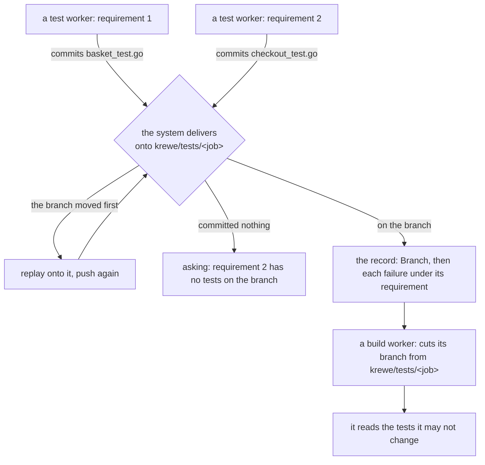

**The tests one stage writes reach the stage that builds against them.** Each test worker held a
sandbox of its own with a clone of its own. It wrote its test files there. Nothing asked it to commit
them, so the report it answered with was the only thing that outlived the sandbox. Each build worker
then cloned the default branch again and was handed the names of the tests that fail. Those files
were not in its checkout. The boundary the build stage works under guarded files that were not there.

Now the tests go on a branch, and the next stage reads them off it.

One branch for the job, not one for each worker. A branch for each worker would need something to
merge five of them when the stage closes. That is git running outside a container, and the control
plane is a static binary with no git and no credential. So each worker's commits go on top of what is
already on the branch. The remote decides who was first. A push that is refused as behind is answered
by a fetch, a replay onto the branch, and another push. Two workers that wrote different files both
survive it.

The push is the system's and the commit is the worker's. Five sessions reach this branch at the same
time, and a session told to resolve a race it cannot see writes the file twice or takes another
worker's away.

A worker that committed nothing is a failed worker. Its report reads exactly like the others, and
nothing it wrote can be read by anybody. So the stage refuses that requirement by name and asks a
person, the way it already does for a worker that died. It refuses the same way where the system
cannot reach the session's files at all: a stage that read that as a pass would close on no evidence.

The branch name is derived from the job rather than kept in a column, for the reason a claim is
derived. Two stages write the same string without either of them being told it, and a second copy of
a fact could only disagree with the first. It is on the record as a `Branch:` line, so a person
reading the row can open it.

A job that names no repository has no remote. Its tests go nowhere and never did, so it is left as it
was rather than refused for a branch it could never have.

The round trip is driven end to end in
[internal/job/testsbranch_test.go](internal/job/testsbranch_test.go): two workers write files in
clones of their own, against a real remote, and the assertion reads both files out of the checkout a
build worker takes. The delivery itself is in [internal/publish/deliver.go](internal/publish/deliver.go).
