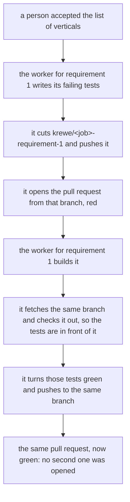

**One branch carries a requirement from its failing tests to the build that turns them green.** The
tests one stage wrote never reached the next one. Each test worker took its own sandbox and its own
clone, wrote its test files there and answered with three lines: the requirement, how many tests ran,
and the names of the ones that fail. The sandbox then went away with the files in it. The worker that
built the same requirement took another fresh clone and was told to read those tests and not change
them, and they were not in its checkout. The boundary that stage works under guarded files that were
not there, and every check was green the whole time.

So the work lands on a branch. The system names it, from the job and the requirement number, because
two workers have to agree on one name without either of them being told by the other, and a name a
session invents is a name the next session cannot guess.

The worker that writes a requirement's tests cuts that branch, pushes it and opens the pull request
from it. That pull request is the one the work lands in. It stays open and red, carrying the failing
tests for its requirement and nothing else, which is the ordinary state of work in progress, and
nothing red is merged. The worker that builds the same requirement fetches the branch, checks it out
and turns those tests green on it. The build stage opens no pull request at all, so each requirement
has one branch and one pull request from its first failing test to its last passing one.

The boundary is real for the first time. A build worker may read every test and change none, and the
test gate refuses the write. Until now it guarded files that were not in the checkout.

A worker that pushed nothing is a failed worker rather than a quiet pass. Its report can be perfect
and the tests it describes are gone with the sandbox, so the stage does not close on a report whose
tests reached no branch: what says they reached one is the pull request the system read off the
answer itself, rather than the worker's word about its own push.

Two workers never land on one branch. A branch belongs to one requirement, the claim already refuses
a second job taking work a first job holds, and the two stages never run at once.

One column on the jobs table records the branch. A job that names no repository has nowhere to push,
so it carries none and works the way every job worked before this.
