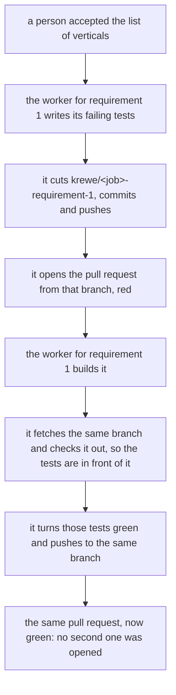

**One branch carries a requirement from its failing tests to the build that turns them green.** The
tests one stage writes now leave the sandbox that wrote them. This is the second half of that: where
they go. The branch belongs to the requirement rather than to the job, so each requirement's work has
one branch and one pull request from its first failing test to its last passing one.

The worker that writes a requirement's tests cuts the branch the system named, commits every file it
writes, pushes it and opens the pull request from it. That pull request is the one the work lands in.
It stays open and red, carrying the failing tests for its requirement and nothing else, which is the
ordinary state of work in progress, and nothing red is merged. The worker that builds the same
requirement fetches the branch, checks it out and turns those tests green on it. The build stage opens
no pull request at all.

A branch for each requirement rather than one for the job settles the race by construction. One branch
for the whole job has five workers pushing to one place at once; a branch for each requirement has one
worker on it at a time, and the delivery the system already does is then what catches a worker that
committed and could not push.

The system names the branch rather than the session, because two workers have to agree on one name
without either being told by the other, and a name a session invents is a name the next session cannot
guess. Two workers never land on one branch: a branch belongs to one requirement, the claim already
refuses a second job taking work a first job holds, and the two stages never run at once.

A worker that pushed nothing is a failed worker rather than a quiet pass. Its report can be perfect
and the tests it describes are gone with the sandbox, so the stage does not close on a report whose
tests reached no branch: what says they reached one is the delivery the system made and the pull
request it read off the answer, rather than the worker's word about its own push.

One column on the jobs table records the branch a worker works on. A job that names no repository has
nowhere to push, so it carries none and works the way every job worked before this.
