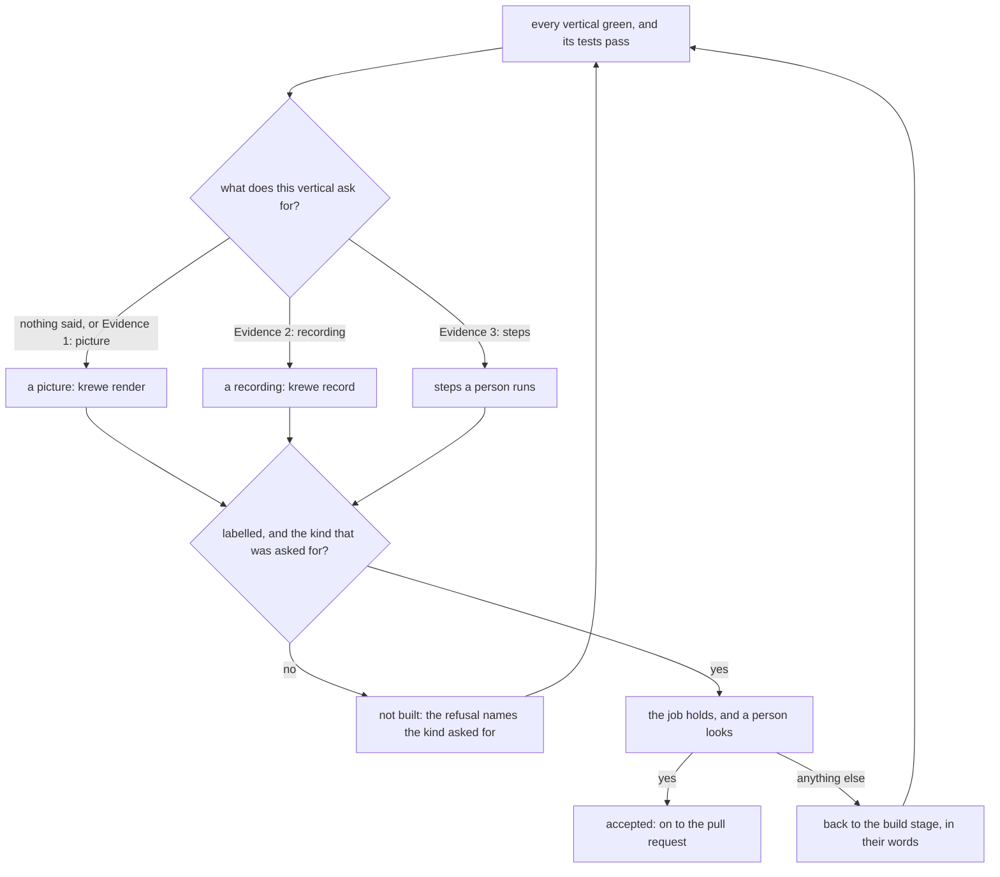

**A vertical is shown with the kind of evidence it needs, and a picture is only the first kind.** The
acceptance stage took one kind. A picture answers most verticals, because most of what this system
builds is something you can point a camera at, and it does not answer all of them.

A still frame of a list that refreshes shows a screen that looks right. The failure was between two
frames. And some value no capture shows at all: a refusal that arrives at the right moment, a
permission denied to the account it should be denied to. What proves those is a person doing them.

So there are three kinds now, and the vertical says which one it needs. It says so on the list a
person accepts, with a line reading `Evidence 2: steps`, because the person accepting the list is the
person who will be looking at the evidence. A vertical that says nothing is shown with a picture,
which is what every vertical written before this asked for.

A **picture** is a still of the built thing running, drawn with `krewe render`. A **recording** is a
moving picture of it, for value a still frame cannot carry. **Steps** are what a person runs or
presses to see it themselves, for value no capture shows.

The build worker is told which kind it owes and how to produce it, and the stage holds it to that
kind. A vertical that asked for steps and was sent a picture is not built, and the refusal names the
kind that was asked for, because a worker told only that its answer is wrong sends another picture.

Steps are the kind that will be abused, so they are held to the standard the other two are held to.
At least two of them. Each one is a command to run, an address to open or a key to press, and each
one says what a person should see, so they can tell a pass from a failure. A paragraph saying the
thing works is refused by name.

Every kind carries the label, which is the rule the picture already had: where the evidence came from
and what it takes to get it again. A kind is never a way around the evidence, so steps nobody can
start are refused the way a screenshot nobody can reproduce already was, and a label saying mockup or
placeholder is refused under all three.

The person's word is still the only thing that lands the job done, whatever they looked at.

`krewe record` is new, and it is how a recording gets made here. It joins captures of a screen into
one webm: capture with `tmux capture-pane -e -p` while the thing runs, then
`krewe record run.webm frame-*.txt`. There is no asciinema, no vhs and no ffmpeg on the path in the
sandbox, so it uses the encoder the headless browser brings with it, and the frames are drawn as jpeg
because that encoder decodes mjpeg and not png. On a machine that has no encoder it says it cannot
record, and a person attaches a recording made elsewhere.
