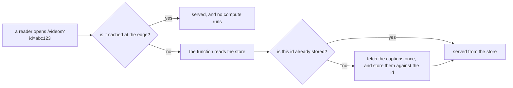
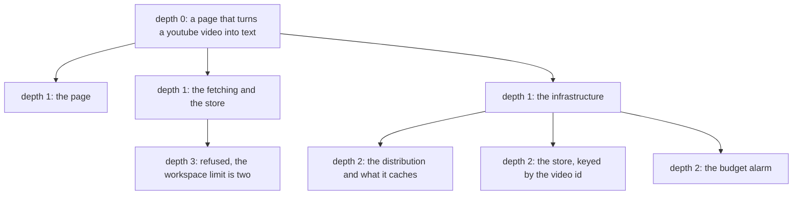
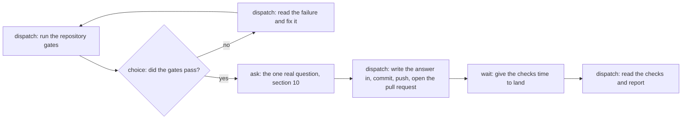

# The acceptance project

One idea, twenty four hours, one declared job. The operator only answers questions.

This document describes a project to run once the orchestration slices land. It is not a feature and
it is not a plan for a feature. It is quay's own acceptance test, written before the run so that
nobody can move the target afterwards.

Do not build the project from this document. This document says what the run must exercise and how
the run is scored.

Where a slice is missing, the run still starts, and every step that needed the missing slice becomes
a finding.

## 1. The rule of the test

The operator declares one job. After that the operator only answers questions.

**Answering** is a reply to a question the crew asked. There are two commands, because there are two
things that ask. `quay flow answer` answers an ask node in a graph. `quay job answer` answers a
question a session put about the job it is running, which shipped on 30 August 2026 out of the first
run's own finding, `quay-crew#446`: a session chose a store that bills while idle and the operator
found out by asking.

**Driving** is anything else the operator types that changes the job. A second `quay job create` is
driving. A `quay task --dispatch` is driving. A `quay job stop` is driving. An edit to a file is
driving. A push is driving.

**Reading is free.** The operator may read anything at any moment. `quay job list`, `quay task list`,
`quay answer`, the console, the panel and the web view are all reads. A read is never a finding.

Every time the operator drives, that is a finding. The site can still ship. The test still fails.
See section 13.

### How a finding is recorded

One issue per finding, in `atlantic-blue/quay-crew`, with the label `acceptance`. The operator opens
it during the run and not afterwards, because the detail is gone by the morning.

Each issue carries six things:

- the moment, as a clock time, so the trace and the events can be found;
- the job identifier, or the run identifier;
- what the operator typed;
- what the operator expected to answer instead;
- what the crew showed at that moment, quoted from the terminal;
- the record that should have made the command unnecessary.

The last one is the useful field. A finding is not "the crew is bad". A finding names the row, the
event or the view that was missing.

The score of the run is the count of these issues. A run with no findings passes rule one. A run with
fifteen findings tells the crew what to build next, in order.

## 2. When it runs

The two pull requests that blocked it merged on 29 August 2026.

- https://github.com/atlantic-blue/quay-crew/pull/436 put a job's session on a network the control
  plane is also on. Before it, a session could not declare a job, could not hand work to a role, and
  the verb boundary in section 7 had never refused a real call.
- https://github.com/atlantic-blue/quay-crew/pull/437 renamed the noun this whole document is about.
  `quay work create` is `quay job create`, and the words here are the words that shipped.

One gap is left and it does not block the run. Nothing raises a trigger yet, which is
https://github.com/atlantic-blue/quay-crew/issues/433. Section 9 says what the run does about it.

## 3. The product

A page that takes a YouTube video and shows its text.

**Version one reads captions only.** If the video carries captions, the page fetches them and shows
them. If it does not, the page says so plainly and stops. There is no speech to text, no transcription
service and no audio download. That is a cost decision and a scope decision in the same line:
transcribing audio charges per video and needs the audio first, and neither buys anything this test
measures.

**The video id is the key.** A fetched transcript is stored against it, so a second visit to the same
video serves what was already fetched and costs nothing.

**The address carries the id.** It reads `/videos?id=<video id>`, so a transcript is a link somebody can
send. The shape is taken from the site the operator already uses.

**It is delivered through CloudFront.**

The operator uses a site like this already, so a transcript with the wrong text in it is spotted in a
second. That is why this project replaced the status page that was here before. A target the operator
does not use produces findings nobody notices.

## 4. What it costs to run

A project that quietly runs up a bill is a bad test whatever else it proves. So the cost posture is part
of the specification.

- **Serverless throughout, on Amazon Web Services.** Nothing is always on.
- **No network address translation gateway.** It is the line item that charges while nothing happens, so
  the function that fetches captions does not sit behind one.
- **Cache at the edge.** A repeated read is answered by CloudFront and never reaches compute at all.
- **Store a transcript once, keyed by the video id.** The same video is never fetched twice.
- **A budget alarm.** Its number is measured from a real week of the site being up, and it is
  provisional until that week exists.

No cost figure appears in this document, because nobody has measured one. The run produces the first
week of real numbers, and the alarm is set from those.

## 5. Why this project, and what a contrived one would look like

Every capability below is needed by the product. Where one is not, this section says so.

- **Three deliverables that three sessions can write at the same time.** The page, the fetching and the
  infrastructure. That is a real fan out, so the job tree is real.
- **The infrastructure deploys through the pipeline on merge.** So the session that writes it must not be
  the session that ships it. That is a real capability boundary.
- **A page is drawn.** So a session has to look at what it drew.
- **A credential reaches the video platform.** Asking whether a video has captions is a call that carries
  a key. The key is a workspace secret and never reaches the repository.
- **Something runs while nobody is watching.** The site is public and the operator sleeps for a third of
  the run. A scheduled flow reads one known transcript through the edge and says whether the site still
  serves it.
- **One decision no data answers.** Section 10.

**Two capabilities have no honest use here, so they are dropped from the checklist.** `secret mount` gives
a session a credential as a file, and nothing here needs one: the certificate for the address is issued
and held by the platform, and the platform key is a string. Deleting a workspace or a project is the
second, and section 15 says why.

**A contrived version of this project looks like this.** A job tree with children that exist only to reach
depth two. A secret that is set and never read. A second role whose `verbs` list differs by one verb that
nothing calls. A schedule that runs a job which prints the date. An ask node that asks "continue?" and
always gets yes.

That version passes the checklist and proves nothing, because every capability is exercised by a step that
exists to exercise it, so a capability that half works still passes. This project fails honestly instead.
The operator opens a video he watched this morning. A transcript that stops halfway, or a page that says a
captioned video has no captions, is wrong the moment he reads it.

## 6. The job tree

The workspace is `me`. The project is `transcript`. The operator declares one root.

The root runs as `orchestrator`. Its session reads the brief, reads `quay manual`, declares the three
children and declares nothing else. It then goes to `waiting`, because a parent with open children waits.
The infrastructure job runs as `infrastructure-writer` and declares three children of its own, because the
distribution, the store and the alarm are three deliverables with three reviews.

The fetching job tries to declare a child at depth three. The crew refuses it, and the refusal names the
limit, the current depth and the command that raises it. **That refusal is a step of the test and not an
accident.** The session then does that one child's work itself, which is the one refusal an
orchestrator may work around. Every other refusal ends the job with the refusal written into the answer,
for the reason section 7 gives.

The depth limit for the run is two. That number comes from the tree and not from taste: the tree is three
levels deep, so a limit of two makes the fourth level refuse. The operator sets it with `quay limits`
before the run starts.

## 7. The roles

Three roles, imported with `quay role import` and attached by the operator. They live in
[`roles/`](../roles) now, beside the twelve the design phase uses, so they can be read, reviewed and
changed like anything else. They were written outside this repository for the first run, which is the
reason the first run's version of this section was wrong in the three ways below.

**`orchestrator`.** `receives: job, context, skills`. `verbs: job.create, job.read, job.stop`. It declares
the three children, reads their answers, and writes the summary at the end.

**`infrastructure-writer`.** `receives: job, context, skills`. `verbs: job.create, job.read`. It writes the
infrastructure into the working tree, declares its own three children, and opens the pull request for
what it wrote. It never applies anything.

**`releaser`.** `receives: job, skills`. `verbs: job.read`. It takes a working tree somebody else wrote and
gets it onto a branch, in a commit, in a pull request. It cannot declare a job.

**A push is not a deploy, and the first version of this section confused the two.** What runs the pipeline
is a merge, and the pipeline is what applies, so the merge is the gate and it is the operator's. Pushing a
branch changes nothing in any account. `infrastructure-writer` received no skills on the first run, which
was justified as stopping it from shipping unreviewed infrastructure; it did not stop that, and the only
thing it changed was that the operator could not see what had been built until the job ended. So every
role receives `skills`, every role pushes and opens a pull request when its slice is done, and no role
merges.

**Why the `verbs` lists still differ.** `releaser` cannot declare a job, because a session that can push and
can also fan out could spend the whole budget on pushes nobody reviewed. `infrastructure-writer` cannot
stop one, because stopping a job is the orchestrator's. `receives` still bounds what reaches the container
at all, which is a different question from what a session may ask the crew for.

**An orchestrator does not absorb the tree.** The first version of its brief said that a refused
declaration meant doing that work itself. That was written for the depth limit in section 6 and it was
applied to a credential failure, so one session wrote the whole product and no child ever ran. It now
works around exactly one refusal, the depth limit, and only by doing that one child's work. Every other
refusal is written into the answer, with the exact words of the refusal, and the job ends.

**A test and the code it tests come from different sessions.** On the first run one session wrote the
contract, the tests and the implementation, so the tests agreed with the code as it was written. The
orchestrator's brief now says that any deliverable carrying logic is declared as three children,
`test-writer` then `implementer` then `verifier`. Those three already shipped; nothing had ever told an
orchestrator to use them.

**What the run must observe.** Every child ends with a pull request address in its answer, and nothing is
merged by the crew. A session running as `infrastructure-writer` that runs an apply, rather than writing
the pipeline that applies on merge, is a finding of the worst kind.

## 8. The flows

Two flows, in [`flows/`](../flows) at the root of this repository: `transcript-release.yaml` and
`transcript-watch.yaml`. The operator imports both with `quay flow import` before the run and starts
neither by hand.

What each node type proves, and what a failure looks like:

- **Dispatch: a step is its own job**, with its own session, answer and row. A failure holds a container
  while it waits.
- **Choice: the run branches on data.** It reads the field the step returned, not prose. A failure walks
  the success edge after a red gate.
- **Wait: a run survives time.** The wait is a column and not a timer. Section 13 restarts the crew inside
  this wait on purpose, and it must still come due.
- **Ask: the crew stops for a person.** A failure takes silence for a yes.

**The scheduled read.** Every fifteen minutes: read one known transcript through the edge, then branch on
whether the text came back. If it did, say nothing. If it did not, write what is missing into the answer.
The crew refuses a schedule shorter than fifteen minutes, which is `flow.MinimumEvery` in
`internal/flow/graph.go`, and that constraint costs this product nothing. A page that serves stored text
from a cache does not need a check every minute.

## 9. The trigger

**The outside event is the deploy.** The pipeline finishes deploying the site and publishes one record. An
ingress reads that record and writes a `pending_triggers` row. The poller claims the row and starts a run,
and that run renders the address for a known video id and reads the text out of the picture.

**Nothing raises a trigger today.** `flow.Engine.Raise` has one caller and it is its own definition, which
is https://github.com/atlantic-blue/quay-crew/issues/433. So either the ingress lands before the run
starts, or this step is a finding on the first day, recorded like any other.

**What the trigger proves, and nothing else here proves it.** A run can start because the world changed.
The schedule proves that a run starts because time passed, and a manual start proves that one starts
because a person typed. Only the trigger proves the third, and the third is the difference between an
automation you set off and an automation that reacts.

**What a failure looks like.** The deploy finishes and no run starts. Or two runs start from one event,
which means the claim on the trigger row did not hold.

## 10. The one real question

The ask node in the release flow asks this:

`a video carries captions only in a language the reader did not ask for. Does the page show them, or say there is nothing to show?`

**Why this is a real question.** The page cannot render without an answer, and the answer decides what a
reader sees on a page the operator's name is on.

**Why the crew cannot derive it.** There is no history and there are no readers yet, so no measurement in
the crew contains the answer. Both answers are defensible. Text in another language is still text a reader
can put through a translator, and it is also a wall of characters that makes the page look broken. That
trade is a judgement about who the page is for, and only the operator holds it.

The other candidate was what the page does when a video has no captions at all. Section 3 decided that one,
and a question the specification already answers is not a real question.

**What the run must observe.** The run stops at that node and waits. The operator answers with
`quay flow answer <run> <answer>`, and the next step writes the answer into the page. If the run passes the
node without an answer, the gate is decoration and the test failed.

The answer also becomes the first measurement. After a week, the count of visits whose only captions were
in another language says whether the choice mattered at all.

## 11. The limits the operator sets first

Four numbers. None is invented here, and for each one this document names the measurement that sets it
later.

- **`max_depth` is two.** Derived from the tree in section 6. The measurement is the greatest depth over
  completed root trees after the first month, plus one.
- **`max_running`.** The measurement is the number of concurrent sandboxes at which host memory pressure
  first appears. Section 13 takes it during the run.
- **`budget_tokens` on the root.** Set from what one day of model use costs today. The measurement is the
  median `quaycrew.tokens` for a completed job over the first fifty, and this run produces the first fifty.
- **The lease length.** The crew refuses to start with it unset. The measurement is the ninety fifth
  percentile of `quaycrew.job.duration` over the first fifty completed jobs.

The run records the real figure for each one. That is the point of running it: after this test the next
crew derives these numbers instead of guessing them.

## 12. The checklist

One line per capability, grouped by who exercises it, each naming its failure. The list is taken from
`quay help` and from `internal/manual`, so it is complete rather than remembered.

**The operator, before the one declared job.** Setting up is not driving: it happens before the job exists.

1. **workspace create, list.** A failure omits the workspace it just made.
2. **project create, list.** A failure shows a project the address then refuses.
3. **use, the address.** A failure is an identifier from a listing that the address will not take.
4. **limits.** The four numbers in section 11. A failure is a limit set and never enforced.
5. **role import, list, attach.** The three roles in section 7. A failure grants nothing.
6. **skill import, list, attach.** A failure attaches a skill that never reaches the container.
7. **secret set, list.** The platform key. A failure lets it reach a log, a task record or a listing.
8. **hook import, attach.** A hook refuses a command that changes infrastructure from inside a sandbox,
   because infrastructure ships through the pipeline. A failure runs an apply and nothing stops it.
9. **context at four levels.** Crew: the house rules. Workspace: what this project is. Project: the shape
   of the stored transcript. Session: what one attempt learned. A failure is a child told again in its
   brief, or two children that build two different shapes.
10. **flow import.** Both flows. A failure imports a graph that dies at its first movement.
11. **flow schedule, unschedule.** A failure stops after a restart, or keeps running once unscheduled.
12. **role detach, skill detach.** `releaser` and the git skill come off once the site is live. A failure
    is a session that still holds the token afterwards.

**The crew, while the job runs.**

13. **job create, list, show.** A failure hides the tree, or truncates an answer.
14. **job stop.** The operator stops nothing, because stopping is driving. The budget exercises it: a job
    stopped by the budget reads `stopped` with a reason naming the budget. A failure reads the same as a
    job that went quiet.
15. **The tree and its depth limit.** A failure is a declaration at depth three that succeeds, or a
    refusal that does not name the limit and the command that raises it.
16. **The budget.** Every child draws from the root. A failure is a tree that spends past it.
17. **The lease.** Section 13 kills the controller while a child runs. A failure dispatches a job twice,
    or leaves one that never moves again.
18. **The `verbs` and `receives` lists.** A failure declares a job the role does not grant, merges a pull
    request the operator never read, or ends a slice with nothing pushed.
19. **Dispatch, task list, answer.** A failure blocks without an end, or returns an answer only a person
    can read.
20. **Mode.** Each job declares its mode. A failure stops to ask permission with nobody there.
21. **Render.** The page job looks at the picture it drew. A failure reports a page it never saw.
22. **Room.** A failure sizes a build against the whole machine and is killed.
23. **flow start, show, list, answer, stop.** The release flow starts from the job that finished, not from
    a person. A failure is a halted run and a quiet run reading the same.
24. **Triggers.** Section 9.
25. **Sessions, attach, label.** The crew names each session itself. A failure lists identifiers with no
    names, or silently restores an archived session.

**The record, read at the end.**

26. **Events.** Every movement writes a row. A failure is a state change that emits nothing.
27. **Tracing.** One trace covers the root and every child. A failure is a dozen unrelated traces.
28. **Headroom.** A failure says there is room while the crew runs out of memory.
29. **Drain and version drift.** The operator drains before the upgrade and compares the three builds
    after it. A failure reports a clean drain while a task is still working.
30. **Health.** A failure answers every read, starts no work, and reports itself healthy.
31. **The console, the panel and the web view.** A failure is a flat session list, or a view that shows a
    session and not what it was asked.
32. **Manual and features.** The orchestrator reads `quay manual` to learn how to drive the crew. A
    failure has to be told in its brief what the crew can do.

That is thirty two capabilities, and two dropped in section 5.

## 13. The two things only this test can prove

Every other item here can be proved by a scenario in `features/`. These two cannot, because both need a
real machine, real time and real work in flight.

**An upgrade in the middle of the run.** It proves whether an upgrade costs the intent or costs one
attempt. At hour twelve, with at least one job in `running` and the release flow inside its wait node,
the operator merges a small change to `main` and runs `make upgrade`. Five numbers, read from rows and
not from memory:

- job rows before and after. The counts must be equal, because a row that is gone is a lost intent.
- the phase of every row before and after. A job in a terminal phase must not move.
- `attempts` on the job that was running. It may increase by one. Two is a failure.
- the minutes from the upgrade to the next answer that lands, which is the real cost of the upgrade.
- whether the run inside the wait node still comes due. The wait is a column, so it must.

The controller death is measured in the same hour, as a separate action. The operator stops the
controller while a child runs and confirms two things from the record: the job is dispatched once, and
`quaycrew.controller.leases.expired` goes up by one. The evidence is the absence of a second
`job.started` event.

**Whether twenty four hours of work fits inside the machine.** On 27 August 2026 it did not: the kernel
killed eighteen sandboxes, three monitors and a build in one event, and nothing in quay reported it.
The headroom figure is sampled for the whole run, plus four counts:

- the peak memory against the limit that binds, which on this machine is the Docker virtual machine's
  cap and not the host's memory;
- the greatest number of sandboxes alive at one moment;
- the count of dispatches the crew refused because the machine was full, which must be a refusal with a
  reason and never a silent block;
- the count of processes the kernel killed, which must be zero.

**No threshold is set here.** The greatest number of sandboxes alive when memory pressure first appears
is the measurement that sets `max_running` for the next run.

## 14. What would make the test fail

Any one of these is a failure.

- **The operator had to drive.** Any finding of the class in section 1. **A run that needs the operator
  to drive is a failure even if the site ships.** This is the first rule and it is the whole point.
- **A job was lost.** A row that no controller moved again, or one that vanished across the upgrade.
- **Work was paid for twice.** Two `job.started` events for one attempt, or two dispatches from one
  trigger row.
- **A dispatch blocked without an end.**
- **The depth limit did not hold.** A declaration at depth three that succeeded.
- **The budget did not hold.** A tree that spent past its root.
- **The capability boundary did not hold.** A session that pushed when its role gave it no way to push.
- **A run took silence for an answer.**
- **The machine died.** The kernel killed a sandbox, or the crew stopped serving.
- **The record cannot explain the run.** The site ships and the operator cannot rebuild what happened
  from rows, events and traces alone. A container log does not count, because the container is gone.
- **The upgrade cost the intent.** Section 13.

A site that does not ship is not automatically a failure. If the crew carried the work honestly, and the
operator only answered, and the model simply did not finish in twenty four hours, that is a result about
the model and about the size of the idea. Record it as such. The crew is what is under test here.

## 15. What this test does not cover

- **One operator, one machine, one model.** Nothing here covers a shared crew or a second operator.
- **Fairness across workspaces.** One workspace, so `max_running` starving one project behind another is
  untested.
- **Deleting a workspace or a project.** The run creates and reads and never removes.
- **Backup and restore.** A crew can still be destroyed by an ordinary Docker command.
- **A chat channel.** Questions arrive through the command line tool.
- **Kubernetes and remote sandboxes.** Everything runs on one machine's Docker daemon.
- **Driving from the web view.** It is read only, so this run proves reading and never writing there.
- **The inside of a session.** Nothing in the container adopts the trace context, so the trace stops at
  the attempt.
- **Cost accuracy.** The crew reports what the published prices say. The run does not compare that
  against the bill, and the bill is what the budget alarm is set from.
- **Whether the captions are right.** The page shows what the platform holds. Nothing proves that text
  matches the audio.
- **The quality of the code the model wrote.** A site that works and reads badly still passes.
- **A second run.** Every number here is a first measurement from one run on one machine, and a
  threshold set from one sample is one nobody should trust yet.
