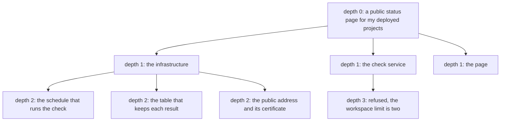
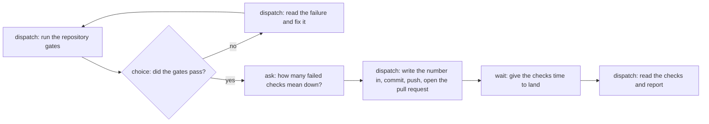
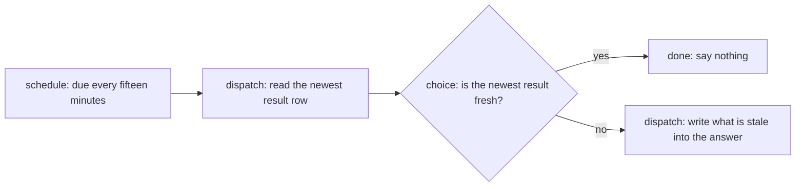
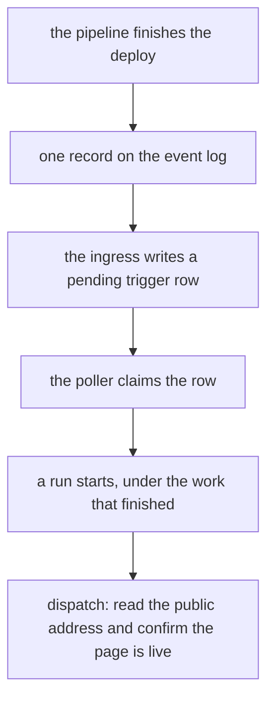

# The acceptance project

One idea, twenty four hours, one declared piece of work. The operator only answers questions.

This document describes a project to run once the orchestration slices land. It is not a feature and
it is not a plan for a feature. It is quay's own acceptance test, written before the run so that
nobody can move the target afterwards.

Run it after slice 10 of `docs/ORCHESTRATION.md` section 15. It also needs the headroom reporting in
issue 405 and the trigger node in issue 399. Where a slice is missing, the run still starts, and
every step that needed the missing slice becomes a finding.

Do not build the project from this document. This document says what the run must exercise and how
the run is scored.

## 1. The rule of the test

The operator declares one piece of work. After that the operator only answers questions.

**Answering** is a reply to a question the crew asked. There are two commands for it,
`quay work answer` and `quay flow answer`. The crew asks, the operator replies, the run continues.

**Driving** is anything else the operator types that changes the work. A second `quay work create`
is driving. A `quay dispatch` is driving. A `quay work stop` is driving. An edit to a file is
driving. A push is driving.

**Reading is free.** The operator may read anything at any moment. `quay work list`, `quay tasks`,
`quay answer`, the console, the panel and the web view are all reads. A read is never a finding.

Every time the operator drives, that is a finding. The page can still ship. The test still fails.
See section 11.

### How a finding is recorded

One issue per finding, in `atlantic-blue/quay-crew`, with the label `acceptance`. The operator opens
it during the run and not afterwards, because the detail is gone by the morning.

Each issue carries six things:

- the moment, as a clock time, so the trace and the events can be found;
- the work identifier, or the run identifier;
- what the operator typed;
- what the operator expected to answer instead;
- what the crew showed at that moment, quoted from the terminal;
- the record that should have made the command unnecessary.

The last one is the useful field. A finding is not "the crew is bad". A finding names the row, the
event or the view that was missing.

The score of the run is the count of these issues. A run with no findings passes rule one. A run
with fifteen findings tells the crew what to build next, in order.

## 2. Why this project, and what a contrived one would look like

The project is a public status page for the operator's deployed projects. It checks each project on
a schedule. It shows whether each one is up.

It needs every part of quay for its own reasons:

- It has three deliverables that different sessions can write at the same time. The infrastructure,
  the check service and the page. That is a real fan out, so the work tree is real.
- The infrastructure deploys through the pipeline on merge. So the piece that writes the
  infrastructure must not be the piece that pushes it. That is a real capability boundary.
- It checks on a schedule, so it needs a schedule.
- It reacts to a deploy, so it needs a trigger.
- It holds a credential to reach the projects it checks, so it needs a secret.
- It draws a page, so a session must look at what it drew.
- It has one decision no data answers. Section 7.
- It must run while the operator sleeps. So the intent must live in a row and not in a conversation.

**A contrived alternative looks like this.** A work tree with children that exist only to reach
depth two. A secret that is set and never read. A second role whose `may` list differs by one verb
that nothing calls. A schedule that runs a task which prints the date. An ask node that asks
"continue?" and always gets yes.

That version passes the checklist and proves nothing. Every capability is exercised by a step that
exists to exercise it, so a capability that half works still passes. The status page fails honestly
instead. If the capability boundary is wrong, the wrong session pushes to the default branch, and
the operator sees it in the pull request list.

## 3. The work tree

The workspace is `me`. The project is `status-page`. The operator declares one root.

The root runs as `orchestrator`. Its session reads the brief, reads `quay manual`, and declares the
three children at depth one. It declares nothing else. It then goes to `waiting`, because a parent
with open children waits.

The infrastructure work runs as `infrastructure-writer`. Its session declares three children of its
own at depth two, because the schedule, the table and the public address are three separate
deliverables with three separate reviews.

The check service work tries to declare a child at depth three. The crew refuses it. The refusal
names the limit, the current depth and the command that raises it. **That refusal is a step of the
test and not an accident.** The session then does the work itself, which is what the design says a
model does when it reads the refusal.

The depth limit for the run is two. That number comes from the tree above and not from taste: the
tree is three levels deep, so a limit of two makes the fourth level refuse. The operator sets it
with `quay limits` before the run starts.

## 4. The roles

Three roles. Each is a directory with a manifest, imported with `quay role import` and attached to
the workspace by the operator.

**`orchestrator`.** `receives: work, context, skills`. `may: work.create, work.read, work.stop`.
It declares the three children, reads their answers, and writes the summary at the end. It holds the
skills, so it can read the repository. It does not push.

**`infrastructure-writer`.** `receives: work, context`. `may: work.create, work.read`. It writes the
infrastructure code into the working tree and declares its own three children. It does not receive
skills, so it holds no git skill and no token. It cannot push and it cannot open a pull request.

**`releaser`.** `receives: work, skills`. `may: work.read`. It holds the git skill and the token. It
commits, pushes and opens the pull request. It cannot declare work.

### Why the lists must differ

**The piece that writes the infrastructure must not be the piece that pushes it.** A push to the
default branch runs the pipeline, and the pipeline deploys. So a session that writes infrastructure
and can also push can put unreviewed infrastructure into production from one wrong answer. Two roles
make the deploy a separate step with a separate record.

The second difference is the opposite direction. `releaser` cannot declare work. A session that can
push and can also fan out could spend the whole budget on pushes that nobody reviewed. It holds the
narrower list because it holds the more dangerous tool.

The third difference is `receives`. The verb list bounds what a session may ask the crew for. The
`receives` list bounds what reaches the container at all. A role that does not receive skills has no
credential in its sandbox, so the boundary holds even if the brief asks it to push.

**What the run must observe.** A session running as `infrastructure-writer` tries to push. The
attempt fails inside the sandbox, because the tool is not there. That failure appears in the task's
answer. If it succeeds, the capability model failed, and that is a finding of the worst kind.

## 5. The flows

Two flows. The operator imports both before the run and starts neither by hand.

### The release flow

What each node type proves:

- **The dispatch node proves that a step is its own piece of work.** After slice 8 it declares work
  and does not hold the call open. So each step gets its own session, its own answer field and its
  own row. A failure looks like a run that holds a container while it waits.
- **The choice node proves that the run branches on data.** It reads the field the step returned. It
  does not read prose. A failure looks like a run that walks the success edge after a red gate.
- **The wait node proves that a run survives time.** The wait is a column and not a timer, so the
  run survives a restart in the middle of it. Section 10 restarts the crew during this wait on
  purpose.
- **The ask node proves that the crew stops for a person.** Nothing but an answer moves an asking
  run. A failure looks like a run that took silence for a yes.

### The scheduled health check flow

This flow checks the checker. It does not check the projects. The crew refuses a schedule shorter
than fifteen minutes, which is `flow.MinimumEvery` in `internal/flow/graph.go`. So a check every
minute belongs to the deployed service, and the crew's own schedule watches whether that service is
still writing results.

That constraint is the honest reason for the split, and the run must not hide it. If the operator
wants the crew itself to check every minute, that is a finding against `flow.MinimumEvery`.

## 6. The trigger

**The outside event is the deploy.** The pipeline finishes deploying the check service to the public
address, and it publishes one record. An ingress reads that record and writes a `pending_triggers`
row. The poller claims the row and starts a run.

There is a second source, and it is inside the crew. A piece of work reaches a terminal phase and
writes a trigger row in the same transaction. The run that confirms the deploy starts that way when
the release work finishes.

**What the trigger proves, and nothing else in this test proves it.** A run can start because the
world changed. The schedule proves that a run can start because time passed. A manual start proves
that a run can start because a person typed. Only the trigger proves the third one, and the third
one is the difference between an automation you set off and an automation that reacts.

It also proves one more thing. The event log gets its first real consumer. Until now nothing reads
`<workspace>.tasks` or `<workspace>.sessions`, and `docs/EVENTS.md` says that plainly.

**What a failure looks like.** The deploy finishes and no run starts. Or two runs start from one
event, which means the claim on the trigger row did not hold.

## 7. The one real question

The ask node in the release flow asks this:

`how many consecutive failed checks before the page says a project is down?`

**Why this is a real question.** The page cannot render without the number. It decides what the
public reads about the operator's own projects.

**Why the crew cannot derive it.** There is no history. The system is new, so there is no record of
how often a check fails while the project is up. The number trades one cost against another. A low
number raises a false alarm and costs the operator's reputation. A high number hides a real outage
and costs the same reputation. Only the operator holds that tolerance, and no measurement in the
crew contains it.

**What the run must observe.** The run stops at that node and waits. The operator answers with
`quay flow answer <run> <number>`. The next step writes that number into the configuration. If the
run passes the node without an answer, the gate is decoration and the test failed.

The answer also becomes the first measurement. After the page runs for a week, the operator can read
the check history and see whether the number was right. That is the measurement that sets it next
time.

## 8. The limits the operator sets first

Four numbers. None of them is invented here, and for each one this document names the measurement
that sets it later.

- **`max_depth` is two.** Derived from the tree in section 3, which is three levels deep. The
  measurement that sets it after the first month is the greatest depth over completed root trees,
  plus one.
- **`max_running`.** The operator sets it before the run. The measurement that sets it is the number
  of concurrent sandboxes at which the host memory pressure first appears. Issue 405 asks for that
  measurement, and section 10 of this document takes it during the run.
- **`budget_tokens` on the root.** The operator sets it from what one day of model use costs today.
  The measurement that sets it next time is the median `quaycrew.tokens` for a completed piece of
  work over the first fifty, which `docs/ORCHESTRATION.md` section 5 already names. This run
  produces the first fifty.
- **The lease length.** The operator sets it before the run, because the crew refuses to start with
  it unset. The measurement that sets it is the ninety fifth percentile of `quaycrew.work.duration`
  over the first fifty completed pieces of work. This run produces that too.

The run records the real figure for each one. That is the point of running it: after this test the
next crew derives these numbers instead of guessing them.

## 9. The feature checklist

One line per capability. Each line says which step of the project exercises it, and what a failure
looks like. The list is taken from `quay help` and from `internal/manual`, so it is complete rather
than remembered.

1. **workspace create.** The operator makes `me` before the run. A failure is a workspace that
   exists and holds nothing.
2. **workspace list.** The operator reads it once to confirm where the run stands. A failure is a
   listing that omits the workspace it just made.
3. **project create.** The operator makes `status-page`. A failure is a project the address cannot
   reach.
4. **project list.** Read during the run to find the project by name. A failure is a project that
   the listing shows and the address refuses.
5. **use, the address.** Every command in the run leans on it. A failure is a session identifier
   from a listing that the address will not take.
6. **work create.** The operator declares the root. Every other declaration comes from a session. A
   failure is a declaration the crew accepts and no controller ever claims.
7. **work list.** The operator reads the eight rows to see where the run is. A failure is a listing
   that does not show the tree, so eleven rows read as eleven unrelated things.
8. **work show.** The operator reads one answer, one question and one reason. A failure is an answer
   that is truncated, because then the read path is prose again.
9. **work stop.** The operator stops nothing during the run, because stopping is driving. The step
   that exercises it is the budget: work stopped by the budget must read `stopped` with a reason
   naming the budget. A failure is stopped work that reads the same as work that went quiet.
10. **The work tree and its depth limit.** The check service declares at depth three and is refused.
    A failure is a declaration at depth three that succeeds, or a refusal that does not name the
    limit and the command that raises it.
11. **The budget.** The root declares it and every child draws from it. A failure is a tree that
    spends past its root, or a dispatch made after the line was crossed.
12. **The lease.** Section 10 kills the controller on purpose while a child runs. A failure is work
    that is dispatched twice, or work that never moves again.
13. **Roles: import, list, attach.** Three roles, imported and attached before the run. A failure is
    a role that imports and grants nothing.
14. **Roles: detach.** The operator detaches `releaser` from the workspace after the release lands.
    A failure is a session that still holds the token afterwards.
15. **The `may` list.** `infrastructure-writer` tries to declare at depth three, and `releaser`
    tries to declare at all. A failure is a session that declares work its role does not grant.
16. **The `receives` list.** `infrastructure-writer` has no git skill in its sandbox. A failure is a
    push from that session.
17. **Skills: import, list, attach.** The git skill and the github skill reach the sessions that
    need them. A failure is a skill that attaches and does not reach the container.
18. **Skills: detach.** Detached after the release. A failure is a running sandbox that keeps a
    skill the workspace no longer holds, with nothing that says why.
19. **Secrets: set.** The token the check service uses to reach the deployed projects. A failure is
    a secret that reaches the log or the task record.
20. **Secrets: mount.** The certificate for the public address reaches a session as a file under
    `/run/secrets`. A failure is a file that is not there when the session reads it.
21. **Secrets: list.** The operator confirms which level holds each secret. A failure is a listing
    that shows a value.
22. **Context at the crew level.** The house rules that every session in the crew follows. A failure
    is a session that never read them.
23. **Context at the workspace level.** What the status page project is, for every session in `me`.
    A failure is a child session that has to be told again in its brief.
24. **Context at the project level.** The design of the page and the shape of the result row. A
    failure is two children that build two different shapes.
25. **Context at the session level.** What one child learned that the next attempt needs. A failure
    is an attempt two that starts blind.
26. **Dispatch.** The controller dispatches every piece of work. A failure is a dispatch that blocks
    without an end, which is the fault issue 400 fixed.
27. **Ask.** The operator uses `quay ask` once, to ask the crew a question about its own state. That
    is a read and not a finding. A failure is a reply that never arrives.
28. **Answer.** The orchestrator reads each child's answer with `quay answer` or `quay work show`. A
    failure is an answer that only a person can read.
29. **Tasks.** The operator reads what a session was asked and what came back. A failure is a
    running task that reads as no tasks recorded.
30. **Label.** The operator labels nothing. The crew describes each session itself. A failure is a
    listing of eleven identifiers with no names.
31. **Mode.** Each role's work declares its mode, so a dispatched task has room to work. A failure
    is a task that stops to ask permission with nobody there.
32. **Flows: import.** Two flows, imported by the operator before the run. A failure is a graph that
    imports and then fails at the first movement.
33. **Flows: start.** The release flow starts from the work that finished, not from a person. A
    failure is a flow that only a person can start.
34. **Flows: show.** The operator reads where a run got to and why it stopped. A failure is a run
    that halted and a run that went quiet reading the same.
35. **Flows: list.** The operator reads what has run. A failure is a listing that loses a run after
    a restart.
36. **Flows: stop.** The operator stops nothing. The transitions cap exercises the same path if a
    graph loops. A failure is a run that spends past its cap.
37. **Flows: answer.** The one real question in section 7. A failure is a run that moves without an
    answer.
38. **Schedules: schedule.** The health check flow runs every fifteen minutes for the whole run. A
    failure is a schedule that stops after a restart.
39. **Schedules: unschedule.** The operator unschedules it at the end of the run. A failure is a
    flow that keeps running after it was unscheduled.
40. **Triggers.** The deploy starts the confirmation run. Section 6. A failure is a deploy that
    starts nothing, or one event that starts two runs.
41. **Sessions.** Eleven sessions exist across the run. A failure is a session with no work that
    names it and nothing that says why.
42. **Attach.** The operator opens one child's conversation to read it. A failure is an attach that
    silently restores an archived session, which the design records as a known trap.
43. **The console.** The operator watches the work tree in the left half for the whole run. A
    failure is a console that shows a flat session list, because then eleven sessions read as
    eleven unrelated things.
44. **The panel.** The operator sits in the panel: the header, the console and the driver's
    conversation. A failure is a panel where the operator has to leave to read the work.
45. **The web view.** The operator reads the crew from a browser once during the run. A failure is a
    view that shows a session and not what it was asked.
46. **Render.** The page work draws the page it built and looks at the picture. A failure is a
    session that reports a page it never saw.
47. **Room.** A session reads how much memory it actually has before it runs the gates. A failure is
    a session that sizes a build against the whole machine and is killed.
48. **Headroom, issue 405.** The header carries one figure for the whole run. A failure is a crew
    that runs out of memory while the header says there is room.
49. **Drain.** The operator drains before the upgrade in section 10. A failure is a drain that
    reports success while a task is still working.
50. **Version drift.** After the upgrade the tool, the crew and the sandbox image are compared. A
    failure is a stale build that reports nothing.
51. **Events.** Every movement writes a row. At the end the operator reads the whole run from
    `work_events` and `session_events`. A failure is a state change that emits nothing.
52. **Tracing.** One trace covers the root and every child, because `trace_id` is a column. A
    failure is eleven unrelated traces.
53. **Features and manual.** The orchestrator session reads `quay manual` to learn how to drive the
    crew. A failure is a session that has to be told in its brief what the crew can do.
54. **Health.** The compose health check writes for the whole run. A failure is a crew that answers
    every read and starts no work while it reports itself healthy.

That is fifty four capabilities.

## 10. The two things only this test can prove

Every other item in this document can be proved by a scenario in `features/`. These two cannot,
because both need a real machine, real time and real work in flight.

### An upgrade in the middle of the run

**What it proves.** Whether an upgrade costs the intent or costs one attempt. Issue 397 records the
cost of the old answer, which was that a fix sat uninstalled for five days because taking it meant
losing twenty running sessions.

**How to run it.** At hour twelve, with at least one piece of work in `running` and the release
flow inside its wait node, the operator merges a small change to `main` and runs `make upgrade`.

**How it is measured.** Five numbers, all read from rows and not from memory:

- work rows before and after. The two counts must be equal. A row that is gone is a lost intent.
- the phase of every row before and after. Work in a terminal phase must not move.
- `attempts` on the work that was running. It may increase by one. Two is a failure.
- the minutes from the upgrade to the next answer that lands. That is the real cost of the upgrade.
- whether the run inside the wait node still comes due. The wait is a column, so it must.

**What a failure looks like.** A work row that no controller ever claims again. A conversation that
does not continue. A run whose wait never comes due. Any of those means the intent lived in the
process after all.

The controller death is measured in the same hour, and it is a separate action. The operator stops
the controller while a child runs, and confirms two things from the record: the work is dispatched
once, and `quaycrew.controller.leases.expired` goes up by one. The evidence is the absence of a
second `work.started` event.

### Whether twenty four hours of work fits inside the machine

**What it proves.** Whether the crew can run a day of real work on the operator's own machine. On
27 August 2026 it could not: the kernel killed eighteen sandboxes, three monitors and a build in
one event, and nothing in quay reported it.

**How it is measured.** The headroom from issue 405, sampled for the whole run, plus four counts:

- the peak memory against the limit that binds, which on this machine is the Docker virtual
  machine's cap and not the host's memory;
- the greatest number of sandboxes alive at one moment;
- the count of dispatches the crew refused because the machine was full, which must be a refusal
  with a reason and never a silent block;
- the count of processes the kernel killed, which must be zero.

**No threshold is set here.** The run produces the number instead. The greatest number of sandboxes
alive at the moment when memory pressure first appears is the measurement that sets `max_running`
for the next run. That is the same measurement issue 405 asks for.

**What a failure looks like.** The kernel kills a session. Or the crew refuses to start work and
says nothing about the machine. Or the header says there is room while there is none.

## 11. What would make the test fail

Named plainly, and any one of them is a failure.

- **The operator had to drive.** Any finding of the class in section 1. **A run that needs the
  operator to drive is a failure even if the status page ships.** This is the first rule and it is
  the whole point of the test.
- **A piece of work was lost.** A row that no controller moved again, or a row that vanished across
  the upgrade.
- **Work was paid for twice.** Two `work.started` events for one attempt, or two dispatches from one
  trigger row.
- **A dispatch blocked without an end.** That is issue 400 coming back.
- **The depth limit did not hold.** A declaration at depth three that succeeded.
- **The budget did not hold.** A tree that spent past its root, or a dispatch made after the line
  was crossed.
- **The capability boundary did not hold.** A session that pushed when its role gave it no way to
  push.
- **A run took silence for an answer.** An asking run that moved without a person.
- **The machine died.** The kernel killed a sandbox, or the crew stopped serving.
- **The record cannot explain the run.** The page ships and the operator cannot rebuild what
  happened from rows, events and traces alone. A container log does not count, because the
  container is gone.
- **The upgrade cost the intent.** Section 10.

A page that does not ship is not automatically a failure. If the crew carried the work honestly, and
the operator only answered, and the model simply did not finish in twenty four hours, that is a
result about the model and about the size of the idea. Record it as such. The crew is what is under
test here.

## 12. What this test does not cover

Every document names its own edges. These are this one's.

- **One operator, one machine, one model.** Nothing here says anything about a shared crew, a second
  operator, or two people answering the same question.
- **Fairness across workspaces.** The run uses one workspace, so `max_running` starving one project
  behind another is untested. The design already states that a workspace is the only fairness
  boundary.
- **Deleting a workspace or a project.** Destructive commands are out of scope on purpose. The run
  creates and reads and never removes.
- **Backup and restore.** A crew can still be destroyed by an ordinary Docker command. Issue 266.
- **A chat channel.** Questions arrive through the command line tool. A question delivered to a
  chat needs a bot token, which is issue 10.
- **Kubernetes and remote sandboxes.** Everything here runs on one machine's Docker daemon.
- **Driving from the web view.** The web view is read only, so this run proves reading and never
  writing there.
- **The inside of a session.** Nothing in the container adopts the trace context, so the trace stops
  at the attempt. The design already names that gap and this test does not close it.
- **Cost accuracy.** The crew reports what the published prices say. The run does not compare that
  against the bill.
- **The quality of the code the model wrote.** The test measures whether the crew carried the work.
  It does not measure whether the status page is well built. A page that works and reads badly still
  passes.
- **Whether the status page is correct.** The page reports what its own checks return. Nothing here
  proves the checks are the right checks.
- **A second run.** Every number this run produces is a first measurement from one run on one
  machine. A threshold set from one sample is a threshold nobody should trust yet.
