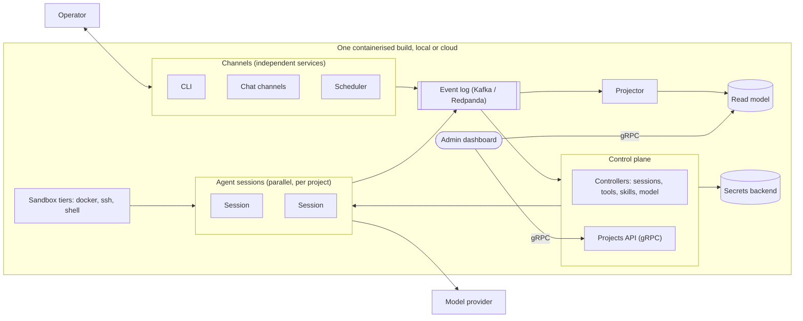
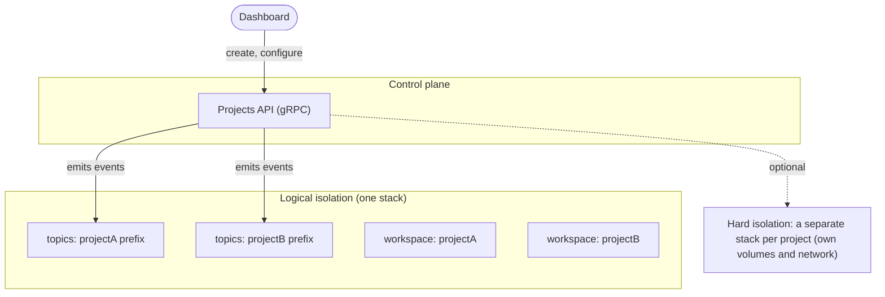
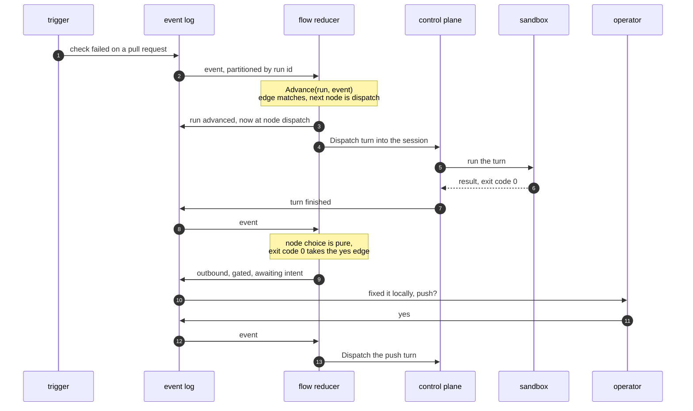
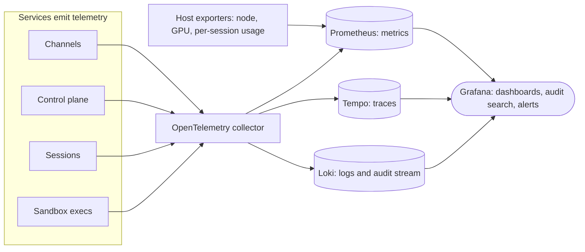

# Quay Crew architecture

Quay Crew is a self hosted, open source personal agent hub: a set of small independent services that
let you drive AI agent work from any channel, run it in sandboxes, and see and audit everything. This
document describes the design, the stack, and the delivery plan.

## Design principles

1. **Open source and self hosted.** Everything runs on infrastructure the operator controls.
2. **No baked in data or secrets.** The code has no knowledge of any project. Projects and their
   credentials are created at runtime through the control plane and stored outside the repository.
3. **Independent components.** Services communicate over a durable event log and typed APIs, never by
   calling into each other in process, so any one can be deployed, scaled, or replaced on its own.
4. **Auditable and observable by construction.** Structured logs and an audit stream, distributed
   traces, and metrics flow through OpenTelemetry from the first line of every service.
5. **Reviewed changes only.** An agent can propose a skill or a memory, but nothing self applies.
6. **Bring your own model.** The model provider is configuration.
7. **Runs the same locally and in the cloud.** One containerised build, backends swapped by config.

## The shape

Channels feed a durable event log. A control plane consumes it, manages projects, and drives parallel
agent sessions. Each session talks to the model and runs tools in a sandbox tier. The event log is the
write side; a projection materialises a read model that the admin dashboard reads. Synchronous
queries (the dashboard reading the read model, the control plane managing projects) go over gRPC.



## Components

Each is its own Go service in its own container.

- **Channels.** One service per channel kind (CLI, a chat integration, a scheduler). A channel
  receives input, publishes an inbound message to the event log, and delivers outbound replies. Every
  channel implements one shared contract.
- **Control plane.** Consumes inbound messages and routes them. It holds the controllers: a sessions
  controller (start or resume the right session), a tools controller, a skills controller, and a model
  controller. It also exposes the **Projects API** over gRPC for creating and configuring projects.
- **Agent sessions.** Worker services that run a model thread, capture the session id so a thread can
  be resumed, and execute tools. Many run in parallel, isolated per project. Tool execution happens in
  a sandbox tier.
- **Projector.** Consumes the event log and materialises the read model. The read model is derived, so
  it is disposable and can be rebuilt from the log.
- **Admin dashboard.** Reads the read model and drives the control plane over gRPC: list projects, see
  every session, tail a conversation, start or stop work.
- **Flow reducer.** Consumes the event log in its own group and advances automation runs against a
  graph, dispatching turns and asking the operator through the same gated outbound as everything
  else. It is where control flow across sessions is written down. See Automation graphs below.

## Messaging and contracts

- **Event log: Kafka.** The async backbone. Run locally with **Redpanda**, which speaks the Kafka
  protocol and is a single lightweight binary, and managed Kafka or Redpanda in the cloud. The client
  is `franz-go` (pure Go, no CGO, so the images stay small).
- **Why an event log.** It decouples the services (each publishes and subscribes on its own), it is
  durable and replayable, and it is the natural write side for the read model: the log is the source
  of truth, the projection is a consumer.
- **Synchronous APIs: gRPC.** Request and response calls (managing projects, reading the read model)
  use gRPC. The message shapes and the service methods are defined in **protobuf** under `proto/`, so
  every service agrees on one contract.
- **The channel contract.** The shared inbound and outbound message schema every channel implements.
  Each message carries a `project` and a `correlation_id` (which is also the trace id).

## Projects and isolation

A project is the unit of isolation, and it is a runtime resource, not a file in the repository.

- **Created through the control plane.** The Projects API (and the dashboard on top of it) creates and
  configures projects. Project lifecycle is captured as events on the log (`ProjectCreated`,
  `ChannelAttached`, `SecretSet`), projected into a projects read model the dashboard renders.
- **Namespaced by project id.** Every message carries its project. The event log topics, the consumer
  groups, the stored state, and the agent workspace are all scoped by project id.
- **Two isolation levels.** Logical isolation shares one running stack and separates everything by
  project id (the default, lightweight). Hard isolation runs a fully separate stack per project, with
  its own volumes and network, when stronger separation is wanted.



## Sandboxes

A **session** is the conversation. A **sandbox** is the isolated environment that session runs in. A
session runs in exactly one sandbox, created on its first turn, reused across turns so the model's own
state survives between them, and closed when the session ends.

The default provider gives each session its own container. The control plane runs as a service in the
same stack and creates those containers as **siblings on the host daemon**, through a mounted Docker
socket, rather than nesting Docker inside Docker. Two consequences follow, and both are deliberate:

- Mounting the host's Docker socket into the control plane is **equivalent to giving it root on the
  host**. The control plane is trusted; the sandboxes it starts are not, which is the boundary that
  matters. A deployment that cannot accept this runs the control plane as a host process instead, and
  nothing else changes, because the provider talks to the same daemon either way.
- Bind mount paths in a sandbox are resolved by the **host** daemon, not inside the control plane
  container, so paths handed to a sandbox are host paths.

The control plane image therefore carries the Docker client and runs as root. Every other service is
an unprivileged distroless image.

The default sandbox image carries the Claude Code CLI, and a turn runs `claude` inside it under the
operator's subscription. The image holds no credentials: the subscription token is stored per project
as a secret and injected into the sandbox as an environment variable at turn time, so the same image
runs unchanged on a laptop or in the cloud. See `docs/SANDBOX.md` for how to build the image, set the
token, and run a real turn.

Verifying this end to end is a requirement, not a nicety. A turn that cannot exec inside its sandbox
is a stack that cannot do anything at all, and a smoke test that only checks the services are running
will not notice. Continuous integration therefore dispatches a real turn against the composed stack
with a model substitute that still execs inside the sandbox.

## Storage

Projects, their channels and their sessions live in Postgres, a service in the same compose stack.
The control plane holds no domain state of its own, which is the whole point: a session's
`model_session_id` is the handle to a conversation the model keeps on its own disk, so losing that
pointer orphans a conversation that still exists and cannot be reached again.

- **One interface, two implementations.** `store.Store` is the contract. `store.Memory` runs without
  a database and loses everything on restart, which the control plane warns about on the way up.
  `store.Postgres` is what the composed stack and the cloud use. Both are held to the same
  conformance suite, so a behaviour proven against one is proven against the other.
- **Forward only migrations.** Embedded in the binary and applied on every start inside a
  transaction each, recorded in `schema_migrations`, so starting twice is a no op. Every migration
  ships a matching down file for an operator to run deliberately; nothing rolls back automatically.
- **Every table carries `id`, `created_at` and `updated_at`.** Projects are soft deleted through
  `deleted_at` and disappear from every read, while their sessions keep their history.
- **A failed turn never erases the conversation handle.** Recording a turn with no handle leaves the
  stored one alone, so a model call that fails cannot cost you the thread.

Set `QC_DATABASE_URL` to use Postgres. Leave it unset and the store is in memory, which is only
appropriate for a throwaway stack.

## What the product does, as an executable specification

`features/` holds the behaviour specifications: feature files written in plain language, run by
godog, driving the control plane over its real interface through an in memory connection. They are
the readable answer to what Quay Crew does, and they fail when it stops doing it. `make features`
runs them and prints them.

Three rules keep the layer worth having.

- **The control plane contract only.** A behaviour that is better said as a Go table test belongs in
  the package it tests. A feature file per package restates the tests more slowly.
- **Every scenario has teeth.** Each one was checked by breaking the implementation on purpose and
  confirming it goes red. A scenario that passes against a broken system is worse than no scenario.
- **They state their own limits.** The model runner and the sandbox provider are doubles here, so
  these scenarios prove routing, session identity, sandbox lifecycle and refusals. They deliberately
  do not prove a real turn executes; the dispatch smoke does that against the composed stack.

The suite fails if it finds no feature files, because a run with nothing to run reports success.

## Automation graphs

Inside a session the model decides what happens next, and that is right. It is better at choosing the
next step than any diagram would be. Across sessions the operator wants the opposite: a decision
written down where it can be read, tested and stopped. Automation graphs are that second thing.

The substrate is the one already here, a stream and a reducer:

```go
// Pure. No Docker, no Postgres, no model. Testable in a table test.
type Runner interface {
    Advance(run Run, ev Event) (Run, []Command, error)
}
```

A run is an instance of a graph: an identifier, the graph version it is pinned to, a small state map,
and one current node. An event arrives, the reducer evaluates the current node's outgoing edges, and
returns the next state plus commands to emit. Every transition is written back to the log as an
event, so run state is derived rather than stored, and any run can be reconstructed by replay.

A stream and a reducer is the more powerful arrangement, strictly. Any control flow can be written as
a reducer, including branching computed at run time and steps chosen by the model. A graph cannot
express that. **The graph is a deliberate restriction on the reducer, and the restriction is the
point.** An arbitrary reducer is code, so the only way to answer what an automation will do is to run
it, which is the same opacity the model already has. A graph answers statically: the console can draw
it, the operator can read it before it runs and see which node a run is sitting on while it does.
Power is not what is wanted at this layer, legibility is.

Five node types, and a sixth needs an argument:

- `dispatch` sends a turn to a session and waits for the result.
- `wait` waits for an external event, a timer or a webhook or a channel message.
- `ask` puts a question to the operator through the gated outbound and waits for the reply.
- `choice` branches on state, pure, no side effect.
- `done` ends the run.

Every node either waits on something or is pure, so the reducer never blocks and there is no
goroutine per run.

Graphs are authored as files, loaded into the store, and versioned:

```yaml
name: fix-red-pull-request
on: { event: pull_request.check_failed }
nodes:
  fix:   { type: dispatch, session: "{{project}}", prompt: "CI is red on {{url}}. Diagnose and fix." }
  ok:    { type: choice, on: { result.exit_code: 0 } }
  ask:   { type: ask, text: "Fixed {{url}} locally. Push?" }
edges:
  - [fix, ok]
  - [ok, ask, "true"]
  - [ok, done, "false"]
  - [ask, push, "yes"]
```

### Where it sits

`internal/flow` is another consumer group on the log, a peer of the gateway rather than a layer under
anything. It is in no request path, so removing it leaves every existing path working. It holds no
privileged access: it calls the same `ControlPlaneService` the console does, and its outbound goes
through the same gate as everything else, so it cannot reach the operator without intent.



### Constraints that hold the design together

- **Partition the log by run identifier.** One run's events are then totally ordered, so no locking.
- **Pin the graph version on the run.** Otherwise editing a file changes an automation that is
  halfway through.
- **No expression language.** Three comparison operators to start. Accepting arbitrary expressions
  means owning a language and a sandbox.
- **No parallel nodes and no joins in the first version.** A single current node. Joins are where
  every workflow engine turns into a product, and which join is needed will not be knowable until two
  real automations exist.
- **No framework.** LangGraph and its peers get durability from a checkpointer that saves a snapshot
  per node. That is a weaker version of the log already here: it keeps the latest state and not the
  history, so a consumer added later cannot read what already happened. A framework also owns the
  schema, which turns the store into its cache rather than the source of truth.

The scheduler is an implementation detail of the `wait` node, not an automation system of its own. It
delivers timer events onto the log and nothing more.

## Secrets

Secrets are never stored in the repository, and the code has no built in knowledge of any.

- **Set at runtime.** The operator sets a project's credentials through the dashboard or the API. The
  value goes straight to a pluggable secrets backend.
- **A reference in the log, never the value.** The event log records only a reference to a secret; the
  value lives in the backend. Services read by reference at runtime. Logs and the audit stream redact.
- **Pluggable backends.** Development uses an encrypted local store in a gitignored data volume, so
  nothing sits in plaintext or in the repository even locally. The cloud swaps to a managed secrets
  service behind the same interface.

## Observability and audit

Auditability and observability are first class, because the system runs a model with real permissions
and can send messages and run shell. Two layers reinforce each other.

1. **The application's own history.** The event log is the write side; the read model is a queryable
   view of what happened. That record lives in the operator's own storage.
2. **Operational telemetry.** Logs, metrics, and traces through an OpenTelemetry pipeline into Grafana,
   with Loki for logs and audit, Tempo for traces, and Prometheus for metrics.



Concretely:

- **Structured logs** to Loki from every service at boundaries: a message arriving on a channel, log
  enqueue and consume, each controller decision, session start and resume, every tool and sandbox
  execution (command, exit code, duration), every model call (latency, tokens, cost), the permission
  tier applied, every outbound delivery, and every error. One correlation id per inbound message
  threads through all of them and equals the trace id, so logs and traces pivot in Grafana.
- **An audit stream:** the security relevant subset (who initiated, what command, which permission
  tier, what shell or tool ran, which files changed, what was sent and to whom), labelled and retained
  longer than debug logs. Every privileged action is a queryable audit event.
- **Token and cost metrics:** input and output tokens and cost per model call, per session, per
  channel, per project, and per day, with a cost ceiling alert. When the model runs remotely, its cost
  is tokens and money, not local hardware.
- **Host and resource metrics:** CPU, memory, and disk via a node exporter; GPU utilisation and memory
  via the platform appropriate exporter where a GPU is in play (local transcription, a local model, or
  a cloud GPU runner); and per session process usage, so an individual session's compute cost is
  visible, not just its tokens.
- **Traces** to Tempo: one trace per inbound message spanning channel, log, control plane, session,
  tool or model call, and outbound. Error scoping is by span kind, so a denied permission or an
  expected client error does not read as a system failure.
- **Dashboards and alerts as code**, reviewed in a pull request, not clicked into a UI.
- The whole telemetry stack runs the same locally and in the cloud.

## Deployment

- **Everything in Docker.** Each component is a container; a compose file wires them locally, and
  `make up` (alias `make start`) is the front door. The heavy observability stack sits behind a compose
  profile so the day to day loop stays light.
- **Local and cloud from one build.** The event log, storage, sandbox, and secrets are each behind an
  interface with a local implementation (Redpanda, files or a local database, local docker, an
  encrypted local store) and a cloud implementation (managed Kafka or Redpanda, object store, remote
  runners, a managed secrets service), selected by configuration.
- **Deploy through CI.** The cloud target ships through a pipeline on merge, with secrets from the
  platform store, never a laptop apply.

## Delivery plan

Sequenced spine first. Each slice is small, single intention, typed, and tested. Observability is
cross cutting from the first slice: every service emits structured logs with a correlation id that
doubles as the trace id, and token and cost counters land with the first model call.

- **Foundations.** Scaffold the Go monorepo and tooling, resolve the open decisions, and stand up the
  logging and correlation id conventions.
- **Spine (local and usable).** The channel contract, the event log interface, the control plane with
  the sessions controller, the thread engine, and a CLI channel end to end.
- **First remote channel.** A chat channel inbound onto the log, outbound gated so nothing sends
  without the operator's intent, plus the telemetry stack in the local compose.
- **Controllers, sessions, sandbox.** The remaining controllers, parallel sessions with a durable
  session store, and sandbox tiers with permission tiers per channel.
- **Dashboard and projection.** The projection that materialises the read model, and the admin
  dashboard that reads it and drives the control plane.
- **Cloud parity.** Containerise, cloud implementations behind the interfaces, and deploy through CI.
- **Differentiators (optional).** A reviewed learning loop that proposes a skill or memory for
  approval, a scheduler, and voice input transcribed locally.

## Prior art

Quay Crew learns from three points on the map.

- **OpenClaw:** a self hosted gateway with a control plane, many channel adapters, and config, memory,
  and skills as files on disk. Quay Crew keeps the self hosted, files on disk, control plane shape and
  avoids an unvetted third party skill marketplace.
- **Hermes Agent:** an agent loop that writes its own skills, a built in scheduler, and persistent
  memory. Quay Crew borrows the learning loop and the scheduler but keeps changes reviewed rather than
  self applied.
- **Remote control features** that turn a phone into a live window onto a local session: the safest way
  to steer one session, but not a programmable, multi channel, self hosted hub. Quay Crew is the
  latter.
