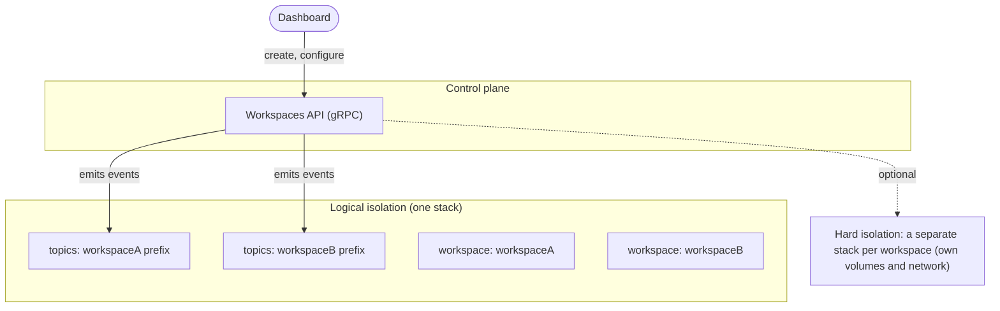
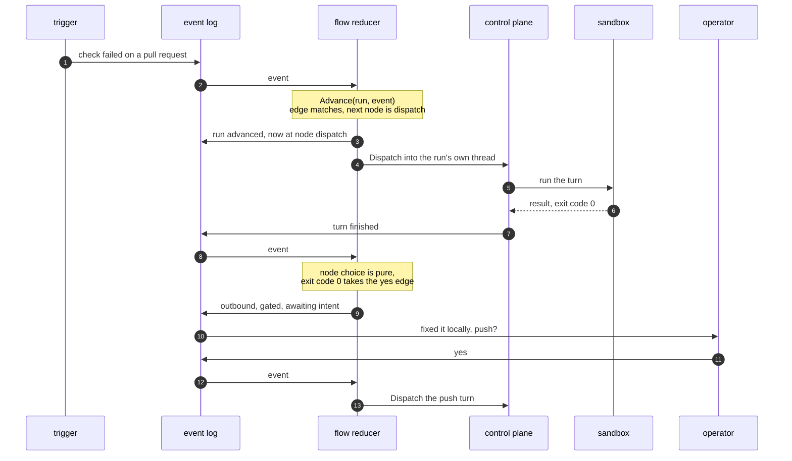

# Quay Crew architecture

Quay Crew is a self hosted, open source personal agent hub: a set of small independent services that
let you drive AI agent work from any channel, run it in sandboxes, and see and audit everything. This
document describes the design, the stack, and the delivery plan.

## Design principles

1. **Open source and self hosted.** Everything runs on infrastructure the operator controls.
2. **No baked in data or secrets.** The code has no knowledge of any workspace. Workspaces and their
   credentials are created at runtime through the control plane and stored outside the repository.
3. **Independent components.** Services communicate over a durable event log and typed APIs, never by
   calling into each other in process, so any one can be deployed, scaled, or replaced on its own.
4. **Auditable and observable by construction.** Structured logs and an audit stream, distributed
   traces, and metrics flow through OpenTelemetry from the first line of every service.
5. **Reviewed changes only.** An agent can propose a skill or a memory, but nothing self applies.
   What a skill is, and how one reaches a session, is in [SKILLS.md](SKILLS.md).
6. **Bring your own model.** The model provider is configuration.
7. **Runs the same locally and in the cloud.** One containerised build, backends swapped by config.

## The shape

Channels feed a durable event log. A control plane consumes it, manages workspaces, and drives parallel
agent sessions. Each session talks to the model and runs tools in a sandbox tier. The store is the
write side; the event log carries the same records outward for anything that wants a stream, and a
projection materialises read models from it where one is worth having. Synchronous queries (the
dashboard reading the read model, the control plane managing workspaces) go over gRPC.


## Components

Each is its own Go service in its own container.

- **Channels.** One service per channel kind (CLI, a chat integration, a scheduler). A channel
  receives input, publishes an inbound message to the event log, and delivers outbound replies. Every
  channel implements one shared contract.
- **Control plane.** Consumes inbound messages and routes them. It holds the controllers: a sessions
  controller (start or resume the right session), a tools controller, a skills controller, and a model
  controller. It also exposes the **Workspaces API** over gRPC for creating and configuring workspaces.
- **Agent sessions.** Worker services that run a model thread, capture the session id so a thread can
  be resumed, and execute tools. Many run in parallel, isolated per workspace. Tool execution happens in
  a sandbox tier.
- **Workspaceor.** Consumes the event log and materialises the read model. The read model is derived, so
  it is disposable and can be rebuilt from the log.
- **Admin dashboard.** Reads the read model and drives the control plane over gRPC: list workspaces, see
  every session, tail a conversation, start or stop work.
- **Flow reducer.** Consumes the event log in its own group and advances automation runs against a
  graph, dispatching turns and asking the operator through the same gated outbound as everything
  else. It is where control flow across sessions is written down. See Automation graphs below.

## Messaging and contracts

- **Event log: Kafka.** The async backbone. Run locally with **Redpanda**, which speaks the Kafka
  protocol and is a single lightweight binary, and managed Kafka or Redpanda in the cloud. The client
  is `franz-go` (pure Go, no CGO, so the images stay small).
- **Why an event log, and what it is not.** It decouples the services (each publishes and subscribes
  on its own) and it lets a consumer added later read what already happened. It is **not the source
  of truth**: the store is, and publishing is deliberately lossy, because a broker that cannot be
  reached must never fail a turn that already happened ([`EVENTS.md`](EVENTS.md) is the honest
  account). Decided 9 August 2026: anything the crew cannot afford to lose is written to the store
  in the same transaction as the thing it describes, and the log carries the same record outward as
  an export for whatever wants a stream. Unset seeds then mean no export, never lost history.
- **Synchronous APIs: gRPC.** Request and response calls (managing workspaces, reading the read model)
  use gRPC. The message shapes and the service methods are defined in **protobuf** under `proto/`, so
  every service agrees on one contract.
- **The channel contract.** The shared inbound and outbound message schema every channel implements.
  Each message carries a `workspace` and a `correlation_id` (which is also the trace id).

`docs/EVENTS.md` is the operator's version of this: how Redpanda runs, how to inspect it with `rpk`,
how topics are named, and the honest state of the log today, which is that the boundary and its
client exist while nothing publishes to it or consumes it yet.

## Workspaces and isolation

A workspace is the unit of isolation, and it is a runtime resource, not a file in the repository.

- **Created through the control plane.** The Workspaces API (and the dashboard on top of it) creates and
  configures workspaces. Workspace lifecycle is captured as events on the log (`WorkspaceCreated`,
  `ChannelAttached`, `SecretSet`), workspaceed into a workspaces read model the dashboard renders.
- **Namespaced by workspace id.** Every message carries its workspace. The event log topics, the consumer
  groups, the stored state, and the agent workspace are all scoped by workspace id.
- **Two isolation levels.** Logical isolation shares one running stack and separates everything by
  workspace id (the default, lightweight). Hard isolation runs a fully separate stack per workspace, with
  its own volumes and network, when stronger separation is wanted.



## Sandboxes

A **session** is the conversation. A **sandbox** is the isolated environment that session runs in. A
session runs in exactly one sandbox, created on its first turn, reused across turns so the model's own
state survives between them, and closed when the session ends.

The default provider gives each session its own container. The control plane runs as a service in the
same stack and creates those containers as **siblings on the host daemon**, through a mounted Docker
socket, rather than nesting Docker inside Docker. Two consequences follow, and both are deliberate:

- Mounting the host's Docker socket into the control plane is **equivalent to giving it root on the
  host**. The control plane is trusted; the sandboxes it starts are not, which is the boundary that
  matters. A deployment that cannot accept this runs the control plane as a host process instead, and
  nothing else changes, because the provider talks to the same daemon either way.
- Bind mount paths in a sandbox are resolved by the **host** daemon, not inside the control plane
  container, so paths handed to a sandbox are host paths.

The control plane image therefore carries the Docker client and runs as root. Every other service is
an unprivileged distroless image.

### What a sandbox keeps, and where

A container's filesystem dies with the container. The model's own conversation store lives in one, so
without somewhere else to put it, removing a sandbox destroys the conversation the database still
holds a handle to, permanently. Two directories are therefore mounted in from the host:

```
<data>/workspaces/<workspace>/claude                        ->  /home/agent/.claude
<data>/workspaces/<workspace>/projects/<project>/workspace   ->  /home/agent/workspace
```

The levels are not an invention. The model's command line tool already reads memory from `CLAUDE.md`
in the home directory and `CLAUDE.md` in the working directory, and already keeps its transcripts
under the home directory. So a workspace's directory carries who you are plus every conversation in
it, and a project's directory carries that body of work and its files. Context reaches the model with
no prompt assembly, no token cost on a turn that does not need it, and no second mechanism: editing
context is editing files.

They are bind mounts rather than named volumes so the operator can drop a file into a project with an
editor instead of a throwaway container. Both are read write, which they have to be, because the same
directory holds the store the model writes and the files the agent works on. The consequence worth
naming: an agent can edit its own context. That is how `CLAUDE.md` normally works, and it does mean
context is no longer something only the operator changes.

The control plane sees that data directory through its own mount (`QC_DATA_DIR`) and hands sandboxes
the path the host daemon sees (`QC_DATA_HOST`), because those containers are siblings on that daemon.
With neither set, state stays in the container and dies with it. Where the directories live is
configuration, so a Kubernetes provider can back the same two levels with a volume instead.

The default sandbox image carries the Claude Code CLI, and a turn runs `claude` inside it under the
operator's subscription. The image holds no credentials: the subscription token is stored per workspace
as a secret and injected into the sandbox as an environment variable at turn time, so the same image
runs unchanged on a laptop or in the cloud. See `docs/SANDBOX.md` for how to build the image, set the
token, and run a real turn.

Verifying this end to end is a requirement, not a nicety. A turn that cannot exec inside its sandbox
is a stack that cannot do anything at all, and a smoke test that only checks the services are running
will not notice. Continuous integration therefore dispatches a real turn against the composed stack
with a model substitute that still execs inside the sandbox.

## Workspaces, projects and threads

Three levels, named the way Claude Projects and Linear name them, because the words should mean what
a reader already expects.

**Decided 9 August 2026: the operator facing word is thread, everywhere.** The code and the wire
still say session in places (`ListSessions`, `session_id`, the store), the surfaces say thread, and
one row answers to both plus a third name for its conversation handle. That split is settled in the
thread direction and the protocol definitions align with it before the repository goes public,
because after publication the same rename is a breaking change instead of a tidy up.

```
workspace  "me"                      who you are; secrets and channels attach here
  └── project  "house-bills"         a body of work, with its own shared context
        ├── thread  "energy supplier"
        └── thread  "council tax"
```

A workspace and a project are named in lowercase with hyphens, because a name is half of an address:
`me/house-bills` says which project of which workspace, on a command line and in a directory path on
disk. The control plane refuses a name that could not be part of one, and says what would work.

The three levels are addressed as a path, and the operator stands in one of them at a time. `quay use
me/house-bills` records that in `~/.config/quay/context`, the way kubectl keeps a current context, and
every command after it acts there until an address typed on the command line says otherwise. A thread
is the third level, so standing in one continues that conversation rather than starting another.

A **workspace** is the unit of tenancy. A **project** is a body of work inside it. A **thread** is one
conversation, and a session is that thread running: it belongs to a project, and it carries its
workspace too, denormalised so a listing needs no join. A project never moves workspace, so that
cannot drift.

A thread identifier is unique within its project, not within the workspace. Two bodies of work in one
workspace can both have a thread a channel calls "general" without colliding, which is the whole
reason the level exists.

Deleting a workspace hides its projects, and deleting a project hides it from every read while its
sessions keep their history. Nothing is hard deleted, because a session holds the only pointer to a
conversation the model keeps on its own disk.

## Storage

Workspaces, their channels and their sessions live in Postgres, a service in the same compose stack.
The control plane holds no domain state of its own, which is the whole point: a session's
`model_session_id` is the handle to a conversation the model keeps on its own disk, so losing that
pointer orphans a conversation that still exists and cannot be reached again.

- **One interface, two implementations.** `store.Store` is the contract. `store.Memory` runs without
  a database and loses everything on restart, which the control plane warns about on the way up.
  `store.Postgres` is what the composed stack and the cloud use. Both are held to the same
  conformance suite, so a behaviour proven against one is proven against the other.
- **Forward only migrations.** Embedded in the binary and applied on every start inside a
  transaction each, recorded in `schema_migrations`, so starting twice is a no op. Every migration
  ships a matching down file for an operator to run deliberately; nothing rolls back automatically.
- **Every table carries `id`, `created_at` and `updated_at`.** Workspaces are soft deleted through
  `deleted_at` and disappear from every read, while their sessions keep their history.
- **A failed turn never erases the conversation handle.** Recording a turn with no handle leaves the
  stored one alone, so a model call that fails cannot cost you the thread.

Set `QC_DATABASE_URL` to use Postgres. Leave it unset and the store is in memory, which is only
appropriate for a throwaway stack.

`docs/DATABASE.md` is the operator's version of this section: how to shell in, what every table
means, the queries worth knowing, and how migrations are added.

## What the product does, as an executable specification

`features/` holds the behaviour specifications: feature files written in plain language, run by
godog, driving the control plane over its real interface through an in memory connection. They are
the readable answer to what Quay Crew does, and they fail when it stops doing it. `make features`
runs them and prints them.

Three rules keep the layer worth having.

- **The control plane contract only.** A behaviour that is better said as a Go table test belongs in
  the package it tests. A feature file per package restates the tests more slowly.
- **Every scenario has teeth.** Each one was checked by breaking the implementation on purpose and
  confirming it goes red. A scenario that passes against a broken system is worse than no scenario.
- **They state their own limits.** The model runner and the sandbox provider are doubles here, so
  these scenarios prove routing, session identity, sandbox lifecycle and refusals. They deliberately
  do not prove a real turn executes; the dispatch smoke does that against the composed stack.

The suite fails if it finds no feature files, because a run with nothing to run reports success.

## Automation graphs

Inside a session the model decides what happens next, and that is right. It is better at choosing the
next step than any diagram would be. Across sessions the operator wants the opposite: a decision
written down where it can be read, tested and stopped. Automation graphs are that second thing.

**Decided 9 August 2026: the substrate is Postgres, and the log is the export.** A run and its
transitions are rows, written in one transaction, which is what makes "reconstructable" a guarantee
rather than a sentence: there is no gap for a dropped publish to hide in. The `wait` node is a due
time column read by a poller, and a dispatch is idempotent through a unique key on run, node and
attempt, which is the compare and set a log does not have. The reducer below stands unchanged; what
changes is what delivers events to it and where its state lives. Kafka stays as the outward carrier
of the same records, and as the trigger bus where an external source already speaks to it. The
delivery plan for this is [#182](https://github.com/atlantic-blue/quay-crew/issues/182), whose
sections on the outbox and on consumer group ordering predate this decision and are superseded by
it.

The reducer is a pure function over that state:

```go
// Pure. No Docker, no Postgres, no model. Testable in a table test.
type Runner interface {
    Advance(run Run, ev Event) (Run, []Command, error)
}
```

A run is an instance of a graph: an identifier, the graph version it is pinned to, a small state map,
and one current node. An event arrives, the reducer evaluates the current node's outgoing edges, and
returns the next state plus commands to emit.

**A run lives in Postgres, and each transition is published to the log as the audit record.** That is
the same split the rest of the system already makes, and it is the split the log forces: publishing a
turn is deliberately lossy, because a broker that cannot be reached must never fail a turn that
already happened, and with `QC_KAFKA_SEEDS` unset nothing is published at all. A run whose next
transition depended on an event that was dropped would sit on that node forever with nothing to say
so, which is why the log cannot be the place a run's position is kept.

A stream and a reducer is the more powerful arrangement, strictly. Any control flow can be written as
a reducer, including branching computed at run time and steps chosen by the model. A graph cannot
express that. **The graph is a deliberate restriction on the reducer, and the restriction is the
point.** An arbitrary reducer is code, so the only way to answer what an automation will do is to run
it, which is the same opacity the model already has. A graph answers statically: the console can draw
it, the operator can read it before it runs and see which node a run is sitting on while it does.
Power is not what is wanted at this layer, legibility is.

Five node types, and a sixth needs an argument:

- `dispatch` sends a turn to the run's own thread and waits for the result.
- `wait` waits for an external event, a timer or a webhook or a channel message.
- `ask` puts a question to the operator through the gated outbound and waits for the reply.
- `choice` branches on state, pure, no side effect.
- `done` ends the run.

Every node either waits on something or is pure, so the reducer never blocks and there is no
goroutine per run. `Dispatch` on the control plane is a synchronous call that returns the reply, so
the blocking is done by an executor beside the reducer: it takes the commands the reducer returned,
makes the call, and feeds the result back in as an event. One goroutine per outstanding dispatch,
never one per run, and the reducer itself still touches no Docker, no Postgres and no model.

Graphs are authored as files, loaded into the store, and versioned. A run is addressed at a project,
because that is what a dispatch needs, so the trigger carries `workspace/project` and no node names a
session:

```yaml
name: fix-red-pull-request
on: { event: pull_request.check_failed }
nodes:
  fix:   { type: dispatch, prompt: "CI is red on {{url}}. Diagnose and fix." }
  ok:    { type: choice, on: { result.exit_code: 0 } }
  ask:   { type: ask, text: "Fixed {{url}} locally. Push?" }
edges:
  - [fix, ok]
  - [ok, ask, "true"]
  - [ok, done, "false"]
  - [ask, push, "yes"]
```

### A run owns its thread

**The thread identifier is the run identifier.** `Dispatch` resolves a thread through
`FindOrCreateSession(project, thread)`, so a thread identifier that does not exist yet is created and
the same one later continues the conversation. A dispatch node therefore passes the run's own
identifier every time, and four things follow:

- **The reducer keeps no session handle.** The address is derived from the run it already holds, so
  there is nothing to store and nothing to go stale.
- **A restart mid run resumes.** The next dispatch lands in the same thread and the same sandbox, so
  the model's own state across the run survives it.
- **Correlation stops being a heuristic.** Turn events are keyed by session, and the session belongs
  to the run, so a turn event on it is unambiguously this run's, even when the operator types into
  that thread by hand. `TurnEvent` needs no run identifier for this, which is why the first version
  changes nothing in `proto/`.
- **The run owns the sandbox lifetime.** `done` archives the session, otherwise every run leaves a
  container behind. Archived threads are listed apart from live ones, so a finished run takes itself
  out of the way.

A thread identifier is free form and unique within its project, so a run names its thread after the
graph and a short run identifier, `fix-red-pull-request-a1b2c3d4`. The console then reads as what the
run is doing without waiting for labels; labels become the thing that groups runs rather than the
thing that names them.

### Where it sits

`internal/flow` is a state machine over its own tables, driven by a poller and by the store's own
writes, a peer of the gateway rather than a layer under anything. It is in no request path, so
removing it leaves every existing path working. It holds no privileged access: it calls the same
`ControlPlaneService` the console does, and its outbound goes through the same gate as everything
else, so it cannot reach the operator without intent.



### Constraints that hold the design together

- **One run has one writer, so no locking.** A run's row is advanced in a transaction, and a
  transaction is the one writer at a time the database already gives. The trigger that starts a run
  has no session yet, which is why a partitioned log could not have given this for every event a run
  cares about.
- **Pin the graph version on the run.** Otherwise editing a file changes an automation that is
  halfway through.
- **No expression language.** Three comparison operators to start. Accepting arbitrary expressions
  means owning a language and a sandbox.
- **No parallel nodes and no joins in the first version.** A single current node. Joins are where
  every workflow engine turns into a product, and which join is needed will not be knowable until two
  real automations exist.
- **No framework.** LangGraph and its peers get durability from a checkpointer that saves a snapshot
  per node. That is a weaker version of the log already here: it keeps the latest state and not the
  history, so a consumer added later cannot read what already happened. A framework also owns the
  schema, which turns the store into its cache rather than the source of truth.

The scheduler is an implementation detail of the `wait` node, not an automation system of its own. It
delivers timer events onto the log and nothing more.

### What a sandbox carries

The control plane sets the workspace's environment on the sandbox when it creates it, not only on
each turn. That is what lets the operator attach to a session's conversation, or shell in and run the
model by hand, without any tool carrying a credential to each command.

The cost is stated plainly: those values are readable for the life of the container, for example
through `docker inspect`. They were already reachable from inside the sandbox, which is where the
model runs, so this changes who can see them rather than whether they are present. The alternative
considered and rejected was returning the value through the API on request, which would make a secret
the backend holds readable by any client that asks for it.

## Secrets

Secrets are never stored in the repository, and the code has no built in knowledge of any.

- **Set at runtime.** The operator sets a workspace's credentials through the dashboard or the API. The
  value goes straight to a pluggable secrets backend.
- **A reference in the log, never the value.** The event log records only a reference to a secret; the
  value lives in the backend. Services read by reference at runtime. Logs and the audit stream redact.
- **Pluggable backends.** Development uses an encrypted local store in a gitignored data volume, so
  nothing sits in plaintext or in the repository even locally. The cloud swaps to a managed secrets
  service behind the same interface.

## Authentication

**Decided 9 August 2026: a bearer token per crew.** One token, minted by the control plane the
first time it starts, and refused to nobody who holds it: per client identities can follow when
more than one operator exists, and the token is the smallest thing that makes the boundary real.

How it works today, in `internal/auth`:

- The token lives at `<data directory>/crew.token`, beside the key that seals secrets and kept the
  same way: made rather than asked for, readable only by its owner. It sits there rather than
  sealed in the store because a sealed value can never be read back out through the API, by
  construction, and the operator's own tool has to present this one.
- Every call carries `authorization: Bearer <token>`, or is refused before it reaches anything,
  with the refusal naming what to present and where quay reads it from. A control plane with
  nowhere to keep a token refuses every caller rather than serving them all.
- The listener binds to loopback unless the operator says otherwise, and the compose file publishes
  the port on the host's loopback only. The token is what recognises a caller, not what hides the
  conversation: publishing the port beyond the machine needs transport the operator owns in front
  of it.
- `quay` reads QC_TOKEN first, then the token file under the crew's data directory.

A driver session is a client like any other and gets less, not more. It is handed its own token at
sandbox birth, minted into `driver.token` beside the crew's, so the control plane can tell its
calls apart and a token that leaks out of a driver sandbox grants strictly less than the operator
holds. The calls that grant capability are refused to it, in `DeniedToDriver`: setting or listing
secrets, importing, attaching or detaching skills, a session's permission mode, and context at the
crew scope, which is injected into every session including the driver itself. Everything the
driver exists to do stays open: workspaces, projects, threads, dispatch, and context at the
workspace and project scopes.

## Observability and audit

Auditability and observability are first class, because the system runs a model with real permissions
and can send messages and run shell. Two layers reinforce each other.

1. **The application's own history.** The store holds what happened, written with the thing it
   describes; the event log carries the same record outward. Both live in the operator's own
   storage.
2. **Operational telemetry.** Logs, metrics, and traces through an OpenTelemetry pipeline into Grafana,
   with Loki for logs and audit, Tempo for traces, and Prometheus for metrics.

`docs/OBSERVABILITY.md` is the operator's version of this, and the honest one: logs are real today,
no span or metric is created anywhere yet, and the collector discards what it receives.


Concretely:

- **Structured logs** to Loki from every service at boundaries: a message arriving on a channel, log
  enqueue and consume, each controller decision, session start and resume, every tool and sandbox
  execution (command, exit code, duration), every model call (latency, tokens, cost), the permission
  tier applied, every outbound delivery, and every error. One correlation id per inbound message
  threads through all of them and equals the trace id, so logs and traces pivot in Grafana.
- **An audit stream:** the security relevant subset (who initiated, what command, which permission
  tier, what shell or tool ran, which files changed, what was sent and to whom), labelled and retained
  longer than debug logs. Every privileged action is a queryable audit event.
- **Token and cost metrics:** input and output tokens and cost per model call, per session, per
  channel, per workspace, and per day, with a cost ceiling alert. When the model runs remotely, its cost
  is tokens and money, not local hardware.
- **Host and resource metrics:** CPU, memory, and disk via a node exporter; GPU utilisation and memory
  via the platform appropriate exporter where a GPU is in play (local transcription, a local model, or
  a cloud GPU runner); and per session process usage, so an individual session's compute cost is
  visible, not just its tokens.
- **Traces** to Tempo: one trace per inbound message spanning channel, log, control plane, session,
  tool or model call, and outbound. Error scoping is by span kind, so a denied permission or an
  expected client error does not read as a system failure.
- **Dashboards and alerts as code**, reviewed in a pull request, not clicked into a UI.
- The whole telemetry stack runs the same locally and in the cloud.

## Deployment

- **Everything in Docker.** Each component is a container; a compose file wires them locally, and
  `make up` (alias `make start`) is the front door. The heavy observability stack sits behind a compose
  profile so the day to day loop stays light.
- **Local and cloud from one build.** The event log, storage, sandbox, and secrets are each behind an
  interface with a local implementation (Redpanda, files or a local database, local docker, an
  encrypted local store) and a cloud implementation (managed Kafka or Redpanda, object store, remote
  runners, a managed secrets service), selected by configuration.
- **Deploy through CI.** The cloud target ships through a pipeline on merge, with secrets from the
  platform store, never a laptop apply.

## Delivery plan

Sequenced spine first. Each slice is small, single intention, typed, and tested. Observability is
cross cutting from the first slice: every service emits structured logs with a correlation id that
doubles as the trace id, and token and cost counters land with the first model call.

- **Foundations.** Scaffold the Go monorepo and tooling, resolve the open decisions, and stand up the
  logging and correlation id conventions.
- **Spine (local and usable).** The channel contract, the event log interface, the control plane with
  the sessions controller, the thread engine, and a CLI channel end to end.
- **First remote channel.** A chat channel inbound onto the log, outbound gated so nothing sends
  without the operator's intent, plus the telemetry stack in the local compose.
- **Controllers, sessions, sandbox.** The remaining controllers, parallel sessions with a durable
  session store, and sandbox tiers with permission tiers per channel.
- **Dashboard and projection.** The projection that materialises the read model, and the admin
  dashboard that reads it and drives the control plane.
- **Cloud parity.** Containerise, cloud implementations behind the interfaces, and deploy through CI.
- **Differentiators (optional).** A reviewed learning loop that proposes a skill or memory for
  approval, a scheduler, and voice input transcribed locally.

## Prior art

Quay Crew learns from three points on the map.

- **OpenClaw:** a self hosted gateway with a control plane, many channel adapters, and config, memory,
  and skills as files on disk. Quay Crew keeps the self hosted, files on disk, control plane shape and
  avoids an unvetted third party skill marketplace.
- **Hermes Agent:** an agent loop that writes its own skills, a built in scheduler, and persistent
  memory. Quay Crew borrows the learning loop and the scheduler but keeps changes reviewed rather than
  self applied.
- **Remote control features** that turn a phone into a live window onto a local session: the safest way
  to steer one session, but not a programmable, multi channel, self hosted hub. Quay Crew is the
  latter.
