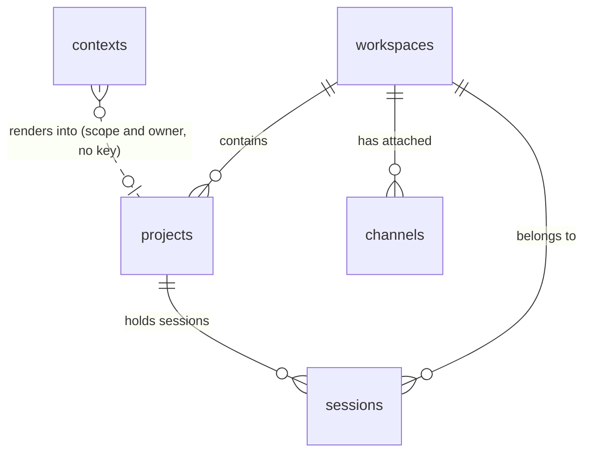

# The database

Quay Crew keeps its workspaces, projects, sessions, context and channels in Postgres, a service in
the same compose stack as everything else. This document is how to run it, how to look inside it, and what
each thing in there means.

For the design reasoning behind it, see the Storage section of `docs/ARCHITECTURE.md`. This one is
for the operator with a terminal open.

## Why there is a database at all

The control plane holds no state of its own. That is the point, and it is worth being blunt about
what would happen otherwise.

When a session runs a turn, the model keeps the conversation on its own disk and hands back a handle
to it. That handle is stored as `model_session_id` on the session row, and it is the only pointer to
that conversation anywhere in the system. Lose the row and the conversation still exists, sitting in
`~/.quaycrew/data`, unreachable forever. Nothing can reconstruct the handle.

So the database is not a cache and it is not an optimisation. It is the thing that makes a session
something you can come back to tomorrow.

There is a second implementation, `store.Memory`, which runs without a database and loses everything
on restart. It exists for tests and for a throwaway stack. Both implementations are held to the same
conformance suite in `internal/store/storetest`, so a behaviour proven against one is proven against
the other. If `QC_DATABASE_URL` is unset the control plane falls back to memory and warns on the way
up:

```
no QC_DATABASE_URL set, using the in memory store: workspaces and sessions will not survive a restart
```

If you ever see that line in `make logs`, your sessions are living on borrowed time.

## How it runs

`make up` starts it. The relevant part of `deploy/docker-compose.yml`:

- image `postgres:17-alpine`, database `quaycrew`, user `quaycrew`
- the password comes from `QC_POSTGRES_PASSWORD` and defaults to `quaycrew`, which is fine because
  of the next point and would not be anywhere else
- **no host port is published.** Nothing outside the compose network can reach it, which is why a
  weak local password costs nothing and why you inspect it with `docker exec` rather than a psql on
  your machine
- the data lives in the named volume `postgres-data`, so it outlives the containers
- there is a healthcheck, and the control plane waits on it (`condition: service_healthy`) rather
  than racing it

The control plane gets `QC_DATABASE_URL` pointed at the service by name, and applies the migrations
on the way up. Starting twice is a no op.

## Shell into it

```
docker exec -it quaycrew-postgres-1 psql -U quaycrew -d quaycrew
```

No password prompt, no port forward, no psql installed on your machine. If you renamed the compose
project with `PROJECT=...`, the container is `quaycrew-<name>-postgres-1`, and `make ps` will tell
you.

Once you are at the `quaycrew=#` prompt:

```
\dt          list the tables
\d sessions  one table's columns, indexes and foreign keys
\x auto      switch to one field per line when a row is too wide, which it will be
\timing on   show how long each query took
\q           leave
```

## What is in there

Six tables. Five are the model, one is bookkeeping.

**`workspaces`** is the top level: a body of work with its own secrets, its own channels and its own
event log topics. It carries `id`, `name`, timestamps and `deleted_at`. Deletion is soft: a deleted
workspace disappears from every read and its rows stay, because the sessions pointing at it still
hold conversation handles.

**`projects`** sits between a workspace and its sessions: `id`, `workspace`, `name`, timestamps,
`deleted_at`. Same soft deletion for the same reason. A turn runs inside a project, and the
project is where the files the model reads live.

**`sessions`** is the interesting one. Each row is a session: one conversation, running in its own
sandbox. The console calls them sessions too, and `threads` still opens that view.

- `id` is the session's identity, and the first eight characters are what the console shows you
- `workspace` and `project` are where it sits
- `thread_id` is the channel's own idea of the conversation, unique per project, so a channel that
  knows only its own thread identifier always lands back in the same session
- `status` is `idle` or `stopped`, and nothing else is ever written today. The console also knows how
  to colour `running` and `dispatching`, which no code sets yet
- `model_session_id` is the conversation handle described above. Empty means no turn has succeeded
  yet, so there is nothing to attach to
- `permission_mode` is what that session's turns may do without asking, `acceptEdits` by default and
  `bypassPermissions` once you press `D` in the console
- `archived_at` is set when you put a session away with `A`. Archiving hides it from the default
  listing, stops it, and closes its sandbox. It deletes nothing

**`contexts`** is the memory the model reads: `scope`, `owner`, `body`, timestamps, keyed on the first
two columns together. `scope` is `crew`, `workspace` or `project`, and `owner` is the workspace or
project it belongs to, empty for the crew. It has no foreign key for that reason. The `CLAUDE.md`
inside a sandbox is a rendering of this row, written when the sandbox is made and read back when
something inside has changed it, so the store is the truth and the file is a copy. `quay context`
shows it and `quay context edit` changes it.

**`channels`** is where an attached chat channel would be recorded: `id`, `workspace`, `kind`. It is
empty today, and it stays empty until the first chat channel lands. See `docs/EVENTS.md`.

**`schema_migrations`** is one row per applied migration, with the timestamp it was applied.



## Queries worth knowing

Every session, live ones first, named by where it sits rather than by its identifier:

```sql
select w.name || '/' || p.name as address,
       substr(s.id, 1, 8) as session,
       s.status, s.permission_mode,
       s.archived_at is not null as archived,
       s.updated_at
from sessions s
join projects p on p.id = s.project
join workspaces w on w.id = s.workspace
order by s.updated_at desc;
```

Sessions with no conversation behind them, which is what "there is nothing to attach to" looks like
from here:

```sql
select substr(id, 1, 8) as session, status, created_at
from sessions where model_session_id = '';
```

The handle itself, which is also the directory name to look for under `~/.quaycrew/data`:

```sql
select substr(id, 1, 8) as session, model_session_id
from sessions where archived_at is null;
```

How much is in each project, including what has been put away:

```sql
select w.name || '/' || p.name as address,
       count(s.id) as sessions,
       count(s.archived_at) as archived
from workspaces w
left join projects p on p.workspace = w.id
left join sessions s on s.project = p.id
group by 1 order by 1;
```

What the model has been told, and where:

```sql
select scope, owner, length(body) as characters, updated_at
from contexts order by scope, owner;
```

## Read from psql. Do not write from it

The control plane treats these tables as its own state. An `update` or a `delete` typed at the
prompt will disagree with what the console is showing, and deleting a session row orphans a
conversation on disk permanently, because the row was the only pointer to it.

Change things through `quay` or the console, which stop the sandbox and close things down in the
right order. Use psql to look.

## Migrations

They live in `internal/store/migrations`, embedded in the binary, and `internal/store/migrate.go`
applies them.

- **Forward only.** Every unapplied `*.up.sql` runs in filename order, each inside its own
  transaction, and is recorded in `schema_migrations`. A failure rolls that one back and stops.
- **Down files are shipped, never applied automatically.** They are there for an operator to run
  deliberately. Nothing rolls back on its own.
- **Applied on every start**, which is safe because of the recorded versions. There is no separate
  migrate step to remember.

To add one, write `000N_thing.up.sql` and `000N_thing.down.sql`, then restart the stack. Give every
table `id`, `created_at` and `updated_at`, and reach for a nullable timestamp rather than a delete.

## Testing it

`internal/store/postgres_integration_test.go` runs the full conformance suite against a real
Postgres started with testcontainers, and it is behind the `integration` build tag:

```
go test -tags=integration -count=1 ./internal/store/
```

Continuous integration runs the same thing. `-count=1` matters: without it a cached pass looks
exactly like a real one.

## Backing it up, and starting over

Dump it:

```
docker exec quaycrew-postgres-1 pg_dump -U quaycrew quaycrew > quaycrew.sql
```

`make down` stops the stack and keeps the volume, so your sessions come back with `make up`.

Destroying the volume is the one command worth being careful with:

```
docker compose -p quaycrew -f deploy/docker-compose.yml down -v
```

That throws away every workspace, project and session. The conversations themselves stay on disk
under `~/.quaycrew/data`, and without the rows there is nothing left that knows how to reach them.

---

The command outputs and shapes above were taken from a running stack (`make up` with Postgres
healthy, one workspace and its sessions created through `quay`). Reproducing them needs the stack up;
`make ps` should show `quaycrew-postgres-1` healthy before any of it will answer.
