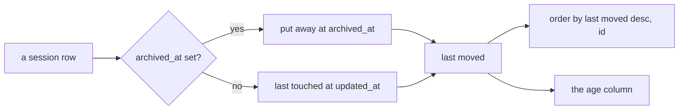
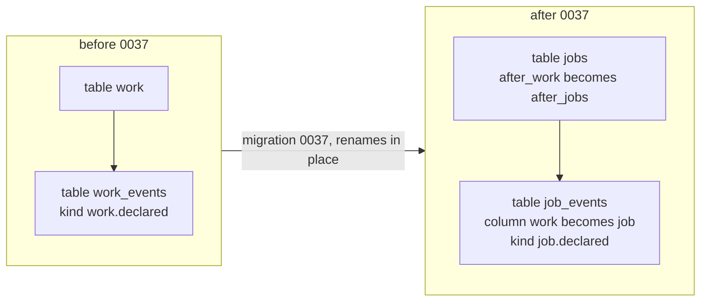
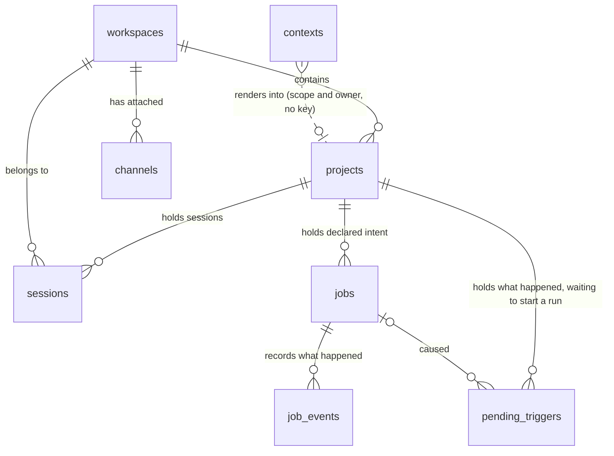

# The database

Quay Crew keeps its workspaces, projects, sessions, context and channels in Postgres, a service in
the same compose stack as everything else. This document is how to run it, how to look inside it, and what
each thing in there means.

For the design reasoning behind it, see the Storage section of `docs/ARCHITECTURE.md`. This one is
for the operator with a terminal open.

## Why there is a database at all

The control plane holds no state of its own. That is the point, and it is worth being blunt about
what would happen otherwise.

When a session runs a task, the model keeps the conversation on its own disk and hands back a handle
to it. That handle is stored as `model_session_id` on the session row, and it is the only pointer to
that conversation anywhere in the system. Lose the row and the conversation still exists, sitting in
`~/.quay/data`, unreachable forever. Nothing can reconstruct the handle.

So the database is not a cache and it is not an optimisation. It is the thing that makes a session
something you can come back to tomorrow.

There is a second implementation, `store.Memory`, which runs without a database and loses everything
on restart. It exists for tests and for a throwaway stack. Both implementations are held to the same
conformance suite in `internal/store/storetest`, so a behaviour proven against one is proven against
the other. If `QC_DATABASE_URL` is unset the control plane falls back to memory and warns on the way
up:

```
no QC_DATABASE_URL set, using the in memory store: workspaces and sessions will not survive a restart
```

If you ever see that line in `make logs`, your sessions are living on borrowed time.

## How it runs

`make up` starts it. The relevant part of `deploy/docker-compose.yml`:

- image `postgres:17-alpine`, database `quaycrew`, user `quaycrew`
- the password comes from `QC_POSTGRES_PASSWORD` and defaults to `quaycrew`, which is fine because
  of the next point and would not be anywhere else
- **no host port is published.** Nothing outside the compose network can reach it, which is why a
  weak local password costs nothing and why you inspect it with `docker exec` rather than a psql on
  your machine
- the data lives in the named volume `postgres-data`, so it outlives the containers
- there is a healthcheck, and the control plane waits on it (`condition: service_healthy`) rather
  than racing it

The control plane gets `QC_DATABASE_URL` pointed at the service by name, and applies the migrations
on the way up. Starting twice is a no op.

## Shell into it

```
docker exec -it quaycrew-postgres-1 psql -U quaycrew -d quaycrew
```

No password prompt, no port forward, no psql installed on your machine. If you renamed the compose
project with `PROJECT=...`, the container is `quaycrew-<name>-postgres-1`, and `make ps` will tell
you.

Once you are at the `quaycrew=#` prompt:

```
\dt          list the tables
\d sessions  one table's columns, indexes and foreign keys
\x auto      switch to one field per line when a row is too wide, which it will be
\timing on   show how long each query took
\q           leave
```

## What is in there

The tables an operator meets most often. Most of them are the model, one is the history, one is
bookkeeping. The crew has more: the flow engine, skills, hooks, roles and secrets each keep their own.

**`workspaces`** is the top level: a body of work with its own secrets, its own channels and its own
event log topics. It carries `id`, `name`, timestamps and `deleted_at`. Deletion is soft: a deleted
workspace disappears from every read and its rows stay, because the sessions pointing at it still
hold conversation handles.

**`projects`** sits between a workspace and its sessions: `id`, `workspace`, `name`, timestamps,
`deleted_at`. Same soft deletion for the same reason. A task runs inside a project, and the
project is where the files the model reads live.

**`sessions`** is the interesting one. Each row is a session: one conversation, running in its own
sandbox. The console calls them sessions too, and `sessions` still opens that view.

- `id` is the session's identity, and the first eight characters are what the console shows you
- `workspace` and `project` are where it sits
- `handle` is the channel's own idea of the conversation, unique per project, so a channel that
  knows only its own session identifier always lands back in the same session
- `status` is `idle` or `stopped`, and nothing else is ever written today. The console also knows how
  to colour `running` and `dispatching`, which no code sets yet
- `model_session_id` is the conversation handle described above. Empty means no task has succeeded
  yet, so there is nothing to attach to
- `permission_mode` is what that session's tasks may do without asking, `acceptEdits` by default and
  `bypassPermissions` once you press `D` in the console
- `archived_at` is set when you put a session away with `A`. Archiving hides it from the default
  listing, stops it, and closes its sandbox. It deletes nothing
- `reclaimed_at` is set when the crew took the container back on its own, which is the status
  `reclaimed`. Everything else on the row stays, so the next task builds a fresh container over the
  same conversation and carries on. It is a stamp of its own rather than a reading of `updated_at`,
  because how long a session has been reclaimed is what the archive time is measured against, and
  `updated_at` moves on every write. A task, a stop or a restart clears it. See section 11 of
  `docs/ORCHESTRATION.md`, which also says why the two times that drive it ship unset
- `label`, `title` and `description` are the three names a listing can show, read in that order.
  `label` is what the operator typed, `title` is what the session was dispatched with and is written
  only when the session is made, and `description` is the line the crew wrote about the conversation

### The order a session listing comes back in

A listing of sessions comes back last moved first, and `id` breaks a tie so two sessions that share a
moment keep one order between two reads. Last moved is `archived_at` where it is set and `updated_at`
otherwise, which is the same stamp the age column at the end of the listing shows.



The order and the column read the same field on purpose. They used to disagree: the query ordered by
`created_at desc` while the column showed this stamp, so a session made a week ago and used an hour
ago sat below one made yesterday and untouched since. A real listing of forty five sessions ran
1d, 1d, 1d, 7d, 7d, 7d, 1d, 7d down the age column, which is a column nobody can read.

Last moved is defined once, in `internal/session`, because it is a fact about a session rather than
a fact about how one is drawn or where one is kept. The store reads it to order the listing and the
surfaces read it to fill the age cell, so the order and the column cannot come apart. It sits beside
`internal/job`, which holds a job's phases the same way and for the same reason.

Both stores then write the order. Postgres orders by `coalesce(archived_at, updated_at) desc, id` and
the in memory store sorts by `sortByLastMoved` in `internal/store/store.go`. The conformance suite in
`internal/store/storetest` holds the two to the same answer.

The order is decided here and nowhere else. The console, `quay sessions` and the web page all render
this listing in the order they are given it, and none of them sorts it again: a second order would be
a second thing to keep in step with this one.

What this does not do. It does not order any other listing. Workspaces and projects still come back
by `created_at desc`, which is the stamp their own age column shows, and neither store sorts them at
all in memory. It does not change what the age column means, and it does not give an operator a way
to ask for a different order: the console's sort key is a constant per view, and on these two views it
is now unset.

**`contexts`** is the memory the model reads:
 `scope`, `owner`, `body`, timestamps, keyed on the first
two columns together. `scope` is `crew`, `workspace` or `project`, and `owner` is the workspace or
project it belongs to, empty for the crew. It has no foreign key for that reason. The `CLAUDE.md`
inside a sandbox is a rendering of this row, written when the sandbox is made and read back when
something inside has changed it, so the store is the truth and the file is a copy. `quay context`
shows it and `quay context edit` changes it.

**`channels`** is where an attached chat channel would be recorded: `id`, `workspace`, `kind`. It is
empty today, and it stays empty until the first chat channel lands. See `docs/EVENTS.md`.

**`tasks`** is the history: one row per task, carrying what was asked, what came back, the status and
when. The dispatch path writes it in the same breath as the task itself, on a context detached from
the request, so a caller that hangs up cannot lose the record of the task it was waiting on. The
projection that used to write it from the event log is retired, and this paragraph said so for
longer than it was true.

It is not disposable. It is the only copy of what a session has done, and the export to
`<workspace>.tasks` is a copy going outward rather than a source it could be rebuilt from. Its `id`
is minted where the row is written, so the same identifier travels outward on the export. See
`docs/TASKS.md` for the whole path and `docs/EVENTS.md` for the export.

**`jobs`** is declared intent: one row per job a caller asked for. It carries what the
caller declared (the title, the brief, the role and the version it was pinned to, the material it
requires of that role, the mode, what the answer must carry, what it waits for, a deadline, a budget
and its labels), what the crew assigned
(the parent, the depth and the version), and what a controller writes (the phase, the session, the
answer, the reason, the question and what it spent). The intent is a row rather than a list held in a
process, so it outlives the caller. `quay job list` and `quay job show` read it.

It also carries the lease: `lease_owner` and `lease_until`, which say which controller is holding
the job and until when. Those two are the only fields on the row a reader should ignore. They are how a
controller is made disposable: a hold that stops moving is the signal its holder went away, and the
controller that finds it reads the task record before it does anything, so an answer that already
landed is adopted rather than asked for a second time.

**`job_events`** is what happened to each job, one row per event, written in the same
transaction as the row it describes. The store is the source of truth, and an export to the log is a
copy going outward rather than a source it could be rebuilt from.

**`pending_triggers`** is the queue a flow run starts from when something happens: one row per
trigger, carrying the flow to run, the project to run it in, what the trigger carried as a payload,
the job that caused it where one did, and the claim a poller takes on it. `status` is
`pending`, `started` or `failed`, and a failed row keeps the sentence saying why on `reason`, which
is the only place that failure is ever read.

It is beside `job_events` rather than inside it, and the two look alike on purpose. An audit record
is never claimed, so marking one consumed would rewrite the history; a trigger has to be claimed
exactly once, because the claim is what stops two pollers starting two runs from one thing happening.
Nothing writes a row from outside the control plane's own process yet. See section 14 of
`docs/ORCHESTRATION.md`.

**`schema_migrations`** is one row per applied migration, with the timestamp it was applied.

### What happened to rows written before jobs were called jobs

The tables were `work` and `work_events` until migration 0037. It renames them rather than adding a
second pair, because two would then disagree and every read would have to say which one wins. A
rename carries its rows, so a job declared before the rename keeps its identifier, its phase, its
answer and its history, and reads back whole under the new name.

The kinds move with the rows: `work.declared` becomes `job.declared`, and the same for started,
answered, failed, asked, stopped, claimed and released. Leaving them reads well as an argument, since
a record says what happened at the time, and it costs the reader everything: the crew has one
vocabulary and a history that answers in two makes every consumer switch on both spellings forever.
A kind is the crew word for what happened rather than anything a person typed, so nothing somebody
wrote is being changed.



The down file reverses every step of it. The control plane never applies one: migrations are forward
only there, and a down file is for an operator going back deliberately.



## Queries worth knowing

Every session in the order the crew lists them, named by where it sits rather than by its
identifier. The order is the one described above, so this reads the way the console and
`quay sessions` read:

```sql
select w.name || '/' || p.name as address,
       substr(s.id, 1, 8) as session,
       s.status, s.permission_mode,
       s.archived_at is not null as archived,
       s.updated_at
from sessions s
join projects p on p.id = s.project
join workspaces w on w.id = s.workspace
order by coalesce(s.archived_at, s.updated_at) desc, s.id;
```

Sessions with no conversation behind them, which is what "there is nothing to attach to" looks like
from here:

```sql
select substr(id, 1, 8) as session, status, created_at
from sessions where model_session_id = '';
```

The handle itself, which is also the directory name to look for under `~/.quay/data`:

```sql
select substr(id, 1, 8) as session, model_session_id
from sessions where archived_at is null;
```

How much is in each project, including what has been put away:

```sql
select w.name || '/' || p.name as address,
       count(s.id) as sessions,
       count(s.archived_at) as archived
from workspaces w
left join projects p on p.workspace = w.id
left join sessions s on s.project = p.id
group by 1 order by 1;
```

A session's history, which is the same thing `quay task list` prints:

```sql
select occurred_at, status, left(prompt, 60) as asked, left(reply, 60) as answered
from tasks where session = '<session id>'
order by occurred_at;
```

What the model has been told, and where:

```sql
select scope, owner, length(body) as characters, updated_at
from contexts order by scope, owner;
```

## Read from psql. Do not write from it

The control plane treats these tables as its own state. An `update` or a `delete` typed at the
prompt will disagree with what the console is showing, and deleting a session row orphans a
conversation on disk permanently, because the row was the only pointer to it.

Change things through `quay` or the console, which stop the sandbox and close things down in the
right order. Use psql to look.

## Migrations

They live in `internal/store/migrations`, embedded in the binary, and `internal/store/migrate.go`
applies them.

- **Forward only.** Every unapplied `*.up.sql` runs in filename order, each inside its own
  transaction, and is recorded in `schema_migrations`. A failure rolls that one back and stops.
- **Down files are shipped, never applied automatically.** They are there for an operator to run
  deliberately. Nothing rolls back on its own.
- **Applied on every start**, which is safe because of the recorded versions. There is no separate
  migrate step to remember.

To add one, write `000N_thing.up.sql` and `000N_thing.down.sql`, then restart the stack. Give every
table `id`, `created_at` and `updated_at`, and reach for a nullable timestamp rather than a delete.

## Testing it

`internal/store/postgres_integration_test.go` runs the full conformance suite against a real
Postgres started with testcontainers, and it is behind the `integration` build tag:

```
go test -tags=integration -count=1 ./internal/store/
```

Continuous integration runs the same thing. `-count=1` matters: without it a cached pass looks
exactly like a real one.

## Backing it up, and starting over

Dump it:

```
docker exec quaycrew-postgres-1 pg_dump -U quaycrew quaycrew > quaycrew.sql
```

`make down` stops the stack and keeps the volume, so your sessions come back with `make up`.

Destroying the volume is the one command worth being careful with:

```
docker compose -p quaycrew -f deploy/docker-compose.yml down -v
```

That throws away every workspace, project and session. The conversations themselves stay on disk
under `~/.quay/data`, and without the rows there is nothing left that knows how to reach them.

---

The command outputs and shapes above were taken from a running stack (`make up` with Postgres
healthy, one workspace and its sessions created through `quay`). Reproducing them needs the stack up;
`make ps` should show `quaycrew-postgres-1` healthy before any of it will answer.
