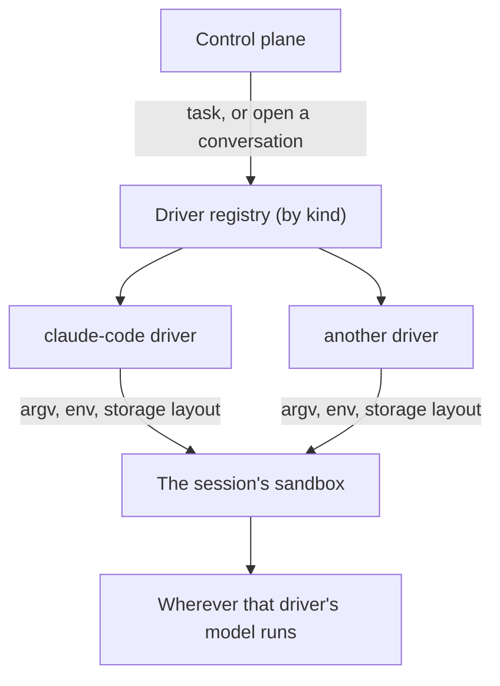

# Drivers

A system runs somebody else's agent inside its own sandbox. Today that agent is Claude Code, and the
system knows it: the flags, the stream format, the transcript path, the environment variable holding
the token, and the vocabulary of permission modes are all Claude Code's, spread across five packages.

Principle 6 in [`ARCHITECTURE.md`](ARCHITECTURE.md) says the model provider is configuration. This
document is the delta between that sentence and the code, and a plan to close it.

A **driver** is the unit: everything the system needs to know to run one agent command line tool inside
a sandbox. Its argument vectors, how to read what it says back, where it keeps a conversation, the
secret it authenticates with, and its own vocabulary for autonomy.

One property of a driver is worth stating up front because it has to be answered to somebody else. A
driver does not by itself decide where the model runs: swapping Claude Code for another vendor's
command line tool sends the code somewhere else rather than nowhere. So the driver declares where its
model runs, and the system writes that with the task, and an operator can read it off the log rather
than reason about a configuration file.

## What is already true

The headless task is behind an interface and the interactive conversation is not.

`model.Runner` in [`internal/model/model.go`](../internal/model/model.go) takes a `Request` and
returns a `Response`, and `model.NewRunner` selects an implementation by kind. That seam is real and
it works. `EchoRunner` proves it by running `echo` in a sandbox instead of a model.

Everything else leaks. Five places, and the interactive path is the worst of them because it has no
seam at all.

1. **Task arguments.** `buildArgs` in [`internal/model/claudecode.go`](../internal/model/claudecode.go)
   writes `-p`, `--output-format stream-json`, `--verbose`, `--permission-mode`, and one of
   `--session-id` or `--resume`, choosing between them on whether the runtime has opened that
   conversation, exactly as the shell script in point 3 does.
2. **Result parsing.** `parseStream` in the same file reads Claude Code's event stream, including
   where the session identifier and the cost of a task come from.
3. **The interactive conversation.** `AttachSession` in
   [`internal/controlplane/server.go`](../internal/controlplane/server.go) builds
   `tmux new-session -A -s quay open-conversation <conversation> <mode>`, and
   [`deploy/sandbox/open-conversation.sh`](../deploy/sandbox/open-conversation.sh) runs `claude` with
   `--resume`, `--session-id` and `--permission-mode`, deciding between them by looking for a
   transcript at `$HOME/.claude/projects/-home-agent-workspace/<conversation>.jsonl`. The control
   plane and a shell script in the image both hardcode one agent.
4. **Conversation storage.** [`internal/sandbox/storage.go`](../internal/sandbox/storage.go) mounts a
   directory named `claude` and finds a conversation by globbing Claude Code's project layout. That
   layout is why a conversation survives its container, and it is Claude Code's, not ours.
5. **Vocabulary.** `PermissionPlan`, `PermissionAcceptEdits` and `PermissionBypass` sit in
   [`internal/model/runner.go`](../internal/model/runner.go) under a comment saying they are the
   model's own and not ours, which is exactly right and is why they read oddly there: one agent's
   words are in the shared package. `ClaudeCodeOAuthTokenEnv` is already in the driver's own file and
   is the shape the rest of this is aiming at.

A sixth thing is worth noting and does not have to be acted on. `Runner` currently names two
unrelated interfaces: the one that runs a task, and the automation graph reducer in
[`ARCHITECTURE.md`](ARCHITECTURE.md) whose method is `Advance`. If a new interface is introduced for
the first anyway, calling it `Driver` clears the collision as a side effect, with nothing that ships
having to be renamed.

## The shape

A driver answers seven questions and nothing else. It holds no state, touches no database, and starts
no container: it is handed a sandbox and describes what to run in it, which is what makes it a table
test rather than an integration test.

- **How do I run a task?** The argument vector for a new session and for resuming one.
- **How do I read the answer?** Reply text, the session identifier to resume with, and what the task
  cost.
- **How do I open the conversation for a person?** The argument vector for an interactive terminal,
  which is the half that has no seam today.
- **How do I tell resuming from starting?** Where this agent keeps a conversation, so the sandbox can
  mount it and the open path can look for it.
- **What does it authenticate with?** A named secret, never a value, so the system binds it from its own
  store the way a skill does.
- **What autonomy words does it use?** A mapping from the system's vocabulary to this agent's, so a
  system level mode survives a change of driver.
- **Where does its model run?** One of: the operator's subscription, a vendor API, the operator's own
  cloud account, or an endpoint the operator controls. Declared, reported, and written to the event
  log with the task.

That last one is the commercial answer, not an engineering nicety. An operator who has to tell a
client where their code went can read it off the log rather than reason about a configuration file.

## What does not change

The sandbox, the event log, the store, the console and the automation graphs are all untouched. A
driver is a description of a subprocess. The permission mode concept stays exactly as it is at the
system's edge; only its values become per driver. `EchoRunner` stays as the driver with no model, which
is how the smoke test drives a real task without a subscription and how the first table tests for the
registry run.

The image already assumes what this document argues for, and does not enforce it. The Makefile builds
`deploy/sandbox/claude.Dockerfile` as `quaycrew-sandbox-claude:local`, and `deploy/env.example` pairs
`QC_SANDBOX_IMAGE` with `QC_MODEL=claude-code`. One image per driver is therefore the existing
convention rather than an open question; what is missing is that nothing checks the pair. A system
configured with one driver and another driver's image starts, runs, and fails at the first task with
whatever the missing binary says.

The skills work also removed the reason to bake driver files in at all. `sandbox.Config` now carries
`Mounts` with a `ReadOnly` flag, so a driver's own scripts can arrive the way a skill's do, mounted
read only, rather than being built into an image. That leaves the image responsible only for the
binaries a driver declares.

## Proving a seam exists

A second implementation is the only evidence that an interface is one. Two rules apply, and both come
from having been caught by their absence before.

**One conformance suite, run against every driver.** Written once, in `features/`, and executed per
registered driver. A driver that is looser than the real agent manufactures a green run, so the
suite is the contract rather than each driver's own tests.

**The suite fails when it finds no drivers**, the same way the feature suite already fails when it
finds no feature files. A registry with nothing in it must not report success.

## Delivery

Six slices, each a pull request that leaves the tree green, ordered so the risky one is last.

1. **Name the concept.** Add the `Driver` interface and a registry beside the existing `Runner`,
   with `claude-code` and `echo` registered. Nothing calls it yet. Behaviour identical.
2. **Move the task behind it.** `buildArgs` and `parseStream` become driver methods. The existing
   tests carry over unchanged, which is the check that this slice changed nothing.
3. **Move the interactive conversation behind it.** The argument vector leaves
   `server.go` and `open-conversation.sh` stops naming an agent. This is the slice that closes the
   real gap, and it is the one to mutation check hardest, because a wrong argument vector here fails
   as a terminal that opens onto nothing rather than as an error.
4. **Move storage and vocabulary.** The transcript layout, the mount name, the secret name and the
   permission mapping become driver properties. The event log starts carrying where the model ran.
5. **The conformance suite**, run against `claude-code` and `echo`, failing on an empty registry.
6. **A second real driver.** The choice is the decision below.

## Open decisions

**Which second driver.** Two candidates, and they prove different things. The Codex command line tool
is the closest in shape, so it proves the seam cheaply, and it proves nothing about the objection that
matters commercially, because the code still leaves the network. An agent that can be pointed at an
endpoint the operator controls proves the seam and the market case in the same slice, at the cost of
being less similar to what already works. The second is the one worth the extra week, and it is the
only one that makes principle 6 mean anything to a buyer.

**Whether a driver is a skill.** `internal/skill/skill.go` already declares binaries, names secrets
and ships a setup script that runs in the sandbox, and a driver needs all three. The overlap is
uncomfortably close. The difference is that a skill is a capability a task may use while a driver is
how a task happens at all, so a session with no skills still runs and a session with no driver does
not. Deciding they stay separate is defensible; deciding it without writing down why is not.

**Whether a driver and image mismatch is refused.** The pairing exists in configuration and nothing
checks it, so the failure arrives at the first task rather than at startup. Refusing it early is
cheap, and it is the same shape as `make env-check` naming configuration that the system's own file does
not have.
