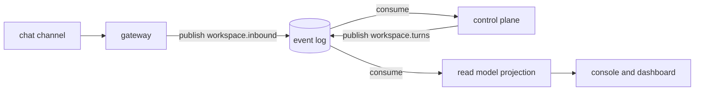

# The event log

Quay Crew runs a Kafka compatible event log, served locally by Redpanda in the same compose stack as
everything else.

Read the next section before you go looking for messages in it.

## What state it is in today

**The control plane publishes a turn to the log every time one runs**, on `<workspace>.turns`, keyed
by session so one session's events stay in order on one partition. A turn that failed is published
too, because that is the one somebody comes looking for.

**A projection consumes it.** It subscribes to `^.+\.turns$`, so a workspace created while the crew
is running is read too, and writes each record into the `turns` table. `quay turns <session>` lists a
session's history from there, and `l` on a session in the console opens the same thing as a view. The projection runs inside the control plane process for now, because
it materialises into the store that process already owns.

Delivery from a log is at least once, so the same record arrives more than once: each event carries
an id and the insert collides on it, which is what makes a replay harmless. Drop the table and the
projection rebuilds it from the beginning of the log, which is the point of the log being the write
side.

**No chat channel publishes either.** The gateway (`cmd/gateway/main.go`) is still a service skeleton
that boots telemetry and waits, so the inbound stream a channel would write to does not exist. That
work is #9 and #10, and it is blocked on a bot token rather than on code.

Publishing never fails a turn. The turn already happened by the time the record is written, so a
broker that is unreachable is logged and the record is dropped: the log is the audit record, and the
store is the source of truth. That makes the log lossy by design.

If `QC_KAFKA_SEEDS` is not set, turns run and nothing records that they did, and the status block
says `none, nothing reads or writes the log yet` rather than leaving an empty column to read as fine.

## Why an event log at all

The synchronous path does not need one. Today `quay` speaks gRPC to the control plane, the control
plane writes to Postgres and runs a turn in a sandbox, and a reply comes back down the same
connection. Adding a broker to that would be architecture for its own sake.

The log earns its place at the point where the system stops being one operator at one terminal:

- **Channels.** A message arriving from a chat channel is not a request waiting on a response. It
  arrives, it is durable, and something picks it up. If the control plane is restarting when your
  message lands, the message waits rather than vanishing.
- **Replay.** The log is the write side and the read model is a consumer of it, so a projection that
  was wrong can be rebuilt by reading the log again from the beginning.
- **Decoupling.** Each service publishes and subscribes on its own, which is what makes a second
  channel additive rather than a change to the first one.
- **Automation graphs.** The design in `docs/ARCHITECTURE.md` is a pure reducer over the event log:
  events in, decisions out, no side effects in the middle, which is only testable if the events are
  a real stream.

The intended shape, none of which is wired yet:



## How it runs

`make up` starts it. From `deploy/docker-compose.yml`:

- image `redpandadata/redpanda:v24.2.7`, started in `dev-container` mode with a single core
- two listeners: `redpanda:9092` inside the compose network, and `localhost:19092` published to your
  machine, so a tool on the host can reach the same broker
- a healthcheck that waits for the cluster to report healthy, which the gateway depends on
- data in the named volume `redpanda-data`

The gateway is given `QC_KAFKA_SEEDS=redpanda:9092`. It does not read it yet.

## Inspect it

`rpk` ships inside the Redpanda image, so there is nothing to install:

```
docker exec -it quaycrew-redpanda-1 rpk topic list      what streams exist
docker exec -it quaycrew-redpanda-1 rpk group list      who is reading, and how far behind
docker exec -it quaycrew-redpanda-1 rpk cluster health  is the broker itself well
docker exec -it quaycrew-redpanda-1 rpk cluster info    brokers and addresses
```

One turn through `quay dispatch` creates the topic and puts a record on it, so `rpk topic list` shows
`<workspace>.turns`. The topic is created by the publisher on first use rather than provisioned ahead
of time, because a workspace's stream is named after a workspace nobody knew about yet. `rpk group
list` still prints no groups, because nothing reads.

This is how you watch turns go by, live:

```
docker exec -it quaycrew-redpanda-1 rpk topic consume demo.turns
```

The value is a protobuf `TurnEvent`, so the payload reads as binary in the terminal. What is legible
without decoding is the key, which is the session identifier, and the topic it landed on.

Add `--num 5` to take a few and stop, or `--offset start` to read a topic from the beginning rather
than tailing it.

## How topics are named

`messaging.Topic(workspace, stream)` joins a workspace and a logical stream with a dot, so
`Topic("demo", "inbound")` gives `demo.inbound`. Workspaces are namespaced on one cluster, which is
what keeps two workspaces on the same broker from reading each other's traffic. Names may not
contain a dot, a slash or whitespace, so the separator stays unambiguous.

## Prove the broker works

The plumbing is easy to verify without any Quay Crew code being involved. This creates a throwaway
topic, writes one message, reads it back and cleans up:

```
docker exec -it quaycrew-redpanda-1 rpk topic create scratch
docker exec -it quaycrew-redpanda-1 sh -c 'echo hello | rpk topic produce scratch'
docker exec -it quaycrew-redpanda-1 rpk topic consume scratch --num 1
docker exec -it quaycrew-redpanda-1 rpk topic delete scratch
```

If that round trips, the broker is fine and any missing messages are missing because nothing is
sending them.

## Testing the client

`internal/messaging/kafka_integration_test.go` starts a real Redpanda with testcontainers and
publishes and consumes against it, behind the `integration` build tag:

```
go test -tags=integration -count=1 ./internal/messaging/
```

Continuous integration runs the same command across the repository. `-count=1` matters: a cached
pass and a real one are indistinguishable otherwise.

## What would turn it on

In rough order, each an open issue:

- **First chat channel inbound (#9).** The gateway consumes from a channel and publishes to
  `workspace.inbound`. Blocked on a bot token rather than on code.
- **Gated outbound delivery (#10)** and **a second channel (#11).** Replies going back out, and the
  proof that a second channel is additive.
- **Projection: materialise the read model (#17).** Turns are projected. Sandboxes, streams and
  metrics are not, and neither is anything a channel would produce.
- **Read surface for the console (#45).** Turns, sandboxes, streams and metrics, which is what the
  console needs before it can show more than the store.
- **Automation graphs (#42).** The pure reducer over the log.

Until a consumer lands, the log accumulates turns that nothing reads. That is the right order to
build it in, and it is written down here so an empty consumer group list does not read as a fault.

---

The `rpk` commands above are the ones to run; the empty listings were captured from a running stack
on 4 August 2026, before the publisher existed. That a turn reaches a real broker, creates its topic,
arrives keyed by session and decodes back into the event that was sent is proved by
`internal/controlplane/events_integration_test.go` against a real Redpanda, not by a screenshot.
Reproducing the listing yourself needs the stack up and at least one turn dispatched.
