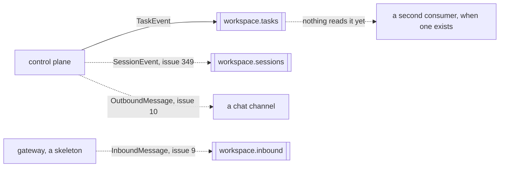
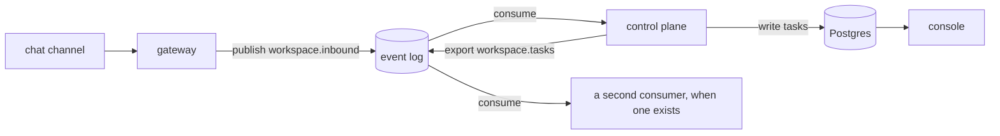

# The event log

Quay Crew runs a Kafka compatible event log, served locally by Redpanda, which starts with the rest
of the stack. It is an audit export, not the road anything travels by: history lives in Postgres,
written in the same breath as each task, and a crew with no broker loses nothing but the export.

Read the next section before you go looking for messages in it. The path one task takes, from the
moment it is dispatched to the records it leaves in the store and on the log, is in
[`TASKS.md`](TASKS.md).

## What state it is in today

**Every task is written to the store synchronously.** The dispatch path writes the redacted task
into the `tasks` table in the same breath as the task itself, on a context detached from the
request's, so a client hanging up cannot lose the record and a broker being down cannot either.
`quay tasks <session>` and `l` on a session in the console read that table.

**When an export is configured, the control plane also publishes each task to the log**, on
`<workspace>.tasks`, keyed by session so one session's events stay in order on one partition. A
task that failed is exported too, because that is the one somebody comes looking for.

**The payload is redacted before it is written anywhere.** The record carries the prompt, the reply
and the failure, and what an operator pastes into a conversation can be a credential, so all three
go through the crew's redactor first: every value the workspace keeps sealed is matched exactly and
replaced with the secret's name, the driver's token is matched for a driver session, and anything
shaped like a subscription token is caught even when the crew never held the value. A value the
crew could not know about, a password typed in that was never sealed as a secret, is stored as
typed: the log and the `tasks` table hold what was said minus what the crew can recognise, not a
guarantee that nothing sensitive was ever said.

**Nothing consumes it.** There is no projection any more: history does not travel through the log,
so nothing has to read it back. The log exists for a second consumer that is not built yet, a
dashboard, a data pipeline, another machine, and until one lands an empty consumer group list is
the expected state, not a fault.

**No chat channel publishes either.** The gateway (`cmd/gateway/main.go`) is still a service skeleton
that boots telemetry and waits, so the inbound stream a channel would write to does not exist. That
work is #9 and #10, and it is blocked on a bot token rather than on code.

Exporting never fails a task. The task already happened and the store already holds it, so a broker
that is unreachable is logged and the export record is dropped: the log is the audit copy, and the
store is the source of truth.

If `QC_KAFKA_SEEDS` is not set, history is kept in the store and nothing is exported, and the
status block says so rather than leaving an empty column to read as fine.

## What is on the log

One record kind exists.

**`<workspace>.tasks` carries a `TaskEvent`**, one per task, whether the task worked or not. The key
is the session identifier. The value is protobuf, so it reads as binary in a terminal, and it is
defined in [`../proto/quaycrew/v1/events.proto`](../proto/quaycrew/v1/events.proto), which is the
only place the shape is written down. It carries ten fields:

- `id` is the task's own identifier, and the same value as the row in the `tasks` table. That is how
  a record on the log joins back to the store, with no lookup and no guessing.
- `session`, `workspace`, `project` and `handle` say where the task ran. They are copied into every
  record on purpose, so a consumer knows what it is reading without asking the database.
- `prompt`, `reply`, `status` and `failure` are what happened, redacted as described above.
- `occurred_at` is when the task finished.

### What kinds there are

There is no `kind` field, and no `type`. One message is published, at four moments, and the only
thing that tells them apart is `status`, which is `idle` or `failed`:

- **A task worked.** `idle`, with `prompt` and `reply` filled in and `failure` empty.
- **The model did not finish.** `failed`, with `prompt` filled in, `reply` empty, and `failure`
  saying which: a refusal, a crash, a deadline the caller set, or a caller that went away.
- **The sandbox could not be made.** `failed`, with `failure` naming the sandbox and what the daemon
  said.
- **The crew restarted while the task was running.** `failed`, with no `prompt` at all, because the
  crew is settling a row it found on the way up rather than reporting a task it ran.

So a consumer reads `status`, then `failure`, and there is nothing else to branch on. That is the
whole vocabulary of the log today.

It stops being enough the moment a second record kind exists, which is
[#349](https://github.com/atlantic-blue/quay-crew/issues/349). Two messages with no discriminator
leave a consumer guessing from the topic name, so a kind field is part of that work rather than
something to add afterwards.

The key is the session rather than the task, and that is a deliberate choice. A broker keeps order
inside a partition and nowhere else, and it picks the partition from the key, so keying by session is
what makes one session's records arrive in the order they happened. Two sessions have no order
between them. [`TASKS.md`](TASKS.md) follows one of these records from the moment a task is
dispatched.

Three more streams are designed and not built:

- **`<workspace>.inbound`** is a message arriving from a chat channel, written by the gateway, which
  is still a skeleton. [#9](https://github.com/atlantic-blue/quay-crew/issues/9)
- **Outbound delivery** is a reply going back out through a channel, gated so nothing is sent
  without the operator's intent. [#10](https://github.com/atlantic-blue/quay-crew/issues/10)
- **`<workspace>.sessions`** is a session's own lifecycle: created, stopped, archived, restored, and
  the rest. Today a finished task is the only thing the crew emits, so there is nothing to watch.
  [#349](https://github.com/atlantic-blue/quay-crew/issues/349)



A solid line is built. A dotted line is not.

## Why an event log at all

The synchronous path does not need one. Today `quay` speaks gRPC to the control plane, the control
plane writes to Postgres and runs a task in a sandbox, and a reply comes back down the same
connection. Adding a broker to that would be architecture for its own sake.

The log earns its place at the point where the system stops being one operator at one terminal:

- **Channels.** A message arriving from a chat channel is not a request waiting on a response. It
  arrives, it is durable, and something picks it up. If the control plane is restarting when your
  message lands, the message waits rather than vanishing.
- **Decoupling.** Each service publishes and subscribes on its own, which is what makes a second
  channel additive rather than a change to the first one.
- **A second consumer.** A dashboard, a data pipeline or another machine reads the export without
  touching the crew's database. That consumer does not exist yet, which is exactly why the export
  is optional.

Automation graphs are deliberately not on this list: flows are a Postgres state machine, with their
transitions appended in the same transaction as the state they describe, and the log only ever gets
a copy. The decision and its reasons are in `docs/ARCHITECTURE.md`.

The intended shape, none of which is wired yet:



## How it runs

`make up` starts it, like everything else. It used to sit behind an `export` profile, on the argument
that a crew with no second consumer needs no broker; the cost of that was an export nobody had
switched on and a second command to know about. From `deploy/docker-compose.yml`:

- image `redpandadata/redpanda:v24.2.7`, started in `dev-container` mode with a single core
- two listeners: `redpanda:9092` inside the compose network, and `localhost:19092` published to your
  machine, so a tool on the host can reach the same broker
- a healthcheck that waits for the cluster to report healthy
- data in the named volume `redpanda-data`

The control plane exports when `QC_KAFKA_SEEDS` is set, and the compose file now defaults it to
`redpanda:9092`. Set it to empty in your own configuration to turn the export off, which loses
nothing: the store is the source of truth and the log only ever carried a copy.

## Inspect it

`rpk` ships inside the Redpanda image, so there is nothing to install:

```
docker exec -it quaycrew-redpanda-1 rpk topic list      what streams exist
docker exec -it quaycrew-redpanda-1 rpk group list      who is reading, and how far behind
docker exec -it quaycrew-redpanda-1 rpk cluster health  is the broker itself well
docker exec -it quaycrew-redpanda-1 rpk cluster info    brokers and addresses
```

One task through `quay dispatch` creates the topic and puts a record on it, so `rpk topic list` shows
`<workspace>.tasks`. The topic is created by the publisher on first use rather than provisioned ahead
of time, because a workspace's stream is named after a workspace nobody knew about yet. `rpk group
list` still prints no groups, because nothing reads.

This is how you watch tasks go by, live:

```
docker exec -it quaycrew-redpanda-1 rpk topic consume demo.tasks
```

The value is a protobuf `TaskEvent`, so the payload reads as binary in the terminal. What is legible
without decoding is the key, which is the session identifier, and the topic it landed on.

Add `--num 5` to take a few and stop, or `--offset start` to read a topic from the beginning rather
than tailing it.

## How topics are named

`messaging.Topic(workspace, stream)` joins a workspace and a logical stream with a dot, so
`Topic("demo", "inbound")` gives `demo.inbound`. Workspaces are namespaced on one cluster, which is
what keeps two workspaces on the same broker from reading each other's traffic. Names may not
contain a dot, a slash or whitespace, so the separator stays unambiguous.

## Prove the broker works

The plumbing is easy to verify without any Quay Crew code being involved. This creates a throwaway
topic, writes one message, reads it back and cleans up:

```
docker exec -it quaycrew-redpanda-1 rpk topic create scratch
docker exec -it quaycrew-redpanda-1 sh -c 'echo hello | rpk topic produce scratch'
docker exec -it quaycrew-redpanda-1 rpk topic consume scratch --num 1
docker exec -it quaycrew-redpanda-1 rpk topic delete scratch
```

If that round trips, the broker is fine and any missing messages are missing because nothing is
sending them.

## Testing the client

`internal/messaging/kafka_integration_test.go` starts a real Redpanda with testcontainers and
publishes and consumes against it, behind the `integration` build tag:

```
go test -tags=integration -count=1 ./internal/messaging/
```

Continuous integration runs the same command across the repository. `-count=1` matters: a cached
pass and a real one are indistinguishable otherwise.

## What would turn it on

In rough order, each an open issue:

- **First chat channel inbound (#9).** The gateway consumes from a channel and publishes to
  `workspace.inbound`. Blocked on a bot token rather than on code.
- **Gated outbound delivery (#10)** and **a second channel (#11).** Replies going back out, and the
  proof that a second channel is additive.
- **Read surface for the console (#45).** Tasks, sandboxes, streams and metrics, which is what the
  console needs before it can show more than the store.
- **A second consumer.** The first real reader of the export, whichever lands first: a dashboard, a
  pipeline, another machine.

Until a consumer lands, the export accumulates tasks that nothing reads when it is on at all. That
is the right order to build it in, and it is written down here so an empty consumer group list does
not read as a fault.

---

The `rpk` commands above are the ones to run; the empty listings were captured from a running stack
on 4 August 2026, before the publisher existed. That a task reaches a real broker, creates its topic,
arrives keyed by session and decodes back into the event that was sent is proved by
`internal/controlplane/events_integration_test.go` against a real Redpanda, not by a screenshot.
Reproducing the listing yourself needs the stack up and at least one task dispatched.
