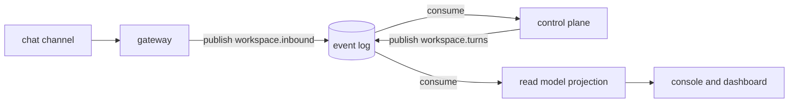

# The event log

Quay Crew runs a Kafka compatible event log, served locally by Redpanda in the same compose stack as
everything else.

Read the next section before you go looking for messages in it.

## What state it is in today

**Nothing publishes to the log and nothing consumes it.** The broker starts, it is healthy, and it
holds zero topics. That is not a fault to debug, it is the honest position of the project: the
boundary was built before the things on either end of it.

What exists:

- `internal/messaging` defines the `EventLog` interface: publish a record to a topic, consume a
  topic as a group, close.
- `messaging.Client` implements it over `franz-go`, with the producer connecting lazily so
  constructing one does not require a running broker.
- `messaging.Topic(workspace, stream)` names topics, and refuses a name with a dot, a slash or
  whitespace in it.
- Unit tests, plus an integration test that runs against a real Redpanda through testcontainers.

What does not exist:

- Any publisher. `cmd/gateway/main.go` is a service skeleton: it boots telemetry, logs one line, and
  waits for a shutdown signal.
- Any consumer. The read model projection has not been built.
- Any rows in the `channels` table, because no channel has ever been attached.

The control plane says so rather than letting an empty column read as fine. Its status block reports
the events engine as `none, nothing reads or writes the log yet`, and that string comes from the
control plane reporting an empty engine name, not from a display default.

## Why an event log at all

The synchronous path does not need one. Today `quay` speaks gRPC to the control plane, the control
plane writes to Postgres and runs a turn in a sandbox, and a reply comes back down the same
connection. Adding a broker to that would be architecture for its own sake.

The log earns its place at the point where the system stops being one operator at one terminal:

- **Channels.** A message arriving from a chat channel is not a request waiting on a response. It
  arrives, it is durable, and something picks it up. If the control plane is restarting when your
  message lands, the message waits rather than vanishing.
- **Replay.** The log is the write side and the read model is a consumer of it, so a projection that
  was wrong can be rebuilt by reading the log again from the beginning.
- **Decoupling.** Each service publishes and subscribes on its own, which is what makes a second
  channel additive rather than a change to the first one.
- **Automation graphs.** The design in `docs/ARCHITECTURE.md` is a pure reducer over the event log:
  events in, decisions out, no side effects in the middle, which is only testable if the events are
  a real stream.

The intended shape, none of which is wired yet:



## How it runs

`make up` starts it. From `deploy/docker-compose.yml`:

- image `redpandadata/redpanda:v24.2.7`, started in `dev-container` mode with a single core
- two listeners: `redpanda:9092` inside the compose network, and `localhost:19092` published to your
  machine, so a tool on the host can reach the same broker
- a healthcheck that waits for the cluster to report healthy, which the gateway depends on
- data in the named volume `redpanda-data`

The gateway is given `QC_KAFKA_SEEDS=redpanda:9092`. It does not read it yet.

## Inspect it

`rpk` ships inside the Redpanda image, so there is nothing to install:

```
docker exec -it quaycrew-redpanda-1 rpk topic list      what streams exist
docker exec -it quaycrew-redpanda-1 rpk group list      who is reading, and how far behind
docker exec -it quaycrew-redpanda-1 rpk cluster health  is the broker itself well
docker exec -it quaycrew-redpanda-1 rpk cluster info    brokers and addresses
```

On a stack today, `rpk topic list` prints its header and nothing else, and `rpk group list` prints
no groups. A healthy broker with no traffic looks exactly like this:

```
NAME  PARTITIONS  REPLICAS
```

Once there is something on the log, this is how you watch it go by:

```
docker exec -it quaycrew-redpanda-1 rpk topic consume demo.inbound
```

Add `--num 5` to take a few and stop, or `--offset start` to read a topic from the beginning rather
than tailing it.

## How topics are named

`messaging.Topic(workspace, stream)` joins a workspace and a logical stream with a dot, so
`Topic("demo", "inbound")` gives `demo.inbound`. Workspaces are namespaced on one cluster, which is
what keeps two workspaces on the same broker from reading each other's traffic. Names may not
contain a dot, a slash or whitespace, so the separator stays unambiguous.

## Prove the broker works

The plumbing is easy to verify without any Quay Crew code being involved. This creates a throwaway
topic, writes one message, reads it back and cleans up:

```
docker exec -it quaycrew-redpanda-1 rpk topic create scratch
docker exec -it quaycrew-redpanda-1 sh -c 'echo hello | rpk topic produce scratch'
docker exec -it quaycrew-redpanda-1 rpk topic consume scratch --num 1
docker exec -it quaycrew-redpanda-1 rpk topic delete scratch
```

If that round trips, the broker is fine and any missing messages are missing because nothing is
sending them.

## Testing the client

`internal/messaging/kafka_integration_test.go` starts a real Redpanda with testcontainers and
publishes and consumes against it, behind the `integration` build tag:

```
go test -tags=integration -count=1 ./internal/messaging/
```

Continuous integration runs the same command across the repository. `-count=1` matters: a cached
pass and a real one are indistinguishable otherwise.

## What would turn it on

In rough order, each an open issue:

- **First chat channel inbound (#9).** The gateway consumes from a channel and publishes to
  `workspace.inbound`. This is the smallest change that puts a real message on the log.
- **Gated outbound delivery (#10)** and **a second channel (#11).** Replies going back out, and the
  proof that a second channel is additive.
- **Projection: materialise the read model (#17).** The first consumer, and the thing that makes the
  log the write side rather than a queue.
- **Read surface for the console (#45).** Turns, sandboxes, streams and metrics, which is what the
  console needs before it can show more than the store.
- **Automation graphs (#42).** The pure reducer over the log.

Until at least the first of those lands, the broker in your stack is a placeholder that costs memory
and returns nothing. That is a deliberate ordering choice, not an oversight, and it is written down
here so nobody spends an evening debugging an empty topic list.

---

The outputs above were captured from a running stack (`make up`, Redpanda healthy, no topics). The
empty listing reproduces on any stack where nothing has published; once #9 lands it will not, and
this section should change with it.
