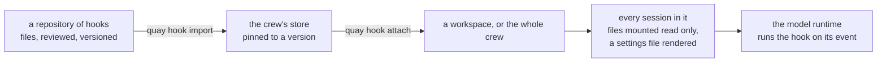
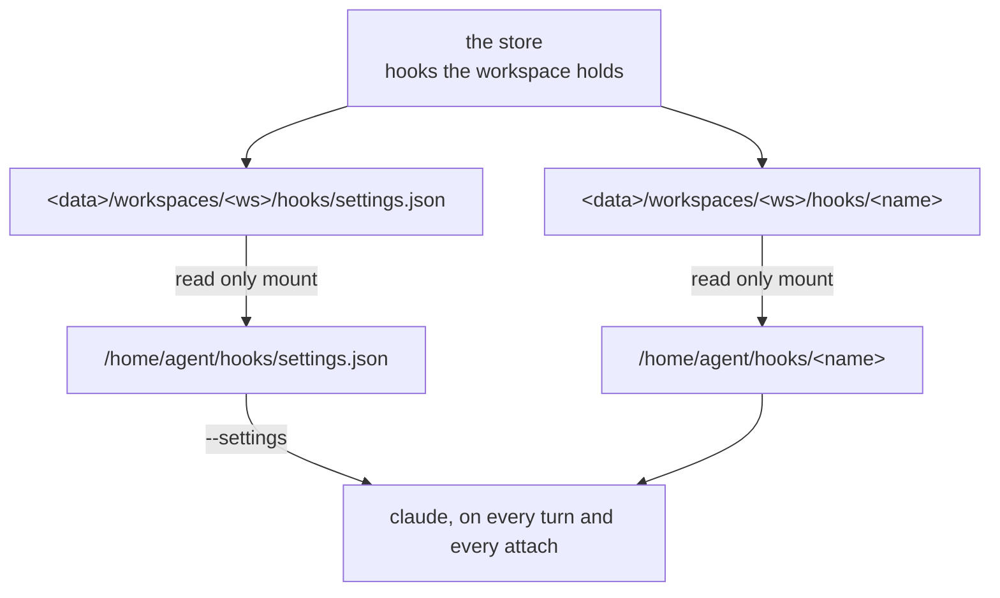

# Hooks

A crew gives every session its rules as context. Context is advice, and the model decides whether to
take it.

The evidence is one working session on 13 August 2026. The crew context held 100 kilobytes of rules.
The session broke three of them. It did not break the one about committing without approval, because
that one is not advice on the operator's machine: a hook refused the command and named how to ask.

A quay sandbox has no such gate. So the rule that matters most is the rule nothing checks.

## What a hook is, and is not

A hook is a constraint: what a session **may not** do, checked at the moment it tries, able to refuse
and say what to do instead. It can also add to what the session was told, which is the same machinery
pointed the other way.

Three entities, and keeping them apart is the useful part:

- A **skill** is a capability. What a session **can** do, and what it needs to do it. Passive.
  Nothing happens because a skill exists. Designed in [`SKILLS.md`](SKILLS.md).
- A **workflow** is a plan. What **should** happen, in what order, on what trigger. It has control
  flow, state, and a run that survives a restart. Designed in [`ARCHITECTURE.md`](ARCHITECTURE.md).
- A **hook** is a constraint. It has no run and no state. It fires, decides, returns, and nothing of
  it survives. It cannot choose what happens next; it can only allow, refuse, or add context to the
  thing already about to happen.

A hook is triggered by the session's own tool use. A workflow is triggered by a schedule or by the
operator. Fold a hook into a workflow and a constraint gains control flow, which means the thing that
decides whether an action is allowed can now take actions of its own.

**A hook is not in the model's context.** A skill's brief is prose the model reads. A hook is
invisible until it fires. That is the point: moving a checkable rule out of the context shrinks the
prompt, and a shorter prompt is followed more closely, so the advice that remains gets stronger.

## Where a hook lives

The same three layers as a skill, for the same reasons, and this is deliberate rather than
convenient. A hook was once built as `quay hook <name>`, compiled into the command line tool. That
made it impossible to write a hook for one workspace, impossible to change one without releasing the
tool, and impossible to hand one to another crew.



**Files are the authoring format**, so a hook is code somebody reviews and versions. **The store is
the runtime**, so a crew on a pod still has its hooks and a hook cannot change under a session using
it. **The sandbox gets files again**, because the thing that runs a hook takes a path to an
executable.

## The shape of a hook

```
hooks/prompt-analyser/
  hook.yaml         what it is, and what event it fires on
  bin/hook          the executable the runtime calls, built rather than committed
  go.mod            its own module, because a hook is not part of the crew
  *.go              the source, beside the thing it builds
  hook.config.json  what it reads, so the paths are not compiled in
```

The entry point is built by `make hooks` and by the image build, and it is not in the history. A hook
is an executable, an executable is a build artifact, and one committed binary would run on one
processor type: this repository's image is built on both arm and amd machines.

`hook.yaml` is data. No expressions, no conditionals, nothing that runs on the host.

```yaml
name: prompt-analyser
version: 1
summary: Reads every message and hands the session a short brief beside it.
events:
  - on: UserPromptSubmit
    entry: bin/hook
    timeoutSeconds: 20
binaries:
  - claude
secrets: {}
```

### The fields

`name` is what it is called and the directory it lives in. Lowercase letters, digits and dashes only,
because it is also a directory name inside a sandbox.

`version` is an integer of 1 or more. A session is pinned to the version it started with, so editing
a hook never changes one that is already running.

`summary` is one line of at most 200 bytes. It is what a listing shows. Unlike a skill's summary, no
session pays for it, because a hook is not in the context.

`events` is one or more bindings, and a hook with none does nothing. Each binding has:

- `on`, the event name, which must be one the runtime actually raises: `PreToolUse`, `PostToolUse`,
  `UserPromptSubmit`, `Stop`, `SubagentStop`, `SessionStart`, `SessionEnd`, `Notification` or
  `PreCompact`. An unknown name is refused rather than accepted and never fired, because a hook that
  is quietly never called looks exactly like a hook that approves of everything.
- `matcher`, which tools this fires for, as the runtime's pattern, for example `Bash` or
  `Write|Edit`. Empty means every tool. It is refused on any event that is not `PreToolUse` or
  `PostToolUse`, because a matcher there is a mistake that silently does nothing.
- `entry`, the executable to run, relative to the hook's own directory. It has to be a file the hook
  actually carries, and it has to be executable. A hook whose entry point arrives without its
  executable bit fails inside a container with nothing pointing back at the import.
- `timeoutSeconds`, how long the runtime waits. Zero means the runtime's own default.

`binaries` are the commands the hook cannot work without, declared so a session missing one is
refused with a sentence rather than discovering it halfway through. The same rule a skill uses.

`secrets` names workspace secrets by name, never by value, with a line saying what each is for. A
name starting `QC_` or `CLAUDE_` is refused: those are the crew's own.

## How a hook reaches a sandbox

Two things land, and neither is baked into the image.

**The files** are mounted read only at `/home/agent/hooks/<name>`, out of the workspace's own
directory on the host, exactly as a skill's files are mounted at `/home/agent/skills/<name>`.

**A settings file** is rendered to `/home/agent/hooks/settings.json`, listing every held hook against
its event. Every invocation of the model is given `--settings /home/agent/hooks/settings.json`.

The settings file is a separate file the crew owns entirely, rather than `/home/agent/.claude/settings.json`,
and that is the one non obvious decision here. `/home/agent/.claude` is the workspace's conversation
directory, bind mounted from the host, written by the runtime and editable by the operator. Rendering
the crew's hooks into it would mean merging with whatever else is in there on every turn, and losing
an operator's edit the first time the merge is wrong. `--settings` loads additional settings, so the
operator's own file still applies and the crew's file is never a place anybody else writes.



Both the turn and an attached conversation get the flag. A hook that guards commits and only runs on
dispatched turns is a hook the operator walks around by opening the conversation.

## What a hook deliberately does not do

- **It holds no state.** Nothing survives a firing. A constraint that remembers is a workflow.
- **It does not choose what happens next.** Allow, refuse, or add context to the thing about to
  happen. Nothing else.
- **It is not given to the model to read.** A hook that has to be explained in the prompt to work is
  advice with extra steps.
- **It cannot ask for the crew's own secrets.** `QC_` and `CLAUDE_` are refused at validation, the
  same rule a skill lives under.

## The first hooks

Each one is a rule the crew already carries and nothing checks. The analyser comes first because it
only adds context and can never wrongly refuse.

- **prompt-analyser.** Reads the message, asks a small model to restate it, and hands the session
  both. Adds context, never refuses.
- Refuse a `git commit`, a `git push`, a pull request creation or a merge without approval, and name
  how to approve it.
- Refuse `git add .` and `git add -A`, and name the form that stages files by name.
- Refuse a force push and any history rewrite.
- Check the commit message format, and refuse an attribution line.

A hook that refuses wrongly blocks the work and costs the operator an interruption, which is worse
than no hook. A rule stays advice until its check is exact.

## What is not settled

Hooks, skills and documents are three instances of one shape: files the crew holds, pinned to a
version, attached at a level, rendered into a sandbox. They do not share machinery today. Whether
they should is a real question and it is open, recorded here rather than answered by building the
third one the same way and calling it a pattern.

A hook is a compiled executable, so what it was written in is its own business and the sandbox does
not need a runtime for it. The one shipped here is Go, built to a static binary, which is why its
`binaries` list names only the commands it shells out to. That says what a hook may be written in. It
says nothing about where a hook lives.

The layout is the crew's own and predates the Claude Code plugin format, which is
`.claude-plugin/plugin.json` beside a `hooks/hooks.json` that resolves paths through
`${CLAUDE_PLUGIN_ROOT}`. Whether to move onto it is open, and it is the same question as the one
above about skills, hooks and documents sharing machinery.
