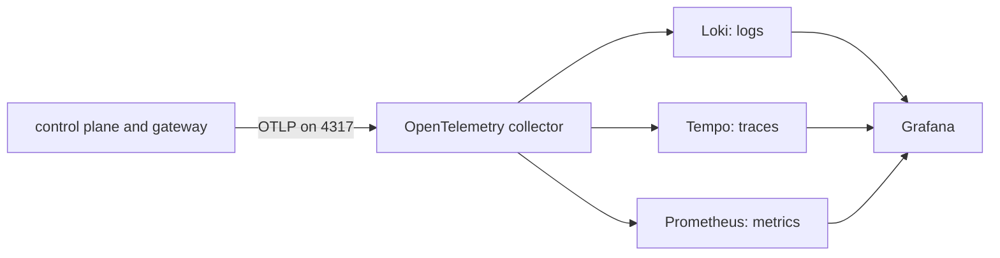

# Observability

Quay Crew is meant to be fully auditable and observable: structured logs, an audit stream,
distributed traces, and metrics including token spend, all through OpenTelemetry into Grafana, Loki,
Tempo and Prometheus.

That is the design. This document is about the difference between it and what your stack does today,
because the gap is large and nothing on screen tells you about it.

## What state it is in today

Three signals, in three different conditions.

**Logs are real, and every line carries the call it happened under.** Every service logs structured
JSON to its own stdout through `internal/logging`, from the first line. `make logs` follows all of
them and `docker logs quaycrew-controlplane-1` gives you one. This is the signal that actually
works, and it is the one worth reaching for when something is wrong.

Each line carries `service`, and a line written while a call is being served also carries
`correlation_id`. That id is the trace id, not a second identifier beside it, so filtering the logs
by it and opening the trace are the same question asked twice.

Two things about the shape are worth knowing. A line only carries the id when the call site logs
with a context, so `slog.WarnContext(ctx, ...)` rather than `slog.Warn(...)`. And the id survives
`context.WithoutCancel`, which is what a turn and a flow run detach with, so the interesting half of
a turn is correlated to the dispatch that started it rather than orphaned.

**Traces exist for inbound calls.** `telemetry.ServerOptions` puts an OpenTelemetry stats handler on
the control plane's gRPC server, so every message it serves runs in a span and the exporter has
something to export. It is a stats handler rather than an interceptor because a stats handler runs
first: a call refused by the crew's token guard is traced too, which is the call somebody is most
likely to come looking for.

Nothing else is traced yet. There is no span around a turn, a sandbox or the model, and the command
line tool starts no trace of its own, so a trace today covers the crew's own handling of one message
and stops there.

**Metrics do not exist.** A meter provider is set up and no instrument is ever created.

**The collector forwards traces and metrics, and still discards logs.** `deploy/otel-collector.yaml`
sends traces to Tempo and republishes metrics for Prometheus to scrape, keeping the `debug` exporter
beside both so the collector's own log stays the fastest way to see whether anything is arriving. The
logs pipeline is still `debug` only, because the services log to their own stdout and nothing
forwards it.

**The telemetry stack is not running by default.** Grafana, Loki, Tempo and Prometheus are in the
compose file behind the `observability` profile, so `make up` does not start them.
`make up-observability` does, and it comes up joined: Grafana's data sources are provisioned from
`deploy/grafana/datasources.yaml` rather than added by hand.

With the profile off there is nowhere to forward to, so the collector drops each batch of traces and
says so once. The queue and the retry are turned off for exactly this reason, so a crew running
without the profile makes one line per batch instead of holding them and retrying forever.

You can confirm the whole picture in one command. On a stack that has been up and serving:

```
docker logs quaycrew-otel-collector-1 2>&1 | grep -c "ResourceSpans"
```

That count grows as you use `quay`, because the collector's debug exporter summarises every batch it
receives. Swap `ResourceSpans` for `ResourceMetrics` and it stays at `0`, because nothing creates an
instrument.

## Why it is worth building anyway

The logs answer "what did the control plane do". The three things they cannot answer are the reason
the rest of this exists.

- **What did one task cost.** Tokens, and money. This is the number that decides whether a crew of
  agents is a tool or a hobby, and it is per task, per session, per workspace. Issue #16.
- **Where did a request go.** A task crosses the command line tool, the control plane, a sandbox
  container and the model. When it hangs, the interesting question is which of those it is sitting
  in, and a log line in each cannot tell you that. One trace can.
- **What happened, in order, later.** An audit stream is not the same as logs on a container's
  stdout, which are gone when the container is replaced. This is what the event log is for, and
  `docs/EVENTS.md` covers why it is empty.

The intended pipeline, none of which carries data yet:



## What you can actually look at today

Follow everything:

```
make logs
```

One service, which is usually what you want:

```
docker logs -f quaycrew-controlplane-1
```

The lines are JSON, so `jq` is worth it. Errors only:

```
docker logs quaycrew-controlplane-1 2>&1 | jq -R 'fromjson? | select(.level == "ERROR")'
```

Two lines to look for on the way up, because each one means a whole capability is off:

- `no QC_DATABASE_URL set, using the in memory store` means workspaces and sessions will not survive
  a restart. See `docs/DATABASE.md`.
- `no QC_DATA_DIR set` means a conversation lives inside its container and dies with it.

For anything historical, the database is the real audit trail today: it holds every session, its
status, when it was created and last updated, and whether it was archived. `docs/DATABASE.md` has the
queries.

## Running the telemetry stack

```
make up-observability
```

That starts Grafana, Loki, Tempo and Prometheus alongside the core stack. Grafana is on
`http://localhost:3000` with anonymous access as an admin, so there is no login, and Prometheus is on
`http://localhost:9090`.

The shortest way to see it working, from a cold start:

```
make up-observability
quay dispatch <workspace>/<project> "remember the number"
```

Then open `http://localhost:3000`, choose Explore, pick Tempo and search. The turn is one span, named
`quaycrew.v1.ControlPlaneService/Dispatch`. Take the trace id and grep the control plane's log for it
and you have every line that call wrote.

All four containers start and stay up. Loki and Tempo are configured from `deploy/loki.yaml` and
`deploy/tempo.yaml`, kept in this repository rather than left to whatever the image happens to ship,
and both report `ready` on their own health endpoints. Tempo used to exit on startup because it was
pointed at a config file that did not exist; `deploy/compose_test.go` now refuses any service in the
stack that names a config file nobody provides.

Two things to know before you spend time in there:

- **Tempo holds traces.** Dispatch a turn, open Grafana, pick the Tempo data source and search. The
  span is named for the gRPC method the crew served.
- **Prometheus scrapes the collector and finds an empty set**, because nothing creates a metric
  instrument. The path is connected and there is nothing on it. That is issue 16.
- **Loki holds nothing.** The services log structured JSON to their own stdout and no pipeline
  forwards it, so the data source is provisioned and empty. That is the rest of issue 12.
- **There are no dashboards.** The data sources are provisioned; what you build on them is not.

So one of the three signals is real end to end, and the document says which.

## What would task it on

In this order, because each step is pointless without the one above it.

1. ~~**Create spans (#3).**~~ Done: inbound calls are traced and every log line carries the
   correlation id. What is left of #3 is the audit event carrying the trace id, so a turn in the
   `turns` table joins to the trace that ran it.
2. **Give the collector somewhere to send it (#12).** Mostly done: traces reach Tempo, Prometheus
   scrapes the collector, and Grafana's three data sources are provisioned as code. What is left is
   the logs pipeline, which needs the services' stdout collected into Loki, and the derived field
   that turns a `correlation_id` in a Loki line into a link to the trace.
3. **Token, cost and resource metrics (#16).** The number that makes the rest worth having. The
   model runner already calls the command line tool with `--output-format stream-json`, and that
   stream carries the token usage the crew currently reads past.

## Checking whether it is working

The same command from the top of this document is the fastest signal, because the collector's debug
exporter prints a summary of every batch it receives:

```
docker logs quaycrew-otel-collector-1 2>&1 | grep -c "ResourceSpans"
```

Zero after a dispatch means the control plane is not exporting, so check `QC_OTEL_ENDPOINT` reaches
the collector. A number that grows means the crew is exporting, and the next question is whether the
collector delivered it, which the same log answers: an export that failed says so on the line after.

The other half is the correlation id. Take one from a log line and you have the trace it belongs to:

```
docker logs quaycrew-controlplane-1 2>&1 | jq -R 'fromjson? | select(.correlation_id)'
```

---

The health endpoint results above were captured from a running stack on 4 August 2026, and the four
observability services have not changed since.

That inbound calls are traced, that a refused call is traced too, and that a log line written inside
a turn carries the trace id of the dispatch that started it are proved by `features/observability.feature`
against the real gRPC interface, not by a screenshot.

That the four telemetry containers agree with each other about names and ports is proved by
`deploy/telemetry_test.go`, which reads the collector, Prometheus, Grafana and compose files and
refuses a host that is not a service or a scrape port that is not the one the collector publishes on.

Neither of those is the same as having watched it work. Every command in this document that starts
`docker` is a reproduction step and not a captured result: this change was made and gated in an
environment with no container runtime. Run `make up-observability`, dispatch a turn, and the Tempo
search above is the check.
