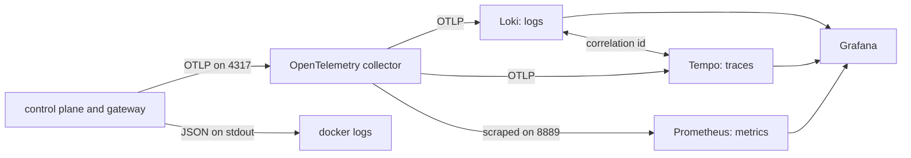

# Observability

Quay Crew is meant to be fully auditable and observable: structured logs, an audit stream,
distributed traces, and metrics including token spend, all through OpenTelemetry into Grafana, Loki,
Tempo and Prometheus.

That is the design. This document is about the difference between it and what your stack does today,
because the gap is large and nothing on screen tells you about it.

## What state it is in today

Three signals, in three different conditions.

**Logs are real, and every line carries the call it happened under.** Every service logs structured
JSON to its own stdout through `internal/logging`, from the first line. `make logs` follows all of
them and `docker logs quaycrew-controlplane-1` gives you one. This is the signal that actually
works, and it is the one worth reaching for when something is wrong.

Each line also goes to the collector, and from there to Loki. That is a copy and not a move: stdout
keeps carrying every line, because stdout is what you read when the collector is the broken thing.
The first line each service writes goes to stdout only, because it is written before the exporter
exists.

Each line carries `service`, and a line written while a call is being served also carries
`correlation_id`. That id is the trace id, not a second identifier beside it, so filtering the logs
by it and opening the trace are the same question asked twice.

Two things about the shape are worth knowing. A line only carries the id when the call site logs
with a context, so `slog.WarnContext(ctx, ...)` rather than `slog.Warn(...)`. And the id survives
`context.WithoutCancel`, which is what a task detaches with, so the interesting half of
a task is correlated to the dispatch that started it rather than orphaned.

**Traces exist for inbound calls.** `telemetry.ServerOptions` puts an OpenTelemetry stats handler on
the control plane's gRPC server, so every message it serves runs in a span and the exporter has
something to export. It is a stats handler rather than an interceptor because a stats handler runs
first: a call refused by the crew's token guard is traced too, which is the call somebody is most
likely to come looking for.

Nothing else is traced yet. There is no span around a task, a sandbox or the model, and the command
line tool starts no trace of its own, so a trace today covers the crew's own handling of one message
and stops there.

**Metrics carry what tasks cost.** Three instruments, published by the control plane after every
task:

- `quaycrew.tasks`, tasks run
- `quaycrew.tokens`, tokens spent, split by `kind` into input, output, cache read and cache written
- `quaycrew.cost.usd`, what those tasks would cost at published prices

Each carries `workspace`, `project`, `model` and `status`, by name rather than by identifier, because
nobody groups a cost dashboard by a uuid.

Two things to read carefully. The cost is not a charge anybody receives: the crew runs under a
subscription, and this is the model's own tooling pricing the task at published rates, which is the
number that says whether a crew of agents is affordable. And a task whose backend reported nothing
contributes to `quaycrew.tasks` and to neither of the others, so an unknown never reads as a zero.

Nothing else is measured. There is no host metric, no per session process usage, no GPU metric, and
no cost ceiling alert. A task that failed is counted with `status="failed"` and contributes no
tokens, because a failed task returns nothing to read them from.

**The collector forwards all three signals.** `deploy/otel-collector.yaml` sends traces to Tempo and
logs to Loki, and republishes metrics for Prometheus to scrape. The `debug` exporter stays beside
each of them, so the collector's own log is still the fastest way to see whether anything is arriving
at all.

**The telemetry stack starts with everything else.** `make up` brings up Grafana, Loki, Tempo and
Prometheus alongside the services, and it comes up joined: Grafana's data sources are provisioned
from `deploy/grafana/datasources.yaml` rather than added by hand.

These four used to sit behind an `observability` profile, so a plain `make up` gave you a crew you
could not see and a second command to remember. A signal nobody starts is a signal nobody has, so
there is no second command now. `make up-observability` still works and says it is the same thing.
`deploy/telemetry_test.go` refuses any service that goes back behind a profile.

The collector keeps its queue and its retry, so a batch that arrives while a store is still coming up
is held and delivered rather than dropped. Those were off while the four were behind a profile,
because there was nothing to deliver to.

You can confirm the whole picture in one command. On a stack that has been up and serving:

```
docker logs quaycrew-otel-collector-1 2>&1 | grep -c "ResourceSpans"
```

That count grows as you use `quay`, because the collector's debug exporter summarises every batch it
receives. Swap `ResourceSpans` for `ResourceMetrics` and it stays at `0`, because nothing creates an
instrument.

## Why it is worth building anyway

The logs answer "what did the control plane do". The three things they cannot answer are the reason
the rest of this exists.

- **What did one task cost.** Tokens, and money. This is the number that decides whether a crew of
  agents is a tool or a hobby, and it is per task, per session, per workspace. Issue #16.
- **Where did a request go.** A task crosses the command line tool, the control plane, a sandbox
  container and the model. When it hangs, the interesting question is which of those it is sitting
  in, and a log line in each cannot tell you that. One trace can.
- **What happened, in order, later.** An audit stream is not the same as logs on a container's
  stdout, which are gone when the container is replaced. This is what the event log is for, and
  `docs/EVENTS.md` covers why it is empty.

The pipeline. All three signals carry data:



## What you can actually look at today

Follow everything:

```
make logs
```

One service, which is usually what you want:

```
docker logs -f quaycrew-controlplane-1
```

The lines are JSON, so `jq` is worth it. Errors only:

```
docker logs quaycrew-controlplane-1 2>&1 | jq -R 'fromjson? | select(.level == "ERROR")'
```

Two lines to look for on the way up, because each one means a whole capability is off:

- `no QC_DATABASE_URL set, using the in memory store` means workspaces and sessions will not survive
  a restart. See `docs/DATABASE.md`.
- `no QC_DATA_DIR set` means a conversation lives inside its container and dies with it.

For anything historical, the database is the real audit trail today: it holds every session, its
status, when it was created and last updated, and whether it was archived. `docs/DATABASE.md` has the
queries.

## Running the telemetry stack

```
make up
```

That starts Grafana, Loki, Tempo and Prometheus with everything else. Grafana is on
`http://localhost:3000` with anonymous access as an admin, so there is no login, and Prometheus is on
`http://localhost:9090`.

The shortest way to see it working, from a cold start:

```
make up
quay ask <workspace>/<project> "remember the number"
```

Then open `http://localhost:3000`, choose Explore, pick Tempo and search. The task is one span, named
`quaycrew.v1.ControlPlaneService/Dispatch`. Open it and Grafana offers the log lines that call wrote.

Going the other way, pick Loki and query `{service_name="controlplane"}`. Any line carrying a
correlation id has an Open the trace link on it.

All four containers start and stay up. Loki and Tempo are configured from `deploy/loki.yaml` and
`deploy/tempo.yaml`, kept in this repository rather than left to whatever the image happens to ship,
and both report `ready` on their own health endpoints. Tempo used to exit on startup because it was
pointed at a config file that did not exist; `deploy/compose_test.go` now refuses any service in the
stack that names a config file nobody provides.

Two things to know before you spend time in there:

- **Tempo holds traces.** Dispatch a task, open Grafana, pick the Tempo data source and search. The
  span is named for the gRPC method the crew served.
- **Prometheus holds what tasks cost.** `sum by (workspace) (quaycrew_cost_usd_total)` is what each
  piece of work has cost, and `sum by (kind) (quaycrew_tokens_total)` is where the tokens went. The
  cache read figure is normally the largest by far.
- **Loki holds the crew's log lines**, and a line carrying a correlation id has a link on it that
  opens the trace. The link works the other way too: from a span, Grafana offers the log lines that
  call wrote.
- **There are no dashboards and no alerts.** The data sources are provisioned; what you build on
  them is not, and there is no cost ceiling that fires.

So all three signals are real end to end, and what is left is what you make of them.

## What would switch it on

In this order, because each step is pointless without the one above it.

1. ~~**Create spans (#3).**~~ Done: inbound calls are traced and every log line carries the
   correlation id. What is left of #3 is the audit event carrying the trace id, so a task in the
   `tasks` table joins to the trace that ran it.
2. ~~**Give the collector somewhere to send it (#12).**~~ Done: traces reach Tempo, logs reach Loki,
   Prometheus scrapes the collector, Grafana's three data sources are provisioned as code, and a log
   line and its trace link to each other. What is left of #12 is dashboards and alerts as code, which
   is worth doing once there is a metric worth putting on one.
3. ~~**Token and cost metrics (#16).**~~ Done: every task publishes its tokens and what they would
   cost, by workspace, project and model. What is left of #16 is the rest of its list, none of which
   is built: a cost ceiling alert, host metrics, per session process usage, GPU metrics, and the
   dashboards to put any of it on.

The one piece of #3 still open is the audit record. A task in the `tasks` table carries no trace id,
so history and traces cannot be joined the way logs and traces now can.

## Asking the crew whether it can start work

The control plane serves the standard gRPC health check, and answering it writes rather than reads:
a row in the store, and a record on the event log. Both are writes a dispatch makes before a sandbox
is ever asked for, so a crew that answers every listing and starts nothing fails this check. That is
the state issue 400 describes, and reading alone agreed the crew was well for an hour.

The stack asks it every thirty seconds. The image carries no shell, so the check is the service
binary in its other mode:

```
docker inspect --format '{{.State.Health.Status}}' quaycrew-controlplane-1
docker exec quaycrew-controlplane-1 /service health
```

`serving` on standard output and an exit status of zero is a crew that can write. Anything else
exits non zero, and the control plane's own log says which of the two writes did not land.

## Checking whether it is working

The same command from the top of this document is the fastest signal, because the collector's debug
exporter prints a summary of every batch it receives:

```
docker logs quaycrew-otel-collector-1 2>&1 | grep -c "ResourceSpans"
```

Zero after a dispatch means the control plane is not exporting, so check `QC_OTEL_ENDPOINT` reaches
the collector. A number that grows means the crew is exporting, and the next question is whether the
collector delivered it, which the same log answers: an export that failed says so on the line after.

The other half is the correlation id. Take one from a log line and you have the trace it belongs to:

```
docker logs quaycrew-controlplane-1 2>&1 | jq -R 'fromjson? | select(.correlation_id)'
```

---

The health endpoint results above were captured from a running stack on 4 August 2026, and the four
observability services have not changed since.

That inbound calls are traced, that a refused call is traced too, and that a log line written inside
a task carries the trace id of the dispatch that started it are proved by `features/observability.feature`
against the real gRPC interface, not by a screenshot.

That the four telemetry containers agree with each other about names and ports is proved by
`deploy/telemetry_test.go`, which reads the collector, Prometheus, Grafana and compose files and
refuses a host that is not a service or a scrape port that is not the one the collector publishes on.

Neither of those is the same as having watched it work. Every command in this document that starts
`docker` is a reproduction step and not a captured result: this change was made and gated in an
environment with no container runtime. Run `make up`, dispatch a task, and the Tempo
search above is the check.
