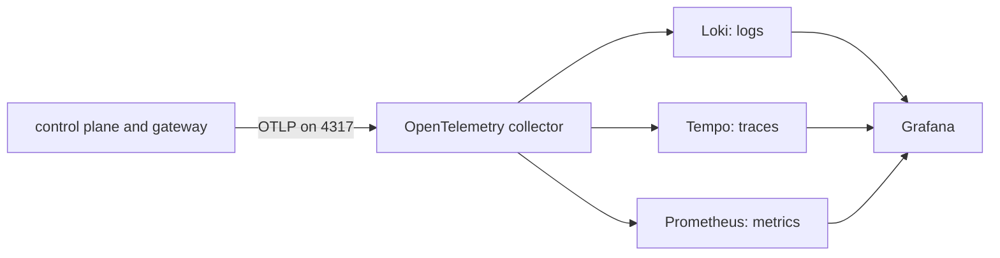

# Observability

Quay Crew is meant to be fully auditable and observable: structured logs, an audit stream,
distributed traces, and metrics including token spend, all through OpenTelemetry into Grafana, Loki,
Tempo and Prometheus.

That is the design. This document is about the difference between it and what your stack does today,
because the gap is large and nothing on screen tells you about it.

## What state it is in today

Three signals, in three different conditions.

**Logs are real.** Every service logs structured JSON to its own stdout through `slog`, from the
first line. `make logs` follows all of them and `docker logs quaycrew-controlplane-1` gives you one.
This is the signal that actually works, and it is the one worth reaching for when something is
wrong.

**Traces do not exist.** `telemetry.Init` builds a tracer provider and an OTLP exporter, and both
services call it on startup. Nothing then creates a span. There is no gRPC interceptor on the server,
no `otel.Tracer(...).Start(...)` anywhere in the codebase, so the exporter has nothing to export.
This is not a collector problem or a configuration problem. There are no spans.

**Metrics do not exist either**, for the same reason: a meter provider is set up and no instrument is
ever created.

**The collector receives and discards.** `deploy/otel-collector.yaml` has one exporter, `debug`, on
all three pipelines. Anything that did arrive would be summarised into the collector's own stdout and
dropped. Nothing is forwarded to Loki, Tempo or Prometheus, and the file says so in a comment.

**The telemetry stack is not running.** Grafana, Loki, Tempo and Prometheus are in the compose file
behind the `observability` profile, so `make up` does not start them. `make up-observability` does,
with the caveats in the next section.

You can confirm the whole picture in one command. On a stack that has been up and serving:

```
docker logs quaycrew-otel-collector-1 2>&1 | grep -c "ResourceSpans\|ResourceMetrics"
```

It prints `0`. Every time, so far.

## Why it is worth building anyway

The logs answer "what did the control plane do". The three things they cannot answer are the reason
the rest of this exists.

- **What did one turn cost.** Tokens, and money. This is the number that decides whether a crew of
  agents is a tool or a hobby, and it is per turn, per thread, per workspace. Issue #16.
- **Where did a request go.** A turn crosses the command line tool, the control plane, a sandbox
  container and the model. When it hangs, the interesting question is which of those it is sitting
  in, and a log line in each cannot tell you that. One trace can.
- **What happened, in order, later.** An audit stream is not the same as logs on a container's
  stdout, which are gone when the container is replaced. This is what the event log is for, and
  `docs/EVENTS.md` covers why it is empty.

The intended pipeline, none of which carries data yet:



## What you can actually look at today

Follow everything:

```
make logs
```

One service, which is usually what you want:

```
docker logs -f quaycrew-controlplane-1
```

The lines are JSON, so `jq` is worth it. Errors only:

```
docker logs quaycrew-controlplane-1 2>&1 | jq -R 'fromjson? | select(.level == "ERROR")'
```

Two lines to look for on the way up, because each one means a whole capability is off:

- `no QC_DATABASE_URL set, using the in memory store` means workspaces and sessions will not survive
  a restart. See `docs/DATABASE.md`.
- `no QC_DATA_DIR set` means a conversation lives inside its container and dies with it.

For anything historical, the database is the real audit trail today: it holds every session, its
status, when it was created and last updated, and whether it was archived. `docs/DATABASE.md` has the
queries.

## Running the telemetry stack

```
make up-observability
```

That starts Grafana, Loki, Tempo and Prometheus alongside the core stack. Grafana is on
`http://localhost:3000` with anonymous access as an admin, so there is no login.

All four containers start and stay up. Loki and Tempo are configured from `deploy/loki.yaml` and
`deploy/tempo.yaml`, kept in this repository rather than left to whatever the image happens to ship,
and both report `ready` on their own health endpoints. Tempo used to exit on startup because it was
pointed at a config file that did not exist; `deploy/compose_test.go` now refuses any service in the
stack that names a config file nobody provides.

Two things to know before you spend time in there:

- **Grafana has no data sources provisioned.** It comes up empty and you would add Loki, Tempo and
  Prometheus by hand.
- **Nothing reaches any of them yet**, because the collector exports to `debug` only, and nothing
  upstream of the collector emits anything either. Prometheus scrapes only itself.

So the profile now starts cleanly and has nothing to show you. Both halves of that are worth knowing
before you go looking.

## What would turn it on

In this order, because each step is pointless without the one above it.

1. **Create spans and metrics (#3).** A gRPC interceptor on the control plane server, a correlation
   id per inbound message that equals the trace id, and the audit event shape defined once rather
   than retrofitted. Until something emits, nothing downstream matters.
2. **Give the collector somewhere to send it (#12).** Exporters to Loki, Tempo and Prometheus, a
   Tempo config file, and Grafana data sources provisioned as code. Dashboards and alerts as code
   from there on.
3. **Token, cost and resource metrics (#16).** The number that makes the rest worth having.

## Checking whether it is working, once it is

The same command from the top of this document is the fastest signal, because the collector's debug
exporter prints a summary of every batch it receives:

```
docker logs quaycrew-otel-collector-1 2>&1 | grep -c "ResourceSpans\|ResourceMetrics"
```

Zero means nothing is being emitted. A number that grows while you use `quay` means the services are
exporting and the question moves downstream, to whether the collector has anywhere to put it.

---

Everything above was checked against a running stack on 4 August 2026. The four observability
services were brought up together and each was asked for its own health endpoint: Loki and Tempo both
answered `ready`, Grafana answered `"database": "ok"`. Reproducing the collector count needs the core
stack up (`make ps` showing `quaycrew-otel-collector-1`), and the count is expected to change the
moment #3 lands, at which point this section should change with it.
