# Orchestration in Quay Krewe

## 1. Purpose

Today a person outside the system decides what to dispatch, watches it, reads the answer and decides the
next thing. The intent lives in that conversation. When the process dies, the intent dies with it.
That happened twice on 27 August 2026.

**The one sentence: move the intent out of the conversation and into a record the system stores, and
let an ordinary loop make reality match that record.**

This document is a delta. It does not replace the two designs that already cover this ground.

## What already exists as a design, and what commit this was searched at

Searched at commit `d6a6417bdd28bb0b68e0d945a39c1182b5bbe3e9` on `main`, 27 August 2026. The search
covered `docs/`, all 392 issues open and closed, and the merged pull requests. No file or issue uses
the word orchestration. Two designs cover most of this ground, and this document sits under both.

**`quay-crew#354`, "Roles: a sub task runs as a named role, in its own session and container".**
Open. It is the closest existing design and it decides the part this document does not repeat: a
role is the boundary, a team is chosen at run time, and the system starts one session per role named.
Its slice 1 has shipped. This document supplies the substrate that its slices 5, 6 and 7 need, and
it changes none of its decisions.

**The "Automation graphs" section of `docs/ARCHITECTURE.md`, filed as `quay-crew#42` and delivered
through `quay-crew#182`.** The flow engine. It decides that Postgres is the state, that the log is
the export, that the graph is a deliberate restriction for legibility, and that a run pins its graph
version. This document keeps every one of those and adds one record beneath them.

Where this document disagrees with either, it says so by name. There is one such place, in section
8b, and it concerns where a dispatch node's blocking happens.

## 2. What krewe has today, and what it does not

Named by file and by command, because a design that describes a built thing as missing wastes the
reader's time.

### The three stated blockers, checked against the code

**Blocker one, a session cannot start another session. Half true, and the half matters.**

An ordinary session cannot. A driver session can, and does so today. `internal/controlplane/server.go:1621`
puts `QC_GRPC_ADDR` and the driver's own token into the sandbox environment, but only when
`session.GetDriver()` is true. `internal/sandbox/docker.go:186` joins only the driver to the control
plane's network. `internal/controlplane/deny.go` refuses eleven calls to that token, and `Dispatch`
and `StartFlow` are not among them. So the driver holds exactly the capability this document wants
to generalise.

**Both of those sentences were overtaken on 29 August 2026, by `quay-crew#435`.** Every sandbox now
joins a network the control plane is also on, and a session running a job is told the
address and handed a credential minted for that job. The rest of this section is left as it was
written, because it is what was true when the design was made. Section 5's "what this does not do"
carries the correction.

Captured from inside an ordinary session on 27 August 2026, in the sandbox this document was written
in. `which quay` answers `/usr/local/bin/quay`, so the tool is in the image. `krewe sessions` then
answers:

```
quay: this session was not told where the system is, so there is nothing at the address it fell
back to. It reaches the control plane only when the system is set up for it: QC_SANDBOX_NETWORK
and QC_SANDBOX_CONTROL_PLANE on the control plane ... Then start this session again, because a
sandbox keeps the configuration it was made with.
```

That last sentence is the trap. A sandbox is born with its environment. A capability granted after
birth does not reach the container that is already running.

That capture is what the tool said that day and it says something else now: a task is told where the
system is when it runs a job, and `krewe sessions` is not a job verb, so a session running
one is refused it by name. The trap in the last sentence is unchanged and is the reason the network
is joined at birth.

**Blocker two, a session's answer cannot be read as data. True, and smaller than it looks.**

The store already holds the whole reply. `internal/store/migrations/0007_turns.up.sql` declares
`reply text`, which Postgres does not bound. `ListTasks` on the control plane returns it whole, and
`proto/quaycrew/v1/controlplane.proto:820` puts no limit on the field.

One function truncates it. `oneLine` in `cmd/krewe/task.go` cuts at 120 characters and appends three
dots, so a listing stays readable. There is no command that prints one reply whole. That is the
entire defect, and section 15 fixes it first.

**Blocker three, a running task is invisible. Fixed today, at this commit.**

`quay-crew#376` described exactly this symptom. Its fix merged as `e53befc` on 27 August 2026, hours
before this document. A task is now written to the `tasks` table when it starts, on every path, and
`cmd/krewe/task.go` prints `still running` for a task whose row is still open. A system that shows the
old behaviour is running a build older than `e53befc`.

This matters more than it reads. A controller that dies mid task can only recover because the task
row exists before the answer does. Section 4 depends on it.

### What else is already built

- **The store is the truth and the log is the export.** Decided 9 August 2026, recorded in
  `docs/EVENTS.md`. Publishing is deliberately lossy and never fails a job that already happened.
- **A session has a lifecycle on the log.** `quay-crew#349` merged as `156e867`. Eight kinds,
  `session.created` through `session.deleted`, written to `session_events` by
  `internal/controlplane/sessionevents.go` and exported to `<workspace>.sessions`. `ListSessionEvents`
  reads them back.
- **The flow engine runs graphs.** `internal/flow`, over migration 0014. A pure reducer in
  `advance.go`, an engine in `engine.go`, a poller in `poller.go`. All five node types job.
  `krewe flow import|start|list|show|stop|answer|schedule|unschedule`.
- **Dispatch is idempotent per step.** The `flow_dispatches` table keys on run, node and attempt in
  the same transaction as the movement, so one task can never be paid for twice.
- **A run cannot spend without bound.** `flow.DefaultTransitions` is 100 movements. A graph may
  declare `limits.tokens`. Both are checked in `brake` before the movement, so the dispatch that
  would cross a line is never made.
- **A run can wait, and a restart does not lose it.** The due time is a column the poller reads.
- **A run can ask, and only a person answers.** The poller passes over asking runs by status.
- **A role is imported, pinned and attached.** `internal/role/role.go`, migration 0024,
  `krewe role import|list|attach|detach`. A role declares `name`, `version`, `summary`, `model` and
  `receives`. `receives` is one of `job`, `context` or `skills`.
- **A caller is recognised by a token.** `internal/auth`. One system token, one driver token, and a
  deny policy over the driver's.
- **Every task carries its cost.** `internal/telemetry/taskmetrics.go` publishes `quaycrew.tasks`,
  `quaycrew.tokens` and `quaycrew.cost.usd`.
- **Inbound calls are traced.** `telemetry.ServerOptions` puts a stats handler on the control plane
  server. Every log line written with a context carries `correlation_id`, and that value is the trace
  identifier rather than a second identifier beside it.

### What is missing

- **No declared unit of work.** Everything is a verb. `Dispatch` runs a task, `StartFlow` starts a
  run. Nothing writes down what somebody wants and lets a loop make it so.
- **No capability a session can hold except the driver's.** The boundary is locality: the network
  and the token follow the `driver` flag on the row. (Both halves of this shipped since: the
  credential in `quay-crew#414`, the network in `quay-crew#435`.)
- **No quota anywhere.** A workspace has no limit on running sessions, on depth, or on spend. The
  flow engine's caps are per run, and nothing bounds a workspace.
- **No command prints one answer whole.** Named above.
- **No `job.*` or `flow.*` records on the log.** `quay-crew#349` named four flow kinds and shipped
  none of them. `docs/EVENTS.md` lists the eight session kinds and nothing else.
- **No span below the control plane's own interface.** `quay-crew#345`. No span around a task, a
  sandbox or the model call, and the command line tool starts no trace.
- **No trace identifier on a durable record.** `quay-crew#346`. The `tasks` row and the `TaskEvent`
  carry none, so history and traces cannot be joined.
- **No events view and no flows view in the console.** `internal/console/resources.go` registers
  ten views and neither is among them.
- **Nothing consumes the log.** Expected, and stated as such in `docs/EVENTS.md`.

## 3. The resource

The declared unit is a **job**, and the table is called `jobs`. The word is already the
system's own. A role declares `receives: job`, and `quay-crew#354` says the product manager reads the
job first.

A caller writes a job. A controller makes reality match it. Nothing dispatches.

### One job, end to end

This is the overview. The loop that does each step is section 4, and the lease that makes the
controller disposable is in it.

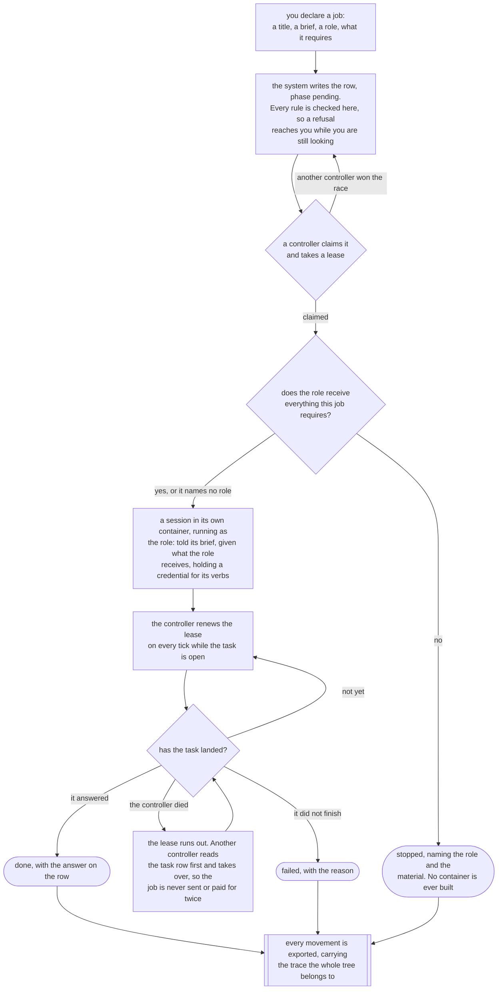

### What a caller declares

Every field below is a column on the `job` table. Types are Postgres types. Every one is validated
at the moment of the write, never at the moment of the dispatch, for the reason the graph parser
already gives: a refusal in the middle of a run arrives hours later with nothing pointing back at
the declaration.

**`id`, text, assigned by the system.** Twenty four hexadecimal characters, the shape
`flow.newRunID` already mints. A caller that sets it is refused. Reason: an identifier the caller
chooses is an identifier the caller can collide.

**`workspace`, text, required.** Must name a workspace that exists and is not soft deleted. A
missing or unknown workspace is refused, and the refusal names it.

**`project`, text, required.** Must name a project inside that workspace. Refused otherwise. A
A job needs a project because a dispatch needs one.

**`title`, text, required.** One line, for a listing. Between 1 and 200 bytes after the leading and
trailing space is removed. The ceiling is `role.SummaryLimit`, which is the same job on a role.
Empty is refused. Over the ceiling is refused, and the refusal says how long it is.

**`brief`, text, required.** What the session is asked to do. Between 1 and 16,384 bytes, which is
`role.BriefLimit`. The reason for the ceiling is the reason `docs/ROLES.md` gives: a brief nobody
reads to the end is a brief nobody follows.

**`role`, text, optional, default empty.** Names a role. Empty means the session runs with no role,
which is what every session does today. A role the workspace does not hold, at the system level or at
its own, is refused by name at the write. This is the acceptance criterion `quay-crew#354` already
states, moved earlier: refusing at the write is refusing while somebody is looking.

**`role_version`, integer, assigned by the system.** The version attached at the moment of the write.
Zero when no role. A job is pinned the way a run pins its graph, so editing a role cannot
change a job that is already declared.

**`requires`, text array, optional, default empty.** The material this job cannot be done
without, drawn from the same three words a role receives: `job`, `context` and `skills`. A word the
system does not hand out is refused by name at the write, with the three offered back.

The column was called `hands` until August 2026. The word needed explaining every time somebody read
it, and it read correctly in neither direction; `requires` comes from the Amazon Elastic Container
Service and Batch line, `requiresAttributes` and `resourceRequirements`, where a job declares what it
cannot run without and the scheduler refuses to place it where that is missing. This job requires
context. The architect role receives context. Migration 0036 renames the column, so a row written
before the rename requires exactly the material it was declared with, and `--hands` refuses on the
tool and names `--requires`.

Empty is every job written before this existed: it requires nothing beyond its own brief,
and nothing about it changes.

Where the job names a role, what it requires is held against what that role receives, and where the
two disagree the job is refused. The refusal names the role, the material it does not receive, and
the two ways out: widen the role and import it again, or declare the job without the material.

It is checked twice, and the second check is the one that matters. At the write, because a refusal
that arrives hours later has nothing pointing back at the declaration. And again at the dispatch,
because a role can be detached, imported at a new version and attached again while a job sits pending,
so what the system would put in front of a session is only settled at the moment it hands it over. A job
refused there is `stopped` with the reason on the row, and no container is ever built for it.

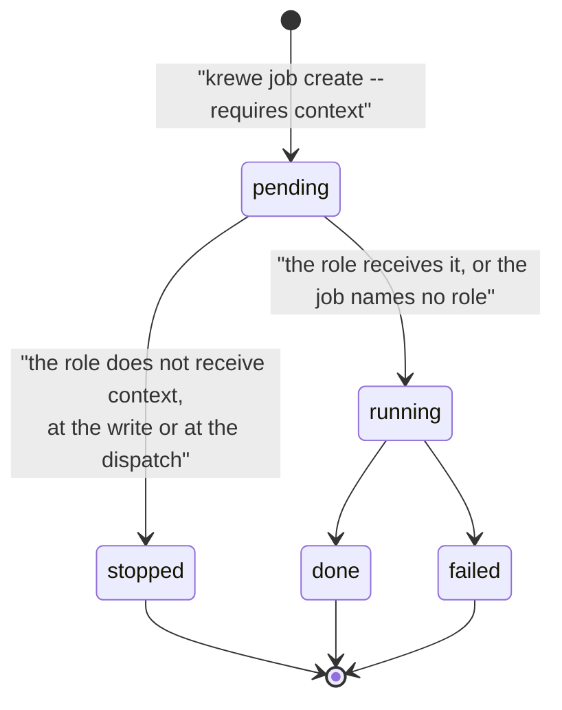

What this does not do: it holds the three words the system hands out and nothing else. There is no way
to require a named file, a named repository or a named secret, and a role that receives `context`
receives all of it rather than a part.

The reason to refuse rather than to withhold: a session asked to do the work with the context missing
answers plausibly instead of stopping. That is the same failure `expect_file` exists to catch, and
`docs/ARCHITECTURE.md` states it plainly.

**`mode`, text, optional, default empty.** What this job's tasks may do without asking. Empty
leaves the session in the mode it is born in. Validated through `model.PermissionModeNamed`, which
is what `flow.Parse` already does, and refused with the same list of what would work.

**Held against the repository, because a repository is reached over the network.** The clone, the
push and the pull request are all network commands, and the narrower modes ask a person before they
run one. Nobody stands beside a dispatched job, so the approval never arrives: the system used to
admit the pair, spend the session, and say so at the end. `model.PermissionModeReachesTheNetwork` is
the one place that answers whether a mode may run a network command, and both the declaration and the
controller read it. A job that carries a repository and cannot reach it is refused at the write,
naming the repository, the mode and what to type instead. The mode a job runs in is its own where it
named one and the system's where it did not, so the pair is held again at the control plane, once the
project's repository and the system's own mode are both filled in. A crew configured to be born in
the mode that reaches the network admits what the default configuration refuses.

**Nothing widens a mode on the job's behalf.** A repository on the project could have made every job
declared in it born in the widest mode instead, and that is an upgrade quietly granting what nobody
asked for, which is the worst way to learn a setting exists. The refusal costs a sentence. The run it
replaces costs a session and its budget.

**`expect_file`, text, optional, default empty.** A path that must be in the session's working
directory after the task. Relative only. An absolute path is refused. A path with a `..` part is
refused. Both rules are `flow.usableExpectFile`, unchanged.

**`expect_contains`, text, optional, default empty.** A string the answer must carry.

Both may be empty, which claims nothing and is checked as nothing. Where either is set, the
controller checks it, and a job that does not meet its claim stops rather than reporting success. The
reason is in `docs/ARCHITECTURE.md`: a model asked to read a file that is not there answers
plausibly instead of stopping.

**`repository`, text, optional, default empty.** The repository this job works in, written
`owner/name`. Both spellings of the address are accepted and stored as one, so a person pasting from
a browser and a person typing from memory declare the same thing. Anything that is not an owner and a
name is refused at the write, because a repository the system cannot then look for in an answer is an
expectation that was never going to hold.

**Empty takes the project's.** A project records the repository its work lands in, so a job declared
there and naming none works in that one and is held to it like any other. A job that names its own
keeps it: the project's is the default, not a ceiling. Before this the address was passed to every job
by hand, and a job that was not given one produced work nobody could read.

Naming one says how the job ends. The system adds a line to what the session is asked, saying to push
the branch, open the pull request, name its address in the answer, and not to merge it. The job is
not done until an answer names a pull request against that repository, and the address the system read
lands on the row as `pull_request`, which is what `krewe job show` prints beside the answer.

**A session that answered without one is asked again, once.** It is the only expectation the system
asks again about rather than stopping on, and the difference is what is missing. An answer that does
not carry what it claimed is work that was not done, so asking again is asking a model to do it
twice. A pull request is work that was done and not published: the branch is in the session, the
session is still open, and opening it is one command. A second answer that still names none stops the
job, with a reason saying it was asked twice.

**No role gains anything by this.** The merge is the gate, because a push applies nothing and a merge
runs the pipeline, so nothing here lets a session merge and the line the system adds says so.

**And naming one says the job cannot settle on its own answer.** Before it settles, a reviewer reads
the change and a tester runs the repository's own gates, in sessions that did not do the work. The
whole of it is section 3.1 below.

**`ungated`, boolean, optional, default false.** Declares this job with that gate off, so it settles
on its own answer. Stated in the negative, so a caller that says nothing is gated: a boundary has to
default on, and a column that defaults false is a job that is gated. The row keeps it, so a settled
job always says which of the two it was.

**A brief that asks the job to wait is refused.** A job runs once and answers. Nothing wakes it, so
"push, watch the checks and merge on green" asks for something the runtime does not have, and the
session is left with two bad moves: hold a container open through a five minute pipeline and pay for
it, or answer and stop. It takes a third and reports that it will wait. So the brief is read where a
caller declares a job, and a brief that asks the job to wait for a forge pipeline, or to merge on the
result of one, is refused with the graph named: a dispatch that pushes and opens the pull request, a
wait, then a choice on the check result. The flow engine has the wait node; a job never will.

**A step of a flow is not held to it.** The graph around a step already holds the wait, so the node
after it merges the pull request and means it. Holding a step to the rule would refuse the very graph
the refusal tells a caller to write. So the check sits on `CreateJob`, which is where somebody wrote
a brief, rather than on the declaration the flow engine builds for each of its nodes.

The rule reads English, so it is held narrow. A waiting word has to point at a pipeline and a merge
has to point at a pull request or at the result of one, and a phrase the brief negates is left alone.
`merge origin/main into the branch` and `do not merge the pull request` both stay legal. A brief that
gets past it is a brief the system still cannot run, and that is the trade: a refusal that fires on
ordinary work is the rule everybody learns to word around.

**What the system then learns about that pull request.** The address on its own was the whole of what
the system knew about the work it opened, so a change that merged and a change whose checks went red
an hour later read the same. A reader in the control plane asks the forge about every pull request
that has not merged or closed, and keeps four things on the job: whether it is open, merged or
closed, what its checks say and the name of the check that failed, whether a review asked for
changes, and when it was read.

**A reading nobody took reads as unknown, and never as green.** It is the rule `GetHeadroom` already
holds, and for the same reason: an operator decides what to pick up on these words, so a pull request
that reads as fine because nothing could read it is the one they will not look at. The reason sits
beside the unknown, so a system with no forge credential says so rather than leaving the operator to
work it out.

**Where the credential lives, which is the decision this needs first.** Every other credential in the
system reaches a sandbox through a skill. This one is different: the reader is the control plane
itself rather than a session. So it is a system secret, `GH_TOKEN` at the system level, the same name
the github skill already names. One process does the reading, and a credential on a workspace would
leave the system able to read one workspace's work and not the next one's for no reason a person
could see. Set once with `gh auth token | krewe secret set system GH_TOKEN`.

**What it costs.** One call for each unsettled pull request every two minutes, in one GraphQL request
rather than four REST reads, capped at twenty for each tick, longest unread first. A merged or closed
pull request is read once more and then left alone, and a job that opened none is never read, so
nothing bills while nothing is open. Two minutes is provisional: what would replace it is the
measured time from opening a pull request to its checks settling, over the first fifty.

**A page reads the row and never the forge**, which is the rule `GetHeadroom` and `GetHealth` already
hold. A view that waited on a forge would go blank whenever the forge was slow.

**`product`, text, optional, default empty.**
 One sentence in a person's words: what somebody does
with what this job builds, and what they get back. Not the architecture, and not the address shape.
It is held to the title's ceiling, because a paragraph here is a design document arriving by the back
door.

**Every job under it carries the same one.** A job declared under another inherits its parent's
sentence, so a session three levels down is given it without anybody typing it again. A job that
states a different sentence is refused, naming the parent's, because a tree with two products has
none, and a field dropped in silence leaves the caller believing the product moved. Under a job that
carries none, the new job's own sentence stands, so a tree that started without one can still gain
one.

The session is given the sentence above its brief, and told that the sentence wins over any design
the brief names. The reason: a tree of jobs built `docs/ACCEPTANCE-PROJECT.md` section 3 faithfully,
every check was green, and the operator opened it two days later and could not use it. The document
said the address reads `/videos?id=<video id>`, so the video identifier became the key, and a reader
holding a link had to dig it out by hand. Nobody had written "paste a link and get the text back", so
there was nothing to measure the address shape against.

**A job at the top that states none is not refused.** The system cannot write the sentence, and a
tree that runs an errand needs none, so the tool says one is missing and how to write it, the way it
already says which skills a session starts without.

**The gate is in the flow engine, and section 14b describes it.** A graph says which of its steps
builds the first thing a person can open, and a run of it stops there once and asks whether that
thing does what the sentence says. Where a caller declares its jobs directly rather than through a
graph, the sentence still reaches every session and nothing reads it back.

**`request`, text, optional, default empty.** What was asked for, in the words it was asked in. The
brief was written from it, and the two are read against each other at the moment of the write.

**It is not `product`, and the difference is what makes it worth a field.** Product says what a
person does with what is built and what they get back, which is an outcome. This is the ask. On the
article that failed, the product sentence read "a reader opens the post" and the brief was a diary
of throughput, and the two agree completely: nothing stated as an outcome could ever have caught it.

**The ceiling is the brief's, not the title's.** Every other one line field on this table takes the
title's ceiling. This one does not, because a ceiling that makes somebody shorten what was said is
exactly the compression the field exists to catch.

**Nothing rewrites it and no call replaces it.** A product sentence can be replaced, which is the
path an answer of "no" takes at the first usable path. What was said is not a setting, so the
request has no such call.

**Every job under it carries the same one**, on the rule the product sentence already follows: a
child that says nothing carries its parent's, and a child that states a different one is refused
naming the parent's, because a tree with two requests has none.

**The brief is read against it at the write, and the answer says which words the brief never says.**
The measure is the content words. Take the words of the request that carry its subject, fold two
shapes of one word together so `pasting` matches `paste`, and report the ones the brief never says.
Coverage is the share of the request's words the brief carries, and below two thirds the declaration
answers with a sentence naming what is missing. Nothing about the model is read, so it costs no call
and anybody holding the row can work the number out again, which is the argument the loop measure in
section 3 already makes.

**It refuses nothing, and that is the design rather than a softening.** Every other rule here
refuses. This one cannot: a false alarm would stop work that was right, and the person who said the
request is often not the person at the terminal. It is `left_out`'s shape, an answer rather than a
refusal, said once while somebody is looking. A question to a person instead would be an approval on
every job, which is the cost this system exists to remove.

**Only where the declaration states its own request.** A child builds one slice of the work and
cannot carry the whole sentence, so measuring an inherited request would speak about every ordinary
slice, and a rule that fires on ordinary work is the rule everybody words around. What is measured
is the one hop this exists for: somebody said a sentence, somebody wrote a brief from it, and the
two arrive together.

**The session is given the request above its brief, whole.** This is the half that works with nobody
watching. A summary of what was said is the same compression that caused the fault, so the words go
across unrewritten, and where the brief dropped some of them the session is told which and told that
the request wins. It answers by saying so rather than by building the brief as written. Building it
faithfully is what already happened.

**No column holds the reading and no event carries it.** The coverage is a function of two columns
the row already holds, neither of which changes after the write, so a third copy could only disagree
with them. `krewe job show` works it out again and prints the sentence the caller read.

**The threshold is two thirds, measured on the text this repository holds.** The corpus of the right
shape is a sentence beside the brief written to serve it, and there are 27 of those here: the summary
and the brief of every role and every skill. The lowest covers 0.778 and the median covers 1.000. The
two briefs that cost real work cover 0.500 and 0.000. `internal/job/requestcalibration_test.go` runs
the measurement on every build, the way the loop threshold's does.

**What it does not catch, said plainly.** A brief that keeps every word and inverts the meaning
scores as faithful: this reads words, not meaning. A brief that renames a thing reports the rename as
a dropped word, which is the error it makes in the other direction, and it costs a line. On the
looser corpus of 121 issue titles held against their bodies, one in eight falls below the threshold.

**What replaces the number.** The same shape the lease length and the loop threshold already have.
Once fifty jobs carry a request, read where a job whose answer the operator kept sits against where a
job the operator steered or stopped sits, and put the threshold at the fifth percentile of the first.

### The plan, and the person who approves it

The sentence reaches every session and nothing ever holds the brief against it. That is the gap this
closes, and it sits before every other gate the system has: a job that states the sentence writes its
plan, and a person approves the plan before any work starts.

The failure is the one section 14b already describes, one step earlier. A person says one sentence.
Something turns that sentence into a brief. The system executes the brief faithfully and fast, and
nothing compares the two, because reading the brief costs nearly as much as reading the result: one
of them ran to 1,109 words for a 1,505 word result. So a misreading of one sentence becomes two days
of correct work in the wrong direction, and it looks like progress the whole way. 14b stops the run
at the first thing a person can open, which costs one step. This stops it before the first step,
which costs one task.

**The sentence is the trigger, and it adds no field.** A job that states the sentence and hangs under
nothing is planned. A job that states none is an errand, which section 3 above already says needs no
sentence: there is nothing to write a plan from and nothing to hold the plan against, which is the
argument 14b makes for refusing a usable node with no sentence. Right against what. A job declared
under another is never planned either: it is one part of a plan a person already approved, and
stopping at every job in a tree puts a person back in the loop for all of them, which is the cost the
system exists to remove.

**`plan`, text, written by the controller.** The steps the session wrote, one per line, in the shape
`Step 1: read the design`. At most `job.PlanSteps`, which is seven, each held to the title's ceiling.
So a whole plan is at most about 1,400 bytes against a brief of 16,384, which is the whole point:
reading the plan has to cost less than reading the result, and a plan as long as the work buys
nothing. The number seven is chosen rather than measured. What replaces it is the distribution of
steps a job actually records, which `krewe job step` already writes down: after fifty jobs, the
ninety fifth percentile of steps recorded per job.

**`plan_approved`, boolean, written by the control plane.** Whether a person said yes. The two are
separate columns rather than one state word, because a plan on a row nobody has approved is the plan
a person is being asked about, and the same plan with the flag set is the thing the work is held to.

**The first task asks for the plan and for no work.** It carries the sentence above the brief, the way
every task for a planned job does, because a plan written from the brief alone carries whatever
misreading the brief carries. The reply is read for the plan rather than believed, the way a pull
request address and a base line are read. A reply carrying no plan the system can read is asked once
more and stops the job the second time, which is the two strike shape the pull request ask already
has: a job whose plan nobody could read is a job nobody approved.

**Then the job asks, through the mechanism that already exists.** The plan and the question land in
one movement, so a reader never finds a job asking with no plan on it. Nothing new puts a question to
a person: the phase is `asking`, the answer is `krewe job answer`, and nothing but an answer moves it.

**`yes` approves and anything else replaces the plan.** This is 14b's rule, one gate earlier. An
answer that is not the approval is the correction: the job goes back to pending carrying it, and the
session is given the plan it wrote and what the person said, and writes the plan again from that. So
an answer of no costs one task and never ends the job, and the person who said no writes no plan.
Writing the replacement is the system's job, because a person writing the plan by hand is the person
doing the compression the system exists to do.

**The work is then held to the plan, or the approval is worth nothing.** The approved plan travels
with the work, and it replaces the ordinary line about recording steps rather than sitting beside it:
the session records each step it finishes with its number, `krewe job step "2: read the design"`. When
the job lands, the numbers the record carries are held against the numbers the plan carries, and a
step of the plan that nothing accounts for stops the job with a reason naming it. What the session
answered stays on the row, because work that walked off the plan is unapproved rather than lost.

The measurement is arithmetic over a set of numbers. It costs no model call and anybody holding the
record can work it out again, which is the property the loop detector's own measure was chosen for. A
model judging whether a plan was followed, or a similarity score over prose, would both be guesses.
Work the session recorded that the plan never named is not a fault: the plan is a floor rather than a
ceiling.

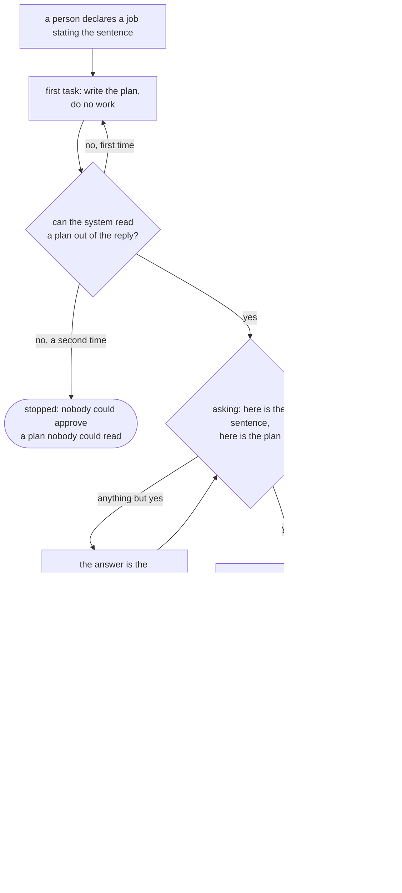

**What it does not do.** It reads no brief and judges no wording: nothing here compares the brief with
the sentence, because that comparison needs a judgement no rule can make. What it does is put a short
thing a person can read in front of them while stopping is still cheap. It reaches one job rather than
a tree: a child is not planned and is not held to its parent's plan, so a tree still spends whatever
the approved plan set it going on. And a plan a person approves without reading is a plan that
approves itself, which no system can prevent and the ceiling is the only defence against.


**`claim`, text, optional, default empty.** The piece of work this job is doing: an issue, a branch,
or a name two people would both use for the same thing. Empty claims nothing. It is held to the
title's ceiling, and it is stored lowercased with any run of space inside it taken down to one,
because two people naming the same work from memory write it two ways and a claim that misses over a
capital letter is a claim that did nothing.

**A second job that claims work another job is holding is refused, and the refusal names that job.**
The failure it answers happened twice in one run: two sessions picked up the same issue and built it
under different names, and the first anybody knew was two pull requests conflicting on files both of
them had created. The two designs disagreed in small places, which is the expensive part. Nothing was
in the other's way in the filesystem, because `quay-crew#255` already gives each session its own
working copy. They were in each other's way over the work itself.

It is not a lock on a file. It is a record of intent, which is what was missing: both sessions would
have read it before starting. So the claim is on the row, `krewe job list` carries a column of what is
claimed, and `krewe job show` says it.

**A claim ends three ways, and the third is the one to test.** The job settles, into any of the three
terminal phases and not only `done`. Somebody stops it. Or nothing moves the job for longer than a
claim lives, which is the crashed session: the container went, no controller is renewing anything,
and the row is all that is left. Without the third, one dead container holds a piece of work for as
long as the system runs, and every test about claiming still passes.

The life is two hours, chosen rather than measured, and it is a constant rather than a setting
because a system given no number would hold work forever. What it has to outlast is the longest gap
between two movements of a job that is alive. A running job is not one of them: its controller renews
the lease every tick and every renewal moves the row. The two long gaps are a job waiting for a
person to answer its question and a job queued behind everything else in its workspace. The
measurement that would replace the number is the distribution of that gap, which nothing takes yet.

**The scope is the workspace**, which is the boundary this design already uses for concurrency and
for fairness. Two projects inside one workspace are the same people's work, so a claim in one is a
claim in the other.

**Checked at the write, and only there.** Every other rule on a declaration is checked again at the
dispatch, and this one is not: a job stopped hours later because somebody else claimed its work in
the meantime is a refusal nobody can act on, and the second declaration was refused at its own write
anyway. The check is a read inside the transaction that writes the row, under a lock taken on the
claim, because a check made before the write is a check two callers declaring at the same moment both
pass. No unique index does it instead, because an index cannot say that holding has run out.

**`after`, text array, optional, default empty.** Identifiers of other job this job waits for.
Every identifier must name a job that exists. A cycle is refused, and the refusal names the two
identifiers that close it. This is the ordering primitive, and it is the whole of it: there is no
condition, no branch and no expression. A job waits until every identifier in `after`
reaches a terminal phase, whatever that phase is. Where a caller wants to stop on a failure, it
declares the dependent job only after it reads the answer.

**`deadline`, timestamptz, optional, default null.** After this moment the controller stops the job
rather than starting it. A job already running is not killed, for the reason `krewe flow stop` gives:
the model is already working and abandoning it mid sentence gains nothing.

**`budget_tokens`, bigint, optional, default 0.** What this job and everything under it may spend.
Zero means it draws from its parent, and a root with zero draws from the workspace. Negative is
refused. A value above the parent's remaining budget is refused, and the refusal says both numbers.

**`escalation`, text, optional, default empty.** What this job does when it goes in circles: `ask`,
which puts the question to the operator, or `role:<name>`, which hands the job to another role in a
conversation of its own. Empty is asking, which is what a job whose author never thought about
looping gets, because it is the only route that needs nothing else to be true and cannot make the
work worse. A role the workspace does not hold is refused at the write, by name.

`model:<name>` is refused, and the refusal says what to write instead. A role declares a model and
nothing reads it yet, the runner taking one model for the whole system, so a job declaring that route
would read as a decision that had been taken and change nothing. `docs/ROLES.md` records the gap and
[#354](https://github.com/atlantic-blue/quay-crew/issues/354) owns closing it. Once it closes, the
route is a role that runs on the other model, which is what `role:<name>` already says.

**`labels`, jsonb, optional, default empty.** Free text pairs, so a caller finds its own job later.
At most 16 pairs. Each key and each value at most 63 characters, which is the ceiling Kubernetes
puts on a label value. Anything larger is refused.

### What the system assigns and the caller may not

**`parent`, text, empty for a root.** Which job asked for this one. **The caller never
sets this.** The system reads it from the credential the caller presented, and a caller presenting an
operator's credential creates a root. This is the mechanism that bounds depth, and it only works
because the caller cannot lie about it. A `parent` in the request body is refused, not ignored.

**`depth`, integer, derived.** Zero for a root. Otherwise the parent's depth plus one. A job whose
depth would exceed the workspace's limit is refused, and the refusal names the limit, the current
depth and the command that raises it.

**`trace_id`, text, 32 hexadecimal characters.** Minted for a root. Inherited unchanged from the
parent otherwise. One trace covers a whole tree.

**`parent_span_id`, text, 16 hexadecimal characters, empty for a root.** The span the parent was
inside when it declared this job. Section 8c explains why both live on the row rather than in a
process.

**`created_at`, `updated_at`, timestamptz.** Every table in this system carries them.

### What the controller writes, and nobody else

This is the status. A reader reads a field, never a log.

**`phase`, text.** Seven words, and they are the flow engine's words plus one, so a reader learns
one vocabulary rather than two.

- `pending`, declared and not started. The opening phase of every job.
- `waiting`, held back because something in `after` has not finished, or because the workspace is at
  its concurrency limit, or because it is a parent whose children are outstanding.
- `running`, a session exists and a task is in flight.
- `asking`, it put a question to a person and nothing but an answer moves it. No timer and no poller,
  which is the rule `flow.Advance` already enforces for a run.
- `done`, it finished and the answer is on the record.
- `failed`, the model did not finish, or the sandbox could not be made.
- `stopped`, it was halted: a person stopped it, or it met a limit, or its claim did not hold. A
  a job that went quiet and one that was halted must never read the same.

The last three are terminal. Nothing moves a job out of them on its own.

**One person may, and only out of `failed`.** `ResumeJob` puts a job that failed back to `pending`,
keeping its session, so a controller starts it again in the conversation it has been in all along.
That is the whole of the exception: no controller, no timer and no poller moves a terminal job, and
`done` and `stopped` are not movable at all. `done` has nothing left to continue, and `stopped` is
somebody ending a job on purpose, which is what `RefuseJob` does to a failure the operator judges was
the work being wrong rather than the run. `features/resuming.feature` is the shape of it.

**A continued attempt says what moved under its base, and the answer is read.** A resume puts a
session back into the working directory it left, and what that work stands on moved while it was
stopped. Nothing runs git here, so the system states the shape it will read and reads the answer
against it, exactly as it does with the address of a pull request: the continued task asks for one
line opening with `Base:`, and where the job names a repository and the answer carries no such line,
the session is asked once more and the job stops if the second answer carries none either. The reason
names the repository and says it asked twice, and what the attempt produced stays on the row, because
the end of an attempt is not the end of its work. A job that names no repository is not held to it,
since the system knows of no base it was away from.

**A job that stops without a pull request has its branch pushed, and the reason says where its work
is.** The last word on this path used to be an instruction to a person: open the container, and push
what is inside it. The product of the job then sat where no command reached it and the operator became
the transport, which is the opposite of what a system is for.

The bytes were never in the container alone. A session's working directory is a bind mount the system
made itself and a workspace's volume is another, so the system was holding the work the whole time and
had no way to name it.

So the system publishes rather than asking. Where a job that names a repository is about to stop
without one, the system looks at what the session left behind and pushes the branch it is on. A push
applies nothing, so it needs nobody's approval; a merge runs the pipeline and a pull request is a
decision, so the system does neither, and the reason says which step is left. This is the one place
the system runs git itself, and it runs it inside the session's own container: the control plane is a
static binary with no shell, and the credential that reaches the remote belongs to the workspace and
is already in there.

**Five outcomes, and the empty one matters most.** A reason that names a branch nobody made sends the
operator looking for work that was never done, so the states are held apart rather than collapsed:
the branch is on the remote, whether the system put it there or the session had; there are commits and
the push was refused; a repository is there and nothing was committed to it; the session holds no
repository at all; and the system could not look, which is never reported as one of the other four. In
every state but the first the reason names the directory the work is in, on the machine that runs the
sandboxes, and the command that reads it. No reason it writes may send a person into a container.

**One command reads work out of a session.** `krewe read <session> [<path>]` lists what a session made
or prints one file out of it, reading the directory rather than the container, so it answers for a
session whose sandbox has gone. Before it, the only road into a finished session was to attach, which
is a person driving a terminal: it does not compose into a script, a flow or a report.
**A job in a mode that could never push is published too.** The mode holds the session and not the
system, so the reason that explains the mode ends with what became of the work in the same way. What
a narrow mode costs a job is the pull request, never the branch.

`features/publishing.feature` is the shape of both halves.

### How a job ends: the outcome, which is one word from a fixed set

**This is the one place the set is written down.** The tool, the flow schema and the console all read
the same four words out of `internal/job/outcome.go`, so nothing can offer a fifth.

Jobs on the acceptance run of 30 August 2026 reported "done", "complete", "the pull request is open"
and "I could not finish because the credential expired". All four settled the same way, because the
system read the prose to decide the job was over. A job that could not do its work and a job that did
it read identically to anything downstream, so the operator opened each one to tell them apart and
nothing could be counted. Two readings of one sentence give two outcomes. See
[#537](https://github.com/atlantic-blue/quay-crew/issues/537).

So a session ends its task with one word on a line of its own, and the prose sits under it as the
explanation rather than as the signal.

**`outcome`, text, written by the controller.** One of four words, and empty on a job nothing has
settled.

- `proved`, the work is done and something the session ran proves it.
- `unproved`, the work is done and nothing proves it. Its own word rather than a missing one: work
  nobody checked and work that was checked must never read the same.
- `blocked`, the work cannot be done, and the reason is under the line.
- `decide`, a person has to decide before this goes any further.

**The word is read off the answer, never reported.** The same mechanism the pull request address and
the base line already use, for the same reason: the model reporting on its own job is what this exists
to stop. The line carries the marker `Outcome:` and one of the four words and nothing else, so
`Outcome: proved, once the deploy is checked` states no outcome and neither does "the tests proved
it". Both are prose, and prose is what was being read before.

**A session that states none has not finished the job.** It stops, with a reason saying what line was
missing, and what the session said stays on the row. It is not asked again, which is the difference
between this and a pull request: an address is work that was done and not published, so asking buys
the work back, and an outcome is one line the session was told to write in the task it has just
answered.

**The outcome is not the phase, and neither replaces the other.** The phase is the system's account of
the attempt: whether a session existed, whether a task landed, whether anybody halted it. The outcome
is the work's own account. Both are on the row because a job that is `done` and `blocked` is a real
job, and it is exactly the row a listing of phases cannot find.

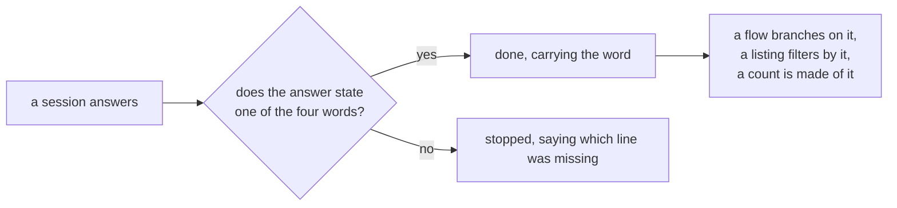

**What reads it.** `krewe job list --outcome blocked` narrows a listing, and a word that is not one of
the four is refused with the four offered back. A flow's choice node branches on `result.outcome`,
which arrives beside `result.reply` rather than inside it: the line comes out of the reply a graph
reads, so a node comparing a reply is comparing what the session wrote. A choice waiting for a word
the system does not hand out is refused at import. The console carries an `outcome` column beside the
phase.

**What this does not do.** Nothing independent has to agree with the word. A session that states
`proved` is still the only witness, which is
[#536](https://github.com/atlantic-blue/quay-crew/issues/536) and not this. Nothing moves the phase on
the strength of the outcome either: a job that ends `blocked` is `done` with `blocked` on it, so a
resume still applies to a job that failed and to nothing else.

**`session`, text, empty until a session exists.** The session the job runs in. This is how a
reader gets from the job to the conversation, and it is what `krewe attach` takes.

**`attempts`, integer, default 0.** How many times a controller started a session for this job.

**`answer`, text, default empty.** What came back, whole, redacted by the system's own redactor before
it is written, exactly as `landTask` already redacts a reply. **This field is the read path.** It is
the difference between an answer that lives in a conversation and an answer a caller can read.

**`reason`, text, default empty.** Why a stopped or failed job stopped. Empty while
running and empty when done.

**`question`, text, default empty.** What an asking job is waiting to be told.

**`reviewed` and `tested`, booleans, default false.** What passed this work before it settled, each in
a session that did not do it. Written in the same statement as the phase, so a reader of a settled job
is never left opening two conversations to find out whether anything independent agreed with the
answer. A settled job carrying neither was declared with the gate off or never reached one, and
`krewe job show` says which.

**`spent_tokens`, bigint, default 0.** What this job's own session has cost, read by the same
reader the flow ceiling uses, `Server.SessionTokens` in `internal/controlplane/flows.go`.

**`looped_step`, integer, default 0, and `escalated_to`, text, default empty.** The step this job went
in circles on, and the route the system took when it did, in the shape the route was declared. Zero
and empty for a job that never has. `escalated_to` being set is what makes a second loop stop the job
rather than escalate it again: escalating twice is the system going round the same loop with more
steps in it.

**The attempts, in `job_attempts`, one row per task.** What each attempt at a step produced, and how
like the earlier attempts at that step it was. See the section below.

**`observed_version`, integer, default 0.** The `version` of the declaration this status describes.
The record carries a `version` integer that increases on every write to a declared field. A
controller that has not caught up has an `observed_version` behind it, and a reader can tell a
status that is current from one that is stale. Kubernetes calls this the observed generation, and it
is worth copying because a status field with no such marker gets believed after the declaration
under it has changed.

**`lease_owner`, text, and `lease_until`, timestamptz.** Which controller holds this job and until
when. Section 4 explains them. They are the only status fields a reader should ignore.

**`started_at`, `finished_at`, timestamptz, null until each happens.**

### Validation a test can fail

Every rule above is a refusal with a sentence. The scenarios go in `features/job.feature`, in the
shape the other feature files take, and each was written to be checked by breaking the code on
purpose. The list, so a test can be written against it:

- A job with no title is refused, and the refusal says a title is needed.
- A job with a title of 201 bytes is refused, and the refusal says the ceiling.
- A job with a brief of 16,385 bytes is refused.
- A job naming a role the workspace does not hold is refused, and the refusal names the role.
- A job naming a mode that is not a mode is refused, and the refusal lists the modes.
- A job whose `expect_file` starts with a slash is refused.
- A job whose `expect_file` holds a `..` part is refused.
- A job whose `repository` is not an owner and a name is refused, and the refusal says how to write
  one.
- A job that names a repository and a mode that cannot reach the network is refused, and the refusal
  names both and gives the mode to declare it in. A job that takes its repository from its project is
  refused on the same rule, and a job that names no repository is admitted in every mode.
- A job running in a mode that cannot reach the network is not asked a second time for its pull
  request, and the reason it stops names the mode.
- A job that names a repository and answers without a pull request against it is asked again, and
  stopped if the second answer names none either.
- A job that names no repository, in a project that records one, works in the project's.
- A job whose brief asks it to wait for a pipeline, or to merge on the result of one, is refused,
  and the refusal quotes the brief and names the flow.
- A job whose brief negates one of those phrases is declared, because "do not merge the pull request"
  is not an instruction to merge it.
- A step of a flow is not held to that rule, because the graph around it holds the wait.
- A job at the top that states the sentence is asked for its plan first, and its first task tells it
  to do no work.
- A job that states no sentence, and a job declared under another, are asked for no plan at all.
- A plan of eight steps, a step over the title's ceiling, and a plan numbered with a gap or a repeat
  are each refused, and the session is asked again.
- A session that answers twice with no plan the system can read stops the job, and the reason says it
  was asked twice.
- An answer of `yes` approves the plan, and the work that follows carries it.
- Any other answer replaces the plan: the job goes back to pending and the session is given the plan
  it wrote and what the person said.
- A job whose record accounts for every step of the approved plan finishes, and says nothing.
- A job whose record misses a step of the approved plan stops, and the reason names that step.
- A job that claims a piece of work another job is holding is refused, and the refusal names that
  job, its title, and how old the claim is.
- The same piece of work written another way, with different capitals or extra space, is the same
  claim and is refused the same.
- A job that claims work a settled or stopped job claimed is declared.
- A job that claims work nothing has moved for longer than a claim lives is declared.
- A job with a claim of 201 bytes is refused.
- A job whose brief carries the words of its request is declared, and the answer says nothing about
  drift. This is the one to break the code against: a check that speaks about every brief passes
  every test about finding drift and is worth nothing.
- A job whose brief drops the words of its request is declared, and the answer names those words.
- A job that states no request is declared exactly as it was before this existed.
- A job declared under another carries its parent's request, and one that states a different request
  is refused naming the parent's.
- A child is never measured against the request it inherited, so an ordinary slice is declared in
  silence.
- The session doing a job is given the request above its brief, and told which of its words the
  brief never says.
- A request of 16,385 bytes is refused, and the refusal says the ceiling is the brief's.
- A job whose `after` names an identifier that does not exist is refused.
- A job whose `after` closes a cycle is refused, and the refusal names both identifiers.
- A job with `parent` in the request is refused, and the refusal says the parent comes from the
  credential.
- A job declared by a credential at the depth limit is refused, and the refusal names the limit.
- A job with a budget above its parent's remaining budget is refused, and the refusal says both
  numbers.
- A job with 17 labels is refused.
- A job with a label value of 64 characters is refused.
- A job whose answer states no outcome does not settle, and the reason says which line was missing.
- A job whose answer states a word the system does not hand out states no outcome.
- A listing asked for a word that is not an outcome is refused, with the four offered back.
- A choice node waiting for a word that is not an outcome is refused at import.
- A caller that is not the controller cannot write `phase`, `answer`, `outcome`, `reason` or `session`.
- A job that names a repository does not reach `done` until a reviewer and a tester have passed it.
- A gate that fails the work sends it back to the session that did the work, and the job stays open.
- A gate that fails the same work twice stops the job, with what it said on the row.
- A gate that answers without a verdict stops the job, and never passes it.
- A gate whose own task failed stops the job.
- A job declared with `ungated` settles on its own answer, and the row says it was declared that way.

### 3.1 The gate before a job settles

A job ends when the session running it says it is finished, and until this nothing independent had to
agree first. Every failure of the acceptance run reached the operator through that door: the answer
was the only evidence, and it was written by the session being judged.

So a job that names a repository is passed by two sessions that did not do the work, before it
settles.

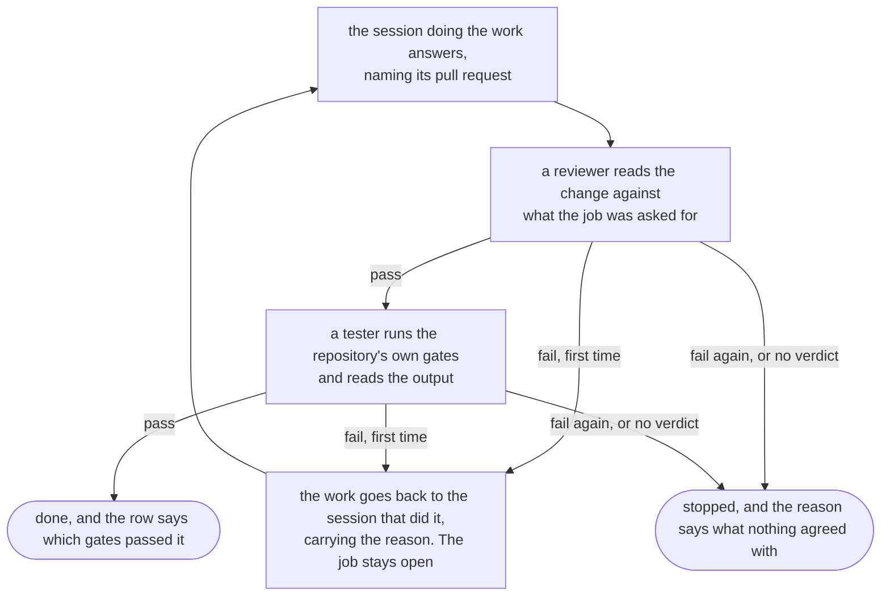

**The reviewer** is given the sentence the job serves, its title and its brief, and the address of the
pull request. It is not given the answer, because the answer is the testimony this exists to check: a
reviewer handed it first is a reviewer reading somebody else's conclusion. It is told to read the
change against the repository as it is rather than against the diff alone, to report only what changes
what a person or an operator gets, and to change no file.

**The tester** runs the gates the repository runs, found in its Makefile, its package scripts or its
continuous integration workflow, and it is told to read their output rather than their exit status. A
suite that ran nothing exits zero, a pipeline reports the status of its last command, and a green
check that executed nothing is indistinguishable from one that passed. So it fails the work where a
gate is red, where a gate could not be run, and where a gate reported success having run nothing.

**Each answers with one line, and the line is read off the answer** rather than reported by the
model, exactly as the address of a pull request and the base line already are:

    Verdict: fail the change adds a column and no migration, so a fresh store cannot read it

An answer carrying no such line has judged nothing, so the job stops rather than settling: reading it
as a pass is the false green the whole gate exists to prevent.

**They run in conversations of their own**, `job-<id>-reviewer` and `job-<id>-tester`, named after the
job the way the working session is, so a controller that comes back to the row finds them without
being told. A second opinion formed by the session that formed the first is not a second opinion.

**Neither holds a credential.** What a session may call on the system comes from the job it runs, and
the dispatch that starts a gate names no job and no role, so the system mints it nothing. That is the
boundary, and it is the credential rather than a sentence in the text.

**A fail is the next task, not the end of the run.** It goes back to the session that did the work
carrying the reason, because the branch and the worktree are still there and the fix is usually one
edit. It asks for the address of the pull request again, for the reason the continued task does: that
answer is the one that ends the job. It goes back once, and the count is read off the tasks of the
working session rather than kept in a field, which is what makes the whole gate safe to run twice.

**Nothing is remembered between ticks.** The reviewer's verdict is on the record of the reviewer's own
session, so a controller that took the row over after another died reads the same records and reaches
the same answer. The only thing that lands on the row is which gates passed, written in the same
statement as the phase.

**A gate the system could not start leaves the job running**, and a later tick asks again. A machine
with no room is a moment rather than a verdict, which is the reasoning a job turned away for want of a
sandbox already gets, and settling here would settle work nothing read.

**It costs two more sandboxes per job**, one at a time, after the work is done. A job that names no
repository produced no change, so nothing reads it and nothing is paid for.

**It is refusable rather than optional.** A job declared `ungated` settles on its own answer, and the
row records that it did, so a settled job always states whether anything independent passed it.

What this does not do: it reads one pull request and it never merges. Nothing here holds a verdict
against a policy, nothing counts how often a gate fails the same session, and the reviewer's method is
its own subject, in [#533](https://github.com/atlantic-blue/quay-crew/issues/533) and
[#534](https://github.com/atlantic-blue/quay-crew/issues/534). A flow that reviews a pull request on a
schedule, with an operator reading the draft before anything is posted, is
[#513](https://github.com/atlantic-blue/quay-crew/issues/513) and is a different mechanism: this one is
inside the loop and posts nothing.

### The lifecycle

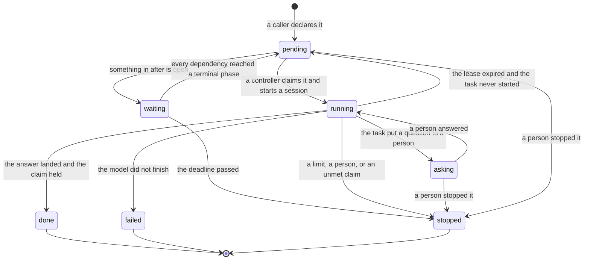

The one edge worth reading twice is `running` back to `pending`. A controller that dies leaves a job
marked running with a lease nobody holds. The next controller reads the task row, and the shape of
that recovery is section 4.

### A job that goes in circles

Nothing compared what a session produced against what it had just produced, so a session going
nowhere and a session working hard were the same picture from outside: one phase word and a growing
bill. On the acceptance run of 30 August 2026 a session that could not get a check green tried the
same shape of fix several times and gave the same reasoning each time, and the operator was the loop
detector, only where he happened to read the transcript.

**What an attempt is, and what a step is.** An attempt is one task: what it produced is the answer
where it answered and the failure where it did not. The step is how many steps its session has
recorded plus one, so the first attempt is at step 1 and the attempt after two finished steps is at
step 3. Attempts are only ever compared with attempts at the same step, and that is what keeps a
working session out of this: a session that finished something is somewhere new.

**The measure.** The overlap of the sets of three word runs two pieces of text hold, over everything
either of them holds. Runs of three words rather than words, because two answers about one repository
share nearly every word and very few of the same sentences. It reads text the system already has, so
it costs no model call and anybody holding the record can work the number out again.

**The rule.** Three attempts at one step, of which the last two were each as alike as the threshold
to an attempt before them, are a loop. Two is a retry; the third is what says the second changed
nothing. An attempt that finished the job is never one, however like the last it reads, and neither
is a task an operator halted.

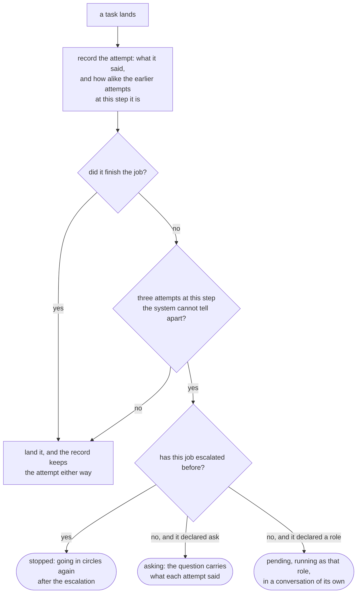

**The threshold is provisional, and its error has a direction.** A detector that fires on real
progress stops work that was going to finish, so it sits an order of magnitude above anything
different work scores rather than as low as it could go. Measured on the 304 paragraphs of
`CHANGELOG.md` over sixty words: across the 46,056 pairs of different paragraphs the median is 0 and
the ninety ninth percentile is 0.024, while a paragraph held against itself with every number changed
scores at least 0.654. The measurement is `internal/job/loopcalibration_test.go`, so it runs on every
build rather than sitting in prose. What it does not catch is an attempt reworded from scratch, which
scores like different work.

**What replaces the number.** Every attempt writes its similarity whether or not it loops, so after
fifty jobs the threshold is measured on attempts rather than on prose: read where an attempt followed
by a finished step sits against where an attempt on a job that ended failed or stopped sits, and put
the number at the ninety fifth percentile of the first. It is the shape the lease length already has.

**A job escalates once.** The route is a property of the job, declared while somebody is writing it,
because the moment a job is going nowhere is the worst moment to be working out what to do about it.
A job handed to another role starts in a conversation of its own, since a role is read only when a
session is born, and the task it is given carries what the earlier attempts said so the new one does
not make them again. The attempts at a step are counted across the handoff, so a new role saying what
the last one said is the handoff itself changing nothing, and the job stops for a person to read.

## 4. The controller loop


A controller is a loop. It watches, it compares what is declared against what exists, it acts to
close the gap, and it records what happened. It is an ordinary workload. Nothing about sitting near
the control plane makes it privileged.

### What of this shipped on 27 August 2026

A controller runs inside the control plane, started the way the flow poller is: something owns its
lifetime, and the goroutine is not hidden inside a constructor. It ticks every five seconds and on
the way up, so a job declared while the system was down starts when the system comes back.

What one tick does today:

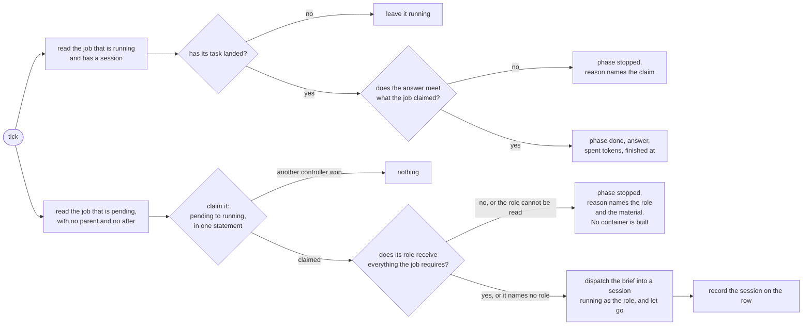

The claim is the whole of the idempotency. It is a conditional update in one statement, so two
controllers ticking at the same moment leave one task rather than two, and a tick run again over a
row that has already started does nothing. A job is paid for, so a second dispatch is a second bill.

The dispatch lets go of its task. A controller that waits on a model is a controller that stops
controlling, so the answer is read off the task record on a later tick.

**What it does not do yet, and which slice does it.** It runs root job: job that waits for
something and jobs under a parent are read and left alone. A job that names a role is run as that
role, which is slice 10. There is no budget check and no depth limit, which is slice 5. A
job that goes to `asking` is not moved by anything here, because nothing asks yet.

The session is named after the job rather than minted, so a dispatch that has to be made again
lands in the same conversation. That is what makes the recovery in slice 4 possible without a second
bill.

### What of the lease shipped on 27 August 2026

A controller holds the job it is running, and the hold is what makes the controller disposable.

```mermaid
stateDiagram-v2
    [*] --> pending: "a caller declares it"
    pending --> running: "a controller claims it and takes the lease"
    running --> running: "the holder renews on every tick while the task is open"
    running --> done: "the task answered and the claim held"
    running --> failed: "the model did not finish"
    running --> stopped: "the answer did not meet what the job claimed"
    running --> abandoned: "the holder stopped renewing"
    abandoned --> running: "another controller reads the task row and takes over"
    abandoned --> pending: "no task was ever sent, so nothing was paid for"
    done --> [*]
    failed --> [*]
    stopped --> [*]
```

`abandoned` is not a phase. It is the same `running` row with a lease that has run out, drawn apart
here because it is the state the recovery reads.

**The claim.** One statement, with its condition inside it: a controller takes a job only where the
lease is free or has run out. Two controllers racing over one row leave one winner, and the loser is
told the job is somebody else's rather than being given an error. The same statement shape does the
take over, so the two moments a race can happen are guarded the same way.

**The recovery reads before it writes.** A controller that finds an abandoned row reads the task
record for its session first. A task that already answered is adopted; a task still open leaves the
job running under a new hold. Only job with no task anywhere goes back to `pending`, because that
is the one state that says for certain nothing was paid for. Where the row carries no session, the
system is asked for one named after the job, which closes the gap between a dispatch and the row that
records it: a task sent by a controller that died a moment later is still found, and never sent twice.

**The lease length, and where the number comes from.** It is a minute, and it is derived rather than
chosen. The holder renews on every tick while its task is open, so what the lease has to outlast is a
gap between renewals rather than a task. Measured on one machine against the real control plane and
the real store, with a model that answers at once: a tick with nothing to do cost 1 to 4
microseconds, a tick that dispatched a hundred jobs cost under a millisecond, and a whole
a job from declared to done cost 2 milliseconds over twenty runs. Reproduce it by timing
`Server.TickJob` around a system holding jobs with the fake model runner. So the renewal rate is set
by the five second tick and not by the job, and a minute is twelve of those: a holder misses twelve
renewals in a row before its job is taken. It is also the budget the system already gives the longest
healthy operation it has, the whole path from a session row to a sandbox ready for its first task.

**This number is provisional.** What replaces it is the ninety fifth percentile of the gap between
renewals over the first fifty completed jobs, which needs the metric slice 6 adds. Until
then `QC_JOB_LEASE` sets it, and a system that says nothing gets the measured default rather than
refusing to start.

**What the lease does not do yet.** It does not cover a job in `asking`, because nothing asks yet. It
is not a limit an operator sets per workspace, which is where the `workspace_limits` row in slice 5
puts it. Nothing counts how often a lease expires, which is the metric slice 6 adds and the only
signal that a controller died.

### Where the Kubernetes idea fits this system, and where it does not

**It fits.** The reducer in `internal/flow/advance.go` is already a pure function from state and
event to next state and commands, with the world touched only beside it. That is the controller
shape, written before anybody called it one. A controller over jobs is the same arrangement with a
different resource.

**It does not fit in one place, and the mismatch is real.** In Kubernetes the control plane runs
nothing. The control plane here holds the Docker socket, builds sandboxes and calls the model. It is a
control plane and a node agent in one process, and `docs/ARCHITECTURE.md` says so plainly: mounting
the host socket is equivalent to giving it root on the host.

This design does not fix that, and it deliberately does not make it worse. The job controller
touches no socket and no model. It reads and writes rows, and it calls `Dispatch` on the same
interface every other caller uses, which is the property `internal/flow` already holds. So the
controller can move out of the control plane process later without changing a line of its logic. Two
things must land before it can: it needs a credential of its own rather than the process's, and it
needs the answer read path so it stops needing the store handle. Slices 5 and 1 supply those.

### The loop

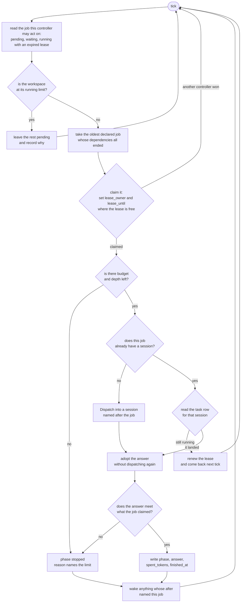

### The fifth comparison: is this system doing anything at all

The four queries above make reality match what was declared. This one asks whether they are working,
and it is the only comparison in the loop that is about the loop rather than about a row.

**Nothing running with something held is a state that is always wrong.** It is not a slow system and
it is not a busy machine, because a busy machine has jobs running on it. It says the room is held by
sandboxes doing nothing, and that nothing will change on its own, because the thing that would give
the room back is the thing that has stopped.

On 31 August 2026 twenty five jobs were declared at once against a workspace allowing eight running.
Fifteen finished. Then nothing ran at all. Five jobs sat held, each saying that a sandbox asks for
100 per cent of a processor and that 0 per cent of 1200 per cent is unallocated. Twelve sandboxes
were idle, every one of them for an hour or more, and between them they held the whole processor
allocation. The workspace reclaim time was thirty minutes and not one container came back. An
operator drained thirty three sessions by hand to free a resource the reclaim was already meant to
free. See issue 575.

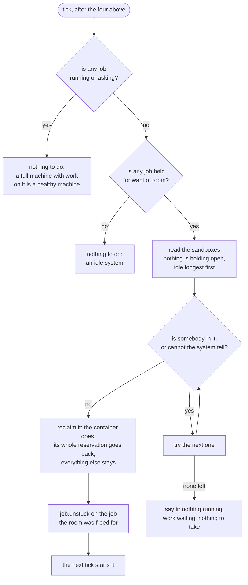

**Three faults were found and all three were real.**

*Reclaim ran and found nothing to take.* `putAway` is on every tick and never conditional, so the
loop was reaching it. But reclaim never looks at the machine: its only inputs are the workspace
reclaim time, the session `updated_at` and whether somebody is attached. And the batch starved.
The controller read twenty settled sessions per tick, ordered by how long ago each was touched. A
reclaimed session stays settled, and with no archive time set nothing ever moves it, so once twenty
reclaimed rows sat at the front the batch was all of them and the reclaim never reached a container
again. That is why the two rules are two queries now, each in its own order.

*The processor is released, and only when the container goes.* Both axes are one reservation and
neither moves without the other. `Ledger.ReleaseSession` is the only path that gives a placed
sandbox's room back, and only `closeSandbox` and the reaper call it. So an idle sandbox holds a
whole processor while using almost none of one. That is correct scheduler arithmetic and it is what
kubernetes does. The mismatch is that a pod ends and a session does not, so the fix is not to change
the arithmetic but to take the container back.

*Nothing noticed.* No query anywhere paired running against held. The health probe is the closest
thing and does not cover it: it asks whether the system can write, because a control plane once
served every listing and dispatched nothing for an hour, which is issue 400. This incident is that
failure again one layer up, with every write landing.

**What it does.** One container per tick, and the one idle longest. One is enough to start the queue
again, and taking twelve would throw away eleven warm containers to answer a question that one
answers. The workspace reclaim clock is not read: that clock exists to save memory on a quiet system
and is unset until three measurements are taken, while this question needs no measurement.

**What it never does.** It never takes a container an operator is attached to, and a system that
cannot tell reads that as attached. It never takes a session a live job names, because the query it
reads leaves those out. It never stops a session that is doing work.

**What a person reads.** A job the machine turns away while nothing at all is running carries the
room arithmetic and then one more sentence saying the system is stopped rather than busy. `hold`
already writes a reason only when the sentence changes, so it is written once and not every five
seconds. Where the system frees room, `job.unstuck` goes on the job it freed the room for, naming
the container it took and how long that container had been idle.

**Why the pair, and not the pressure.** A full machine is healthy. Eight jobs running and seventeen
waiting is exactly what admission is for, and reclaiming there takes a container from a session that
is about to get its next task.

**Why not refuse the declaration earlier.** Section 5.1 already decided that a job the machine cannot
host stays pending for as long as it takes and is never admitted and then killed. Refusing at
declaration would turn away work the machine can do in ten minutes, and it would not have moved the
five jobs in the incident, which were declared while the machine still had room. At declaration
nothing knows what the machine holds when the job's turn comes.

**Why not evict.** Evicting is issue 478, and its trigger is different: the machine in danger,
measured against what the runtime actually holds. This one fires when the machine is idle and the
queue is stopped, which issue 478 would read as a healthy machine. Issue 477 holds a sandbox to what
it asked for, which reduces how often either fires and replaces neither.

### What it watches

Rows in `job`, in the store, by polling. Not the log. This is the same split the flow engine
already made and for the same reason: publishing is lossy, so a controller whose next action
depended on a record arriving would sit forever with nothing to say why.

Six queries per tick, each on an index:

- jobs in `pending` whose `after` identifiers have all reached a terminal phase, oldest declared
  first;
- jobs in `waiting` whose dependencies have now ended, which moves it back to `pending`;
- jobs in `running` or `asking` whose `lease_until` has passed;
- the sessions that still hold a container and nothing is holding open, oldest touched first;
- the sessions whose container has already gone, longest reclaimed first;
- whether any job is running or asking at all, which is a probe rather than a count.

The last one is the fifth comparison, and it costs one index lookup on a system with a million
finished jobs. Only when it says nothing is moving does the loop read a seventh: the jobs the
machine turned away. A working system never pays for that one.

The two session queries are two rather than one because a reclaimed session never leaves the second
set where no archive time is set. Reading both from one batch let those rows crowd out the sandboxes
behind them, and the reclaim stopped reaching a container at all. See the fifth comparison above.

A system with a thousand finished jobs and one pending does one row of work per tick. That
is the property `DueFlowRuns` already has and it is worth keeping.

### What it compares

The declaration against reality. Reality is three things, and they are read rather than remembered:

- the `phase` on the row;
- whether a session named on the row still exists, through `GetSession`;
- whether the `tasks` row for that session is still open, through `ListTasks`.

The third is the one that makes recovery possible, and it only became possible at `e53befc` this
morning.

### What it does

One of: nothing, claim, dispatch, adopt an answer, stop, wake dependents, put a session away, or
take one container back because the queue has stopped. Never more than one job per tick moves from
`pending` to `running`, so the concurrency limit is enforced by construction rather than by counting
after the fact, and never more than one container is taken back for the same reason.

### What it writes

Every movement writes the row and appends one event row in the same transaction. That is the
guarantee `flow_run_events` already gives: there is no gap for a crash to hide in, so either the
the job moved and the record exists, or neither happened. The export to the log follows the write and
never fails it.

### The claim, and what happens when it dies

A controller claims a job by writing `lease_owner` and `lease_until` where the lease is free or
expired. The write is conditional in the same statement, so two controllers cannot both win. This is
the compare and set the log cannot give, and `flow_dispatches` already uses the same idea.

The lease length is provisional. It must be longer than the longest task a job runs, and a
task takes minutes rather than seconds. The measurement that would set it is the ninety fifth
percentile of `quaycrew.job.duration` over the first fifty completed jobs. Until that
exists the operator sets it, and the system refuses to start with it unset rather than choosing a
number nobody measured.

Now the phases, and what a death in each one costs.

**It dies before claiming.** Nothing was written. The next controller reads the same pending row and
claims it. Cost: one tick.

**It dies after claiming and before dispatching.** The row says `running` with a lease and no
session. The lease expires. The next controller sees `running` with no session, which can only mean
the dispatch never happened, and puts the job back to `pending`. Cost: one lease length. Nothing
was paid for, because no model was called.

**It dies during the dispatch call.** This is the expensive one, and it is why the task row matters.
The row says `running` and carries a session, because the controller writes the session identifier
before it waits. The task may be running in a sandbox right now, and the sandbox belongs to the
control plane rather than to the controller, so the model keeps working whether or not anybody is
watching. The next controller reads the `tasks` row for that session. If the row is open, it renews
the lease and waits. If the row has landed, it takes the reply from the row as the answer and never
dispatches again. **The job is never dispatched twice, so it is never paid for twice.** That is the
same protection `flow_dispatches` gives a run, achieved here by reading rather than by claiming.

**It dies after the answer landed and before writing the phase.** The row still says `running`. The
next controller reads the closed task row and adopts the answer. The only cost is the delay.

**It dies while a job is asking.** Nothing happens, correctly. An asking job
moves on an answer and on nothing else, so a controller that is not there is not a controller that
answered. The question stays on the row and a person still sees it.

**It dies after writing the phase and before waking dependents.** The next tick's second query finds
the dependents itself, because waking is derived from the dependency's phase rather than pushed by
whoever finished. A push that can be lost is a design that stalls; a query that is re run cannot be.

The property that holds all six together: **the controller keeps nothing in memory that it cannot
read back from a row.** No timers, no goroutine per job, no map of outstanding calls. That
is the same reason `docs/ARCHITECTURE.md` gives for a wait being a column rather than a timer.

## 5. The capability model


### What of this shipped on 27 August 2026

The `verbs` list, the credential, the parent from that credential, the `workspace_limits` row and
`krewe limits`. The four hook calls joined the deny list at the same time.

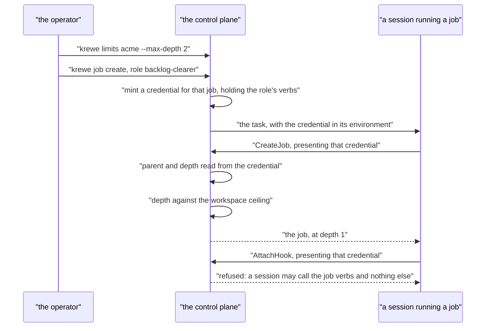

**What the credential is.** A token minted for one job, carrying the verbs that job's
role declared and lasting as long as that job may run: the job's own deadline where it names one, and
twelve hours where it does not. It reaches the session in the
environment of one task and never at sandbox birth: a sandbox keeps the configuration it was made
with, so a credential written at birth would label every later task with the first task's grant, and
one minted afterwards would never reach the container at all. The system holds the minted credentials
in the control plane process, so a restart forgets them, which costs nothing because a restart also
ends every task they belonged to.

**What ends it.** The job ending. The system takes the credential back the moment the job reaches a
phase nothing moves it out of, so a session stops being able to call because its job is over rather
than because a clock ran out, and the expiry above is the backstop for a job whose end the system never
saw. The credential's life is deliberately not the controller's hold on the job, which is a different
lifetime: a hold is renewed on every tick, and a credential is handed to a sandbox once at dispatch
and never refreshed, because refreshing it would mean re entering a running container. The two were
one constant, which made a credential last sixty seconds, and a root job that ran twenty nine minutes
declared none of its three children (`quay-crew#449`). The `--lease` setting on a workspace is the
hold and only the hold, and it does not reach the credential.

**What a session is told when it is refused.** Three different sentences, because the three causes
need three different things done about them: a credential that ran out says so and says when, one the
system took back names the job that ended and the phase it ended in, and a token nobody minted is told
it is not this system's. They were two. An expired credential got the refusal a forgery gets, and a
session told the token is not this system's reads that as holding a bad credential and stops calling,
which is what ended the run in `quay-crew#449`.

**What it holds.** Four verbs and nothing else, and the deny policy points the opposite way from the
driver's: the driver is refused a named list and holds everything else, while a job holds a
named list and is refused everything else. It may not raise its own ceiling, name the job another
task runs for, touch a hook, a skill, a role or a secret, or dispatch.

**The four hook calls.** `ImportHook`, `ListHooks`, `AttachHook` and `DetachHook` are refused to the
driver now. A hook is a command that runs on a session's own tool use, so attaching one changes what
every session in that workspace may do, and reading the list is reading the map of the guard the
session is under. That last one is the difference from a skill, whose listing stays open: a skill is
a capability a session already holds and uses by name.

**What is enforced, and what is only stored.** `max_depth` is enforced at the write, and the refusal
names the limit and the command that raises it. The request is enforced at every start: the system adds
up what its sandboxes asked for and holds a job that does not fit. `max_running` and `budget_tokens`
are stored, read and set, and nothing enforces them yet: nothing runs a child, so there is no fan out to bound. The
slice that runs a job in a role is where they start to bite. The lease length is read by the
controller when it claims that workspace's job.

**What this does not do.** It does not scope `job.read` to the caller's own tree yet: the verb is
checked, the tree is not. `job.answer` is granted and refused, and no call is mapped to it: a
question is put to a person, and only the operator answers one.

**What it did not do until 29 August 2026, and now does.** It did not put a session's container on a
network that could reach the control plane, so every call a session made died resolving the name and
the boundary above had never refused a real call. `quay-crew#435` closed it: every sandbox joins a
second network that the control plane is also on, and nothing else of the system's is. A session can
address the system and cannot address the store, the broker or the dashboards.

The two halves are still two decisions and that is deliberate. The network says what a session can
address, and the credential says what it may do there. A session on the network holding no credential
is refused every call, which is what an ordinary task is. See the "What a session's sandbox can
reach" section of `docs/SANDBOX.md`.

### The verbs

Four, and no more, because a verb nobody uses is a boundary that means nothing.

- `job.create`, declare a job. The parent comes from the credential.
- `job.read`, read a job and its answer. Scoped to the tree the credential's own job is in.
- `job.answer`, answer a question a job asked. An operator only, in the first version, and that is
  what shipped: the verb is grantable and `AnswerJob` is mapped to no verb at all, so a role that
  holds it answers nothing. A run that could answer its own question is a gate that decorates.
- `job.stop`, stop a job in the tree.

Asking is not a fifth verb. A session puts a question about the job it is itself running, and the
credential is already bound to that job identifier, so no grant is involved. `AskJob` refuses any
identifier but the caller's own, which is why it needs none.

Recording a step is not one either, for the same reason and with the same check. `RecordJobStep` is
the session saying what it finished, on the job it is itself doing. A role that could withhold it
would leave a job that can only ever be started again from nothing.

`ResumeJob` and `RefuseJob` are mapped to no verb at all, the way `AnswerJob` is. They are the two
answers to a failure, and which of the two a failure gets is a person's decision: a session that
could continue its own job would be deciding that its own failure was not about the work.

**What shipped on 30 August 2026.** `AskJob` and `AnswerJob`, the `asking` phase written by
something other than a flow, the `job.asked` and `job.told` records, and a `told` column carrying
what a person decided until the session is handed it. The job stops at the question and no controller
holds it, because there is nothing to come back for; the answer puts it back to pending, and the
controller starts it the way it starts anything else, sending the answer and the question rather than
the brief. The cost is that the session keeps its container while it waits, since the job is not over
and a session its job still wants is never put away.

Deliberately absent: no verb creates a workspace, a project, a secret, a skill, a hook or a role.
Those are already refused to the driver in `DeniedToDriver`, and the reason there is the reason
here. A session that could grant itself a capability could write itself a way of working nobody
approved and then run as it.

### How a grant reaches a session

Not through the `driver` flag. The flag makes the boundary locality, which is the thing to change.

A session that is running a job gets a credential minted for that job: a token
bound to the job identifier, the verbs its role declares, and a life as long as the job's own, which
the system ends when the job ends. It reaches the sandbox the way the driver's token reaches the driver, through the
environment at task time. The control plane recognises it, reads the job identifier from it, and
that identifier is the `parent` of anything the session declares.

Two consequences follow, and both are the point:

- **A caller cannot lie about its parent**, so it cannot escape the depth count.
- **A credential that leaks out of a sandbox grants only what that job could do**, and
  only until it ends. That is strictly less than the driver's token grants today.

The cost is stated. A container's environment is readable for the life of the container, through
`docker inspect` among other things. `docs/ARCHITECTURE.md` already says this about the workspace's
secrets. A job token is worse than a secret in one way and better in another: it is narrower, and
it expires.

### Where capability belongs: on the role and on the workspace, and they mean different things

**The role carries the grant.** A role declares which verbs a session running as it may use, in a
new `verbs` list beside `receives`. Validated as an allow list at import, refused by name for a word
the system does not know, exactly as `role.Material` is validated today.

The reason is the reason `docs/ARCHITECTURE.md` already gives for putting `mode` on the graph rather
than on the operator: what an automation is allowed to do should be versioned and reviewable beside
what it does. A role is a file. It is imported, pinned to a version, and attached by the operator
and never by a session. So the grant is reviewable in a pull request, and a session cannot widen it.

There is a second reason, and it is the one `docs/ROLES.md` was written around. `receives` is
already the material boundary on the role. Putting the verb boundary somewhere else would mean two
answers to one question, in two files, and a reader would have to hold both. One file says what a
role may see and what it may do.

**The workspace carries the ceiling.** A `workspace_limits` row per workspace: `max_depth`,
`max_running`, `budget_tokens` and the lease length. The workspace is already the unit of tenancy,
and secrets, skills, channels and isolation are all scoped there. A quota is a tenancy concern.

**The effective capability is the intersection.** A role granting `job.create` in a workspace whose
`max_depth` is zero creates nothing, and the refusal names the workspace limit rather than the role,
because that is the thing an operator would change.

**Why not one of the two alone.** A role alone gives no ceiling, so a role attached to the system
would grant the same power everywhere including workspaces the operator never thought about. A
workspace alone gives no review, so a session in a permitted workspace would hold every verb the
workspace holds, and the boundary between a role that plans and a role that writes code would be
prose in a brief asking nicely.

### How depth is bounded

`depth` is derived from the credential, never declared, so the count cannot be skipped. The
workspace's `max_depth` refuses a write above it. The refusal names the limit and the command that
raises it.

**What stops a job starting itself.** Depth alone, and that is enough. Job at depth d
creates at d+1, so a cycle of any shape terminates at `max_depth`. There is no cycle check between
job rows and none is needed: the parent relation is a tree by construction, because the parent is
assigned rather than chosen.

The default for `max_depth` is 0, which means no session in that workspace may declare a job at all.
Default deny. An operator raises it deliberately, per workspace.

The value an operator should raise it to is provisional. There is no measurement yet. The one that
would set it is the greatest `depth` over completed root trees after the first month, plus one. A
number chosen now would either stop real work or protect nothing.

### How spend is bounded

Three limits, and each catches a different failure.

- **The tree budget.** A root declares `budget_tokens`, or draws the workspace default. Every child
  draws from the parent's remaining budget, so no tree can spend more than its root declared. The
  controller checks it before each dispatch, never after, which is what `brake` already does in
  `internal/flow/advance.go`. The dispatch that would cross the line is never made and never paid
  for.
- **The request.** What one sandbox asks the machine for, per workspace, in memory and processors.
  This is what bounds a fan out, and it is arithmetic rather than a count: the system reads what its
  runtime has, holds back what its own containers are using, and starts a job only where what is
  already placed plus this one still fits. A job that does not fit stays pending and says which
  resource ran out. See section 5.1.
- **The concurrency limit.** `max_running` per workspace. It bounds the rate of spend, and it no
  longer has to bound memory: a count cannot, because sandboxes are not the same size, which is what
  `quay-crew#466` is about.
- **The deadline.** Wall clock rather than tokens, for a job that has stopped being useful.

No default value is named here for `budget_tokens` or `max_running`. The system ships them unset, and
jobs run bounded by depth and by the deadline alone. The measurement that would set the budget is
the median `quaycrew.tokens` for a completed job over the first fifty. `max_running` no longer
carries the machine: the request does, and that one is measured, in `internal/capacity`.

### 5.1 How the machine is bounded

A count cannot protect a machine, because sandboxes are not the same size. On 30 August 2026 nine
jobs went onto a runtime with room for fewer, and the runtime exited with the control plane, the
database and eight running jobs inside it. Ten sandboxes measured on that machine held between 4.3
and 764.5 megabytes, and `max_running` said they were the same.

So the system does what a scheduler does.

**A sandbox declares a request.** Memory and processor, per workspace, in the units the room view
prints: `krewe limits <workspace> --request-memory 1536 --request-processor 100`. A workspace that
declares nothing takes the system's own measured request. The container carries the processor half of
it as a share, so the runtime divides its processors in the proportions the system reserved.

**The system reads what its runtime has, and holds back what it is using itself.** The capacity is the
runtime's own memory and processor count, read from the daemon and never from the host: the host had
36 gibibytes free while the runtime had 7.65 and was full. The reserve is measured rather than
declared, because the system's control plane, database and event log are containers inside the same
runtime the work fills. Everything the runtime holds, less what the sandboxes hold, is the system's
own, and `QC_SYSTEM_RESERVE_MEMORY` and `QC_SYSTEM_RESERVE_PROCESSOR` are a floor under it for the
minutes after a restart when those containers are cold. This is the one place the design differs
from kubernetes, where the kubelet sits outside the pods it manages.

**Admission is arithmetic.** What is already placed, plus this one, against capacity less the
reserve. A job that does not fit stays pending, for as long as it takes, and carries a reason naming
the resource that ran out. It is never admitted and then killed. `krewe job list` shows it as `held`
rather than `pending`, because a full machine and a stalled system must not read the same.

**The room is taken in the same movement as the decision.** A dispatch is detached, so a container
appears seconds after the job that asked for it, and the reading of the machine is ten seconds wide.
Nine jobs asking one reading whether the machine is empty are all told yes, which is the shape of the
incident. So the ledger in `internal/capacity` records what has been promised as well as what has
been built, and the next job counts it. Kubernetes calls this assuming the pod onto the node.

**A system that cannot read its runtime admits the work and says so.** A system whose sessions do not run
on a container runtime has no arithmetic to do, and stopping dead there would be worse than the system
that counted.

**A reservation ends with the container and at no other moment.** `Ledger.ReleaseSession` is the
only path that gives a placed sandbox's room back, and only `closeSandbox` and the reaper call it.
Both axes go together: there is no path that returns memory and keeps the processor. That is the
kubernetes shape and it holds while a pod's life is its work's life. A session is not a pod: it
outlives its job, so an idle sandbox holds a whole processor while using almost none of one, and on
31 August 2026 twelve of them held a whole machine while five jobs waited. The answer is not in the
arithmetic. It is the fifth comparison in section 4, which takes the container back.

**What this does not do.** Nothing holds a sandbox to what it asked for, which is issue 477, and
nothing stops anything once a machine is in trouble anyway, which is issue 478.

## 6. The system workspace

**A system workspace is the wrong boundary, and this is a decision rather than an omission.**

The system already has a level above the workspace and it is called `system`. `name.System` is the word.
`krewe skill attach system`, `krewe hook attach system`, `krewe secret set system` and `krewe context set system`
all take it, and no workspace may be called it, because a workspace with that name would take what
every workspace reads.

A system workspace would be a fifth thing that looks like a workspace, occupies the workspace name
space, needs its own reserved name, and needs a rule that already exists for `system`. It would also
put the boundary back on locality: power would follow from which workspace a session sits in. That
is the idea this design is trying to replace.

**So an orchestrator runs in an ordinary workspace.** What makes it an orchestrator is the role
attached to it and the credential that role earns, not where it lives. Identity, not locality.

**What holds the system level.** The limits an operator wants to state once: a default `max_depth`, a
default `max_running`, a default budget and the lease length. A workspace's own row wins where it
sets one, which is the rule secrets already follow: a workspace wins on a name and every other
workspace reads the system's.

**What stops an ordinary workspace reaching the same power.** Three things, in order of how much
work each costs an attacker.

- The system's default `max_depth` is 0. A workspace that was never given a limit row grants nothing.
- A role granting `job.create` must be imported and attached by an operator. Import and attach are
  already refused to a session's own token in `DeniedToDriver`, and a job token grants strictly less
  than the driver's.
- A job token names its own job, and the verbs come from the role that job pinned at its
  declaration. A session cannot mint one, cannot widen one, and cannot use one after its job ends.

**What this deliberately does not do.** It does not stop an operator granting an ordinary workspace
everything. It cannot: there is one operator and no second reviewer, and a system that refused its own
operator would be a system nobody could set up. The protection is default deny plus a listing that
says which workspaces hold what.

## 7. The read path

An orchestrator cannot work without this, and it is the smallest piece of the design.

### The problem, stated exactly

The reply already survives whole. Postgres `text` is unbounded, `ListTasks` returns the field whole,
and the protobuf message puts no limit on it. One function truncates, `oneLine` in
`cmd/krewe/task.go`, at 120 characters, so a history listing stays readable. That is correct for a
listing and wrong for everything else, and there is no other way to get the value out.

### The fix, in three parts

**One, a command that prints one answer whole.** `krewe answer <session>` writes the reply of that
session's most recent landed task to standard output, with nothing else on it: no timestamp, no
prefix, no truncation. `--all` writes every task's prompt and reply in order. A caller pipes it. This
needs no new table, no new call and no controller. It closes the second blocker on its own.

**Two, the answer as a field on the job record.** `answer` on the `job` row, redacted the way
`landTask` already redacts. A caller that declared job reads the answer without knowing which
session ran it, without a listing, and after the session has been archived and its container
removed.

**Three, the calls.** `CreateJob`, `GetJob`, `ListJobs`, `AskJob`, `AnswerJob`, `StopJob` on
`ControlPlaneService`. `GetJob` returns the whole record including the answer. `ListJobs` filters by
workspace, project, parent, phase, outcome and label, and returns records without their answers,
because a listing of a hundred answers is a listing nobody can read. A caller that wants an answer asks for one
job.

### Why the answer belongs on the job and not only on the task

Three reasons, and the third is the one that matters.

- A job may take more than one attempt, and the answer is the one that counted.
- A session is archived when its job ends, so a reader coming later should not have to know that
  the history outlives the container.
- **A caller reads a field rather than parsing prose.** The whole difference between orchestration
  inside the system and orchestration outside it is whether the next decision reads a value or reads a
  transcript. A transcript is what a person outside the system has been doing.

### What a machine reads, and what a person reads

They are the same records with two renderings, which is the split the console and the command line
tool already make. A person opens `krewe job show <id>` and sees the phase, the reason, the question
and where to read the conversation. A caller reads `GetJob` and switches on `phase`.

## 8. Three worked scenarios

Every scenario names its records, its commands, its events, its trace and its metrics. A state
change that emits nothing is a state change nobody can audit.

### The events, defined once

Written to a `job_events` table in the same transaction as the row they describe, and exported to
`<workspace>.job` after, keyed by the job identifier so one job's records stay in order
on one partition. That is the shape `session_events` already has.

Each carries `id`, `kind`, `job`, `workspace`, `project`, `parent`, `depth`, `trace_id` and
`occurred_at`, plus the fields named below. Each `detail` goes through the system's redactor.

**The contract, which another service may depend on:**

- `job.declared`, fields: `title`, `role`, `role_version`, `after`.
- `job.started`, fields: `session`, `attempt`.
- `job.answered`, fields: `session`, `spent_tokens`, `duration_ms`.
- `job.failed`, fields: `reason`.
- `job.asked`, fields: `question`.
- `job.stopped`, fields: `reason`.
- `job.stepped`, fields: `summary`. One thing the session doing the job said it finished. Not a
  movement: the job is running before it and running after it.
- `job.resumed`, fields: `reason`. A person continued a job that failed, from the first step its
  session did not finish.
- `job.refused`, fields: `reason`. A person ended a failure on purpose instead, so nothing continues
  it.

**Internal, which nothing outside should depend on:**

- `job.claimed`, fields: `lease_owner`, `lease_until`.
- `job.released`, fields: `previous_owner`, `phase_found`.

The split is the useful part. A dashboard counting jobs should never break because the system changed
how it leases. A dashboard counting leases has taken a dependency it was told not to take.

**A correction, forced by reading the code on 27 August 2026.** No such service exists, and none is
being built. `docs/EVENTS.md` says it plainly: "Nothing consumes it. There is no projection any
more: history does not travel through the log, so nothing has to read it back. The log exists for a
second consumer that is not built yet." The export also only happens when `QC_KAFKA_SEEDS` is set.
So the contract above is a promise kept for a consumer that does not exist, and no part of this
design may wait on a record arriving on the log. The store is the state. Section 14 says which
consumer lands first and why.

`quay-crew#349` already named four flow kinds, `flow.run.started`, `flow.run.asked`,
`flow.run.stopped` and `flow.run.finished`, and shipped none of them. They belong to the same
contract and section 8b uses them.

### The correlation identifier

**One identifier ties everything: the trace identifier.**

It is already the system's answer. `internal/logging` says the correlation identifier equals the trace
identifier rather than sitting beside it, and Grafana pivots between a log line and a trace on that
one value. This design extends the same value rather than adding a second.

- A **resource** carries it as `trace_id`, minted at the root and inherited by every descendant.
- An **event** carries it as `trace_id`.
- A **span** is the trace it names.
- A **log line** carries it as `correlation_id`, which is the same value.
- A **task row** gains it, which closes `quay-crew#346` for jobs at the same time.

So an investigator holding any one of the five reaches the other four. The job identifier is the
second key and it narrows within a trace: one trace covers a tree, one job identifier covers a
node.

### 8a. One session

**The answer: a single job should not go through the orchestrator, and
`krewe task --dispatch` stays the right command.**

The reason is cost against gain. `krewe task --dispatch` is one call, one row in `tasks`, and the
reply comes back on the same connection. A job is one row in `job`, at least three rows in
`job_events`, a controller tick before anything starts, the same task row, and a second read to get
the answer. Every one of those buys durability, and durability is worth nothing while a person is
sitting there watching the reply arrive.

**A correction, forced by reading the code on 27 August 2026.** Letting go is a flag rather than the
default. Merged pull request 378 made a second command let go, and the one word that replaced the
three carries it as `--dispatch`. `sendTask` in `cmd/krewe/task.go` sets `Detach` on the request, the
control plane runs the task in a goroutine, and the command prints "started. the system has it, and
nothing here is waiting for it." `krewe task` with no flag waits and prints the reply. So a person
watching a reply arrive types `krewe task`, and the paragraph above holds for that. `krewe task
--dispatch` is closer to declaring a job than it was: it starts a task and reads nothing back, which
is exactly why the read path in section 7 matters more than the first draft of this document assumed.

**The rule.** A person at a terminal dispatches. Anything that is not a person, or anything whose
answer must outlive the caller, declares job.

Where a job does earn it for a single session: a long task the operator wants to walk away
from, a task that must run at a deadline, or a task another job waits for.

**The records, the commands and what the operator sees, today.** All of this is built.

The operator runs `krewe task --dispatch me/house-bills "read the package file"`. The control plane
finds or creates the session, writes the task row as `running`, builds or reuses the sandbox, runs
the model, and writes the reply into the row it opened. The reply comes back down the connection.

Status at each step, read from `krewe sessions` and `krewe task list <session>`:

- before: the session does not exist, or reads `idle`.
- during: the session reads `running`, and the task listing shows the prompt with `still running`
  under it. This is what `e53befc` fixed today.
- after: the session reads `idle` and the task listing shows the prompt with the reply under it,
  truncated at 120 characters.

**Events.** Three, and all three are built: `session.created` on the first dispatch,
`session.started` when the task begins, and `session.completed` when it lands with the reply as the
detail. A failure writes `session.errored` with the reason instead. Each lands in `session_events`
and is exported to `<workspace>.sessions`. The contract is the kind field. There is nothing internal
here.

One record also lands on `<workspace>.tasks` as a `TaskEvent`. It has no kind and only `status`
varies, which `docs/EVENTS.md` says plainly, so a consumer that wants to know what the system is doing
subscribes to the sessions stream instead. Neither stream has a consumer today, and the export runs
only where `QC_KAFKA_SEEDS` is set, so the two sentences above describe a contract rather than a
delivery anybody depends on.

**The trace.** The root span is the control plane serving `Dispatch`, named
`quaycrew.v1.ControlPlaneService/Dispatch`. It exists today, created by the stats handler in
`telemetry.ServerOptions`. There are no child spans. `quay-crew#345` is that gap, and it names the
three that are missing: a span around the task, a span around the sandbox work, and a span around
the model call. The command line tool starts no trace of its own, so the operator's own wait is not
the root today.

What this scenario needs from this design: nothing new. Where the operator does declare a job for a
single session, the root span becomes `job` and the `Dispatch` span hangs under it, and the trace
context travels as section 8c describes.

**Metrics.** Three, all built and all published after the task by
`internal/telemetry/taskmetrics.go`: `quaycrew.tasks`, a counter of tasks; `quaycrew.tokens`, a
counter of tokens split by `kind` into input, output, cache read and cache written; and
`quaycrew.cost.usd`, a counter of what those tokens would cost at published prices. Each carries
`workspace`, `project`, `model` and `status` by name.

Nothing measures how long the task took. `quay-crew#333` is that gap.

**What a person opens.**

- *Where is this now.* `krewe sessions` for the status, `krewe task list <session>` for the prompt and
  whether it is still running. Both exist. The console's `sessions` and `tasks` views show the same
  thing.
- *Why did it stop.* `krewe task list <session>` prints `failed:` and the reason. Exists.
- *What did it cost.* Grafana, Prometheus data source, `sum by (workspace) (quaycrew_cost_usd_total)`.
  Exists, with no dashboard on it. The console's `stats` view shows what the system and a session have
  cost.

**What limit applies.** None. A single dispatch is bounded by nothing today: no deadline, no token
ceiling, no concurrency limit. That is the honest state, and it is one of the reasons this design
exists.

### 8b. One flow

**The flow engine becomes a controller over job. Its reducer does not change.**

This is the one place this document amends `docs/ARCHITECTURE.md`. That document says the blocking
is done by an executor beside the reducer: it takes the commands the reducer returned, makes the
synchronous `Dispatch` call, and feeds the result back in, one goroutine per outstanding dispatch.
The amendment: **the executor writes a job instead of making the call, and the run waits
on that job the way it already waits on a timer.**

**This disagreement now has a tracked home: `quay-crew#399`, opened 27 August 2026.** Its slice 2 is
this change, named there as "a non blocking dispatch node. The run records the task and waits for
`task.finished` as an event, rather than holding the call open. This is the disagreement recorded in
section 8b of the orchestration design." The blocking line is `internal/flow/engine.go:297`, where
`e.plane.Dispatch` is called and its reply is read in the same statement. Section 14 covers the rest
of that issue.

Three things change and one does not.

- `advance.go` does not change at all. It is pure, it returns `[]Command`, and `CommandDispatch`
  already carries the node, the attempt and the rendered prompt. That is exactly the shape of a job
  declaration.
- `engine.go` changes in one function. Where `advance` calls `e.plane.Dispatch` and blocks, it writes
  a job whose `after` is empty, whose parent is the run, and whose identifier it records on
  the run. Then it returns.
- A new run status, `working`, sits beside `waiting` and `asking`. The poller already passes over
  runs by status, so a run that is `working` is passed over by the timer and moved by the job
  controller when the job reaches a terminal phase.
- The idempotency ledger stays. `flow_dispatches` keys on run, node and attempt in the same
  transaction as the movement, and the job declaration lands in that same transaction.

**What this buys, and it is not tidiness.**

- **A step's answer becomes readable.** Today a step's reply lands in the run's state under
  `result.reply`, and `krewe flow show` truncates it. With a job, the answer is a field.
- **A step can run as a role in its own session.** That is what `quay-crew#354` slices 2 and 5 want,
  and it needs a per step session rather than the run's one session.
- **The engine stops holding goroutines.** One goroutine per outstanding dispatch becomes zero, and a
  restart mid step recovers from rows rather than losing the wait.
- **An asking run stops holding a container.** `quay-crew#354` names this trap by name: a run that
  waits or asks holds its container for the whole wait, because `advance.go` closes a session only at
  the end. With job, the session belongs to the job, and the job ended when it answered.
  The run then asks its question holding nothing.

**What it costs.** One more row per step, and one controller tick of latency per step. On a task that
takes minutes, a tick is noise. On a graph of twenty pure choice nodes it is nothing, because
`settle` already runs a chain of pure nodes inside one movement.

**The scenario.** A graph of four nodes: `fix` dispatches, `ok` chooses on the result, `ask` puts a
question, `push` dispatches. The operator runs `krewe flow start me/house-bills fix-red`.

The records, in order:

1. A row in `flow_runs`, status `running`, pinned to the graph's version, with the trigger payload as
   its opening state. Its `trace_id` is minted here and it is the root of the whole run's trace.
2. A movement to node `fix`, one row in `flow_run_events`, one row in `flow_dispatches` keyed on run,
   `fix`, attempt 1, and one row in `job`: phase `pending`, parent the run, `trace_id` inherited,
   brief the rendered prompt, `expect_file` if the node declared one. All in one transaction.
3. The job controller claims it, dispatches, and the model works. The job row carries the session.
4. The job reaches `done` with its answer. The controller wakes the run.
5. The run moves to `ok`, which is pure, and then to `ask`, in one movement. Status `asking`, the
   question on the row.
6. The operator answers with `krewe flow answer <run> yes`.
7. The run moves to `push`, which declares a second job, and then to `done`.

**A step that fails.** Two shapes, and the system already tells them apart.

*The model did not finish.* The job reaches `failed` with the reason. The controller writes
`result.failed` as `true` into the run's state and wakes the run. A graph that branches on
`result.failed` handles it. A graph that does not, walks its success edge, which is the graph
author's decision and is visible in the file.

*The job did not do what the graph said proves it worked.* `expect_file` names a path that is not
in the session. The job reaches `stopped`, and its reason names the path. **The run stops rather
than branching.** That is the existing rule in `advance.go` and it is right: the system knows the job
did not happen and does not know why, and a run that halts is read correctly while a run that
finishes is believed. `result.expected` carries the reason and the session is left alone, because
that is where the evidence is.

**A step that waits for an operator answer.** The `ask` node. The run's status is `asking`, nothing
but an answer moves it, and the poller's own query passes over asking runs on their status. So an
automation nobody answered can never take silence for a yes. Delivered through `krewe flow answer`
today rather than through a chat channel, which is deliberate: it exercises the gate end to end with
no bot token.

**If the controller dies halfway.** Section 4 covers every phase. The one worth naming here: the run
is `working` and the job is `running` with an expired lease. The next controller reads the task row.
If it is open, it waits. If it landed, it adopts the answer. The run never loses its place, because
the run's place is a row, and it never dispatches twice, because the ledger row is already claimed.

**Events.** In order, with the four flow kinds that `quay-crew#349` named and did not ship:

1. `flow.run.started`, contract. Fields: run, graph, version, project, `trace_id`.
2. `job.declared`, contract. Fields: job, parent the run, node `fix`, attempt 1.
3. `job.claimed`, internal.
4. `session.created`, contract. Built today.
5. `job.started` and `session.started`, both contract.
6. `session.completed`, contract. Built today.
7. `job.answered`, contract.
8. `flow.run.asked`, contract. Fields: run, node `ask`, the question.
9. `flow.run.finished`, contract. Fields: run, node, transitions, spend.

A run that hits a limit writes `flow.run.stopped` with the reason instead, and a run halted by a
person writes the same kind with the person's reason. A run that was halted and a run that went
quiet must never read the same, which is the rule `StatusStopped` already carries.

**The trace.** One trace covers the whole run.

- Root span: `flow.run`, opened when the run row is written, closed when the run reaches a terminal
  status. Attributes: run, graph, version, workspace, project.
- Child per movement: `flow.transition`, attributes node and event kind. Short, and there is one per
  row in `flow_run_events`, so the trace and the audit record have the same shape.
- Child per job: `job`, opened when the job is declared and closed when it reaches a
  terminal phase. This one can last minutes.
- Child of that: `job.attempt`, one per attempt. A retry is a new span rather than a longer one,
  because a single span cannot honestly cover two attempts an hour apart.
- Child of the attempt: the control plane serving `Dispatch`, which exists today.
- Missing, and named in `quay-crew#345`: the spans below that, around the task, the sandbox and the
  model call.
- An `asking` run's wait is not a span. A span covering a wait for a person would be a span that runs
  for days and it says nothing. The gap between `flow.run.asked` and the next span is the wait, and
  the event carries the timestamps.

**Trace context across the session boundary.** Covered in full in 8c, because that is where it is
hardest. The mechanism is the same here: `trace_id` and `parent_span_id` are columns on the job row.

**Metrics.** The three that exist, plus these, and every one of them is a metric the loop exports
rather than a metric a dashboard computes:

- `quaycrew.job.pending`, up down counter, unit records. Jobs waiting to start.
- `quaycrew.job.running`, up down counter, unit records.
- `quaycrew.job.first_action`, histogram, unit seconds. From declared to started. This is the number
  that says whether the system is keeping up.
- `quaycrew.job.duration`, histogram, unit seconds. From declared to a terminal phase.
- `quaycrew.job.failures`, counter, unit records, attribute `reason` from a closed list: `model`,
  `sandbox`, `unmet`, `budget`, `depth`, `deadline`, `stopped`, `lease`.
- `quaycrew.job.budget.remaining`, up down counter, unit tokens, attribute `root` naming the tree.
- `quaycrew.controller.leases.expired`, counter, unit leases. Non zero means a controller died.
- `quaycrew.flow.runs`, counter, unit runs, attribute `status`.

Spend against the budget reuses `quaycrew.tokens`, which already exists, with a `job` attribute
added. A second token metric beside it would be two answers to one question.

**No threshold and no alert value is named here.** The first one worth setting is on
`quaycrew.job.first_action`, and the measurement that would set it is that histogram's ninety fifth
percentile over the first two weeks of real use. `quay-crew#347` is the ticket for dashboards and a
cost ceiling alert as code, and it is open.

**What a person opens.**

- *Where is this now.* `krewe flow show <run>` prints the node, the status, the reason, the question
  and the state. It exists. `krewe job show <id>` for the step, which does not exist yet. A `flows`
  view and an `events` view in the console: neither exists, and `internal/console/resources.go`
  registers ten views without them.
- *Why did it stop.* `krewe flow show <run>` prints the reason on its own line before the state,
  deliberately, because a run that halted and a run that went quiet look identical without it.
  Exists.
- *What did it cost.* `krewe flow show` prints the run's spend. Grafana for the trend. Both exist.

**What limit applies.** The graph's `limits.transitions`, defaulting to 100. The graph's
`limits.tokens` where declared, and no ceiling where not. The workspace's `max_running`, new. The
job's deadline, new. A schedule shorter than fifteen minutes is refused, which is
`flow.MinimumEvery`.

### What of this shipped on 27 August 2026

**Slice 8, and the disagreement above is now the behaviour.** `engine.go` writes a job
instead of calling `Dispatch` and reading the reply from the same statement. `advance.go` did not
change: the reducer is byte for byte what it was, and it never learns that job exists.

What a run does now, one movement at a time:

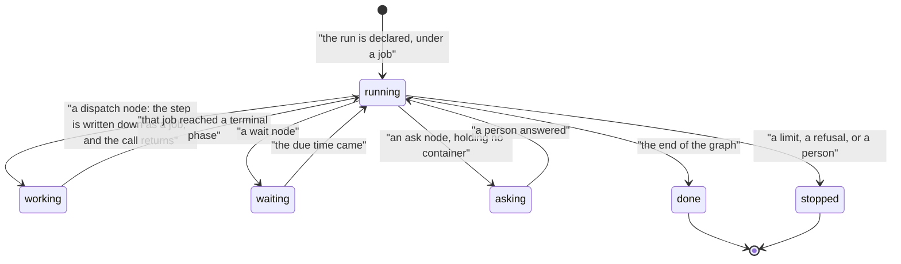

- **`working` is the new status**, and it is the engine's word rather than the reducer's. The engine
  puts a run back to `running` before it feeds the step's result in, which is why `advance.go` did not
  have to change. The store treats it as live: a `working` run can be stopped, and it moves.
- **A run is carried by a job**, as section 14 decides. Starting a run writes that job with
  a brief naming the flow and its version, and the run row points at it. It is written in phase
  `waiting` rather than `pending`, so no controller ever sends a run's own job as a task.
- **Every step is a job under the run's**, one level deeper, carrying the node's prompt as
  its brief, the graph's mode, the node's role and whatever the node said would prove it worked. The
  the job and the movement that declared it land in one transaction, beside the transition and the
  idempotency claim.
- **What carries a run on is a row.** The flow poller reads the runs that are `working` whose step
  reached a terminal phase, and feeds the answer in as the `task.finished` event the reducer always
  took. A movement answering a step applies only to a run still out with that step, so two pollers
  reading one landed step move the run once.
- **The step's session is put away as its job ends.** So a run that then asks a person holds no
  container, which is the trap `quay-crew#354` names by name.
- **`flow.run.started`, `flow.run.asked`, `flow.run.finished` and `flow.run.stopped`** are written, and
  they are job events against the job that carries the run. One history rather than two,
  and they reach `<workspace>.job`, which the export already carries.
- **Every job a run declares carries labels**: `flow.run`, `flow.graph`, and for a step
  `flow.node` and `flow.attempt`. So a person reads a whole run out of the job tree with
  `krewe job list --label flow.run=<run>`, which is what `krewe flow show` now prints.

**What it changed for a graph author, and it is not small.** A run no longer has one session. Each
step is a job and a job owns the session that does it, so a step no longer sees
what the step before it was told. What travels between steps is the run's state: `result.reply`
carries the last step's answer, and a prompt reads it as `{{result.reply}}`. A graph that relied on
the earlier conversation has to say what it needs in its prompt.

**What the depth limit does and does not bound here.** The job that carries a run is held
to the workspace's `max_depth` like any other declaration, counted from the credential of whoever
started the run. A step is not checked again: the ceiling was decided when the run was declared, and
the steps of one graph are a finite set with a transition cap rather than a way to recurse. So a
session in a workspace whose `max_depth` is 1 can start a flow and cannot start one from inside that
flow's own step, and a flow an operator started needs no limit raised.

**What is still not built.** Stopping the job that carries a run does not stop the run;
`krewe flow stop` does. Nothing enforces the tree budget, for a run or for anything else. A step
carries no deadline of its own. The controller still leaves a job that waits for something in `after`
alone, because nothing honours ordering yet.

### 8c. One orchestrator role that starts others

This is the scenario that does not work today. The worked example: **clear a backlog of nine pull
requests, one at a time.** Some need a human decision. The whole run must survive the orchestrator
process being killed.

**How it names what it wants.** It writes nine records. It does not hold a queue, a list or a plan in
its conversation.

The operator declares one root:

```
krewe job create me/quay-crew \
  --role backlog-clearer \
  --title "clear the open pull request backlog" \
  --budget-tokens <a number the operator sets> \
  --brief "Read the open pull requests on atlantic-blue/quay-crew. For each one, declare a
           a job that reviews it and either fixes it or asks. Run them one at a time.
           When they are all finished, read the answers and tell me what is left."
```

The controller claims it, starts a session called after the job, and hands that session a
credential granting `job.create`, `job.read` and `job.stop`, because that is what the
`backlog-clearer` role declares in its `verbs` list.

The session lists the pull requests with `gh`, which is the github skill already in the image. It
then makes nine calls, and the ordering is the important part:

```
krewe job create --title "pull request 341" --brief "..." --expect-contains "..."
krewe job create --title "pull request 344" --brief "..." --after <the identifier of the first>
krewe job create --title "pull request 350" --brief "..." --after <the identifier of the second>
... seven more, each after the one before it
```

Nine rows. Each carries `parent` from the credential, so each is at depth 1. Each carries the root's
`trace_id`. Eight carry an `after` naming the one before, so the chain runs one at a time whatever
the workspace's concurrency limit says.

**Then the orchestrator's session finishes its task and the root job goes to `waiting`.** Not
`done`. A root with outstanding children waits. Its session is not archived, because the conversation
is where the orchestrator's own memory lives.

That is the whole mechanism, and it is worth saying flatly: **the ordering is a field on nine rows,
not a process holding a list.** Kill the orchestrator now and the nine still run in order.

**How it learns the answers.** When every child reaches a terminal phase, the controller dispatches
a new task into the same session:

```
The job you asked for has finished. Read each answer with krewe job show <id>.
<the nine identifiers, with their phases>
Decide what is left and say so.
```

The session resumes because `FindOrCreateSession` continues a conversation on the same handle, and
the model's own conversation store lives in the workspace's mounted directory rather than in the
container. `docs/ARCHITECTURE.md` already states this property for a flow run: the next dispatch
lands in the same session and the same sandbox, so the model's own state across the run survives a
restart.

So the intent lives in the rows and the reasoning lives in the conversation, and both outlive the
process. That is the answer to the failure this document opens with.

**A pull request that needs a human decision.** The child's session cannot merge and should not. Its
brief tells it to ask. It calls `krewe job ask <id> "pull request 344 changes the sandbox image. Merge?"`,
which moves its own job to `asking` and writes the question on the row. Its session then ends and
its container goes away, because the question is on the record rather than held open in a
conversation.

The operator answers with `krewe job answer <id> yes`. The controller starts a new attempt in the
same session with the answer in the brief. Nothing else moves: the chain behind it stays `waiting`,
because `after` waits for a terminal phase and `asking` is not one. **The orchestrator is not woken
and is not involved.** A person answered a question about one pull request, and the orchestrator
learns about it in the summary at the end.

**How depth is bounded.** The root is depth 0 and the nine are depth 1. If a child decides a pull
request needs a test written by a `test-writer` role, that child is depth 2. The workspace's
`max_depth` refuses depth 3, and the refusal reaches the model as the error from its own
`krewe job create`, naming the limit. The model then does the work itself or says it cannot.

The value of `max_depth` is the operator's and it is provisional. There is no measurement. The one
that would set it is the greatest depth over completed root trees after the first month.

**How spend is bounded.** The root declares `budget_tokens`. Each of the nine draws from what is
left, checked before each dispatch. When the tenth dispatch would cross the line, it is never made:
that job goes to `stopped` with a reason naming the budget, and so does everything still
`pending` in the tree. The root then gets its summary task with the truth in it, which is that six of
nine finished and three were stopped by the budget.

**What stops it starting itself.** The parent is read from the credential and never from the request,
so every declaration increases the depth. A cycle of any shape terminates at `max_depth`. There is
nothing else to check.

**What an operator sees while it runs.**

```
krewe job list me/quay-crew
```

Eleven rows: the root at `waiting`, one child `running`, one `asking`, six `pending`, one `done`, one
`stopped`. The listing prints the job identifier, the depth, the phase, the title and the age.
`krewe job show <id>` on the asking one prints the question and how to answer it, the way
`krewe flow show` already does for a run.

**The events, in order.** The contract kinds are what another service may depend on.

1. `job.declared` for the root. Contract. Fields: job, workspace, project, parent empty, depth 0,
   role `backlog-clearer`, role version, title, `trace_id`.
2. `job.claimed` for the root. Internal.
3. `session.created`, then `job.started`, then `session.started`. All contract. The first two carry
   the session and the attempt.
4. `session.completed`. Contract. The orchestrator's first task landed.
5. Nine `job.declared`. Contract. Each carries parent the root, depth 1, and the `after` it holds.
6. `job.claimed`, `job.started`, `session.created`, `session.started` for the first child.
7. `session.completed` and `job.answered` for the first child. `job.answered` carries the session,
   the tokens and the duration.
8. For the child that asks: `job.asked`, contract, carrying the question. Then nothing until a
   person answers, then `job.started` again with attempt 2.
9. `job.stopped` for anything the budget caught, contract, with the reason.
10. `job.answered` for the root, once its summary task lands.

Two events are internal and nothing outside should read them: `job.claimed` and `job.released`.

**The trace, and how the context crosses the session boundary.**

One trace covers the whole run, from the operator's `krewe job create` to the last child finishing.

- Root span: `job`, on the root job. Opened when the row is written, closed when the root
  reaches `done`. It lasts as long as the backlog takes.
- Child span per attempt: `job.attempt`, one per attempt of the root and one per attempt of each of
  the nine. The nine hang under the root's span, not under each other, because the `after` chain is
  ordering rather than causation.
- Under each attempt: the control plane serving `Dispatch`, which exists today.
- Under each `job.create` the session makes: the control plane serving `CreateJob`. That span is
  what ties the child's declaration to the parent's attempt.

**How the context travels, exactly.** This is the hard part and it has three parts.

*Part one, the system's own side.* `trace_id` and `parent_span_id` are columns on the job row. A
controller that picks up a job reads both and opens its span under them. It does not
inherit a context from the process it happens to be in. **That is what makes the trace survive a
controller restart:** the context is in the declaration, not in memory. This is the same reason a
wait is a column rather than a timer.

*Part two, into the container.* A child session runs in its own container as its own process. The
system sets `QC_TRACEPARENT` on the task, formatted as the standard trace context header,
`00-<trace id>-<span id>-01`, where the span identifier is the `job.attempt` span. It goes on the
task rather than on the sandbox, through `sandbox.Spec.Env`, which already exists and is already how
per task environment reaches a command. It must not go on the sandbox at birth: a sandbox is born
with its environment and a session is reused across tasks, so a value set at birth would label every
later task with the first task's span. That is the same trap the refusal message quoted in section 2
describes.

*Part three, and the honest limit.* The model's own tool does not read `QC_TRACEPARENT` today.
Nothing inside the container adopts it. So what the system gets is one span per attempt, written by the
system, around a job whose inside is opaque. Anything finer needs the hook mechanism in `docs/HOOKS.md`,
which raises `PreToolUse` and `PostToolUse`, and no hook emits a span today. **This is a real gap and
this design does not close it.** What it does close is the break between sessions: without the two
columns, a tree of eleven sessions is eleven unrelated traces.

*When a child is resumed or retried.* The `trace_id` never changes. The attempt number increases and
a new `job.attempt` span opens, carrying an attribute naming the attempt and a link to the previous
attempt's span. Not a longer span: a span that covers two attempts an hour apart reports a duration
that is mostly waiting, and the duration is the number somebody reads. A resumed `asking`
job is the same shape: attempt 2 opens when the person answers, and the gap between attempt 1 and
attempt 2 is how long the person took.

**Metrics.** The eight named in 8b, unchanged. The two that matter most in this scenario:

- `quaycrew.job.pending`, because a backlog of nine shows as nine and then falls to zero. A number
  that stops falling is a chain that is stuck.
- `quaycrew.controller.leases.expired`, because it is the only signal that says a controller died.

`quaycrew.job.budget.remaining` with the `root` attribute is what says how much of the backlog the
budget will actually cover.

**What a person opens.**

- *Where is this now.* `krewe job list me/quay-crew`, which does not exist yet. Today the nearest is
  `krewe sessions`, which shows eleven sessions with no relation between them, which is exactly the
  problem.
- *Why did it stop.* `krewe job show <id>` prints the reason. For the tree, `krewe job list --parent
  <root>` shows which child holds the failure. Neither exists yet.
- *What did it cost.* `krewe job show <root>` prints the tree's spend against its budget. Grafana for
  the trend. The first does not exist; the second does, with no dashboard on it.

**What limit applies.** `max_depth` on the workspace, refusing depth 3. `max_running` on the
workspace, which the `after` chain makes moot here because it runs one at a time. `budget_tokens` on
the root. A deadline where the operator sets one. And the lease length, which is not a limit on the
work but on how long a death goes unnoticed.

#### The failure walkthrough: kill the controller in the middle

Kill the controller while child four is running. Child four's task has been going for six minutes.

**What happens.** The task keeps running. The sandbox belongs to the control plane, not to the
controller, and the model does not know anybody stopped watching. The job row stays `running` with a
lease that is now nobody's.

The lease expires. A controller starts, or the same one restarts, and its third query finds child
four: `running`, lease expired, session set. It reads the `tasks` row for that session. The row is
open, so the task is still going. It renews the lease and waits. When the row closes, it takes the
reply from the row and writes `done`. **The job was dispatched once and paid for once.**

**What an investigator sees afterwards.**

*The events.* In `job_events`, filtered by the job identifier:

```
job.declared    child four, parent root, depth 1, after child three
job.claimed     lease_owner controller-a, lease_until 14:32:10
job.started     session <id>, attempt 1
job.released    previous_owner controller-a, phase_found running
job.claimed     lease_owner controller-b, lease_until 14:41:55
job.answered    session <id>, spent_tokens <n>, duration_ms <n>
```

The `job.released` row is the whole story. It names the controller that stopped and the phase the
job was in when it was found. There is no second `job.started`, and the absence is the evidence
that no second dispatch happened.

*The trace.* One trace, because `trace_id` is on the row rather than in the dead process. Under the
root `job` span sits `job.attempt` for child four, still open when the controller died and closed
by the controller that adopted it. The `Dispatch` span underneath it runs the whole six minutes,
because the control plane served that call and the control plane did not die.

**What the trace does not show, and this is worth stating.** There is no span for the controller
being dead. A gap is not a span. What names it is the `job.released` event and the metric below.

*The metrics.* `quaycrew.controller.leases.expired` goes up by one. That counter is the signal that
a controller died, and it is the only one: `quaycrew.job.running` did not change, because the job
never stopped running. `quaycrew.job.duration` for child four records the whole elapsed time
including the gap, which is right, because that is how long the job actually took from the point of
view of whoever was waiting for it.

**What an investigator should not have to do.** Read a container's log. The container may be gone,
and `docs/OBSERVABILITY.md` already says logs on a container's stdout are gone when the container is
replaced. Every fact above comes from a row or from a trace.

## 9. Diagrams

Four, and each is inline where it belongs rather than gathered at the end.

- **One job end to end**, in section 3.
- **The resource lifecycle with its status transitions**, in section 3.
- **The controller loop**, in section 4.
- **The third scenario end to end**, below.

Sections 11 to 14 were added later and each carries its own, which takes the file to seventeen. An
earlier version of this paragraph said ten, and the count had gone stale.

Every one of the seventeen was parsed by mermaid's own parser on the day the overview in section 3
moved here from the README. That says each one is valid mermaid, and it is not the same thing as a
render: the machine it moved on could not download a browser for the rendering tool to drive. The
reproduction step for a render, from this repository's own working directory:

```
PUPPETEER_EXECUTABLE_PATH=/opt/playwright/chromium_headless_shell-1234/chrome-linux/headless_shell \
  npx -y @mermaid-js/mermaid-cli -i docs/ORCHESTRATION.md -o /tmp/design.svg
```

That is a reproduction step and not a captured result. It renders every diagram in this file.

### The third scenario, end to end

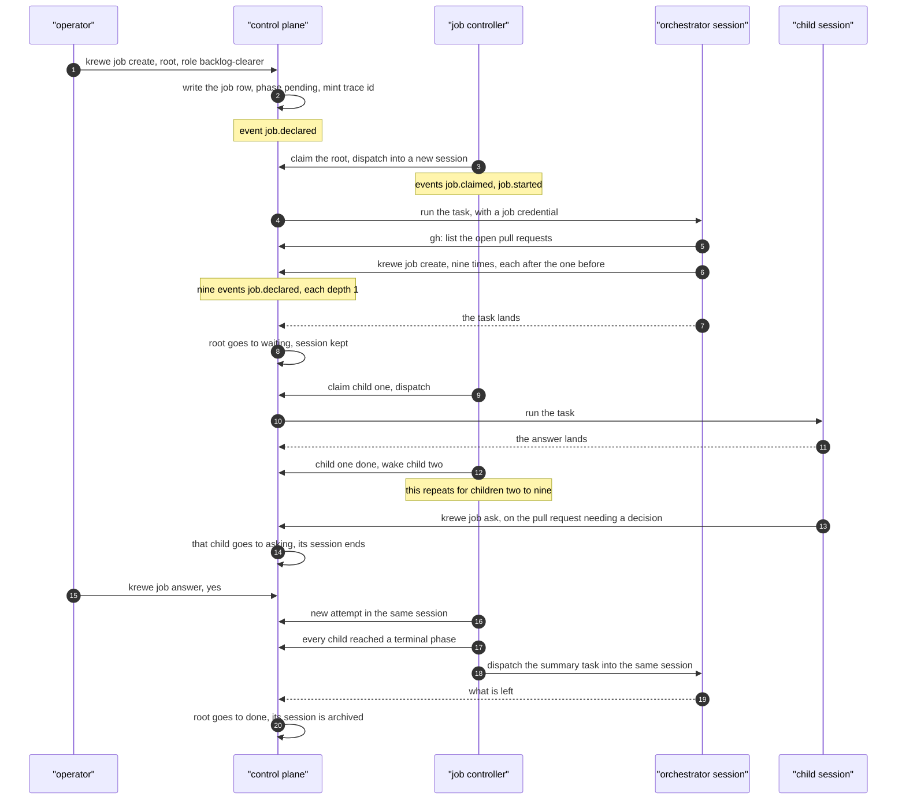

## 10. What is deliberately left out

**The largest omission, and it is a decision: this design gives the system no judgement.** It executes
declared intent and never generates it. There is no planner, no team chooser and no product manager
role here. A person or a model still writes every brief.

That is deliberate for two reasons. `quay-crew#354` already owns that decision and decided it on 17
August 2026: the team is chosen at run time by a product manager role, and writing a second design
for it would disagree with the first in a few places that somebody else would then have to find. And
the substrate is worth having on its own: a flow with no roles at all still gets durability, a read
path and a bound.

The rest, in order of how much each one will be missed.

**Only one join, and it is parent over children.** A job waits for its `after` list and a
parent waits for its children. There is no join an author writes, no condition on a dependency's
phase, and no partial join. The flow engine deliberately shipped with no joins at all, on the
argument that joins are where every workflow engine turns into a product and which join is needed
will not be knowable until two real automations exist. This adds exactly one, on a relation the store
already indexes, because scenario 8c cannot be written without it.

**Nothing cancels job already inside a sandbox.** Stopping a job stops the system taking
another step. It does not kill a model mid sentence. That is the rule `krewe flow stop` already
follows, and it is inherited rather than decided again here.

**No fairness.** `max_running` is first come first served by declared time. A tree of ninety children
starves everything else in that workspace until it drains. A workspace is the only fairness boundary,
which means one project can starve another inside the same workspace.

**A chat channel does not deliver a question.** `krewe job answer` is a command, the way
`krewe flow answer` is. A chat delivery follows `quay-crew#10`, which is blocked on a bot token rather
than on code.

**Nothing consumes `<workspace>.job`.** The export accumulates records nothing reads, which is the
expected state until a second consumer lands and is exactly what `docs/EVENTS.md` says about the two
streams that already exist.

**The controller runs in the control plane process at first.** It should be its own workload, and the
design is written so it can be, but slice 3 puts it where the flow poller already is. Moving it is a
deployment change and not a logic change, and it needs slices 1 and 5 first.

**No backup.** A system can still be destroyed by an ordinary Docker command. `quay-crew#266`.

**Nothing inside the container adopts the trace context.** Named in 8c. The system writes one span per
attempt and the inside of the attempt is opaque.

### What reads the plan before it runs, and what carries a run back into it

The omission above is that the system generates no judgement. Two gaps sit either side of that
sentence, and closing them does not close it. In each one the machine stops where judgement is
absent, and a person supplies it.

**Nothing checks the drawing before it runs, with more than one reader.**
[#520](https://github.com/atlantic-blue/quay-crew/issues/520) states the sentence,
[#576](https://github.com/atlantic-blue/quay-crew/issues/576) writes the plan and holds it for
approval, [#577](https://github.com/atlantic-blue/quay-crew/issues/577) reads the words the brief
dropped, [#580](https://github.com/atlantic-blue/quay-crew/issues/580) lists the claims the plan
rests on, and [#532](https://github.com/atlantic-blue/quay-crew/issues/532) adds one role that reads
the plan. All of them read the drawing once, with one reader, and none of them orders the work by
what a wrong claim costs.

**Nothing carries what a run learned back into the drawing.** A session found that the video
platform refuses a request for captions from the function's own address. The fact stayed in that
session's transcript. The plan still said fetch them there, and the issues still described the
product as designed.

Three issues cover the two gaps, in the order they should be built.

1. [#587](https://github.com/atlantic-blue/quay-crew/issues/587) marks the claim that decides whether
   to build at all, settles it with a spike job before the build starts, and repairs `after`, which
   is declared and validated today and never released.
2. [#586](https://github.com/atlantic-blue/quay-crew/issues/586) has several roles read the same
   brief through different lenses, and puts only the questions none of them settled to a person.
3. [#588](https://github.com/atlantic-blue/quay-crew/issues/588) carries a fact a run discovered back
   onto the claim it disproves, stops the plan that rests on it, and reports it on the issues that
   describe the product.

None of the three writes a plan, ranks a claim, or decides that a question matters. Each one records
a value, and stops.

## 11. The session lifecycle

The question is when the system starts putting sessions away. The answer today is that it never does.
Nothing in the code removes a container on its own. A person removes it, or it stays.

This section designs the states a session moves through, and it names the controller that moves it.
It sets no threshold. The reason is in the last part of this section.

### What the code holds today

A session row carries one of four statuses. They are written down in
`internal/controlplane/server.go:43` and the comment above them calls them the whole vocabulary.

- `idle`, no task is running and the last one landed.
- `running`, a task is under way.
- `failed`, the last task did not land.
- `stopped`, the session was put down and its sandbox is gone.

Beside the status sits `archived_at`, a stamp rather than a status. A session is archived or it is
not, and it also holds one of the four statuses. `ArchiveSession` stops the session first, so an
archived session is always stopped as well.

A container goes away in five ways, and every one of them needs somebody to ask:

- `StopSession`, one session, by the operator.
- `ArchiveSession`, one session, by the operator.
- `DeleteSession` and the workspace and project deletes, through `stopSessions`.
- `DrainSessions`, every live session at once.
- `ReapStrays`, at startup only, for containers whose session is gone, archived or stopped.

There is no timer, no idle sweep and no reclaim. A session that answered one question in March still
holds its container in August, if the system has not restarted.

### What drain does, and how it differs from archiving

`krewe drain` puts every live session down before something else takes the containers away. Read
`cmd/krewe/drain.go` and `internal/controlplane/server.go:1975`.

- It lists every session that is not stopped, and stops each one and closes its sandbox.
- It refuses while any task is running. The refusal names the sessions that are working.
- The word `anyway` drains over a working task. The answer then names what it interrupted.
- It writes no `archived_at` stamp, so every session stays in the default listing.
- `make upgrade` runs it, then removes any sandbox container left by name.

Archiving is a different action for a different reason.

- It works on one session, not on the system.
- It stops the session and closes the sandbox first, for the same reason drain does.
- It then stamps `archived_at`, which moves the session out of the default listing into the console's
  `archived` view.
- `Dispatch` to an archived session is refused, and the refusal says to restore it first.

The one line difference: drain is a shutdown step for the whole system, and archiving is a filing step
for one session. Both close the container. Neither deletes a conversation, a file or a row.

### What an archived session already means, checked against the code

Merged pull request 339 is titled "an archived thread runs nothing". The code does most of that and
one thing more, and the one thing more matters to this design.

What holds:

- `Dispatch` refuses an archived session (`internal/controlplane/server.go:1057`).
- `recordTask` keeps the archived session's status when a task lands late
  (`internal/controlplane/server.go:1582`). A session archived mid task does not read as idle again.
- `ReapStrays` removes the container of an archived session at the next startup
  (`internal/controlplane/server.go:733`).

What the title does not cover: **attaching to an archived session brings it back, silently.**
`AttachSession` restores the session, restarts it, and builds a sandbox for it
(`internal/controlplane/server.go:1798`). The comment above that code says why. The row used to be
the gate. An archived session then refused every action, including the one action that would fix it.

So archived means two things today. The system starts nothing in it, and one operator command undoes
it without asking. The lifecycle below keeps both, and it says which of them the controller may use.

### The states, and what moves a session between them

Six states. Four exist in the code. Two are new, and this document names them.

- `running`, a task is in flight and the container is up. Exists.
- `idle`, no task is in flight and the container is up. Exists.
- `reclaimed`, no task is in flight and the system took the container back. **New.** The row keeps its
  conversation handle, and the next task builds a fresh container over the same host state.
- `archived`, filed away by the system or by the operator. The container is gone and nothing starts it.
  Exists as a stamp.
- `stopped`, a person put it down. Exists.
- `deleted`, the row is gone. Exists.

**Why `reclaimed` is not `stopped`.** This document already holds the rule that a thing which went
quiet and a thing which was halted must never read the same. `stopped` is an operator's decision, and
it is what drain writes over the whole system. `reclaimed` is the system saving memory on a session
nobody is using. An operator who sees `stopped` looks for who stopped it. An operator who sees
`reclaimed` looks for nothing, because the next dispatch fixes it.

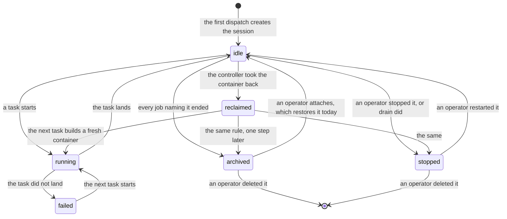

Who owns each move:

- The operator owns `stopped`, `deleted`, and the way back from `archived`.
- Drain owns the sweep to `stopped`, and it belongs to `make upgrade` rather than to a person.
- The controller in section 4 owns `reclaimed` and `archived`, and nothing else.
- The control plane owns `running`, `idle` and `failed`, which it already writes today.

### What a listing says, which is not what the row says

The row's `status` only ever knew about dispatched tasks. `StatusRunning` is written when a task
starts and `StatusIdle` when it lands, and an interactive conversation is not a dispatched task, so a
container answering somebody's question read exactly like an empty one. Eighteen sandboxes were read
on 28 August 2026 and six of them held a running model runtime. All six listed as `idle`.

That word is what an operator acts on. A restart, a drain and a reclaim all start from a listing, and
any of the three takes a running conversation away mid answer.

So a listing derives its word from three inputs rather than one field, and it says which one it is:

- **`running`**, a dispatched task is open. The row knows this and it is unchanged.
- **`attached`**, somebody has the conversation open. The container's own tmux says so.
- **`awake`**, a model runtime is up inside the sandbox with nobody watching it. The container's own
  process table says so.
- **`idle`**, none of those. The only real idle.
- **`unknown`**, the system asked the sandbox and was not told. Never `idle`.

**Why those words.** `awake` rather than `thinking` or `busy`: what the system reads is a runtime
process, and that process is up both while it answers and while it waits at a prompt, so `thinking`
claims more than was measured, and `busy` is what `running` already means to an operator. `attached`
is the word the operator typed to get there. `unknown` says the system could not tell, which is a
different thing from nothing being there, and a listing that guessed `idle` there would hand an
operator the one word that invites them to take the container.

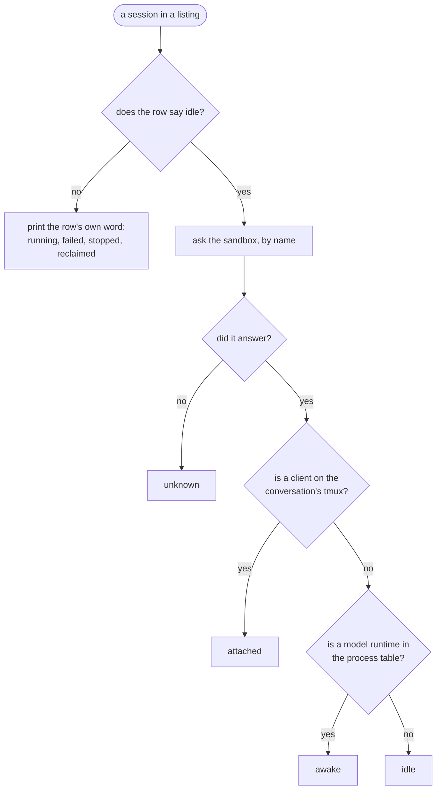

**Asked by name, and never by building a sandbox.** `SessionAttached` already documents why at
`internal/controlplane/lifecycle.go:66`: the sandbox handles are a map in one process and the
containers are not, so after a restart the map is empty while every container runs on, and a question
that made a sandbox to answer would start the very container it is asked about taking away.

**What it costs.** Two questions to the sandbox for every row that would otherwise read `idle`, and
nothing at all for any other row. They are docker execs, so a listing overlaps them, eight at a time,
and gives the whole sweep five seconds, after which every row still waiting reads `unknown` rather
than holding the view open. The budget belongs to the listing rather than to each session, so a system
of forty rows costs no more of an operator's patience than a system of twenty when the daemon is
wedged.
The figures, measured against a real daemon by
`TestWhatOneListingOfTwentySessionsCosts` in the continuous integration `integration` job:

- **PLACEHOLDER_LISTING** for a listing of twenty sessions, each with a container.
- **PLACEHOLDER_QUESTION** for one question to one container.

Because of the price, a caller asks for it: `ListSessionsRequest.presence`. The console, `krewe
sessions` and the web page set it, and the machinery that resolves an address, finds a session by
name or lists sessions to delete a project does not. A caller that does not ask reads the row's own
word, exactly as it did before.

**What this does not do.**

- **The drain is unchanged.** `DrainSessions` reads the row's own status out of the store, so it
  still refuses over a dispatched task and still puts down a session holding a conversation nobody
  dispatched. Making it refuse over `awake` and `attached` means reading presence in the drain and
  deciding what `unknown` should do there, which is its own change.
- **The reclaim is unchanged**, and it was already safe: `internal/job/lifecycle.go` asks
  `SessionAttached` before every reclaim and treats an error as attached. It does not read the
  runtime question, so a conversation answering with nobody watching it can still be reclaimed once a
  workspace sets a reclaim time.
- **`GetSession` does not ask.** One session fetched on its own reads the row's word.
- **`awake` is a process, not a thought.** A runtime waiting at a prompt with nobody attached reads
  the same as one mid answer, because from outside the container they are the same thing.
- **The match is deliberately wide.** Anything in the sandbox whose program name is the runtime's
  counts, so a session running `grep claude` reads `awake` while the grep lasts. Reading a live
  conversation as empty invites a drain over the top of it; reading an empty container as busy holds
  it a little longer.

### How the controller in section 4 owns this

The controller reconciles job. A session is not a second resource with its own declaration. **The
declared state of a session is derived from the job that names it.** So this lifecycle belongs to
the same loop rather than to a second one.

The rule, in three lines:

- A session named by a job in a non terminal phase is wanted alive. The controller does
  nothing to it.
- A session named only by terminal job, whose last task landed longer ago than the workspace's
  reclaim time, is wanted reclaimed. The controller closes the sandbox and writes `reclaimed`.
- A session named only by terminal job, and reclaimed for longer than the workspace's archive time,
  is wanted archived. The controller archives it, which is `ArchiveSession` with no operator.

The last two rules are two queries and not one, and that is what went wrong. A reclaimed session
stays settled, and where no archive time is set nothing ever moves it, so one batch ordered by how
long ago each row was touched fills with rows nothing can act on and never reaches a container. On
31 August 2026 twelve idle sandboxes held a whole machine behind twenty of those rows. See issue 575
and the fifth comparison in section 4.

Each rule is a query per tick, on the same index the other three use. The controller keeps
nothing in memory, which is the property section 4 depends on.

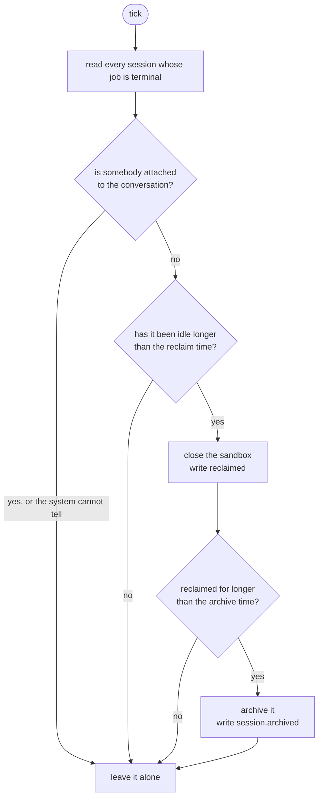

**One gap this design did not close, and it was the dangerous one.** The system could not tell whether
an operator was attached. `AttachSession` returns a `tmux` command that the operator runs against the
container, and the system recorded nothing about it afterwards, so a controller that reclaimed on idle
time alone would close a container an operator is typing into.

Two signals would work, and the first is built. The system asks the container whether the `krewe` tmux
session inside it has a client, through one exec: `DockerProvider.Attached`, and the controller reads
it before every reclaim. The other, stamping the row on attach and refreshing the stamp while the
pane is open, was rejected: a stamp needs somebody to keep it fresh, how often is a number, and no
measurement has set one.

The container answers a second question now as well, which is the subject of the section below.

### Can a session resume after its container goes, and what does it cost

Yes, and two mechanisms in the code already do it.

- **The state is on the host, not in the container.** The workspace's conversation store and the
  project's files are mounts. The comment at `internal/controlplane/server.go:1837` states the
  property: a fresh container over the same mounts is the same conversation.
- **The provider adopts a container by name and starts a stopped one.**
  `internal/sandbox/docker.go:70` adopts, and the adopt function at `internal/sandbox/docker.go:86`
  starts a container that had stopped. So a reclaim that only stops the container is cheaper still.

A resume does seven things, in this order. It creates the container. It prepares the mounts. It
writes the context files. It renders the hooks. It checks that every skill's binaries are in the
image. It runs each skill's setup script once. It sets up commit signing. The setup runs once per
container, marked by a file under `/tmp` (`internal/controlplane/server.go:410`). Repositories are
not cloned again. A workspace keeps one clone in its own volume under `/home/agent/shared/repos`.

**No number is given here, because none was measured.**

### The quantities to measure, and the commands that would measure them

Three numbers decide the reclaim time and the archive time. Each is marked provisional until the run
exists. None of the commands below was run for this document.

**One, the idle gap.** The time between one task landing in a session and the next task starting in
the same session. The distribution of that gap is what a reclaim time has to sit above. The `tasks`
table holds `occurred_at` per task and an index on session and time, so one query answers it:

```
docker exec -i quaycrew-postgres-1 psql -U quaycrew -d quaycrew -c \
  "select session, occurred_at - lag(occurred_at) over (partition by session order by occurred_at) as gap from tasks order by session, occurred_at"
```

Read the ninety fifth percentile of that gap. Set the reclaim time above it. A reclaim time below it
throws away containers that were about to be used.

**Two, what a resume costs.** Remove one session's container by name, then time one task against it,
then time a second task against the warm container. The difference is the resume.

```
docker rm -f krewe-<session id>
time krewe task <session id> "reply with ok"
time krewe task <session id> "reply with ok"
```

`krewe task` waits for the answer and prints it, so both numbers include one model call. The
subtraction removes it.

**Three, what a reclaim buys.** The memory an idle container holds.

```
docker stats --no-stream --format "{{.Name}} {{.MemUsage}}"
```

That number times the count of idle sessions is the whole benefit. If it is small, the reclaim time
should be long, and the honest answer may be that reclaiming is not worth building yet.

**Until those three runs exist, the system ships with the reclaim time and the archive time unset, and
an unset time means the controller does nothing.** That is today's behaviour, so the first version of
this loop changes nothing until an operator sets a number. It refuses a number it was never given
rather than choosing one.

### What shipped, and what it does not do

Slice 7. The mechanism is built and both numbers are absent.

**The state.** A session status `reclaimed`, beside the four that existed, and a `reclaimed_at`
stamp on the row. The container is gone; the row, the conversation handle, the workspace's
conversation store and the project's files all stay. A task sent to a reclaimed session builds a
fresh container over the same mounts and the conversation carries on, which is the property
`internal/controlplane/server.go` already relied on for restarting a stopped session.

**The fourth query.** `SettledSessions` on the store: live, not running, and named by no
job in a non terminal phase, oldest touched first. It runs once a tick, on `sessions_settled_idx`.
A session an operator stopped is left out, because filing away what somebody halted overwrites a
decision with bookkeeping.

**The two times.** `reclaim_seconds` and `archive_seconds` on `workspace_limits`, read and written
with `krewe limits <workspace> --reclaim <duration> --archive <duration>`. Both default to zero, and
`krewe limits` prints "unset" beside what unset does. The reclaim time is measured from the session's
last write, and the archive time from `reclaimed_at`.

**The attached signal.** `Provider.Attached` asks the container whether the `krewe` tmux session
inside it has a client, through one exec. That is the first of the two options above, chosen because
it needs no new state and nothing to keep fresh: stamping the row on attach would need the console to
refresh the stamp while the pane is open, and how often is a number nobody has measured. The
controller reads a failure as attached, never as nobody, so a daemon that will not answer costs a
container held longer rather than a conversation closed under somebody's hands. A controller with no
signal wired reclaims nothing at all.

The exec is asked last, after the clock, so a system whose reclaim time is unset never runs it. That is
why the unmeasured cost of the signal is not a reason to hold the mechanism back: with the number
absent, the cost is zero.

**Stopping one session**, from `quay-crew#395`. `krewe stop <session> [<reason>]` halts the task a
session is running and keeps the session: the conversation, the container and the history all stay,
and the next dispatch continues it. The task record reads `stopped` with the operator's own reason
rather than `failed`, and a job running in that session is stopped with the same reason
rather than failed with whatever the runtime said about being killed. A stop while nothing is running
says so and changes nothing. It answers only once the task has actually ended.

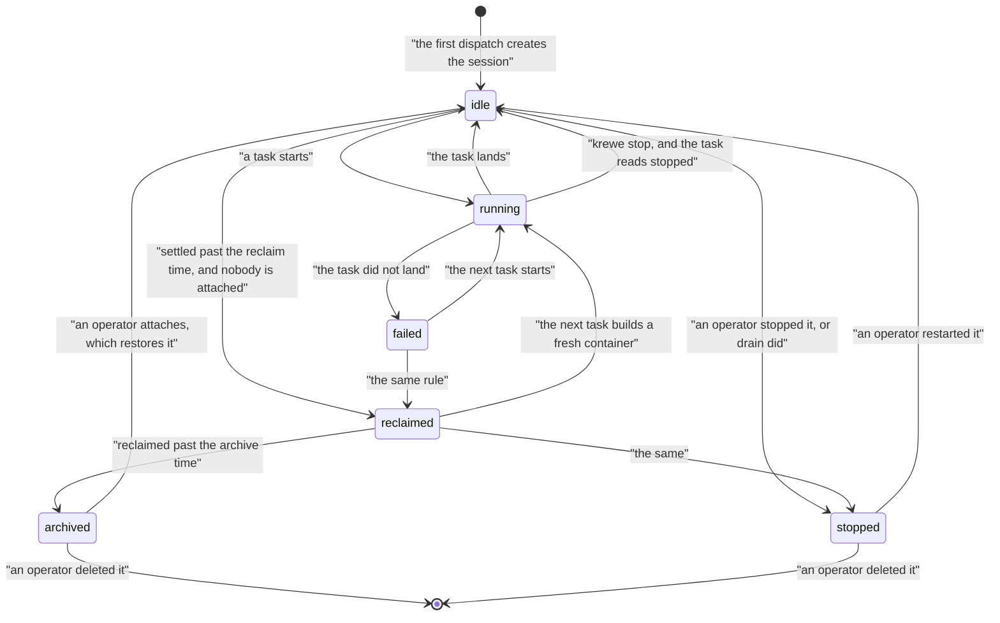

**What this slice does not do.**

- It sets no number, and it will not until the three runs above exist. A system upgraded to this build
  behaves exactly as the one before it.
- The controller does not reclaim a session an operator stopped, and never archives one.
- It does not stop a container it cannot ask about. After a control plane restart the provider is
  still asked by name, so this is not a gap, but a daemon that is unreachable holds every candidate.
- It does not measure anything. Nothing here records how long sessions sit idle, so the first of the
  three runs still has to be done by hand against the `tasks` table.
- Nothing reclaims on a `local` sandbox, which has no container to take back.

## 12. The console is the orchestrator's seat

The console is where an operator sits. This section says what the operator's screen should hold once
job exists, and why a conversation beside it cannot be an ordinary session.

### What the console is today, checked against the code

**`krewe` opens the console, full width, and nothing else.** It used to build a tmux window with the
console in one half and a conversation in the other, and an operator who typed `krewe` got a split
screen they never asked for. `cmd/krewe/quay.go` refuses the word `panel` and names what to type
instead.

**A conversation is asked for by name.** `p` in the console splits the window and puts one beside it,
from inside tmux, and `krewe attach <session>` opens one on its own. `panelSession` in
`cmd/krewe/panel.go` calls `OpenDriver` for the project the operator is standing in, so pressing `p`
on no session opens the driver rather than dropping the operator into somebody else's job. The
commands that split the window live in `internal/panel/panel.go`.

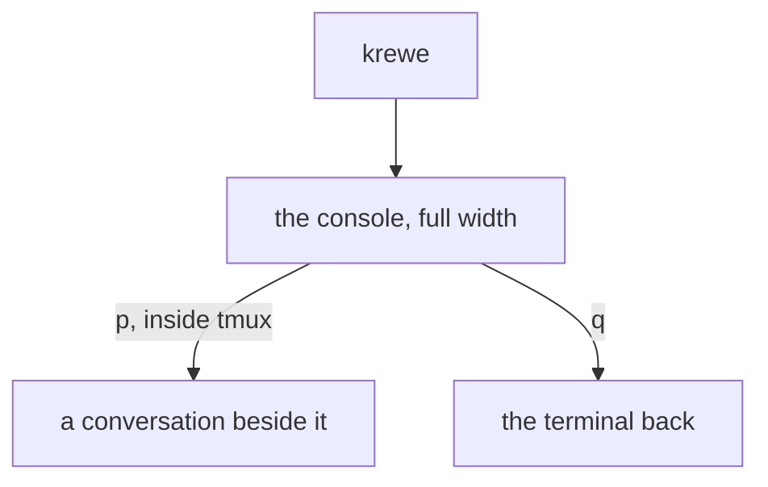

### Why a driver session cannot be an ordinary session

Two properties follow the `driver` flag on the session row, and both are decided when the container
is created. A third used to, and no longer does.

- **The driver's own token, and the address beside it.** `taskEnv` in
  `internal/controlplane/server.go` writes `QC_GRPC_ADDR` and the driver's token when
  `session.GetDriver()` is true. That token is the system's own interface, refused the named list in
  `deny.go` and holding everything else. It is not the same thing as the credential a session gets:
  that one is minted for one job, carries the verbs its role declared, and expires with the job.
- **The extra host paths.** `runArgs` in `internal/sandbox/docker.go` adds the driver mounts, and an
  ordinary session gets none of them. That is what makes the driver the glue between the machine and
  the system.
- **The network is no longer one of them.** It was, and the two halves of this document disagreed
  about it for two days: this section said an ordinary session's container is not on a network that
  reaches the control plane, while section 5 handed that session a credential for an address it could
  not resolve. `quay-crew#435` settled it the way section 5 needs. Every sandbox joins a network the
  control plane is on, and only the control plane is on it. `QC_SANDBOX_NETWORK` still names the
  system's own network, which carries the store, the broker and the dashboards, and only the driver
  joins that, when an operator asks for it.

So the boundary is no longer locality. What a session may do is the credential, and the flag decides
what a session holds rather than what it can address.

The flag reaches the container at `internal/controlplane/server.go:345`, where `cfg.Driver` is set,
one line after `cfg.Env` is filled from `taskEnv`.

### What a sandbox keeps, and what that forces

A sandbox is born with its configuration. `internal/sandbox/docker.go:70` adopts a container that
already carries the session's name, and returns it untouched. The comment at line 58 says what an
adopted container carries. It carries what it was created with.

Three things follow, and they decide the design rather than decorating it.

- **There is no promotion.** Setting `driver` on a row that already has a running container gives it
  nothing. The driver has to be born a driver, which is what `OpenDriver` and `FindOrCreateDriver`
  already do.
- **A capability granted after birth needs a new container, or it needs a per task path.** The per
  task path exists. `taskEnv` is read twice: once into `cfg.Env` at sandbox creation, and once into
  `model.Request.Env`, which `internal/model/claudecode.go:98` puts on `sandbox.Spec.Env` for that
  one command. **So the job credential in section 5 travels per task, and it must not be written at
  sandbox birth.** A value written at birth would label every later task with the first task's
  grant. That is the same trap section 8c names for the trace context.
- **An upgraded system adopts containers born under the old build.** That is section 13's problem, and
  it is the reason it is a separate section.

### What the driver may do, and what it may not

`internal/controlplane/deny.go` holds the policy. `cmd/controlplane/main.go:198` installs it over the
driver's token only.

Ten calls are refused outright, at `internal/controlplane/deny.go:33` to line 42: `SetSecret`,
`ListSecrets`, `ImportSkill`, `AttachSkill`, `DetachSkill`, `ImportRole`, `AttachRole`, `DetachRole`,
`SetSessionPermissionMode` and `ImportFlow`. An eleventh case is conditional: `SetContext` is refused
only when the scope is `system` (line 44). So the count depends on how a conditional refusal is
counted. Ten methods can never be called. One more can be called at two of its four scopes.

`Dispatch` and `StartFlow` are not in the list, and the comment at line 20 says why. Starting a run
of a flow the operator already imported reaches nothing that dispatching directly would not reach.

So the driver may do these things:

- create a workspace, a project or a session;
- dispatch a task;
- start, stop and answer a flow;
- set context at the workspace, project and session scopes;
- read what the system already holds.

The driver may not do these things:

- set or read a secret;
- import, attach or detach a skill or a role;
- set a session's permission mode;
- import a flow;
- write the system's own context.

**One gap worth naming, because it is the same argument as a skill.** `ImportHook` and `AttachHook`
are not in the deny list. A hook is a command that runs on the session's own tool use. So a session
that can attach one changes what every session in that workspace may do. The four hook calls are
declared at `proto/quaycrew/v1/controlplane.proto:896`. Adding them to the deny list is a four line
change. It belongs with the capability slice.

**What this section adds.** The driver keeps every verb above. It gains the four job verbs from
section 5, the same way any other session does, through a role with a `verbs` list. The driver then
stops being a special case in the code. It becomes an ordinary session with a wide role.

### What the left half should show once jobs exist

The console opened on a flat list of every session in the system. `Default` in
`internal/console/console.go` said `sessions`, and `DrillTo` on each resource in
`internal/console/resources.go` took a workspace to its projects and a project to its sessions.

A flat session list is the wrong shape once one operator command produces eleven sessions. Section 8c
says so plainly: eleven sessions with no relation between them is the problem.

So the left half is a tree of four levels, and it opens at the top.

- Workspaces. Every workspace the system holds, which is what `krewe` opens on now.
- Projects. Inside one workspace.
- Jobs. Inside one project, newest first, with the phase and the word the job ended on. The session
  is a column on the job row, not a level of its own.
- The running work. Inside one job: the tasks its session ran and what each one produced. This is
  the level a person watches something happen on, so opening the conversation and shelling into the
  sandbox are both keys here.

Enter goes one level down and escape comes one level back, from every level including the deepest.
The sessions of one project are still one key away, on `s`, and every flat listing is still one word
in the command bar.

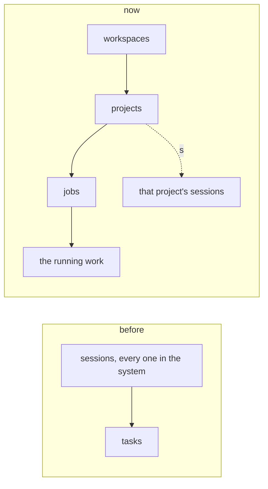

The right half does not change shape. It stays one conversation, and it stays the driver's. What
changes is that the driver now declares jobs rather than dispatching tasks, so the left half shows
what the right half asked for.

**The browser takes the same shape, and it took it first.** `quay-crew#547` built the briefing at the
front door of `krewe web`, and its job rows are this tree: roots at the top, children under them, the
session as a cell rather than a level. A page cannot drill, so it draws the depth instead, and a block
keeps only the branches holding a row that answers it. The console's own version of this is
`quay-crew#474`, and the two must not grow into different shapes.

## 13. Surviving an upgrade

`quay-crew#397` records the cost. Taking a fix costs every running session, and nothing tells an
operator that the stack is behind. On 27 August 2026 three symptoms were investigated as live
defects. All three were already fixed, and the system was running a build from five days earlier.

### What drain already gives, and why it is not enough

Drain makes the loss orderly. Section 11 describes what it does. The value is real. A container
removed by name takes its task with it and says nothing useful. A drained session says stopped, and
that is true.

It is not enough for three reasons, and none of them is a defect in drain.

- **It is a loss, made tidy.** Every session's container goes. Each one comes back on the next
  attach or the next dispatch, and each pays the resume cost in section 11.
- **The word `anyway` still loses the task.** The answer names what it interrupted. Naming a loss is
  better than hiding one, and it is not the same as keeping the job.
- **A task runs inside the control plane process.** `SettleTasks` runs once at startup and marks
  every session the store still calls running as failed
  (`internal/controlplane/server.go:762`). The reason it writes is "the system restarted while this
  task was running, so it did not finish". So even without drain, a restart ends every task in
  flight as far as the system's records are concerned.

### Where the job state must live

In Postgres, on the `job` row. The container is disposable and the process is disposable. That is
the same rule the rest of this document holds, and an upgrade is the case that proves it.

What survives an upgrade today, without any new code:

- The session row, its conversation handle, and its history.
- The conversation itself and the project's files, because they are host mounts rather than container
  layers.
- A container that was not removed, because the provider adopts one by name and starts a stopped one.

What does not survive:

- The task in flight, because the goroutine running it is in the control plane process.
- The answer, because the reply is read from a stream the control plane holds.

**One thing here is not proved, and it must not be asserted.** The model runs through
`docker exec` started by the control plane. When the control plane dies, the client that reads the
stream dies. Whether the process inside the container also stops is a property of the daemon and it
was not tested for this document. The measurement is one run: start a long task, kill the control
plane container, then run `docker exec krewe-<session id> ps -ef` and look for the model process.
Until that run exists, the design assumes the answer is lost either way. That is the safe assumption,
because the system cannot read a stream it no longer holds.

### What an in flight job does across a restart

Section 4 already covers a controller that dies while the control plane lives. This is the other
death, and it costs more.

```mermaid
sequenceDiagram
    autonumber
    participant OP as "operator"
    participant CP as "control plane"
    participant DB as "Postgres"
    participant SBX as "the session container"

    OP->>CP: make upgrade
    CP->>DB: job is running, lease held, session set
    CP->>SBX: the task is under way
    Note over CP: the process stops
    CP--xSBX: the stream is lost
    Note over CP,DB: a new control plane starts
    CP->>DB: SettleTasks marks the open task failed
    CP->>DB: the job row still says running, lease expiring
    Note over DB: the declaration outlived the process
    CP->>DB: the controller reads the task row and sees failed
    CP->>SBX: attempt 2, in the same session
    SBX-->>CP: the answer lands
    CP->>DB: job is done, answer written
```

The lease from slice 4 of the delivery order is what makes that safe, and it does two jobs here.

- **It bounds how long the job sits still.** The new control plane does not know which controller
  held the row. It waits for the lease to expire, and then any controller may claim it.
- **It stops two controllers starting attempt 2 at once.** The claim is conditional in one statement,
  so one wins.

The cost of this death is one attempt's tokens. That is worse than the controller death in section 4,
where the answer was adopted from the task row and nothing was paid twice. The difference is worth
stating plainly: **when the controller dies, the job is recovered; when the control plane dies, the
job is retried.** Closing that gap needs the task to run where a control plane restart cannot reach
it. That is a change to where the model runs, and this design does not make it.

### A version drift warning

**Shipped on 27 August 2026.** The system reports its own build, `krewe version` prints all three, and
any command says on standard error when the tool and the system are different builds. What follows
describes what was true before that, and it is kept because it says why the shape is this one.

**Today the client cannot learn the system's version at all.** This was checked against the code.

- `krewe version` prints the tool's own stamped build and nothing else
  (`cmd/krewe/quay.go:134`, `cmd/krewe/main.go:23`).
- `GetInfoResponse` carries seven fields and none of them is a version
  (`proto/quaycrew/v1/controlplane.proto:773`). It reports the model, the sandbox kind, the store,
  the state, the events log, the secrets backend and the sandbox image build.
- `sandbox_build` is the build the sandbox **image** was made from, read from an image label at
  startup (`internal/sandbox/docker.go:232`). The console compares it against the tool's own build
  and says the image is older (`internal/console/view.go:210`). That is a real drift warning, and it
  is about the image rather than about the control plane.
- The only signal about the control plane itself is coarse. `internal/console/model.go:583` turns an
  `Unimplemented` answer from `GetInfo` into "this control plane is older than the tool". That fires
  only when the system is old enough to lack the call entirely.

So a system nineteen commits behind reports nothing, which is exactly the case `quay-crew#397`
describes.

The fix is small and it is one field.

- Stamp the control plane binary with its build at compile time, the way `make install` already
  stamps the tool.
- Add `version` to `GetInfoResponse`, beside `sandbox_build`.
- `krewe version` prints three lines: this tool, the system, and the sandbox image. Where any two
  differ, it says so in one sentence and names `make upgrade`.
- The console.s footer row shows the same difference, because that is the surface an operator is
  already looking at. It already gives the whole right of that row to "run make upgrade" when the
  control plane is too old to say what it is running.

**What this does not give.** A commit count. The tool holds no repository, so it cannot count the
commits between two builds. It prints both builds and says they differ. Counting them is one `git`
command the operator runs, and the sentence names it.

**Test the way off, as `quay-crew#397` asks.** Two scenarios, and both belong in the same change.

- A client whose build differs from the system's reports the difference, and the report names both
  builds.
- A client against a system with no `version` field at all says the system is too old to say, rather than
  showing a blank column.

### Upgrading without taking the job away

The full answer is that a session's state belongs in the store rather than in the process, and most
of it already does. Three steps in order, and each is worth having on its own.

- **Say how far behind the stack is.** The field above. It removes the whole cost recorded in the
  issue, which was hours spent reproducing fixed defects.
- **Keep the job declaration outside the process.** The `job` row and the lease. An upgrade then
  costs one attempt rather than the intent.
- **Stop removing the containers.** `make upgrade` removes every sandbox by name after draining. The
  provider already adopts a container by name, so a new control plane can pick the containers up
  instead. This step carries a constraint, and `quay-crew#397` names it. A sandbox keeps the
  configuration it was made with. So an adopted container runs the `quay` from the older image, and
  it holds the environment it was born with. An adopted container is therefore safe for a
  conversation and unsafe for a new capability. The system must say which build a container was born
  from, rather than assume. The session listing already has a column for how stale a session is.

## 14. Job and flow runs, after the trigger node

`quay-crew#399` was opened on 27 August 2026. It says the engine has no trigger node. So a run starts
only on a schedule, on a manual start, or when a wait comes due. Its four event kinds are `started`,
`task.finished`, `due` and `answered`. Every one of them is internal, and none of them says that the
world changed.

It also names the blocking dispatch, and this document confirms the line.
`internal/flow/engine.go:297` calls `e.plane.Dispatch` and reads `resp.GetReply()` from the same
call, so a run holds its own dispatch open and can react to nothing while it waits. Section 8b of
this document already disagreed with that behaviour, and the issue is now the tracked home for the
disagreement.

The issue keeps the rule this document keeps. Postgres stays the source of truth. The event log is
the way in from outside, and never the state.

### Is a flow run a job, or does a job start a flow run

**A flow run is carried by a job.** Starting a run declares one job, and the run
row hangs under it. There is one tree, and the tree is the job tree.

The composition, in three lines:

- Starting a run writes a job whose brief names the flow and its version. That job is a
  node in the tree, at the depth its caller sits at.
- The run row keeps its own state, its node, its transitions and its pinned version. Nothing about
  the reducer changes.
- Every step the run dispatches is a job whose parent is the run's own job, which is what
  section 8b already designed.

```mermaid
flowchart TD
    R["job: run the release flow, depth 1"] --> RUN["flow_runs row, pinned to version 3"]
    RUN --> S1["job: step build, depth 2"]
    RUN --> S2["job: step test, depth 2"]
    RUN --> S3["job: step publish, depth 2"]
    S2 --> N1["job: a child the step declared, depth 3"]
```

**Why this way round, and not the other.** Two hierarchies would need two of everything, and the two
would disagree.

- **Depth.** The document bounds recursion with one counter derived from the credential. A run
  outside the job tree would need its own counter. A cycle crossing from one hierarchy to the other
  would then be counted by neither.
- **Budget.** A tree budget only holds when every descendant draws from its parent. A run outside the
  tree spends without drawing from anything.
- **Stopping.** `krewe job stop` on a parent must stop what is under it. With one tree, stopping the
  run's job stops the run. With two, stopping a job leaves a run going and nobody notices
  until the bill arrives.
- **Reading.** The console shows one tree, as section 12 describes. A second hierarchy would need a
  second view and a rule about which one an operator opens first.

The decision costs one extra row for every run, and one more level of depth for every step inside a
flow. A flow started by a session at depth 1 puts its steps at depth 3. So a workspace whose
`max_depth` is 2 cannot run a flow from inside a session. That is a real constraint, and it is stated
rather than hidden. The alternative, letting a run's steps take the run's own depth, was rejected
because it makes a flow a way to gain a level.

### What of this shipped on 27 August 2026

The composition above is built. A run is carried by a job, every step hangs under that one,
and there is one tree. The columns are `flow_runs.job` and `flow_runs.step_job`, added by migration
`0033`, and the poller's query reads the second.

Two things this section said that the code says differently, and both are stated here rather than
left for somebody to find:

- **The controller now runs jobs under a parent and jobs in a role.** It ran roots only, which would
  have left every step of every flow pending forever. A job that waits for something in `after` is
  still left alone, because nothing honours ordering yet, and the tree budget is enforced for nothing,
  a root included.
- **A step is not checked against `max_depth` a second time.** Section 5 says the ceiling refuses a
  write above it, and it does, for the run's own job, counted from the credential of whoever started
  the run. The steps under it are not a way to recurse: a graph is a finite set of nodes with a
  transition cap. Checking each step against the ceiling would have meant no flow could run at all
  until an operator raised a limit, because the default is zero.

### What of the trigger node shipped, 27 August 2026

Slice 9, the first slice of `quay-crew#399`. A run can now start because something happened.

**The `trigger` node type.** It is the node a graph begins at, and a graph may have one. A trigger
node anywhere else is refused at import, because a node a run walks onto after the thing that
triggered it already happened reads as reacting and is not. It declares nothing: what a trigger
carries is decided by whoever raises one, and the row names the graph rather than a node. The reducer
walks straight through it onto the first node that does work, so passing through costs no transition
out of the graph's cap.

```yaml
name: fix-red
version: 1
mode: edits
nodes:
  arrived: { type: trigger }
  fix:     { type: dispatch, prompt: "the build at {{url}} is red. Fix it." }
edges:
  - [arrived, fix]
  - [fix, done]
```

**The `pending_triggers` table**, migration `0035`, with the shape section 14 gives it above: the
graph to run, where to run it, what the trigger carried, what caused it, and the claim. The payload
becomes the run's opening state, which is what `{{url}}` above reads.

**An in process source.** `flow.Engine.Raise` writes one row. A caller inside the control plane's own
process calls it, and it is one statement, so it can sit in the transaction of whatever caused it.

**The poller claims and starts.** A fourth thing its tick does, beside carrying worked steps on,
starting scheduled runs and resuming waits. The latency is the poll interval, five seconds.

```mermaid
stateDiagram-v2
    [*] --> pending
    pending --> pending: a claim runs out, so another poller takes the row
    pending --> started: claimed, and the run written in the same transaction
    pending --> failed: no such flow, or a graph that does not begin at a trigger node
    started --> [*]
    failed --> [*]
```

**Exactly one run per trigger, and two writes make it so.** The claim is a conditional update in one
statement, the same lease discipline the job controller holds a job under, so two pollers
reading one pending row leave one holder. Then the run, the job carrying it and the row
saying started land in one transaction, so a poller that dies after writing the run leaves a row that
says started rather than one the next poller starts again. Either alone stops a second run in the
ordinary race; both are needed for the crash.

**A trigger that starts nothing fails loudly and keeps the sentence.** A flow nobody imported, or a
graph that does not begin at a trigger node, marks the row `failed` with the words that say what to
do about it, and the poller logs it once. It is not retried: a trigger read, refused and logged every
five seconds forever would still leave a row saying pending, which reads exactly like a trigger
nobody has got to yet.

**A triggered run is carried by a job like any other**, and its own job carries the label
`flow.trigger`, so `krewe job list --label flow.trigger=<id>` says why a run nobody started exists.
Where the trigger names the job that caused it, the run's own job hangs under that job, which is
what makes the depth limit bound a flow that triggers itself.

**What it does not do.** Nothing outside this process can raise a trigger. There is no ingress and no
broker: `QC_KAFKA_SEEDS` is untouched, a system with it unset loses the export and nothing else, and
reading the event log to write a trigger row is slice 3 of the issue. Nothing in the system raises one
either: a job reaching a terminal phase does not write a trigger row yet, because which
flows a finished job should trigger is a matching rule this slice does not decide. There is
no command that lists triggers or shows why one failed, so a failed row is read from the log line or
from the database. `krewe flow` is unchanged.

### Trigger rows and job events: one mechanism, two tables

They are **two tables and one mechanism.** The shapes look the same on purpose, and merging them
would break both.

The mechanism, which the system already uses three times, for waits, for dispatch idempotency and for
job events:

- Write the row in the same transaction as the thing that happened, so there is no gap for a crash
  to hide in.
- Poll an indexed query rather than hold a timer.
- Where the row must be acted on once, claim it with a conditional write in one statement.

Why the tables stay apart:

- **An audit record is never claimed.** `job_events` is the history. Marking a row consumed rewrites
  that history. A later reader would then see a record that says something different from what it
  said when it was written.
- **A trigger must be claimed exactly once.** A pending trigger row is a queue entry. It is claimed,
  acted on and finished, and the claim is what stops two pollers starting two runs from one event.
- **They are read by different queries.** A trigger poll reads the few rows that are pending. An audit
  read is by job identifier and by time. One table would make the trigger poll scan the history
  forever.

So `pending_triggers` is its own table, with the shape `quay-crew#399` gives it, and `job_events`
stays the audit record described in section 8.

**Where an outside event comes in.** The log is the way in and never the state. A consumer reads the
broker and writes a `pending_triggers` row. A broker outage delays a trigger and never loses a run,
because the run only ever starts from the row. That ingress is also the first real consumer the
export has ever had, which answers the correction in section 8. Today nothing reads
`<workspace>.tasks` or `<workspace>.sessions`. The trigger ingress is a better reason to run a broker
than the audit export is.

### A job finishing is an event. Can it trigger a flow

Yes, and it should. It is the case the system needs most: a review finishes, so a fix starts.

The path, and every part of it already exists or is designed above:

```mermaid
flowchart TD
    DONE["a job reaches a terminal phase"] --> TX["one transaction:<br/>write the phase, the job event,<br/>and a pending trigger row per matching flow"]
    TX --> POLL["the poller reads pending triggers"]
    POLL --> CLAIM{"claim the trigger row"}
    CLAIM -->|"another poller won"| DROP["do nothing"]
    CLAIM -->|"claimed"| NEW["declare the run's own job,<br/>parent is the job that finished"]
    NEW --> DEPTH{"is the new depth<br/>within the workspace limit?"}
    DEPTH -->|"no"| REFUSE["stop, reason names the limit"]
    DEPTH -->|"yes"| RUN["start the flow run under that job"]
```

**What stops this becoming an unbounded loop.** Four bounds, and the first is the one that actually
holds.

- **Depth, which the document already has.** The run's job is a child of the job that finished. A
  flow whose own step finishes and triggers the same flow again gains one level of depth every cycle,
  so the workspace's `max_depth` ends it. The refusal names the limit, and the record shows the whole
  chain, because every link is a parent pointer.
- **The tree budget.** Every cycle draws from the same root's remaining tokens. A loop that is under
  the depth limit still stops when the budget is spent.
- **The transitions cap inside a run.** `flow.DefaultTransitions` is 100 movements, checked before
  each movement.
- **Only an operator imports a flow.** `ImportFlow` is refused to a session's own token
  (`internal/controlplane/deny.go:42`), so a session cannot write itself a trigger rule. The loop
  above needs a flow file that a person reviewed.

**One rule to add, and it is cheap.** A trigger row carries the job identifier that caused it. A
flow may then declare that it does not trigger on jobs in its own tree. That turns the depth bound
from a backstop into a refusal at the right moment. It is optional, because the depth limit already
makes the design safe.

### What stays exactly as it is

Postgres is the state. The event log is the export. A run pins its version. A wait is a column, an
ask moves on an answer and on nothing else, and a dispatch is idempotent per step and attempt. This
section adds one table and one node type, and it changes none of those.

## 14b. The first usable path

A run stops once, at the first thing a person can open, and asks whether it is the product. This is
the second half of `quay-crew#520`, and it shipped on 31 August 2026.

The failure it answers is in section 3's `product` field. A tree of jobs built a design document
faithfully and delivered it complete, every check was green, and the operator opened it two days
later and could not use it. Section 3 gives the sentence to every session. It does not give a run
anywhere to stop, so nothing ever measures what was built against the sentence while stopping is
still cheap.

**What a graph declares.** Two lines, and both are optional until the first one is used.

- **`product`, at the top of the file.** The one sentence a run of this graph serves, held to the
  same ceiling a job's is, `job.ProductLimit`. It goes onto the job carrying the run, so every step
  under it carries the same one and every session doing a step is given it above its brief. Nothing
  new does that: the inheritance in section 3 already does.
- **`usable: true`, on one dispatch.** This step builds the thing a person opens, and it replies
  with the address.

**Three refusals at import**, because a refusal in the middle of a run arrives hours later with
nothing pointing back at the file.

- Two nodes marked usable, because a run stops once and which one is first is a property of the file
  rather than a race in the run.
- A node that is not a dispatch, because only a dispatch builds anything.
- A usable node with no `product`, because the question is the sentence. Without it the operator is
  shown an address and asked whether it is right, which is the question that was never worth asking:
  right against what.

**What the run does.** The step lands, and instead of following its edge the run goes to `asking`
with a question naming the address the step replied with and the sentence the run serves. It holds
nothing while it waits, which is already true of every asking run. A step that replied with no
address stops the run instead, with a reason saying so, because a question naming something nobody
can open is a gate that passes by being empty.

It stops once. The run records that it asked in its own state rather than counting attempts, so a
graph that sends the work round again over the same step does not put a question the operator has
already answered, and the second time round the sentence is the new one.

**What an answer does.** `yes` follows the edge and changes nothing. Anything else is the sentence
the operator wanted instead: it is held to the sentence's ceiling, written onto the job carrying the
run, and the run follows the same edge. So the run does not end, and every step declared after it
carries the new sentence.

**The order matters and it is the one thing here that is not obvious.** A step reads what it serves
off the job above it as it is written down, so the replacement lands on that job before the step is
declared, not in the transaction that declares it. Written a moment later it would reach every step
except the one the answer was about, which is the step the answer was for.

```mermaid
flowchart TD
    PAGE["dispatch: the first thing a person can open"] --> ASK{"the run stops and asks:<br/>here is the address, here is the sentence"}
    ASK -->|"yes"| ON["the run carries on, the sentence unchanged"]
    ASK -->|"anything else"| NEW["the sentence is replaced on the job carrying the run"]
    NEW --> ON
    ON --> NEXT["every step after this is declared with the sentence the run serves now"]
```

**What it does not do.** It is the flow engine's, so it reaches a tree of jobs only where a flow runs
one. A caller that declares its jobs directly has nowhere to stop, and no graph in `flows/` marks a
step yet, because none of the three builds a first usable path.

## 15. Delivery order

Ten slices, smallest useful thing first. Each one names which of the three blockers it removes.
Blocker three is already fixed at `e53befc`, so nothing below is spent on it.

This list replaces the seven slices this document first carried. Three are new: slice 2 comes from
`quay-crew#397`, slice 7 comes from section 11, and slice 9 comes from `quay-crew#399`. The old
numbers map across as 1, 3, 4, 5, 6, 8 and 10.

**1. Print one answer whole.** `krewe answer <session>` writes the most recent landed task's reply to
standard output with nothing else on it. `--all` writes the history. No new table, no new call, no
controller.

*Removes blocker two, entirely, on its own.* It is one command and about thirty lines, and after it a
caller outside the system can already read an answer as data. Ship it first for that reason. `krewe task`
already prints the reply of a task it waited for. This closes the other half, which is reading back
an answer the caller did not wait for. That is now the default for `krewe task --dispatch`.

**2. The system says which build it is.** A `version` field on `GetInfoResponse`, stamped into the
control plane binary at build time. `krewe version` prints the tool, the system and the sandbox image,
and says when any two differ.

*Removes no blocker, and removes the largest recorded waste.* `quay-crew#397` counts hours spent
reproducing defects that were already fixed. It is a field and a sentence, and it is independent of
everything else in this list.

**3. The job record, the read path and a controller that runs a root.** The `job` table, the
`job_events` table, `CreateJob`, `GetJob`, `ListJobs`, `StopJob`, `krewe job create|list|show|stop`,
and a controller loop that runs jobs with no parent, no role and no `after`. Every validation rule in
section 3 and its refusal.

*Removes nothing of the three blockers, and is the slice everything else needs.* What it buys on its
own: intent survives the caller. Declare a job, close the terminal, read the answer
tomorrow.

**4. The lease and recovery.** `lease_owner`, `lease_until`, the conditional claim, and the recovery
that reads the task row. `job.claimed` and `job.released`.

*Removes the failure this document opens with.* Kill the controller and the job carries on. This is
the slice that makes the difference between a loop and a script. Section 13 depends on it for the
other death, where the control plane goes and the job is retried rather than recovered.

**5. Capability: the credential, the verbs and the workspace limits.** The `verbs` list on a role, the
per job token carried on the task rather than at sandbox birth, `parent` from the credential, the
`workspace_limits` row with `max_depth` defaulting to zero, `max_running`, `budget_tokens` and the
lease length. `krewe limits` to read and set them. The four hook calls join the deny list here, for
the reason section 12 gives.

*Removes blocker one.* A session can now declare jobs, bounded by depth, by budget and by
concurrency, and it holds strictly less than the driver's token holds today.

**6. Events and trace context.** The `job.*` kinds on `<workspace>.job`. `trace_id` and
`parent_span_id` as columns. `QC_TRACEPARENT` on the task rather than on the sandbox. The spans named
in 8b. A `trace_id` column on `tasks`, which closes `quay-crew#346`.

*Removes nothing, and without it none of the above can be audited.* A state change that emits nothing
is a state change nobody can replay.

**7. The session lifecycle.** The `reclaimed` state, the fourth controller query, the reclaim time and
the archive time on the workspace, and an attached signal so a container an operator is typing into is
never taken. Both times ship unset, and unset means the controller does nothing.

*Removes nothing, and it is the slice that keeps a system running for a month.* It cannot ship its
numbers until the three measurements in section 11 exist. It is written so that shipping it with no
numbers changes no behaviour at all.

Shipped, with both numbers absent. It also answers `quay-crew#395`, stopping the task one session is
running, because a session an operator cannot stop is a session whose lifecycle they do not own.
Section 11 says what it does and what it does not do.

**8. The flow engine declares job.** `advance.go` unchanged. `engine.go` writes a job
instead of blocking at line 297. The `working` run status. `flow.run.*` events, which `quay-crew#349`
named and never shipped. A run is carried by a job, as section 14 decides.

*Removes the container an asking run holds, and gives every flow step a readable answer.* This is
slice 2 of `quay-crew#399`.

**Shipped, 27 August 2026.** See the delivery note under section 8b for what changed and what it cost
a graph author.

**9. The trigger node.** A `trigger` node type, a `pending_triggers` table, and an in process source:
a job reaching a terminal phase writes a trigger row in the same transaction. Then an
ingress that writes a trigger row from an outside event, which is the first real consumer the event
log has ever had.

*Removes nothing of the three blockers, and it is the difference between an automation you set off
and an automation that reacts.* This is slices 1 and 3 of `quay-crew#399`. Neither needs a broker.

**Slice 1 shipped, 27 August 2026.** The node type, the table, the in process source and the poller
that claims a row and starts the run. See the delivery note under section 14 for what it does and
what it does not: nothing outside this process raises a trigger yet, and no job raises one
when it finishes. The ingress is the rest of this slice.

**10. Roles on a job.** A job names a role, the session runs as it, and `receives` is
enforced at dispatch. This is `quay-crew#354` slices 2, 3 and 5, and it is the reason the substrate
was built.

Slices 1, 2, 3 and 4 are worth having on their own. Slices 1 and 2 are worth having tomorrow.

### What proves each one

Scenarios in `features/`, because that is what says a behaviour exists in this repository. One
feature file, `features/job.feature`, growing with each slice, driving the control plane over its
real interface. Every scenario checked by breaking the implementation on purpose and confirmed to go
red, because a scenario that passes against a broken system is worse than no scenario.

The five that are worth writing before the code:

- Given a job whose controller is killed after the task starts, when a controller runs
  again, then the answer is adopted and the job is dispatched once.
- Given a session whose role does not grant `job.create`, when it declares a job, then the refusal
  names the verb and no row is written.
- Given a workspace whose `max_depth` is 1, when a job at depth 1 declares more, then the refusal
  names the limit and the command that raises it.
- Given a job running when the control plane restarts, when it comes back up, then the job
  is still declared, the task is marked failed, and attempt 2 runs in the same session.
- Given a client whose build differs from the system's, when any command runs, then the difference is
  reported and both builds are named.
