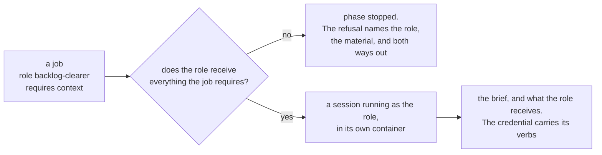
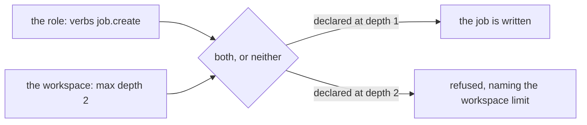
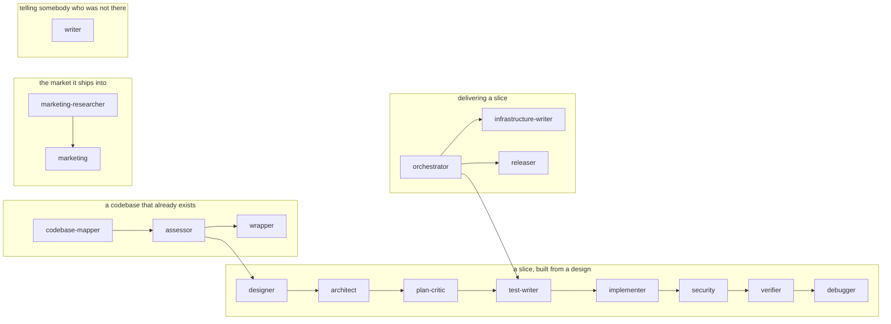

# Roles

A role is a named way of working a session is given: a brief the model reads, the model it runs on,
and the material it is allowed to receive.

The design is [`quay-crew#354`](https://github.com/atlantic-blue/quay-crew/issues/354). This page is
what has shipped of it.

## What is built today

A role is imported, pinned to a version, and attached at a level:

```
krewe role import <directory>
krewe role list [<workspace>]
krewe role show [<workspace>] <name>
krewe role attach [<workspace>|system] <name>
krewe role detach [<workspace>|system] <name>
```

And a step of a flow runs as one. A dispatch node names a role, and that step runs in a session of
its own rather than in the run's:

```yaml
name: write-tests
version: 1
mode: edits
nodes:
  plan:  { type: dispatch, prompt: "say what needs testing" }
  tests: { type: dispatch, role: test-writer, prompt: "write the tests" }
edges:
  - [plan, tests]
  - [tests, done]
```

Nothing chooses the role. The operator writes it into the graph and the workspace has to hold it
already, or the run stops at that step and says which role is missing. Choosing a team while the run
is under way is the product manager's job and is not built.

And a job runs as one. A caller names a role when it declares job, and the controller runs
that job in a session running as that role:

```
krewe job create me/quay-crew --role backlog-clearer \
  --title "clear the open pull request backlog" \
  --brief "Read the open pull requests. For each one, declare a job." \
  --requires context
```

The role is on the record, never on the call that runs the task. A caller that could name its own
role could name one granting more than the job was declared with, and the credential the system mints
for that task carries what the role's `verbs` list declares.

`--requires` is the other side of `receives`: it says what this job cannot be done without.
Where the role does not receive it, the job is refused, and no container is ever built for it.

The two words read correctly in both directions, which is why they are these two words. This job
requires context. The architect role receives context. The flag was called `--hands` until August
2026, and it needed explaining every time somebody read it; `--hands` now refuses and names
`--requires`.



The check happens twice, and the second one is the one that matters. At the write, so the refusal
reaches whoever wrote the declaration. And again at the dispatch, because a role can be detached,
imported at a new version and attached again while a job sits pending, so what the system would put in
front of a session is only settled at the moment it hands it over.

Refused rather than withheld, and that is the difference from a flow step. A flow step naming a role
that receives no context is given none, silently, because the operator wrote the boundary into the
graph and meant it. A job that says it cannot be done without the context is saying the
opposite, so running it without would leave a session answering plausibly instead of stopping.

## Why the boundary, not the persona

A flow sends a job to one session, and every step lands in the same conversation. The session that
writes the code has already read everything the session that planned it said, so it agrees with the
plan. A second opinion that read the first opinion is not a second opinion.

The fix is not a personality. It is what the session is given. A role that writes the tests must not
receive the code. A role that writes the code may receive the test names and not the test bodies. So
`receives` is a declaration the system can hold a session to, rather than a paragraph in a brief asking
the model nicely.

## What a role declares

A role is a directory holding two files, the shape a skill and a hook already have.

`role.yaml` says what it is:

```yaml
name: test-writer
version: 1
summary: writes the tests for a job, from the job alone
model: opus
receives:
  - job
  - context
```

`ROLE.md` is the brief. It is the whole instruction of a session running as this role.

`version` exists so a session is pinned to the version it started with. Editing a role in its
repository makes a new version, so it cannot change under a session already running as it. A
workspace moves by attaching again.

`model` is a tier such as `opus` or a full name such as `claude-opus-5`. It is declared per role
because the job differs: naming a team is worth the larger model and writing one file to a
specification is not. The system does not check the name against a list, because a tier the model's own
tool stops accepting would otherwise fail every task with nothing an operator could configure around
it.

`receives` is the boundary. It is one of three words today, and a fourth is refused at import by
name:

- `job` is the job the role was given. Every role receives it, because a session with no
  job to do is not a task.
- `context` is what the system, the workspace and the project know, as the memory files carry it.
- `skills` are the skills the workspace holds.

Three, because those are what the system puts in front of a session today. A word for material nobody
assembles yet would be a boundary that means nothing, and a boundary that means nothing looks exactly
like one that holds.

`verbs` is the other boundary, and it is the one added on 27 August 2026. `receives` says what a
session running as this role is given, and `verbs` says what it is allowed to call. The word is
kubernetes's: a rule there is api groups, resources and verbs, and the question is asked as `kubectl
auth can-i create jobs`. An operator arrives already knowing it.

```yaml
name: backlog-clearer
version: 1
summary: clears the open pull request backlog
model: opus
receives:
  - job
verbs:
  - job.create
  - job.read
```

Four verbs, refused at import by name the way a material is, and no more, because a verb nobody uses
is a boundary that means nothing:

- `job.create` declares a job. The parent comes from the credential, never from the
  caller.
- `job.read` reads job and its answer.
- `job.answer` answers a question a job asked.
- `job.stop` stops a job.

A role that declares no `verbs` list may call nothing, which is what every role written before this
became. Default deny, so a boundary is something an author wrote rather than something they forgot.

Nothing here creates a workspace, a project, a secret, a skill, a hook or a role. A session that
could grant itself a capability could write itself a way of working nobody approved and then run as
it, which is the same reason those calls are already refused to the driver.

**The grant is half of what a session holds.** The other half is the workspace's ceiling, and the two
mean different things: the role says what a session may do, and the workspace says how much of it.
The effective capability is the intersection, so a role granting `job.create` in a workspace whose
`max_depth` is zero creates nothing. Read and set the ceiling with `krewe limits`, and see section 5
of `docs/ORCHESTRATION.md` for why capability is split across the two.



## How long a brief may be

A brief may be 16,384 bytes, which is about four pages. A skill's brief may be 4,096.

The difference is who pays. A skill's summary reaches every session on every conversation, so it is
held to a sentence, and the measurement behind that is in [`SKILLS.md`](SKILLS.md): one system reached
51,727 bytes of context per session. A role's brief reaches one session, once, and that session
exists to do this one job. The ceiling is still here because a brief nobody reads to the end is a
brief nobody follows.

## Reading one back

`krewe role show [<workspace>] <name>` prints what the role is and the brief in full: the version, the
summary, the model, what it receives, the verbs it may call, and who holds it. A bare name reads what the
current address can see, and a workspace level address reads the version that workspace pinned.

The brief is the role, so a role that could not be read back was a run nobody could audit. There was
no way to diff what the system holds against the file it came from, and no way to tell whether the system
was running the version somebody edited an hour ago. The acceptance run turned on exactly this: one
clause of the orchestrator brief decided the whole outcome, and the only way to find that clause was
to open a file on the host disk the system knows nothing about.

A name nothing holds is refused with the names that are there: the near spellings when there are any,
and everything held when there are not. A short list of real names is more use than a correct
silence.

## Where a role came from

A role is imported from a directory, and a directory is anywhere. That makes the first import easy
and everything after it invisible. The acceptance run was driven by three roles that sat in a folder
on one machine: no pull request touched them, nobody reviewed them, nothing versioned them, and every
listing the system printed showed them looking exactly like the seventeen that ship in
[`roles/`](../roles).

So `krewe role import` records where it read the files, and the system says it back in every place a
role is printed:

```
test-writer      v1   writes the tests for a job, from the job alone
                      runs on opus
                      receives context, job
                      from github.com/atlantic-blue/quay-crew roles/test-writer at 4f2a1b9c
```

Five facts, because an operator acts on them separately: the repository to open, the commit to open
it at, the directory inside it, whether the files were edited after that commit, and whether the
commit is on a remote branch. A role that fails any of them gets a second line saying nobody else can
read it and what to do about that.

The client reads it, because only the client can. The repository is on the operator's machine and the
control plane runs in a container that cannot see it, which is the same reason the files travel
rather than a path.

Nothing is refused over any of it. A role written in a scratch directory while somebody finds the
shape of it is ordinary, and what was missing was not a gate, it was anybody being able to see. A
role imported before the system recorded any of this says only that, because calling it loose would be
an accusation the system cannot support.

Importing the same role again records where it was read this time. That is the way out: commit the
role, push it, import it again, and the warning clears. A system that kept the first answer would leave
the operator fixing it and watching nothing change. It is safe because where a role came from is not
part of what a role is: it is not in the fingerprint, so the same bytes read out of two checkouts are
one role, read in two places, rather than a version already imported being refused as a different one.

What this does not do is put the role in the repository for anybody. A project cannot yet declare a
roles directory the system imports from, because nothing in the system knows what repository a project
has. That is [quay-crew#443](https://github.com/atlantic-blue/quay-crew/issues/443).

## The two levels

A role attaches at the system or at one workspace, which is the outer two of the four levels context
has. Skills stop in the same place, and nothing has wanted the inner two yet.

`krewe role attach system <name>` gives it to every workspace, including the ones made after today.
`krewe role attach <workspace> <name>` gives it to one. The two are separate statements: taking a role
off the system leaves a workspace's own attachment alone.

## Who may attach one

The operator, and not a session. Importing, attaching and detaching are refused to the driver's
token, the way importing a skill is. A role carries a brief, a model and the material a session
receives, so a session that could attach one could write itself a way of working nobody approved and
then be run as it. That is design principle 5 in [`ARCHITECTURE.md`](ARCHITECTURE.md): an agent can
propose, and nothing self applies.

Reading stays open. Choosing from the roles the operator already attached is the point of having
them.

## What a role's session is given

A session running as a role is a new session in a new container, and what it holds is what its role
declares:

- **`job`** is the prompt of the step that named the role. Every role receives it.
- **`context`** is the system's, the workspace's, the project's and the session's context, as the
  memory files carry it. A role without it is told its brief and nothing else.
- **`skills`** are the skills the workspace holds. A role without them holds none: no index in its
  memory file and no skill directory mounted into its container.

The brief is always given, under its own mark in the memory file. It is not context and it is never
read back: it is rendered from the role every task, the way the skills index is.

Two things follow from the boundary being real rather than asked for:

**A role keeps its conversation to itself.** Every other session in a workspace shares one
conversation store, so a role that must not see the code could otherwise read the transcript of the
session that wrote it. A role session's store sits under the session instead. The cost is that its
conversation cannot be resumed from another project, which is not something a sub task does.

**Nothing a role writes reaches the system's memory.** An ordinary session's memory file is read back
into the store, because something that wrote into its own memory has learned something. A role
session's is not. It was given a brief rather than the system's context, so what is in its file is not
an edit of what the store holds, and reading it back would let a session that was given nothing
write what every session in the workspace is told.

## The roles this build ships

Seventeen roles live in [`roles/`](../roles) at the root of this repository, one directory each.
Thirteen of them are a design phase: a way of working from a design to a shipped slice where each
step runs as a session of its own, given only what its role declares. Three deliver one, and they are
below under "The three that deliver a slice". The seventeenth writes prose for a person outside the
work, and it is below under "The one that writes for somebody who was not there".



The design phase, in order, and the model each one runs on:

- `designer` on opus, then `architect` on opus, which writes the contracts and the dependency graph.
- `plan-critic` on opus reads the design, the contracts and the build order before any code exists,
  and reports where they disagree and what they do not answer.
- `test-writer` on sonnet writes the tests from the contracts, then `implementer` on sonnet writes
  the code that makes them pass.
- `security` on sonnet reviews the change and writes a failing test for each defect, `verifier` on
  sonnet checks the slice against its contracts, asks whether verification could have failed at all
  and tries to break what the change says about itself, and `debugger` on sonnet finds a cause and
  fixes it.
- For a codebase that already exists: `codebase-mapper` on sonnet documents it, `assessor` on sonnet
  reports its coverage, contracts and risks, and `wrapper` on sonnet locks an existing boundary with
  tests.
- `marketing-researcher` on opus finds facts with sources, and `marketing` on opus turns them into a
  plan.

The model is declared per role rather than defaulted, for the reason `model` exists at all: naming a
team is worth the larger model and writing one file to a specification is not.

Every one of the thirteen receives `job`, `context` and `skills`. Only the assessor declares a
`verbs` list, `job.create` and `job.read`, because its brief declares a security review and reads what
came back. Nothing else in the thirteen declares anything, and default deny is what makes the
assessor's grant mean something.

`skills` goes to all seventeen because each brief works inside a repository, and a repository reaches a
session here through the git skill: nothing is cloned for a session. Withholding `skills` would take
away the brief and the mounted directory and leave the workspace's secrets in the environment
regardless, so it would break a role rather than fence one.

### The role that reads the plan before anybody builds it

`plan-critic` is the newest of the seventeen and it is the only one that runs before any code exists.
It reads the design, the contracts and the build order, and it reads them against the one sentence
the job carries. It reports where the three disagree, and where none of them answers the sentence.

It exists because a run built a design document faithfully, every check was green, and the operator
opened it two days later and could not use it. Nothing in the run had asked whether the document was
the product. That is [quay-crew#520](https://github.com/atlantic-blue/quay-crew/issues/520).

No role already there covers it. `architect` writes the contracts, so asking it to review them makes
it the only reader of its own work, which is the shape this page refuses at the top. `assessor` reads
a codebase that exists and here none does. `verifier` reads a finished slice against its contracts,
which is the same question one step too late.

The method is imported. Six of its seven classes of finding come from
[github/spec-kit](https://github.com/github/spec-kit), which is MIT licensed, and the brief records
that and the two files it was read from. The seventh is this crew's: the source checks a plan against
itself and never asks whether the plan is the right product. What was read and what was left behind
is in [`ROLE-IMPORTS.md`](ROLE-IMPORTS.md).

It declares no `verbs`, so it may call nothing, and its brief says it changes no file. The first half
is a boundary the system holds. The second is prose, for the reason the whole page gives: krewe has
no word for a file.

### The three that deliver a slice

`orchestrator`, `infrastructure-writer` and `releaser` were written for the acceptance run in
[`docs/ACCEPTANCE-PROJECT.md`](ACCEPTANCE-PROJECT.md) and they ship here now, so they can be read and
changed like anything else.

- `orchestrator` on opus turns one brief into the smallest tree of jobs that delivers it, then waits.
  It may `job.create`, `job.read` and `job.stop`.
- `infrastructure-writer` on opus writes the infrastructure and the pipeline that applies it, and
  declares a child per deliverable that has its own review. It may `job.create` and `job.read`.
- `releaser` on sonnet takes a working tree somebody else wrote and gets it onto a branch, in a
  commit, in a pull request. It may `job.read` only, because a session that can push and can also fan
  work out could spend a whole budget on pushes nobody reviewed. It is the one role that does not
  receive `context`.

**Every role can push, and no role merges.** A push is not a deploy. What runs a pipeline is a merge,
and the pipeline is what applies infrastructure and ships a release, so the merge is the gate and it
is the operator's. Taking the push away from a role removes the operator's sight of work in flight
and stops nothing, which is what the acceptance run proved: `infrastructure-writer` received no
skills, so it held no git tool, and the only thing that changed was that nobody could see what it
had built until the job ended. So each of the three briefs ends a slice the same way. Commit it, push
the branch, open a pull request describing what changed and why in two to five sentences, say the
address in the answer, and move to the next phase.

**The merge is refused rather than asked for.** `may` grants the verbs a session calls on the system,
and merging is not one of them: it is a github action a session takes with a credential a skill gave
it, so the control plane never sees it and cannot refuse it. The place it can be refused is the
sandbox, at the moment the command runs, and that is a hook. `merge-gate` ships in `hooks/` and a
fresh system is put under it, so a session that runs `gh pr merge` is refused and told to open a pull
request instead. An operator who takes the hook off has decided otherwise, deliberately, which is the
difference between a boundary and a sentence.

**A test and the code it tests come from different sessions.** The orchestrator's brief says that a
deliverable carrying logic is at least three children: `test-writer` from the contract, `implementer`
from the test names, `verifier` against the contract. One session that writes the contract, the tests
and the code writes tests that agree with the code it just wrote, and a suite like that is green on
the day it ships and silent afterwards. The three roles already existed; what was missing was
anything telling an orchestrator to use them.

**A refusal it cannot act on stops the run.** There is exactly one refusal an orchestrator may work
around, the workspace depth limit, and only by doing that one child's work. Anything else, an
unknown verb or a credential the system will not accept, means writing the refusal into the answer and
ending. In the acceptance run the brief said to do the work itself when a declaration was refused,
which was written for the depth limit and applied to a credential failure, so one session wrote the
whole product and no child ever ran.

### The one that writes for somebody who was not there

`writer` on opus is the seventeenth role, and the only one whose reader is outside the work. The other
sixteen write for each other or for the repository: contracts, tests, code, infrastructure, security
findings, a marketing plan. A blog post, an announcement, a page and a product description had no
role at all, so each one ran as a plain session and the method was typed into its brief.

That brief ran to over a thousand words and almost none of it was about the subject. Read the voice
specification. Read three existing pieces first. Do not use these words. No dash as punctuation. No
table. State the cost as well as the result. Invent no number that is not in this material. All of it
is the role now, so a writing job carries the subject and the material, and the next piece reads like
the last one instead of like a different brief typed slightly differently.

**It reads before it writes.** The voice specification in full, then the three most recent pieces
already published in the repository it is writing for. Voice is observed rather than described. Where
there is neither, the brief says to stop and ask, because a voice invented in the session is a voice
the reader has never met.

**Two drafts it refuses.** A draft carrying a figure the material does not carry, and a draft that
states no cost. The first is the one that looks like research: "about a thousand", "roughly half" and
"several times faster" each read exactly like a number somebody measured. The second is the one that
looks finished: every sentence true, and the whole thing a pitch. Where the material carries no cost,
the brief says to ask for one rather than to invent one, because an invented weakness is an invented
number wearing modesty.

**It holds no numbers of its own, which is why it grants no verb.** `marketing` may `job.read`, so it
can read what this system actually did rather than remember it. A writer with the same grant would
have a second source of figures, and the material would stop being the only one. Everything in a
draft comes from what the job handed over, and the writer says which line each figure came from.

**The surface decides the length and the pronoun, and the role does not.** A post, a newsletter, a
social post, a pull request description and a product page are five lengths of one voice. The job
names the surface, and the brief carries what each one takes.

`skills` reaches it for the reason it reaches the other sixteen: a repository is where the published
pieces are, and a repository reaches a session here through the git skill. It commits a draft, pushes
the branch and opens a pull request. It does not publish, because sending something to a person is a
person's decision.

**Krewe enforces none of this**, and the brief opens by saying so. Nothing here reads a draft, so
nothing compares a figure against the material and nothing refuses a draft that states no cost. Both
refusals are the session's to keep. A hook that holds the measurable part of prose is
[quay-crew#508](https://github.com/atlantic-blue/quay-crew/issues/508) and it is not built, so the
`ste` skill and this brief are prose a model reads rather than a gate a command runs into.

### What a brief asks that krewe does not enforce

**Every one of these briefs describes a boundary about files, and krewe has no word for a file.** A
role cannot be told which files it may not touch, may not read, or may not write. `receives` is three
words, `job`, `context` and `skills`, and none of the three is about the contents of a repository.
So `test-writer` saying it never sees implementation code, `implementer` saying it never edits a test
file, `verifier` and `assessor` and `codebase-mapper` saying they are read only, `wrapper` saying it
writes to `tests/locking/` and nowhere else, and `security` saying it writes the failing test rather
than the fix, are each a promise the model keeps or does not. The system cannot hold a session to any
of them, and every role's own file says so at the top under `## What krewe does not enforce`.

Two more limits fall out of the same gap. A role session cannot put a question to the operator, so
the interactive parts of `designer` and `marketing` have nothing behind them here. And this system
ships no web search skill, so the research `marketing-researcher` and `designer` are told to do has
no tool behind it.

A brief also names documents the system does not create: `CLAUDE.md`, `docs/DESIGN.md`,
`docs/CONTRACTS.md`, `docs/GRAPH.json`, `docs/ASSESS.md`, `docs/MARKETING.md`,
`references/deviation-rules.md` and the rest. Nothing seeds any of them into a repository. The role
that reads one is the role after the role that writes it, so a phase run out of order finds nothing
there, and each brief says which document it writes.

### The three longest briefs sit near the ceiling

A brief may be 16,384 bytes. Thirteen of the seventeen fit under thirteen thousand. `architect` at
16,354, `assessor` at 16,243 and `verifier` at 15,837 have between two hundred and five hundred and
fifty bytes left, so a sentence added to any of them has to come out somewhere else. The first two
say so at the top of their own file. That is also why the phase ending
about pushing and opening a pull request is written into the three delivery briefs rather than into
all seventeen: those two have no room for it. Raising the ceiling is the change that would give them
room, and it is the operator's to make.

### What this does not do

- **A role cannot be told which files it may not touch.** That is the whole of the paragraph above,
  and it is the reason every one of the seventeen carries a line saying so.
- A fresh system is seeded with none of them. Skills and hooks are seeded and roles are not, so an
  operator runs `krewe role import roles/<name>` from a checkout, once per role.
- Nothing chooses one. A flow graph names a role, or a caller names one when it declares a job, and
  the workspace has to hold it already.
- Nothing runs the phase. The thirteen describe an order and the system does not keep it: a role names
  the role that comes next in its own output, and it is the operator who writes that order into a
  flow graph or declares the next job.
- Nothing hands one role's output to the next. Each writes a document into the repository, and the
  next role reads it from there, so a role whose predecessor never ran says so and stops.

The scenarios that hold this up are in [`features/roles.feature`](../features/roles.feature), which
imports every role in `roles/`, refuses a directory holding none, and asks each of the three
delivery roles for a verb it holds and a verb it does not; in
[`features/rolesessions.feature`](../features/rolesessions.feature), which proves a role receiving
`skills` is handed the git skill and one that does not is handed none, and that a session running as
the writer is told both of its refusals out of the role rather than out of the job's brief; in
[`features/jobcontroller.feature`](../features/jobcontroller.feature), which runs a job as one of
them; and in [`features/plancritic.feature`](../features/plancritic.feature), which reads back what
a session running as the plan critic was told and proves it can declare nothing.

## What is not built

- No product manager role, so nothing chooses a team while a run is under way.
- A role declares its model and nothing reads it: the runner takes one model per system.
- No sub tasks, so a step is one session rather than several, and there is no limit on how many run
  at once.
- A session running as a role emits no event when it finishes.
- No event starts a flow.
- A job pins the version of the role it was declared against, and the session is built from
  the version the workspace holds now. The pin is on the record and nothing reads it back yet, so a
  role narrowed after the job was declared stops that job rather than running it as it was
  written.
- A job in a role is a root job only. A job under a parent and a job that waits for something are each
  their own slice, whether or not they name a role.
- Where a role came from is recorded and printed, and nothing acts on it: no import is refused, no
  run is stopped, and a project cannot declare a roles directory the system imports from.

The scenarios that hold up what is built are in
[`features/roles.feature`](../features/roles.feature),
[`features/rolesessions.feature`](../features/rolesessions.feature),
[`features/plancritic.feature`](../features/plancritic.feature),
[`features/job.feature`](../features/job.feature) and
[`features/jobcontroller.feature`](../features/jobcontroller.feature). If a behaviour is not there,
it is not built.
