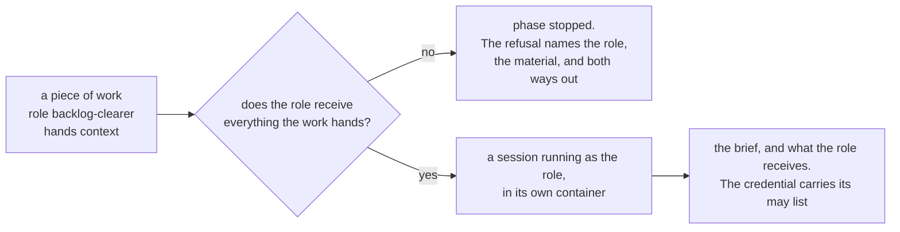
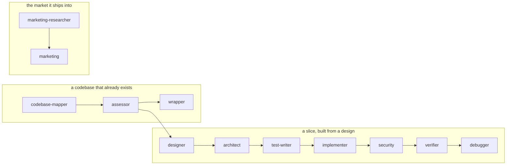

# Roles

A role is a named way of working a session is given: a brief the model reads, the model it runs on,
and the material it is allowed to receive.

The design is [`quay-crew#354`](https://github.com/atlantic-blue/quay-crew/issues/354). This page is
what has shipped of it.

## What is built today

A role is imported, pinned to a version, and attached at a level:

```
quay role import <directory>
quay role list [<workspace>]
quay role attach [<workspace>|crew] <name>
quay role detach [<workspace>|crew] <name>
```

And a step of a flow runs as one. A dispatch node names a role, and that step runs in a session of
its own rather than in the run's:

```yaml
name: write-tests
version: 1
nodes:
  plan:  { type: dispatch, prompt: "say what needs testing" }
  tests: { type: dispatch, role: test-writer, prompt: "write the tests" }
edges:
  - [plan, tests]
  - [tests, done]
```

Nothing chooses the role. The operator writes it into the graph and the workspace has to hold it
already, or the run stops at that step and says which role is missing. Choosing a team while the run
is under way is the product manager's job and is not built.

And a piece of work runs as one. A caller names a role when it declares work, and the controller runs
that work in a session running as that role:

```
quay work create me/quay-crew --role backlog-clearer \
  --title "clear the open pull request backlog" \
  --brief "Read the open pull requests. For each one, declare a piece of work." \
  --hands context
```

The role is on the record, never on the call that runs the task. A caller that could name its own
role could name one granting more than the work was declared with, and the credential the crew mints
for that task carries what the role's `may` list declares.

`--hands` is the other side of `receives`: it says what this piece of work cannot be done without.
Where the role does not receive it, the work is refused, and no container is ever built for it.



The check happens twice, and the second one is the one that matters. At the write, so the refusal
reaches whoever wrote the declaration. And again at the dispatch, because a role can be detached,
imported at a new version and attached again while work sits pending, so what the crew would put in
front of a session is only settled at the moment it hands it over.

Refused rather than withheld, and that is the difference from a flow step. A flow step naming a role
that receives no context is given none, silently, because the operator wrote the boundary into the
graph and meant it. A piece of work that says it cannot be done without the context is saying the
opposite, so running it without would leave a session answering plausibly instead of stopping.

## Why the boundary, not the persona

A flow sends work to one session, and every step lands in the same conversation. The session that
writes the code has already read everything the session that planned it said, so it agrees with the
plan. A second opinion that read the first opinion is not a second opinion.

The fix is not a personality. It is what the session is given. A role that writes the tests must not
receive the code. A role that writes the code may receive the test names and not the test bodies. So
`receives` is a declaration the crew can hold a session to, rather than a paragraph in a brief asking
the model nicely.

## What a role declares

A role is a directory holding two files, the shape a skill and a hook already have.

`role.yaml` says what it is:

```yaml
name: test-writer
version: 1
summary: writes the tests for a piece of work, from the work alone
model: opus
receives:
  - work
  - context
```

`ROLE.md` is the brief. It is the whole instruction of a session running as this role.

`version` exists so a session is pinned to the version it started with. Editing a role in its
repository makes a new version, so it cannot change under a session already running as it. A
workspace moves by attaching again.

`model` is a tier such as `opus` or a full name such as `claude-opus-5`. It is declared per role
because the work differs: naming a team is worth the larger model and writing one file to a
specification is not. The crew does not check the name against a list, because a tier the model's own
tool stops accepting would otherwise fail every task with nothing an operator could configure around
it.

`receives` is the boundary. It is one of three words today, and a fourth is refused at import by
name:

- `work` is the piece of work the role was given. Every role receives it, because a session with no
  work to do is not a task.
- `context` is what the crew, the workspace and the project know, as the memory files carry it.
- `skills` are the skills the workspace holds.

Three, because those are what the crew puts in front of a session today. A word for material nobody
assembles yet would be a boundary that means nothing, and a boundary that means nothing looks exactly
like one that holds.

`may` is the other boundary, and it is the one added on 27 August 2026. `receives` says what a
session running as this role is given, and `may` says what it is allowed to call:

```yaml
name: backlog-clearer
version: 1
summary: clears the open pull request backlog
model: opus
receives:
  - work
may:
  - work.create
  - work.read
```

Four verbs, refused at import by name the way a material is, and no more, because a verb nobody uses
is a boundary that means nothing:

- `work.create` declares a piece of work. The parent comes from the credential, never from the
  caller.
- `work.read` reads work and its answer.
- `work.answer` answers a question a piece of work asked.
- `work.stop` stops a piece of work.

A role that declares no `may` list may call nothing, which is what every role written before this
became. Default deny, so a boundary is something an author wrote rather than something they forgot.

Nothing here creates a workspace, a project, a secret, a skill, a hook or a role. A session that
could grant itself a capability could write itself a way of working nobody approved and then run as
it, which is the same reason those calls are already refused to the driver.

**The grant is half of what a session holds.** The other half is the workspace's ceiling, and the two
mean different things: the role says what a session may do, and the workspace says how much of it.
The effective capability is the intersection, so a role granting `work.create` in a workspace whose
`max_depth` is zero creates nothing. Read and set the ceiling with `quay limits`, and see section 5
of `docs/ORCHESTRATION.md` for why capability is split across the two.


## How long a brief may be

A brief may be 16,384 bytes, which is about four pages. A skill's brief may be 4,096.

The difference is who pays. A skill's summary reaches every session on every conversation, so it is
held to a sentence, and the measurement behind that is in [`SKILLS.md`](SKILLS.md): one crew reached
51,727 bytes of context per session. A role's brief reaches one session, once, and that session
exists to do this one job. The ceiling is still here because a brief nobody reads to the end is a
brief nobody follows.

## The two levels

A role attaches at the crew or at one workspace, which is the outer two of the four levels context
has. Skills stop in the same place, and nothing has wanted the inner two yet.

`quay role attach crew <name>` gives it to every workspace, including the ones made after today.
`quay role attach <workspace> <name>` gives it to one. The two are separate statements: taking a role
off the crew leaves a workspace's own attachment alone.

## Who may attach one

The operator, and not a session. Importing, attaching and detaching are refused to the driver's
token, the way importing a skill is. A role carries a brief, a model and the material a session
receives, so a session that could attach one could write itself a way of working nobody approved and
then be run as it. That is design principle 5 in [`ARCHITECTURE.md`](ARCHITECTURE.md): an agent can
propose, and nothing self applies.

Reading stays open. Choosing from the roles the operator already attached is the point of having
them.

## What a role's session is given

A session running as a role is a new session in a new container, and what it holds is what its role
declares:

- **`work`** is the prompt of the step that named the role. Every role receives it.
- **`context`** is the crew's, the workspace's, the project's and the session's context, as the
  memory files carry it. A role without it is told its brief and nothing else.
- **`skills`** are the skills the workspace holds. A role without them holds none: no index in its
  memory file and no skill directory mounted into its container.

The brief is always given, under its own mark in the memory file. It is not context and it is never
read back: it is rendered from the role every task, the way the skills index is.

Two things follow from the boundary being real rather than asked for:

**A role keeps its conversation to itself.** Every other session in a workspace shares one
conversation store, so a role that must not see the code could otherwise read the transcript of the
session that wrote it. A role session's store sits under the session instead. The cost is that its
conversation cannot be resumed from another project, which is not something a sub task does.

**Nothing a role writes reaches the crew's memory.** An ordinary session's memory file is read back
into the store, because something that wrote into its own memory has learned something. A role
session's is not. It was given a brief rather than the crew's context, so what is in its file is not
an edit of what the store holds, and reading it back would let a session that was given nothing
write what every session in the workspace is told.

## The roles this build ships

Twelve roles live in [`roles/`](../roles) at the root of this repository, one directory each. Between
them they are a design phase: a way of working from a design to a shipped slice where each step runs
as a session of its own, given only what its role declares.



The design phase, in order, and the model each one runs on:

- `designer` on opus, then `architect` on opus, which writes the contracts and the dependency graph.
- `test-writer` on sonnet writes the tests from the contracts, then `implementer` on sonnet writes
  the code that makes them pass.
- `security` on sonnet reviews the change and writes a failing test for each defect, `verifier` on
  sonnet checks the slice against its contracts, and `debugger` on sonnet finds a cause and fixes it.
- For a codebase that already exists: `codebase-mapper` on sonnet documents it, `assessor` on sonnet
  reports its coverage, contracts and risks, and `wrapper` on sonnet locks an existing boundary with
  tests.
- `marketing-researcher` on opus finds facts with sources, and `marketing` on opus turns them into a
  plan.

The model is declared per role rather than defaulted, for the reason `model` exists at all: naming a
team is worth the larger model and writing one file to a specification is not.

Every one of the twelve receives `work`, `context` and `skills`. Only the assessor declares a `may`
list, `work.create` and `work.read`, because its brief declares a security review and reads what came
back. Nothing else in the twelve declares anything, and default deny is what makes the assessor's
grant mean something.

`skills` goes to all twelve because each brief works inside a repository, and a repository reaches a
session here through the git skill: nothing is cloned for a session. Withholding `skills` would take
away the brief and the mounted directory and leave the workspace's secrets in the environment
regardless, so it would break a role rather than fence one.

### What a brief asks that quay does not enforce

**Every one of these briefs describes a boundary about files, and quay has no word for a file.** A
role cannot be told which files it may not touch, may not read, or may not write. `receives` is three
words, `work`, `context` and `skills`, and none of the three is about the contents of a repository.
So `test-writer` saying it never sees implementation code, `implementer` saying it never edits a test
file, `verifier` and `assessor` and `codebase-mapper` saying they are read only, `wrapper` saying it
writes to `tests/locking/` and nowhere else, and `security` saying it writes the failing test rather
than the fix, are each a promise the model keeps or does not. The crew cannot hold a session to any
of them, and every role's own file says so at the top under `## What quay does not enforce`.

Two more limits fall out of the same gap. A role session cannot put a question to the operator, so
the interactive parts of `designer` and `marketing` have nothing behind them here. And this crew
ships no web search skill, so the research `marketing-researcher` and `designer` are told to do has
no tool behind it.

A brief also names documents the crew does not create: `CLAUDE.md`, `docs/DESIGN.md`,
`docs/CONTRACTS.md`, `docs/GRAPH.json`, `docs/ASSESS.md`, `docs/MARKETING.md`,
`references/deviation-rules.md` and the rest. Nothing seeds any of them into a repository. The role
that reads one is the role after the role that writes it, so a phase run out of order finds nothing
there, and each brief says which document it writes.

### The two longest briefs sit near the ceiling

A brief may be 16,384 bytes. Ten of the twelve fit under thirteen thousand, and `architect` at
16,360 and `assessor` at 16,257 are both within two hundred bytes of the ceiling, so a sentence
added to either has to come out somewhere else. Both say so at the top. Raising the ceiling is the
change that would give those two room, and it is the operator's to make.

### What this does not do

- **A role cannot be told which files it may not touch.** That is the whole of the paragraph above,
  and it is the reason every one of the twelve carries a line saying so.
- A fresh crew is seeded with none of them. Skills and hooks are seeded and roles are not, so an
  operator runs `quay role import roles/<name>` from a checkout, once per role.
- Nothing chooses one. A flow graph names a role, or a caller names one when it declares work, and
  the workspace has to hold it already.
- Nothing runs the phase. The twelve describe an order and the crew does not keep it: a role names
  the role that comes next in its own output, and it is the operator who writes that order into a
  flow graph or declares the next piece of work.
- Nothing hands one role's output to the next. Each writes a document into the repository, and the
  next role reads it from there, so a role whose predecessor never ran says so and stops.

The scenarios that hold this up are in [`features/roles.feature`](../features/roles.feature), which
imports every role in `roles/` and refuses a directory holding none, and in
[`features/workcontroller.feature`](../features/workcontroller.feature), which runs a piece of work as
one of them.

## What is not built

- No product manager role, so nothing chooses a team while a run is under way.
- A role declares its model and nothing reads it: the runner takes one model per crew.
- No sub tasks, so a step is one session rather than several, and there is no limit on how many run
  at once.
- A session running as a role emits no event when it finishes.
- No event starts a flow.
- A piece of work pins the version of the role it was declared against, and the session is built from
  the version the workspace holds now. The pin is on the record and nothing reads it back yet, so a
  role narrowed after the work was declared stops that work rather than running it as it was
  written.
- Work in a role is root work only. Work under a parent and work that waits for something are each
  their own slice, whether or not they name a role.

The scenarios that hold up what is built are in
[`features/roles.feature`](../features/roles.feature),
[`features/rolesessions.feature`](../features/rolesessions.feature),
[`features/work.feature`](../features/work.feature) and
[`features/workcontroller.feature`](../features/workcontroller.feature). If a behaviour is not there,
it is not built.
