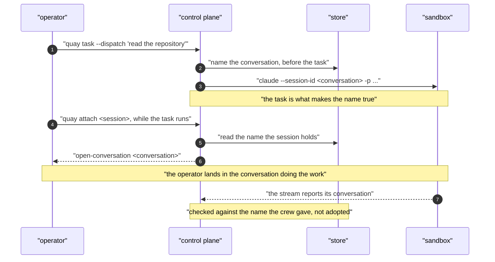
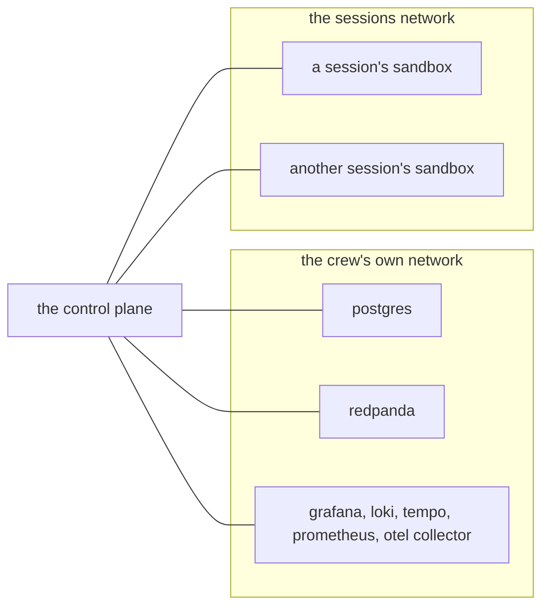

# The Claude sandbox

A session runs its tasks inside a sandbox: an isolated container the control plane starts per
session. The default sandbox image carries the Claude Code CLI, and each task runs `claude` inside
it. The image holds no credentials. The subscription token is injected at task time as the
`CLAUDE_CODE_OAUTH_TOKEN` environment variable, stored per workspace as a secret, so the same image is
safe to build and run anywhere.

The same value is injected a second time, as `QUAY_MODEL_TOKEN`. Claude Code removes
`CLAUDE_CODE_OAUTH_TOKEN` from the environment of every process it starts, by that name and no other,
so a hook fired on a message inherits no credential and cannot ask a model anything. The second name
survives, the way `QC_TOKEN` and `GH_TOKEN` already do, and the prompt analyser reads it. It is one
value under two names: nothing extra is stored, and nothing is written to disk.

For why the control plane starts these containers on the host daemon, see the Sandboxes section of
`docs/ARCHITECTURE.md`.

## Run a real task end to end

You need Docker and a Claude subscription.

1. Mint a long lived subscription token on your machine:

   ```
   claude setup-token
   ```

   This prints a token. Treat it like a password: it can spend your subscription.

2. Install the crew. This is one command:

   ```
   make install
   ```

   It writes `~/.quay/env` if there is none, builds the command line tool over whatever `quay` your
   shell runs, builds the hooks and the sandbox image, and brings the stack up. It then prints the
   commands in step 3, because it cannot mint your credential for you.

   ```mermaid
   flowchart TD
       ONE["make install"] --> CONFIG["config: write ~/.quay/env if there is none"]
       CONFIG --> TOOL["tool: build quay over the copy your shell runs"]
       TOOL --> HOOKS["hooks: build what every session runs under"]
       HOOKS --> IMAGE["sandbox-image: build the container a session is"]
       IMAGE --> ASK{"is this crew already up?"}
       ASK -- "no" --> UP["up: bring the stack up"]
       ASK -- "yes" --> COST["say what replacing the services costs, and wait"]
       COST -- "quay typed, or YES=1" --> UP
       COST -- "anything else" --> REFUSE["refuse, and exit non zero"]
       UP --> NEXT["print the commands it cannot run for you"]
   ```

   Run it again whenever you want. It never writes over the configuration file you edited. It never
   replaces the services under a crew that is already working without telling you what that costs
   and waiting for you to agree, because a task in flight ends with the control plane that runs it.

   The four pieces still work on their own. `make tool` builds the command line tool. `make hooks`
   builds the hooks. `make sandbox-image` builds the image. `make up` brings the stack up.
   `make rebuild` is the three builds together and leaves a running crew alone, which is what to
   type when you want a new build and not a restart.

3. Create a workspace, a project, and give it the token:

   ```
   quay workspace create demo
   quay project create house-bills
   quay secret set CLAUDE_CODE_OAUTH_TOKEN <token from step 1>
   ```

   Creating something moves you into it, so each line lands where the one above it left you, and
   `quay use` says where that is. The secret is scoped to the workspace, and a task runs inside a
   project. The control plane reads the secret when running a task and injects it into that
   session's sandbox; it is never part of the message or the event log.

4. Ask something and get a real reply:

   ```
   quay task "say pong"
   ```

   You are already in `demo/house-bills`, so nothing needs saying twice. To reach somewhere else for
   one task without moving, put the address first: `quay task demo/gardening "order the bulbs"`.

   `quay task` waits for the answer, which is what a short question wants. Real work takes minutes, so
   `quay task --dispatch` starts the task and lets go of it: the crew runs it, and
   `quay task list <session>` reads it back.

   A new sandbox container (`quaycrew-<session id>`) starts on the first task and is reused for the
   rest of the session. A second task on the same session continues the same conversation.

### Which model and which image a task runs

`make install` writes `~/.quay/env` from `deploy/env.example` and never touches it again. Edit that
file to change what a task is, then run `make up` to bring the stack back on it. The stack reads the
file on every command, so `make upgrade` cannot quietly bring it back as something else. The
variables can still be given on the command line for a one off.

Three keys decide what a task is. `QC_MODEL` is the backend: `claude-code` runs the real thing on
your subscription, `echo` runs `echo` in the sandbox instead, which is what continuous integration
runs because it has no subscription. `QC_CLAUDE_MODEL` is which model that backend runs against,
either an alias for the newest of a tier (`opus`, `sonnet`) or a full name (`claude-opus-5`, which is
what a crew gets when it says nothing). `QC_SANDBOX_IMAGE` is the container it all runs in.

Say nothing about the model and the command line tool chooses for itself, and it chooses Sonnet.
That is worth knowing, because a crew configured for Claude Code, holding an Opus subscription, was
running every session on Sonnet and nothing anywhere said so.

### What one command does not do

It does not mint your model credential, which is why step 1 is yours and step 3 names it again.

It does not upgrade a crew. `make upgrade` is that, and it does more: it fetches, it puts every live
session down cleanly first, and it clears the sandbox containers the crew has forgotten. Running
`make install` on a checkout you have just pulled builds the new code and restarts the stack, and it
leaves those sessions to be ended by the replacement rather than put down.

It does not check that the stack came up healthy. It exits when compose has started the containers,
which is not the same as Postgres accepting connections. `make ps` and `quay version` say whether the
crew is answering.

## The gated integration test

`internal/model/claudecode_integration_test.go` runs a real Claude task inside the sandbox image and
checks a reply and a resumable session id come back. It needs a subscription, so it **skips** unless
both are present:

- `CLAUDE_CODE_OAUTH_TOKEN` is set (from `claude setup-token`), and
- the sandbox image exists (`make sandbox-image`).

Run it locally with:

```
make sandbox-image
CLAUDE_CODE_OAUTH_TOKEN=<token> go test -tags=integration -run TestClaudeCodeRunnerRealTask ./internal/model/
```

`TestClaudeConversationSurvivesItsContainer` runs next to it, on the same two conditions. It tells the
model a number, destroys the container the conversation was running in, creates a new one for the same
session, and asks for the number back. Two tasks of your subscription for the one claim that cannot be
made with a substitute.

Continuous integration has no subscription, so this test skips there. The token delivery mechanism
itself, that a value in the sandbox env reaches the process inside the container, is covered by
`TestDockerProviderDeliversEnv`, which needs only Docker and does run in continuous integration.

### A tagged test that nothing ran is not a passing test

Everything behind `-tags integration` is invisible to an untagged run, and that is the trap in this
repository rather than a curiosity. `go build ./...`, `go vet ./...` and `go test ./...` all report a
clean tree with those files missing from it. Adding the tag to the vet (`go vet -tags integration
./...`) proves they compile, and compiling is not running: a test whose fixture cannot be built fails
at the first line of the daemon's answer, and nothing local says so.

Two rules follow, and they cost nothing:

- **A fixture proves itself before the test measures anything.** `aCrewOverRealContainers` asks the
  daemon which containers it holds and names each session it needs, so a helper that built nothing
  fails on the fixture rather than on a measurement that quietly says the crew is empty.
- **A tier that did not run gets reported as unrun, never as green.** On a machine with no daemon the
  only run is the `integration` job in continuous integration, so the number to read is in that job's
  log, and the job has to have finished before anything is claimed from it.

(28 August 2026, pull request 432: three tests here built their sandbox configuration with the
session identifier alone. Storage refuses one that cannot say which workspace to keep state for, so
all three died in the helper. They compiled, they vetted, and they had never once run.)

## Naming a conversation

The crew names a session's conversation, before anything runs in it. The name is a version 4
identifier, it is written on the session, and both roads into that conversation carry it: the task
the crew dispatches, and the terminal an operator opens.



Which flag carries the name depends on one question, and getting it wrong fails the task either way.
A name the model runtime has never seen is **started** with `--session-id`, because resuming a name
with nothing behind it prints "No conversation found" and exits. A name it has seen is **resumed**
with `--resume`, because starting one it already holds is refused as a name already in use. The
answer is the transcript: `HasConversation` in
[`internal/sandbox/usage.go`](../internal/sandbox/usage.go) looks for
`<store>/projects/*/<conversation>.jsonl`, and
[`deploy/sandbox/open-conversation.sh`](../deploy/sandbox/open-conversation.sh) asks the same question
of the same file from inside the container, so the two cannot disagree.

The identifier the model reports in its output stream is a check rather than the source. It used to be
the source, which is why it arrived too late to be any use: it is read once the task is over, and
attaching happens while the task runs. Now, a stream naming a different conversation means the runtime
ignored the flag, and the crew says so in a line carrying both names, keeps its own, and leaves the
other name findable rather than quietly adopting it.

### What this does not do

- **A session running a task that named its own conversation cannot be opened.** That is a session
  carried over from before this, caught mid task: the crew does not know that conversation's name and
  cannot until the task lands. Attaching is refused, in those words, rather than naming a second
  conversation and opening an empty one beside the job. The name lands on the session when the task
  finishes, and attaching works from then on.
- **A transcript written under a name a session does not hold is not deleted, and not shown either.**
  Attaching used to name a conversation of its own while a first task was running, so a sandbox built
  before this can hold two transcripts for one session. Both are still on the host, under
  `~/.quay/data/workspaces/<workspace>/claude/projects/`, and the crew reads the one the session holds.
  Open another by name from inside the container:
  `docker exec -it quaycrew-<session id> claude --resume <conversation id>`.
- **A crew with no data directory cannot see any transcript**, so it falls back to what this process
  has watched a model runtime open. That memory does not survive a restart, and a session whose first
  task ran before the restart would be told to start its conversation again. Set `QC_DATA_DIR`, which
  `make up` does.

## Getting inside a conversation

`quay task` waits for its answer, and `quay task --dispatch` starts a task and returns. To sit inside
the conversation, with its history, and keep typing:

```
quay sessions
quay attach 5d013d07
```

or press `a` on a session in the console.

This runs `claude` inside that session's sandbox on the conversation the session holds, resuming it
or starting it under that name, and needs nothing from your shell. The control plane sets the workspace's environment on the sandbox when it creates it, so
everything started inside is already authenticated and no tool has to carry the token around.

The trade is that the token is readable for the life of that container, for example through
`docker inspect`. It was already reachable from inside the sandbox, which runs the model, so this
widens who can see it rather than whether it is there at all. The alternative, handing the value back
through the control plane API on request, was rejected: a secret the backend holds should not become
readable by any client that asks.

The image also ships past the CLI's first run: onboarding and the workspace trust prompt are marked
done. A task is not interactive and never meets either, but attaching is, and a sandbox is a fresh
container every time, so without this the operator lands in a theme picker instead of their
conversation. It reads exactly like a broken token, because nothing gets far enough to authenticate.

One consequence to know: a token set **after** a session's first task does not reach that session's
existing sandbox. Tasks still work, because a task also passes the environment, but attaching to that
session will not authenticate. Stopping the session and dispatching again gives it a fresh sandbox
that carries the token, and the conversation comes back with it, because the conversation is on the
host rather than in the container. Or reach the old container with the token on the command:

```
docker exec -it -e CLAUDE_CODE_OAUTH_TOKEN=<token> quaycrew-<session id> claude --resume <conversation id>
```

Pressing `s` instead gives you a shell in the same container. That shows you the room; attaching
shows you the conversation.

### What the crew can ask a sandbox about itself

Two questions, both asked of the container by name and neither needing anything written down:

- **is a client on the conversation** (`tmux list-clients -t quay`), so a reclaim never closes a
  container somebody is typing into.
- **is a model runtime in the process table** (`/proc`), so a conversation answering with nobody
  watching it is not read as an empty container.

A listing turns the pair into the word it prints, and the four words and what they cost are in
`docs/ORCHESTRATION.md`, section 11, under "What a listing says, which is not what the row says".

Neither question is asked through a handle this process holds, and neither creates a sandbox to
answer. The handles are a map in one process and the containers are not, so a question that built one
would start the very container it is asked about taking away.

## Seeing what you built

A session used to have no eyes. A change with a visual result was delivered on the strength of a
passing build, and the build, the linter, the type check and the whole test suite all pass on a
layout that is wrong. The image carries a browser now, so a session can look:

```
quay render http://localhost:3000
quay render localhost:3000 home.png 390x844 dark 2s
```

The url comes first. Everything after it is recognised by its shape rather than its position, so any
order is the same command: a file name, a size as `390x844`, `light` or `dark`, and a wait as `2s`.
Say nothing and you get `render.png`, 1280 by 900, light, after half a second. It draws the whole
page rather than the first screen of it, then reads the picture back and says what it drew:

```
drew http://localhost:3000 at 390x844, dark, into /home/agent/workspace/home.png (390 by 3120)
```

Then the session reads the file, which is the step the whole thing exists for. A command that exits
well proves a file exists. Only the picture says whether the page is right.

What is in the image is Playwright and the headless browser it drives, both pinned, with the
browser's own dependencies installed as root at build time: 31 packages, fontconfig and seven font
families among them. Without those the browser exits on
`SkFontMgr_FontConfigInterface: Not implemented` rather than drawing anything, and the failure lands
in a session rather than in a build. The stated cost is about 450 megabytes.

`TestASessionRendersAPageAndReadsItBack` in `deploy/` is the proof: it draws a page in a fresh
container and decodes the picture that comes back, so an image that holds a browser it cannot start
fails there rather than in front of an operator. It needs Docker and the built image, so it runs in
continuous integration and skips without one.

A sandbox keeps what it was made with. A session that was running before the image carried a browser
does not have one, cannot install one, and says so with what to do about it: stop the session and
dispatch again.

## How much memory a session has

A sandbox with no memory limit of its own reports the whole machine in `/proc/meminfo`. So node
sizes its heap from that number, Go sizes its collector from it, and jest and webpack start one
worker for each processor, while what is actually there is whatever the rest of the machine has not
taken. Measured in one sandbox on 20 August 2026: 7836 megabytes advertised, about 1500 free, and an
allocator killed after taking 1600. The session budgets against the first number and the kernel kills
it against the second.

The kill says nothing. Signal 9 leaves no last line on either stream, and the kernel log is not
readable from inside a container, so the session sees exit 137 and reads it as a hang. That cost a
real gate: a linter, a build and an install were each killed part way through and the session
reported a partial check.

`quay room` reads the machine's own accounting and says what is true:

```
quay room
```

It names what this sandbox advertises, what is free, what it holds, and what an out of memory killer
has already taken in it. The last part is the one that cannot be got any other way: `memory.events`
counts kills and counts how often the sandbox reached a limit of its own, and a kill by the machine's
own killer raises the first and leaves the second at zero. That pair is what says whether the machine
ran out or the session did.

Then it says what to do about a gate that does not fit: cap the heap under what is free, take one
worker rather than one for each processor, run the gate over part of the tree and name the part, and
if it still does not fit say what could not run rather than reporting a partial check. The advice is
in the tool rather than in each session's memory, so the answer is the same every time.

Set `QC_SANDBOX_MEMORY` to give a session a limit of its own, as the daemon spells it, for example
`4g`. Swap is capped with it at the same figure, because a daemon told a memory limit and nothing
else allows swap of the same size again, so a session could take twice what was set and reach it by
thrashing. Unset, a session has no limit, which is where every session started.

The figure is the operator's. It shares one machine between the stack, every session already running,
and this one, so add up what you are willing to give them and check it against what the daemon has.

## What a session's sandbox can reach

A session runs model output, so what its container can address is a boundary rather than a detail.
There are two networks, and the split is the whole of the answer.



The control plane is the only thing on both. A session can address it and cannot address the store,
the broker or the dashboards, so widening what a session may do never widens what a session may
reach.

**Every sandbox joins the sessions network, and it joins it at birth.** A sandbox keeps the
configuration it was made with and there is no promotion: a network added when a task starts would
miss every container already running. So a session that has to reach the crew has to be born able to,
which is also why a change here needs the session started again rather than a task run again.

**The network is not the permission.** Reaching the control plane buys nothing on its own. Every call
is refused until the caller presents a credential, and the only credential a session ever holds is
the one the crew mints for the job that task is running: bound to that job, carrying the
verbs the job's role declared, expiring with the job. A session on the network holding no
credential can do nothing at all, which is what an ordinary task is. See `docs/ORCHESTRATION.md`
section 5 for what a role grants and `internal/controlplane/deny.go` for the refusals.

**Nothing is configured for this.** The compose file creates the network and puts the control plane
on it, and the makefile names it after the stack, so two stacks on one machine do not share one.
`QC_SANDBOX_CONTROL_PLANE` is the address a session dials, `controlplane:50051` in the composed
stack. Unset it and the crew tells a session nothing, and a session running a job then
holds a credential it cannot spend. The control plane says so on startup when the two disagree.

**The driver is the one deliberate widening, and it is off.** `QC_SANDBOX_NETWORK` names the crew's
own network, and only the driver joins it. Left empty, which is what a fresh configuration ships
with, the driver joins the sessions network like everything else, which is all it needs to drive the
crew. Set it to `quaycrew_default` only when a driver on this machine has to reach the rest of the
stack, and read `docs/DRIVERS.md` first.

### What this does not do

- **It does not isolate sessions from each other.** Every sandbox is on one network, so a session can
  address another session's container. Nothing in a sandbox listens on a port, and the conversation a
  session runs is a tmux socket inside the container rather than anything on the network, so there is
  nothing there to answer today. A network for each session is the shape that would close it, and
  nothing has needed it yet.
- **It does not bound what a session reaches outside the crew.** A sandbox has the internet, because
  a session clones repositories and installs packages. What is bounded here is the crew's own
  services.
- **It does not hide a port the host publishes.** A container reaches the host at its network's
  gateway, so anything the compose file publishes on every address of the machine is reachable from a
  sandbox as it is from anywhere else on the machine. The control plane's own port is published to
  loopback only, and the store publishes none.
- **It does not reach a crew running its sessions on the host.** `QC_SANDBOX=local` has no container
  and no network, and none of this applies to it.

## What the image pins

Every tool the image installs names its version, as a build argument at the top of the step that
installs it: `CLAUDE_CODE_VERSION`, `GH_VERSION`, `TF_VERSION`, `AWS_CLI_VERSION` and
`PLAYWRIGHT_VERSION`. Raising one is an edit to `deploy/sandbox/claude.Dockerfile` with a commit
behind it, so the same commit builds the same image on any day and a session that starts behaving
differently has a change to point at.

Three tests hold this. `TestNothingInTheSandboxImageFloats` refuses any global install in the image
that does not name a version, so the next tool added unpinned fails there rather than months later.
`TestTheImageRunsTheClaudeCodeItPins` and `TestTheImageRunsThePlaywrightItPins` ask the built image
what it runs, because a pin the registry quietly ignores reads exactly like a pin that works.

## A credential that is a file

Some credentials are not values. A git configuration, a private key, a cloud credentials file: a tool
opens each one by path, so there is nothing an environment variable can do for them.

So a secret says how it reaches a sandbox, which is the shape Kubernetes and Docker both settled on.
The store holds bytes under a name and knows nothing else about them; whether those bytes become an
environment variable or a file is a separate choice. A Kubernetes Secret is read through
`secretKeyRef` or mounted through a `secret` volume; a Docker secret is given a target and lands
under `/run/secrets`. Neither writes the presentation into the store.

`quay secret set` is the environment. `quay secret mount` is a file:

```
quay secret mount gitconfig ~/.gitconfig
cat ~/.gitconfig | quay secret mount gitconfig
```

It lands at `/run/secrets/<name>`, one file per secret, and `quay secret list` says so. The directory
is created with the container and is memory backed, owned by the sandbox user and shut to everybody
else, so a mounted value never reaches the container's writable layer or the host's disk.

A mounted secret is **not** also in the environment, and that is the second reason to mount one. The
trade recorded above for the subscription token is real: a container's environment is readable for
the life of that container, for example through `docker inspect`. A file in a memory backed directory
is not.

Two things to know. The value is written when the sandbox is made, so a session already running was
made before you mounted it: stop the session to get one that has it. And `quay secret set` trims,
because a token gains a newline from the tool that printed it, while `quay secret mount` does not,
because a file's bytes are the file.

## Who a session commits as

A session commits as you, and it has to be told who that is. Mount your own git configuration:

```
quay secret mount <workspace> gitconfig ~/.gitconfig
```

The image ships a git configuration holding one line, `[include] path = /run/secrets/gitconfig`, so
what you mount reaches every git process in the sandbox: your identity, your aliases, your settings,
from any shell rather than only the process a task runs in. A workspace that mounts nothing is
unchanged, because git ignores an include that is not there.

Signing is the one part the crew decides rather than you, and it has to. Most configurations that
sign have it on for everything, against a key your machine holds and a container does not, so left
alone it fails every commit a session makes. A workspace that mounts a signing key signs with it; a
workspace that mounts none is told not to sign. The crew writes its answer after the include, and git
takes the last value it reads.

```
quay secret mount <workspace> GIT_SSH_SIGNING_KEY ~/.ssh/id_ed25519
```

Mounted, not set. Setting it is refused, and the refusal says this instead. A private key in the
environment is readable through `docker inspect` for the life of the container, which is the exposure
mounting exists to avoid, and the key is the most sensitive thing this crew carries. Put the public
half on the account you push to as a signing key, alongside the one your own machine signs with: a
commit signed in a sandbox is signed by a different key from one signed on your laptop.

### Signing with your own gpg key instead

An ssh key in a sandbox signs your history under a second identity. If you already sign with gpg,
mount that key and a session signs as you do everywhere else. Export it first:

```
gpg --armor --export-secret-keys <key id> > /tmp/signing-key.asc
quay secret mount <workspace> GPG_SIGNING_KEY /tmp/signing-key.asc
rm /tmp/signing-key.asc
```

The sandbox imports it at birth into a keyring in `/dev/shm`, which is memory, per container, and
gone with the container. Nothing of the key reaches the disk.

If the key has a passphrase, and most do, mount that too. Without it gpg has nothing to unlock the
key with, and the commit fails saying so:

```
quay secret mount <workspace> GPG_SIGNING_KEY_PASSPHRASE ~/.quay/passphrase
```

gpg in a sandbox runs in batch, with no terminal to ask on. That is deliberate: a passphrase prompt
in a task nobody is watching waits forever, and a failure with a message does not. The passphrase is
mounted rather than set, on the same terms as the key, because it is worth what the key is worth.

A workspace mounting both kinds of key signs with the gpg one. A workspace mounting neither does not
sign, and nothing fails: signing is available in every workspace and required in none.

## Where a session's state lives

A sandbox is a container, and a container's filesystem is thrown away with it. So the three
directories that matter are mounted in from the host:

```
~/.quay/data/workspaces/<workspace>/claude    ->  /home/agent/.claude
~/.quay/data/workspaces/<workspace>/volume    ->  /home/agent/shared
~/.quay/data/workspaces/<workspace>/projects/<project>/sessions/<session>/workspace
                                              ->  /home/agent/workspace
```

The first is the model's own store: its settings, the transcripts `--resume` reads, and the
`CLAUDE.md` every session in that workspace reads. The second is the workspace's volume, shared by
every session in it, which is where something one session writes is there for the next one. The
third is one session's own working directory: its files and its own `CLAUDE.md`. A working directory
belongs to a session rather than to a project, because two conversations sharing one would each be
changing files under the other. All three are read write, and all three survive the container being
replaced.

That is also how you give a session context. Write it with an editor:

```
echo "Supplier is Octopus, account 123." >> ~/.quay/data/workspaces/<workspace>/projects/<project>/sessions/<session>/workspace/CLAUDE.md
```

That session reads it on the next task, because the model already looks for `CLAUDE.md` in its
working directory. Nothing is prepended to your message and nothing is charged for a task that does
not need it. An agent can also write these files, which is the trade for keeping the conversation in
the same place. `quay context set` is the same thing said as a command, and it holds what it writes
in the store, so a level survives a session being replaced. See
[`docs/WORKSPACE.md`](WORKSPACE.md).

### A repository goes in the volume

The working directory belongs to one session, so a repository cloned there is cloned again by the next
session, and a workspace working in one repository across four sessions holds four copies of it. The
volume is the answer: one clone, and a working tree per session.

```
/home/agent/shared/repos/<name>                    the one clone
/home/agent/shared/worktrees/$QC_SESSION_ID/<name>  this session's working tree, on branch quay/$QC_SESSION_ID
```

`QC_SESSION_ID` is on every sandbox, and it is the identifier the crew shows for the session. The
working tree carries it because a clone records where its working trees are and every session sees the
same paths: two sessions adding a tree at one path take each other's away.

This is a convention, written down in the git skill's brief, rather than something the crew does for
you. Nothing removes a working tree when a session ends yet, so the volume keeps one directory per
session that ever worked in a repository.

`QC_DATA_HOST` moves the directory somewhere else, for example a disk with more room:

```
QC_DATA_HOST=/Volumes/job/quaycrew make up
```

Compose gives the control plane its own view of that directory and tells it the host path as well,
because sandboxes are started on the host daemon and only host paths mean anything to it.
