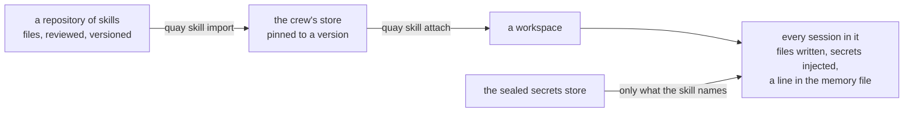

# Skills

A session opens knowing nothing about how you work. It has a model, a sandbox, and whatever context
the crew has written into it. Ask it to open a pull request and it will find `git` in the image, no
identity, no credential, and no `gh`, and it will tell you the control plane is refusing connections.

A skill is the missing piece: a capability a session can be given, written down as code, shared the
way code is shared. This document describes what one is, where it lives, how it reaches a sandbox,
and what it deliberately does not do.

## What a skill is, and is not

A skill is four things and nothing else:

- **A brief.** How this kind of work is done here. Prose the model reads, not prompt engineering.
- **The binaries it needs.** `gh` for GitHub, `terraform` for infrastructure. Declared, so a session
  missing one is refused with a sentence rather than discovering it halfway through.
- **The secrets it names.** By name, never by value. The crew binds them from its own sealed store.
- **Its own setup.** A script that runs inside the sandbox to make the capability real, for example
  configuring a git identity and a credential helper.

A skill has no control flow. It never decides what happens next, it does not run on a schedule, and
it holds no state between tasks. Everything with control flow in it is a workflow, which is a
different entity with its own design in [`ARCHITECTURE.md`](ARCHITECTURE.md). See
[Skills and workflows](#skills-and-workflows) below.

## Where a skill lives

Authored as files, imported into the crew, rendered back into the sandbox. Each of those three is
answering a different question, and this repository has already answered two of them in opposite
directions for good reasons.

Context lives in the store and is rendered to files, because a pod has no host directory to mount and
an interface cannot edit a file on somebody's laptop. Automation graphs are files pinned by version,
because editing a file must not change an automation that is halfway through.

A skill needs both properties, so it gets both layers.



**Files are the authoring and sharing format.** A skill is a directory in a git repository, which
makes it reviewable, diffable, versioned, and testable in continuous integration. "Shared across
users" then needs no invention: it is a repository somebody clones, or a directory in a repository
several crews already read.

**The store is the runtime.** Importing copies the skill in and pins it to a version, so a crew on a
pod with no host directory still has its skills, a listing can answer which skills a session holds,
and a skill cannot change under a session that is using it.

**The sandbox gets files again**, because the model reads files natively and always has. The skill's
directory lands beside the memory files the four levels of context already write, and the memory file
gains a line pointing at it.

## The shape of a skill

```
skills/github/
  skill.yaml        what it is, what it needs
  SKILL.md          the brief the model reads
  bin/setup         run inside the sandbox, once, at creation
  test/             proves the setup does what it says
```

```yaml
name: github
version: 3
summary: Open pull requests and issues, and push branches.
binaries: [git, gh]
secrets:
  GH_TOKEN: a token with repo scope, set with `quay secret set <workspace> GH_TOKEN`
```

`GH_TOKEN` rather than `GITHUB_TOKEN`, because `gh` reads both and prefers the first, so one name serves
the tool and anything else that needs a credential for the same host.

There is no `identity` field. Who a commit is by is carried by the crew already, as
`QC_GIT_AUTHOR_NAME` and `QC_GIT_AUTHOR_EMAIL`, and a field in a manifest that nothing reads looks
configured and does nothing. Identity per workspace arrives with signing, and gets a field then.

A field the crew does not know is refused by name rather than ignored, for the same reason.

The manifest is a description, never a program. No expression language, no conditionals, no hooks
that run on the host. The only executable part is `bin/setup`, and it runs inside the sandbox as the
sandbox user, which is the boundary that was already there.

## How a skill reaches a session

A skill reaches a session three ways, at the outer two of the four levels context already has.

The crew's own skills directory reaches every session: that is the crew level, for skills the operator
keeps as files on the machine. An imported skill attached to the crew reaches every session too, with
`quay skill attach crew <name>`, taking the same word where a workspace goes that `quay context set
crew` takes. That is the crew level again, reached from the tool rather than from the filesystem,
which matters because a crew on a pod has no directory to drop files into and because setting a crew
up once is the difference from setting each workspace up again. A skill imported and attached to one
workspace reaches that workspace's sessions: that is the workspace level, and it is where something
narrow belongs, because a capability for one kind of work should not be in front of every session the
crew has.

A crew whose catalogue is empty is given the skills this build ships with when the control plane
starts: all seven imported, git and github taken at the crew level, the rest waiting to be attached.
It happens only on an empty catalogue, so it is where a crew begins rather than a policy that undoes a
decision later.

A skill the crew holds is rendered into each workspace's own directory and mounted from there, exactly
as a workspace's own skill is, so the writing out, the sweeping when it is let go, and the staleness of
a sandbox born before it all come for free rather than as a second path.

Both are mounted read only at the same path inside the sandbox, so whoever reads the index does not need
to know which it came from. Where a name is held by both, the workspace's own wins: two mounts on one
target is a container that will not start, and the narrower statement of what a workspace should hold is
the more deliberate one.

A project and a session could follow later. Nothing has wanted them yet.

**Decided 9 August 2026: what a session holds is fixed when its sandbox is born.** The mount, the
secrets and the setup only ever happen at container creation, so a skill attached afterwards cannot
fully reach a session that is already running, and pretending otherwise hands the model an index
naming a brief that is not in its container. The behaviour becomes the contract: attaching and
detaching apply to sandboxes created from then on, a listing says when a session's sandbox predates
the workspace's current skill set, and refreshing is cheap because the conversation lives outside
the container. One resolver answers what a session holds, and everything else asks it.

At sandbox creation the control plane resolves the skills that reach this session, and then:

1. Refuses early, with a sentence naming what is wrong, if a binary the skill declares is not in the
   image. A capability that cannot work should say so before a task runs, not through the model
   discovering `gh: command not found`. A secret the skill names and the workspace has not set is
   answered differently: that skill alone is left out of the session, and the listing carries the
   reason. The image is one thing for the whole crew, while a secret is one workspace's to set, and
   refusing every task in a workspace over one skill it has not finished setting up is the wrong
   trade the moment a skill is held crew wide rather than attached one workspace at a time.
2. Mounts each skill's directory read only, so a session can read its scripts and cannot edit them. A
   skill imported into the store is written onto the host first, under the workspace it belongs to,
   because it has to be somewhere before it can be mounted from anywhere. Nothing about a skill is ever
   read back: context is, because an agent writing into its own memory has learned something, while a
   skill is a capability somebody granted, so an edit is not an edit of it and the next render replaces
   it.
3. Injects only the secrets the attached skills name. A session in a workspace with no github skill
   never sees `GH_TOKEN`.
4. Runs each `bin/setup` inside the sandbox, once, before the first task.
5. Writes an index into the context the session reads, marked `skills` the way each level of context is
   marked by scope: a line per skill giving its name, its summary, and the path to its brief.

   This is a change from the first version of this document, which put each brief into the context. The
   brief is a page and a page per skill is what [What it costs](#what-it-costs) exists to avoid, so the
   line is what every conversation pays for and the brief is opened when that kind of work comes up.

All five are built, and steps 1 and 4 cover both sources: a workspace's own skill is refused for a
missing secret or a missing binary exactly as one from the crew's directory is.

## Credentials

A skill names its secrets and never carries them. The values stay in the sealed store where the
subscription token already lives, and the crew binds them at sandbox creation.

The cost is the same one [`ARCHITECTURE.md`](ARCHITECTURE.md) states for the model token, and it is
worth restating because a GitHub token is a different kind of loss. Values set on a sandbox are
readable for the life of the container, for example through `docker inspect`, and they are readable
by the model, which is the point of giving them to it. A token that can push to your repositories is
in the hands of something that decides what to do next on its own. Scope it to what the skill needs,
set it per workspace rather than per crew, and treat attaching a credential bearing skill as the same
kind of decision as turning on the driver's network access.

## What it costs

Every attached skill puts a line in the file the model reads when a conversation starts, so a skill is
not free, and what goes in that line is the decision that matters.

The measurement that matters was taken on a real crew rather than imagined. Its four levels of context
rendered to 51,727 bytes at the workspace, roughly thirteen thousand tokens, and every session in
every workspace paid it before a word was typed, because all of it sat at the crew level. Nothing in
that file was a skill. The lesson is not about skills at all: it is that a level which reaches
everything will be filled until it hurts, and skills are the next thing that would fill it.

So a brief is short by construction, and the mount is what makes that possible:

- **`summary` in the manifest says when to reach for the skill, in a sentence.** This is the part loaded
  every time, and it is capped at 200 bytes so it cannot quietly become a brief.
- **`SKILL.md` says how that kind of work is done here.** A page, not a manual, capped at 4,096 bytes.
  It sits at the path the index gives and is opened when the work comes up.
- **The detail lives in files in the skill's own directory**, which is mounted and which the model
  reads only when it needs them. A convention document, a checklist, an example, a reference. None of
  it costs anything until something opens it.
- **A skill is attached at a level, so nothing is loaded everywhere.** This is the structural
  difference from context as it stands: context at the crew level reaches every session
  unconditionally, and a skill reaches the sessions somebody attached it to.

The rule of thumb that follows: if a brief is long enough that you would skim it, the model is paying
for it on every task and reading it no more carefully than you would.

## Binaries

A skill cannot conjure a binary. `gh` is not in the sandbox image, and no amount of markdown will put
it there.

The first version does the honest thing rather than the clever one: the image carries the binaries the
skills in use need, a skill declares what it requires, and the crew checks before the sandbox runs and
refuses with a message naming the missing binary and the image that has to carry it. A skill that
installs software at task time would need network access, a package manager and a trust story, and
would make every task slower and less reproducible.

An image per set of skills is the natural next step and is not in this design.

## Skills and workflows

They are separate entities and the separation is the useful part.

A skill is a capability: what a session **can** do, and what it needs in order to do it. It is
passive. Nothing happens because a skill exists.

A workflow is a plan: what **should** happen, in what order, on what trigger. It has control flow,
state, and a run that survives a restart. Automation graphs in
[`ARCHITECTURE.md`](ARCHITECTURE.md) are that design.

They compose, and the composition is the reason to keep them apart. "Open a ticket when a session
fails" is a workflow whose step runs in a session holding the github skill. Fold them together and
either a skill grows control flow, which is an agent framework in a trench coat, or a workflow starts
carrying credentials, which puts a token in something that branches.

What they share is real and worth building once: both are authored as files, both are pinned by
version, both are attached at a level of the crew, and both are reviewed before they apply.

## Not tied to one model

The brief lives in a file and the capability lives in scripts and binaries, so neither is expressed in
any model's vocabulary. What differs per engine is where the brief has to be written and what the
sandbox has to hold, which is exactly the seam `model.Runner` already draws for a task.

The Claude adapter maps a skill onto the shape that command line tool already reads. Another engine's
adapter maps it onto its own. A skill is not rewritten for either.

## Constraints that hold the design together

- **Nothing self applies.** Design principle 5 in [`ARCHITECTURE.md`](ARCHITECTURE.md): an agent can
  propose a skill, and adding one is the operator's decision. A session that could attach its own
  skills could grant itself credentials.
- **Pin the version on the session.** A skill edited in its repository must not change a session that
  is running, for the same reason a graph is pinned to a run.
- **The manifest is data.** No expression language and no host side hooks. Accepting arbitrary
  expressions means owning a language and a sandbox for it.
- **Setup runs inside the sandbox, never on the host.** A skill is code somebody else wrote. The
  container is the boundary and there is no second one.
- **Secrets are named, never carried.** A value in a skill file is a value in a git repository.
- **Never half give a capability.** A capability that silently does not work is worse than one that
  is absent, because the model will improvise around it. So a skill either reaches the session whole
  or does not reach it at all, and what is missing is said in the listing either way.
- **A brief is short and the detail is on disk.** Everything loaded at conversation start is paid for
  on every session that holds the skill. See [What it costs](#what-it-costs).
- **No fetching at task time.** A skill is imported deliberately, not resolved from the network while
  a task is waiting.

## What exists today

Verified against the repository and a running stack, rather than assumed:

- `git` version 2.39.5, `rg` and `tmux` are in the sandbox image, and there is still no `gh`: verified by
  running `command -v gh` inside a real session's container on 8 August 2026. A commit has an author and a
  committer now, from the crew's configuration.
- A workspace's secrets reach that workspace's sandboxes. A session holding the github skill is given
  `GH_TOKEN` because the workspace holds it. A skill naming a secret the workspace has not set is
  left out of the session instead, and `quay skill list` says which secret left it out and how to set
  it, so the task still runs and the model is never handed a brief it cannot follow. A manifest
  naming a secret
  starting `QC_` or `CLAUDE_` is refused at validation, because those names are the crew's own, and a
  workspace secret starting `QC_` never travels for the same reason.
- Context already has the four levels, the store, the rendering into files and the reading back, and
  a skill's brief follows that path rather than inventing a second one.
- Automation graphs run: `internal/flow` over Postgres, with `quay flow` in front of it. The `wait` and `ask` nodes, ceilings and stopping a run are not built yet.

## Delivery

Each of these is a slice with its own tests, in this order, and the first two are worth having even
if the rest waits:

1. A workspace's secrets reach a sandbox by name rather than one hardcoded key. Done.
2. A git identity in a sandbox, from the workspace, so a commit has an author. Done.
3. A skill reaches a session from the crew's directory: read, mounted read only, refused early, set up.
   Done.
4. The store: import, pin to a version, attach to a workspace, with `quay skill` on the command line.
   Done. This is one slice of [#179](https://github.com/atlantic-blue/quay-crew/issues/179), whose
   remaining slices are 6 to 9 below plus a `quay skill show`, all still open.
5. A repository reaches a sandbox. Built as a workspace level API (records, a clone at sandbox birth
   into the workspace's volume, a working tree per session) and then reworked back out in
   [#210](https://github.com/atlantic-blue/quay-crew/issues/210): a skill is a text file the session
   follows, and that machinery was hard to explain, which is the sign it was the wrong shape. A
   session clones in conversation now, following the git skill. What stayed is the invisible plumbing
   a brief can rely on: the git identity environment, and a credential helper in the sandbox image
   reading `GH_TOKEN` at the moment git asks. The stated cost: each session clones its own copy, so
   first tasks on big repositories are slower and disk is spent per session.
6. The git skill, in `skills/git/` at the root of this repository. Done, with slice 5's rework. Then
   `gh` in the image with `GH_TOKEN`, and then the github skill. Two skills rather
   than one: git needs a repository and nothing else, github needs a credential, the network, and it does
   things that cannot be undone, so they are attached separately.
7. A skills view in the console.
8. Signing forwarded into the sandbox, per workspace, off by default. Done. A workspace that mounts
   `GIT_SSH_SIGNING_KEY` gets sandboxes that sign, and one that does not is told not to. An ssh key
   rather than a gpg one: one private key file, no agent, no keyring and no pinentry prompt to hang a
   task nobody is watching. Mounted rather than set, so the key is a file in a memory backed directory
   and never reaches the container's environment, where `docker inspect` would read it.
9. Propose and approve, so an agent can offer a skill and nothing it offers applies itself.
