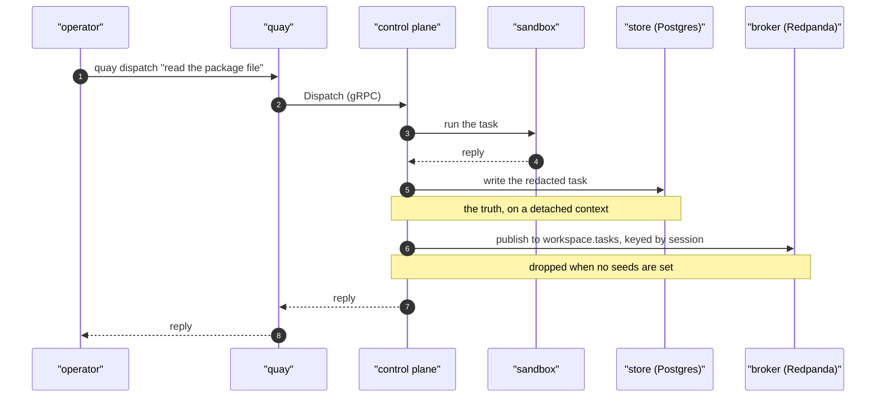

# The life of a task

A task is one piece of work in one session. You ask for something, the model works in that session's
own sandbox, and a reply comes back. Minutes is normal, not seconds.

This document follows one task from the moment it is dispatched to the records it leaves behind. It
names the words first, because four of them get used for each other and mean different things.

`docs/EVENTS.md` describes the log itself and how to inspect it. `docs/DATABASE.md` describes the
tables. This is the path between them.

## The words

**The store** is the database the crew treats as the truth. In a real crew it is Postgres:
`QC_DATABASE_URL` points at it, and the control plane applies its migrations on start. With no url
set the crew uses an in memory store instead, which is what the tests run against and which loses
everything on restart.

**The broker** is a separate server that keeps named streams of records and hands them to whoever
asks for them. Locally it is Redpanda, which speaks the Kafka protocol. It is its own container and
it starts only with `docker compose --profile export up`.

**A seed** is an address the client dials first. A cluster can hold many brokers, and you do not list
them all: you give one or two seed addresses, the client connects, asks the cluster who else is
there, and learns the rest. `QC_KAFKA_SEEDS=redpanda:9092` is one seed. Empty means the crew builds
no client at all, and nothing is exported.

**A topic** is one named stream. A task lands on `<workspace name>.tasks`, so two workspaces on one
broker never read each other's records.

**The key** is what a record is filed under, and here it is the session identifier. Records with one
key land on one partition, which is what keeps a session's records in the order they happened.

## The path

1. You run `quay dispatch "read the package file"`. The command line calls `Dispatch` on the control
   plane over gRPC.
2. The control plane finds or creates the session row, then builds or reuses that session's sandbox
   container.
3. It runs the task through the model inside that sandbox, and waits for the reply.
4. It records the session's new status, then calls `recordHistory` in
   `internal/controlplane/events.go`.
5. `recordHistory` detaches the context, redacts the payload, stamps an identifier and the workspace,
   the project, the handle and the time, and writes one row into the `tasks` table. This write is the
   truth, and it happens whether or not a broker exists.
6. It then calls `exportTask`, which reads the workspace name, names the topic, encodes the event as
   protobuf and publishes it to the broker under the session identifier.
7. Nothing reads the topic. `quay tasks` and the console read the `tasks` table.



## What is written, and where

- **One row in `tasks`**: what was asked, what came back, the status, the failure if there was one,
  and when it happened. `quay tasks <session>` and the console's history view read this.
- **The session row moves**: its status, its conversation identifier, and the count the describer
  reads to decide whether to name the session again.
- **One record on `<workspace>.tasks`**, when seeds are set. The value is a protobuf `TaskEvent`, so
  it reads as binary in a terminal; the key is legible, because it is the session identifier.

## Redaction

What an operator pastes into a conversation can be a credential, and everything above is persisted.
So the prompt, the reply and the failure all go through the crew's redactor before anything is
written. It matches every value the workspace keeps sealed, the driver's own token, and anything
shaped like a published subscription token.

A value the crew has never been told cannot be protected. A password typed into a conversation, and
never set as a secret, is stored as typed. The store and the log hold what was said minus what the
crew can recognise, which is not the same as a guarantee.

## When something fails

- **The model errors.** The task is recorded as failed, with the reason in the failure field, and the
  failed task is exported too. A failed task is the one somebody comes looking for.
- **The sandbox cannot be created.** The same: a record is written saying so, rather than nothing.
- **The caller hangs up.** The write is on a context detached from the request, so the record of a
  long task survives a command line that gave up waiting for it.
- **The store write fails.** It is logged and the task is not failed, because the task already
  happened. A store that cannot be written is a problem for the whole crew, not for this one path.
- **The broker is unreachable, or no seeds are set.** The export is dropped and logged. It never
  fails a task. The log is the copy; the store is the record.

## What does not exist yet

- **A task finishing is the only event the crew emits.** A session being created, stopped, archived
  or restored writes no event anywhere. That is
  https://github.com/atlantic-blue/quay-crew/issues/349
- **Nothing consumes the log.** The export accumulates records that nothing reads, which is the
  expected state until a second consumer lands. The first one named is
  https://github.com/atlantic-blue/quay-crew/issues/45
- **No inbound stream.** A chat channel would publish to `<workspace>.inbound`, and the gateway that
  would write it is still a skeleton. That is
  https://github.com/atlantic-blue/quay-crew/issues/9

## See it for yourself

Read the store, which always works:

```
quay tasks <session>
```

Read the log, which needs the export profile up and `QC_KAFKA_SEEDS` set:

```
docker exec -it quaycrew-redpanda-1 rpk topic list
docker exec -it quaycrew-redpanda-1 rpk topic consume <workspace>.tasks --num 1
```

One task through `quay dispatch` creates the topic and puts one record on it. `rpk group list` still
prints nothing, because nothing reads.
