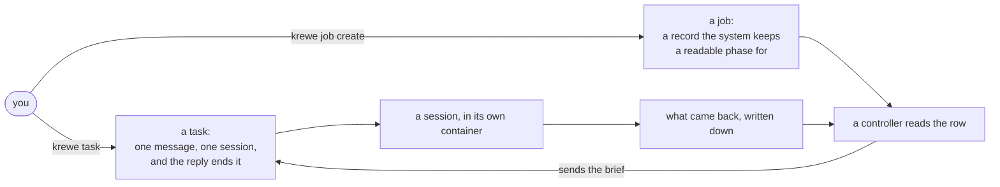
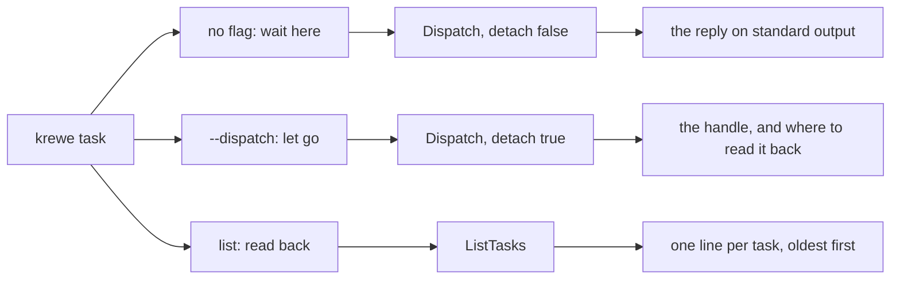
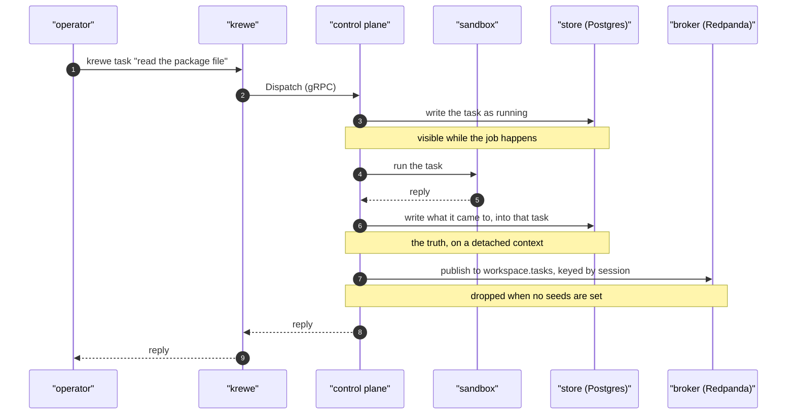

# The life of a task

A task is one request to one session. You ask for something, the model works in that session's own
sandbox, and a reply comes back. Minutes is normal, not seconds.

This document follows one task from the moment it is dispatched to the records it leaves behind. It
starts by telling a task apart from a job, because those two get used for each other most.
Then it names the rest of the words.

`docs/EVENTS.md` describes the log itself and how to inspect it. `docs/DATABASE.md` describes the
tables. This is the path between them.

## Two things you can ask for

A task is a message. You send text, a session answers, and that is the whole life of it.

A job is declared intent. You write down what you want done and the system keeps that record, so it has
a phase you can read at any moment: pending, running, done, failed or stopped. It can run as a named
role, carry a budget and a deadline, and declare jobs of its own. Two more phases are written down
and nothing reaches them yet: `waiting`, because no controller honours ordering, and `asking`, which
today only a flow run gets to.

The test is one question. If you would ever ask where that is up to, it is a job. If you would not,
it is a task.

A flow is a job with its plan drawn in advance. A session is the conversation a task happens in.

Declaring a job does not replace sending a task. A controller sends the brief as a task, into a
session, the same way you do. So the rest of this document is what happens inside a job too.
`docs/ORCHESTRATION.md` is the record, the controller loop, the lease and the capability model.

The words come from Kubernetes, which the system already borrows from: a Lease, a Phase, a Role, and
verbs on a resource. A job is a Kubernetes Job. Declared intent, run to completion, watched by a
controller, with a disposable container underneath, which is this down to the phase field.

**A session is deliberately not a Pod**, and that is the obvious next question. A Pod is disposable
and interchangeable with its replacement: kill one, another takes its place, and nothing is lost. A
session is the opposite. Its value is the history it holds, so killing one loses the conversation
that made it worth having. Borrowing a word whose contract the system does not honour would be worse
than breaking the pattern on purpose, so the pattern is broken on purpose.



## The words

**The store** is the database the system treats as the truth. In a real system it is Postgres:
`QC_DATABASE_URL` points at it, and the control plane applies its migrations on start. With no url
set the system uses an in memory store instead, which is what the tests run against and which loses
everything on restart.

**The broker** is a separate server that keeps named streams of records and hands them to whoever
asks for them. Locally it is Redpanda, which speaks the Kafka protocol. It is its own container, and
`make up` starts it with everything else.

**A seed** is an address the client dials first. A cluster can hold many brokers, and you do not list
them all: you give one or two seed addresses, the client connects, asks the cluster who else is
there, and learns the rest. `QC_KAFKA_SEEDS=redpanda:9092` is one seed. Empty means the system builds
no client at all, and nothing is exported.

**A topic** is one named stream. A task lands on `<workspace name>.tasks`, so two workspaces on one
broker never read each other's records.

**The key** is what a record is filed under, and here it is the session identifier. Records with one
key land on one partition, which is what keeps a session's records in the order they happened.

## One word, and what each shape of it does

A task is one word on the command line, the way a job and a flow are each one word:

```
krewe task [<address>] <text>              send a task, and wait here for the answer
krewe task --dispatch [<address>] <text>   send it, and let go. The system runs it
krewe task list <session>                  what a session was sent, and what came back
```



Waiting and letting go differ in one thing, whether anybody holds the connection open, so letting go
is a flag rather than a second word. Reading back is a verb under the same word, because a history is
a thing you do to a task.

**The three words this replaced are gone, and each one refuses.** `krewe ask` waited, `krewe dispatch`
let go, and `krewe tasks` read the history back. Each now exits non zero and names what to type. None
of them is a quiet alias: a word that still works keeps two spellings alive for one thing, and a word
absorbed into the next argument is worse than either, because the command succeeds.

`krewe task <session>` is refused too, with the same reasoning. It used to print a history, and under
one word it would send that session's own identifier to the model as a message.

**What this does not do.** It is the command line only. The `dispatch` node type in a flow graph
keeps its name, and so does the `Dispatch` method on the control plane. Nothing about the wire
contract moved.

The console is its own surface and keeps its own words. The view that lists what a session ran is
called `exec`, and it still answers to `tasks`, `task` and `history`. Typing `task` alone into its
command bar switches to that view rather than printing the usage, because a view name wins there.
`task list <session>` and anything longer is handed to the tool.

## The path

1. You run `krewe task "read the package file"`. The command line calls `Dispatch` on the control
   plane over gRPC.
2. The control plane finds or creates the session row, names its conversation if it does not have one
   yet, marks the session `running`, and calls `beginTask` in `internal/controlplane/events.go`. The
   name comes before the task rather than after it, so an operator can open the conversation the task
   is working in while it works. See [`SANDBOX.md`](SANDBOX.md).
3. `beginTask` detaches the context, redacts the prompt, stamps an identifier and the workspace, the
   project, the handle and the time, and writes one row into the `tasks` table with the status
   `running`. The row is written now rather than at the end, because a task takes minutes and an
   operator has to be able to see what a session was asked while it works on it.
4. It builds or reuses that session's sandbox container, and runs the task through the model inside
   it.
5. It records the session's new status, then calls `landTask`, which writes the reply or the failure
   into the row `beginTask` opened. The prompt and the time it started are left as they were, so the
   history says when the operator asked. This write is the truth, and it happens whether or not a
   broker exists.
6. `landTask` then calls `exportTask`, which reads the workspace name, names the topic, encodes the
   event as protobuf and publishes it to the broker under the session identifier. The export is one
   record per task, at the end: a consumer handed the same task twice would have to work out which of
   the two to believe.
7. Nothing reads the topic. `krewe task list` and the console read the `tasks` table.



## What is written, and where

- **One row in `tasks`**, written when the task starts and closed when it lands: what was asked, what
  came back, the status, the failure if there was one, and when it started. A row that still reads
  `running` is a task in flight. `krewe task list <session>` and the console's history view read this.
- **The session row moves**: its status, and the count the describer reads to decide whether to name
  the session again. Its conversation identifier was written here and is written before the task now;
  what happens at the end is a check that the runtime used the name it was given.
- **One record on `<workspace>.tasks`**, when seeds are set. The value is a protobuf `TaskEvent`, so
  it reads as binary in a terminal; the key is legible, because it is the session identifier.

## Redaction

What an operator pastes into a conversation can be a credential, and everything above is persisted.
So the prompt, the reply and the failure all go through the system's redactor before anything is
written. It matches every value the workspace keeps sealed, the driver's own token, and anything
shaped like a published subscription token.

A value the system has never been told cannot be protected. A password typed into a conversation, and
never set as a secret, is stored as typed. The store and the log hold what was said minus what the
system can recognise, which is not the same as a guarantee.

## When something fails

- **The model errors.** The task is recorded as failed, with the reason in the failure field, and the
  failed task is exported too. A failed task is the one somebody comes looking for.
- **The sandbox cannot be created.** The same: a record is written saying so, rather than nothing.
- **The caller hangs up.** The write is on a context detached from the request, so the record of a
  long task survives a command line that gave up waiting for it.
- **The store write fails.** It is logged and the task is not failed, because the task already
  happened. A store that cannot be written is a problem for the whole system, not for this one path.
- **The broker is unreachable, or no seeds are set.** The export is dropped and logged. It never
  fails a task. The log is the copy; the store is the record.

## What does not exist yet

- **A task finishing is the only event the system emits.** A session being created, stopped, archived
  or restored writes no event anywhere. That is
  https://github.com/atlantic-blue/quay-crew/issues/349
- **Nothing consumes the log.** The export accumulates records that nothing reads, which is the
  expected state until a second consumer lands. The first one named is
  https://github.com/atlantic-blue/quay-crew/issues/45
- **No inbound stream.** A chat channel would publish to `<workspace>.inbound`, and the gateway that
  would write it is still a skeleton. That is
  https://github.com/atlantic-blue/quay-crew/issues/9

## See it for yourself

Read the store, which always works:

```
krewe task list <session>
```

Read one answer as data, which is what a caller outside the system pipes into the next command:

```
krewe answer <session>
```

Read the log, which needs `QC_KAFKA_SEEDS` set. The compose file defaults it to `redpanda:9092`, so
it is set unless your own configuration empties it:

```
docker exec -it quaycrew-redpanda-1 rpk topic list
docker exec -it quaycrew-redpanda-1 rpk topic consume <workspace>.tasks --num 1
```

One task through `krewe task --dispatch` creates the topic and puts one record on it.
`rpk group list` still prints nothing, because nothing reads.
