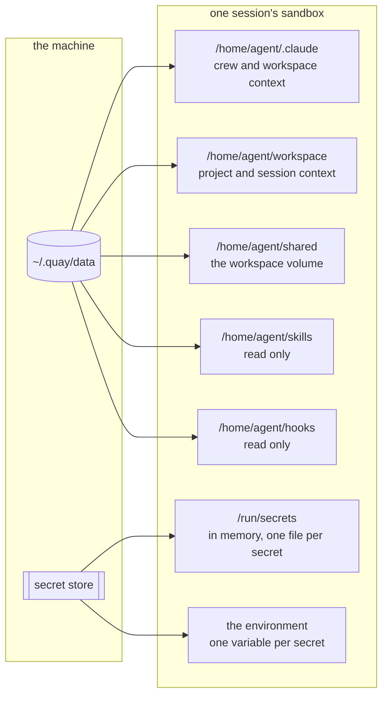

# Setting up a workspace

A workspace is who a session works as. It holds the credentials, the context, the skills and the
hooks that every session inside it is born with.

The quick start in the [README](../README.md) makes a workspace in four commands. This page is the
long version. Follow it when you move a real body of work into the crew, and a session must read a
repository, commit as you, and hold the credentials the job needs.

The examples use a workspace called `acme` and a project called `billing`. Replace both.

## What a session is given



A sandbox is a container, and a container's filesystem goes away with it. The five directories on
the left of the diagram are bind mounted from the host, so they survive the container. The two on
the right carry the workspace's secrets.

## 1. Make the workspace

```sh
quay workspace create acme
```

Creating moves you into it. `quay use` says where you are, and `quay use acme` moves you back.

## 2. Give it the model token

Each workspace holds its own subscription token. Without one, a task fails.

```sh
claude setup-token
quay secret set acme CLAUDE_CODE_OAUTH_TOKEN
```

Paste the token into the second command. Standard input is used, so the value does not reach your
shell history.

## 3. Secrets, and the two ways one reaches a session

A secret is stored once. How it reaches a sandbox is a second, separate choice. Docker and
Kubernetes both answer it this way.

```sh
gh auth token | quay secret set acme GH_TOKEN        # an environment variable
quay secret mount acme gitconfig < ~/.gitconfig      # a file
quay secret list acme                                # which are set, which are mounted
```

`quay secret set` is the default. The value becomes an environment variable in every session in the
workspace.

`quay secret mount` writes the value to a file at `/run/secrets/<name>`. Choose it in two cases.
The first is a credential a tool opens by path: a git configuration, a private key, a cloud
credentials file. The second is a value that must not be readable through `docker inspect`, which
reads an environment variable for the life of the container. A mounted secret is not also in the
environment.

The secrets directory is memory backed, mode 0700, and owned by the sandbox user. Each file is
written under `umask 077`, so it is never on disk readable, not even for the moment between the
write and a change of mode.

`quay secret set` removes leading and trailing whitespace, because the tools that print a token end
with a newline, and a token that carries one authenticates nothing. `quay secret mount` removes
nothing. The bytes stored are the bytes of your file.

`quay secret list` never prints a value.

### A secret every workspace needs

Say `crew` where a workspace goes. The secret is then held by the crew, and every workspace reads
it, including the ones you make tomorrow.

```sh
claude setup-token | quay secret set crew CLAUDE_CODE_OAUTH_TOKEN
gh auth token | quay secret set crew GH_TOKEN
quay secret mount crew gitconfig < ~/.gitconfig
quay secret list crew
```

A workspace wins on a name. Set `GH_TOKEN` on the crew and on one workspace, and that workspace
reads its own while every other workspace reads the crew's. `quay secret list` says which level
holds each one, so a workspace you set nothing on says where its secrets came from.

`crew` is the same word `quay skill attach`, `quay hook attach` and `quay context set` already take.
No workspace may be called `crew`, because a workspace with that name would take what every
workspace reads.

### Mounting from a script

The path form needs a terminal:

```sh
quay secret mount acme gitconfig ~/.gitconfig
```

A script, a hook and an agent all run without one. The command then reads standard input as the
value, and refuses three arguments. Redirect the file instead, which works in both places:

```sh
quay secret mount acme gitconfig < ~/.gitconfig
```

## 4. Who a session commits as

The sandbox image ships `/home/agent/.gitconfig`. It holds one line, an include of
`/run/secrets/gitconfig`. So mounting your own configuration under that name reaches every git
process in the sandbox, not only the one a task starts.

```sh
quay secret mount acme gitconfig < ~/.gitconfig
```

Signing is decided for the whole workspace, and a session is told not to change it. A workspace that
mounts a signing key signs. A workspace that mounts none is told `commit.gpgsign false` and
`tag.gpgsign false`. The crew writes that after the include, because git takes the last value it
reads. Without this half, an operator configuration that signs everything fails every commit a
session makes, on a key the container was never going to have.

Mount the gpg key you already sign with, and a session signs under your own identity:

```sh
gpg --armor --export-secret-keys <key id> > /tmp/signing-key.asc
quay secret mount acme GPG_SIGNING_KEY < /tmp/signing-key.asc
rm /tmp/signing-key.asc
quay secret mount acme GPG_SIGNING_KEY_PASSPHRASE < ~/.quay/passphrase
```

Mount the passphrase whenever the key has one, which is most of them. gpg in a sandbox runs in
batch, with no terminal to ask on, so a key it cannot unlock fails in a second with a message
instead of hanging a task nobody is watching.

An ssh key is the other option, and it signs under a second identity:

```sh
quay secret mount acme GIT_SSH_SIGNING_KEY < ~/.ssh/id_ed25519
```

Put its public half on the account you push to, beside the key your own machine signs with, because
a commit signed in a sandbox is then signed by a different key. The file must also end with a
newline. Measured on this machine: `ssh-keygen -Y sign` with the same key one byte shorter exits 255
and reports `Couldn't load public key <path>: No such file or directory`, which does not point at
the cause. `quay secret mount` stores bytes exactly, so a key redirected from a file is fine, and a
key passed through a shell substitution is not.

Every signing secret is mounted, never set. Setting one is refused, and the refusal names the mount
command. A workspace that mounts both kinds of key signs with the gpg one. A workspace that mounts
neither does not sign, and nothing fails. [`docs/SANDBOX.md`](SANDBOX.md) has the long version,
including where the keyring lives.

A private clone needs `GH_TOKEN`. The image carries a credential helper that answers git from that
variable at the moment git asks, so no token ever reaches a remote address or a file.

## 5. Context, which is how a workspace is told things

Context is files, not prompt text. Nothing is added to your message, and a task that does not need
context is not charged for it.

There are four levels. They land in two files.

`/home/agent/.claude/CLAUDE.md` carries the crew's context, the workspace's context, and the index
of the skills the session holds. Every session in the workspace reads it.

`/home/agent/workspace/CLAUDE.md` carries the project's context and the session's own. Only that one
session reads it.

```sh
quay context set crew < rules.md            # everything the crew does
quay context set acme < context.md          # every session in the workspace
quay context set acme/billing < brief.md    # one project
quay context                                # every level, how big it is, and its first words
quay context edit acme/billing              # open it in $EDITOR
quay context clear acme/billing
```

Both files are read and write. A session can add to its own context, and the crew reads that back
rather than overwriting it.

## 6. Files a workspace shares

Every session in a workspace mounts one shared directory at `/home/agent/shared`. It is read and
write, and what one session writes there is there for the next one and for every session beside it.

On the host it is `~/.quay/data/workspaces/<workspace id>/volume`. `quay workspace list` prints the
id. Put reference material there: a data file, an export, a document set a session should read.
Then name the path in the workspace's context, because nothing tells a session the directory exists.

## 7. Repositories

Nothing is cloned for you. A session clones what it works on, following the git skill, and the clone
goes in the volume so the workspace holds one copy of it rather than one per conversation:

```
/home/agent/shared/repos/<name>                    the one clone, by whichever session needs it first
/home/agent/shared/worktrees/$QC_SESSION_ID/<name>  a working tree per session, on a branch of its own
```

`QC_SESSION_ID` is the session's own identifier, set on every sandbox. The working tree carries it
because a clone records where its working trees are and every session sees the same paths, so two
sessions taking a tree at one path take each other's away.

The cost is stated. This is a convention in a brief rather than machinery, so a session that does not
follow it clones wherever it likes. Nothing removes a working tree when a session ends either, so the
volume keeps a directory per session that ever worked in a repository. That half of
[#255](https://github.com/atlantic-blue/quay-crew/issues/255) is open.

## 8. Skills

A skill is a capability written down as text, which a session follows.

```sh
quay skill import ./skills/git      # take one into the crew
quay skill list                     # what the crew holds
quay skill list acme                # what one workspace holds
quay skill attach acme aws          # give it to one workspace
quay skill attach crew git          # give it to every workspace, including later ones
quay skill detach acme aws
```

A skill is mounted read only at `/home/agent/skills/<name>`. A skill declares the secrets it needs,
and `quay skill list` prints each one beside the command that sets it. A skill whose secret the
workspace has not set is left out of the session, and the listing says why.

[`docs/SKILLS.md`](SKILLS.md) is the long version.

## 9. Hooks

A hook is a constraint a session runs under, checked when the session acts.

```sh
quay hook import ./hooks/prompt-analyser
quay hook list acme
quay hook attach acme prompt-analyser
quay hook attach crew prompt-analyser
quay hook detach acme prompt-analyser
```

Hooks are mounted read only at `/home/agent/hooks`, with the settings file that binds each one to
its event. [`docs/HOOKS.md`](HOOKS.md) is the long version.

## 10. A project, and the first task

```sh
quay project create acme/billing
quay use acme/billing
quay task "say pong"
quay sessions
quay attach <session>
```

## What needs a new sandbox

A sandbox is born with what the workspace held at that moment, and it never drifts. A secret, a
skill or a hook that you add later does not reach a session that is already running. Stop the
session, and the next task builds a sandbox that has it.

Context is the exception. It is written into the two files on every task, so a change reaches a
running session immediately.

## Where it all is on the machine

```
~/.quay/env                                                        which model and image to run
~/.quay/data/workspaces/<workspace>/claude                         the conversation store, and the outer CLAUDE.md
~/.quay/data/workspaces/<workspace>/volume                         the shared volume
~/.quay/data/workspaces/<workspace>/skills                         the workspace's own skills
~/.quay/data/workspaces/<workspace>/hooks                          the hooks it runs under
~/.quay/data/workspaces/<workspace>/projects/<project>/sessions/<session>/workspace
```

`QC_DATA_HOST` moves the data directory somewhere with more room. See
[`docs/SANDBOX.md`](SANDBOX.md), which covers the image, the gated integration test, and how to get
inside a running conversation.
